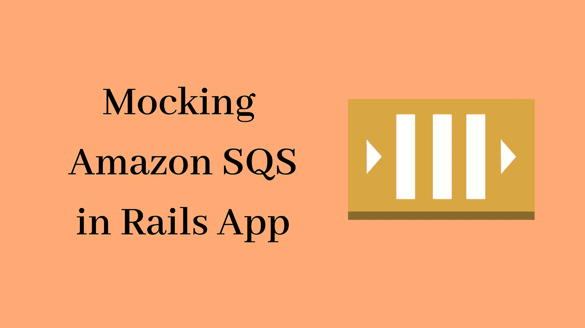

# 如何在 Dockerized Ruby on Rails 应用程序中模拟 AWS SQS 进行开发

> 原文：<https://betterprogramming.pub/how-to-emulate-aws-sqs-for-development-in-dockerized-ruby-on-rails-app-c0c16aadb84c>



在这篇文章中，我将带您了解如何在您的开发环境中模拟 AWS SQS，甚至无需创建 AWS 帐户。我将选择 dockerized ruby on rails 应用程序，我在“[将后台作业和 cron 添加到您的 Dockerized Ruby on Rails 应用程序](https://medium.com/swlh/add-background-jobs-and-cron-to-your-dockerized-ruby-on-rails-app-c7348915021d)”中使用过它你可以克隆这个应用程序，跟着我一起做。希望你准备好了。

我们将使用[https://github.com/softwaremill/elasticmq](https://github.com/softwaremill/elasticmq)，它在 Docker Hub 中被转换为 [roribio16/alpine-sqs](https://hub.docker.com/r/roribio16/alpine-sqs/) 图像。让我们对`docker-compose.yml`进行编辑，以添加我们将要使用的这个模拟 SQS 服务，并将这个服务作为一个依赖项添加到我们的 web 服务中。

```
...
sqs:                           
  image: roribio16/alpine-sqs
  ports:                             
    - "9324:9324"                             
    - "9325:9325"                           
  volumes:                             
    - ./config/elasticmq.conf:/opt/config/elasticmq.conf
...
web:
  ...
  depends_on:
    - sqs
    ...
```

在将服务添加到您的`docker-compose.yml`文件之后，它应该看起来像这样:

docker-compose.yml

如您所见，我直接使用了映射了 9324 和 9325 端口的`alpine-sqs`映像。9324 用于使用队列服务，9325 用于访问 web 界面。此外，我还链接了一个配置文件来配置队列。该文件的内容如下(在名为`elasticmq.conf`的 config 文件夹中创建该文件):

```
include classpath("application.conf")                                            

node-address {                                              
   protocol = http                                              
   host = "*"                                                
   port = 9324                                              
   context-path = ""                                            
}                                            

rest-sqs {                                                
   enabled = true                                              
   bind-port = 9324                                            
   bind-hostname = "0.0.0.0"                                      
   // Possible values: relaxed, strict                          
   sqs-limits = strict                                            
}                                            

queues {                                                
   default {                               
     defaultVisibilityTimeout = 10 seconds                     
     delay = 5 seconds                           
     receiveMessageWait = 0 seconds                               
   }                                                
   service-queue {                          
     defaultVisibilityTimeout = 10 seconds                    
     delay = 5 seconds                           
     receiveMessageWait = 0 seconds                               
   }                                            
}
```

这里需要关注的一个重要部分是 queues 部分，您可以在这里定义任意数量的队列。这里我们有两个队列，`default`和`service-queue`。现在队列设置完成了，但是我们必须测试它。我们将通过使用`aws-cli`推送队列和轮询来自我们的 Rails 应用程序的消息来测试这个设置。我们开始吧。

首先，我们将在 Rails 应用程序中创建一个消息轮询器服务。请按照以下步骤操作:

1.  将`gem ‘aws-sdk-sqs’, ‘~> 1.0.0.rc11’`添加到 Gemfile。
2.  用以下内容创建一个`app/subscribers/test_subscriber.rb`文件:

app/订户/test_subscriber.rb

3.用`Aws.config = { region: ‘s3.ap-southeast-1’, logger: Rails.logger }`的内容在你的 intializers 文件夹中创建`aws.rb`。

4.在名为`sqs_subscriber.rake`的`lib/tasks`文件夹中为轮询器创建一个 rake 任务。

lib/tasks/sqs_subscriber.rake

5.最后，将轮询器服务添加到`docker-compose.yml`文件中。

```
message_poller:                                             
  build: .                                                
  command: bundle exec rake sqs_subscriber:subscribe_test  
  restart: on-failure                                   
  depends_on:                                                  
    - sqs                                                  
    - db
```

注意那行`restart: on-failure`。这很重要，因为有时 SQS 没有完全准备好，所以消息轮询器只是抛出一些错误并关闭。

6.将以下变量添加到我们在`test_subscriber.rb`文件中使用的`.env`文件中:

```
SQS_ENDPOINT="http://sqs:9324"                                            SQS_REGION="ap-southeast-1"                                            SQS_QUEUE_NAME="service-queue"                                            AWS_ACCESS_KEY_ID=""                                            AWS_SECRET_ACCESS_KEY=""
```

7.所有的改变都完成了。现在我们可以运行`docker-compose build`，然后运行`docker-compose up`。一旦所有的服务都启动了，我们就可以开始测试了。

我假设你的机器上已经安装了`aws-cli`。如果没有，你可以按照这里的[步骤](https://docs.aws.amazon.com/cli/latest/userguide/cli-chap-install.html)安装。

启动一个终端，运行下面的命令向我们刚刚创建的队列发送一条消息:

```
*aws --endpoint-url http://localhost:9324 sqs send-message --queue-url http://localhost:9324/queue/service-queue --message-body "Hello, queue"*
```

点击回车键后，您会在`development.log`文件中看到一条日志消息。大概是这样的:`“Message received: \”Hello world\””`。这意味着我们的测试订阅者能够轮询消息。令人惊讶的是，我们甚至不用创建 AWS 帐户就能模仿 SQS。多酷啊。

如果您对代码有任何疑问或问题，请在评论中告诉我。你可以在这里找到完整的源代码。