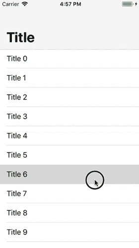

# 如何在 Android 中仿真 iOS PrefersBigTitles

> 原文：<https://betterprogramming.pub/how-to-emulate-ios-prefersbigtitles-in-android-36c24448f5ff>

## 在 Android 中创建一个更干净的用户界面


照片由乔纳斯·李在 [Unsplash](https://unsplash.com/s/photos/android?utm_source=unsplash&utm_medium=referral&utm_content=creditCopyText) 上拍摄

这应该是一篇简短、甜蜜、简单、中肯的文章。

作为一名 Android 和 iOS 开发人员，我发现自己想在 iOS 中做一些我可以在 Android 中做的事情，反之亦然。其中一件事是，我非常想创造一种方法，在 Android 中获得 iOS 的美丽属性。

如果你不熟悉的话，iOS 的`prefersBigTitles`属性在导航控制器中创建了一个外观整洁、左对齐的标题，当滚动时，它平滑地过渡到一个标题栏。

下面是它在 iOS 中的样子的 GIF:



iOS 首选 BigTitles GIF

我找不到在 Android 中模仿这一点的简单方法。然后，我开始尝试协调器布局，并找到了一个解决方案:

此处找到的 gist:[https://gist . github . com/Elijah-danger field/b 9 e41e 62725 aa 0 c 6 b 2 FBA 899 b 2d 7 DD 66](https://gist.github.com/Elijah-Dangerfield/b9e41e62725aa0c6b2fba899b2d7dd66)

# 但是它是如何工作的呢？

你可能在想:“牛逼酱，我有代码可以帮我做我想做的事。但它实际上是如何工作的？”

为了实现我想要的奇怪功能，我知道我需要一个顶层的协调布局。

几乎每当我需要在基于用户交互的布局中有有趣的行为时，我都会查看协调器布局。如果你发现自己需要它，你可以在[文档](https://developer.android.com/reference/android/support/design/widget/CoordinatorLayout)中阅读所有相关内容。

真正的神奇之处在于创建了一个应用程序栏，在标准工具栏周围有一个可折叠的包装。这些组合允许正确的定位，并允许在滚动事件中指定不同的行为:

```
**app:layout_scrollFlags**=”scroll|exitUntilCollapsed|snap”
```

能够在滚动时控制应用程序栏(包括文本样式)让我能够模仿 iOS `prefersBigTitles` 的行为。

我在一次编码挑战中使用了这段代码，作为一名 Android 开发人员加入了 Takl On-Demand Services。该代码可以在 GitHub 上找到[。](https://github.com/Elijah-Dangerfield/BarbrasBook)

结果是这样的:


希望这能帮助你创建外观整洁的 Android 应用程序，并带有一个温暖的 iOS 旋转！