# 如何在 Google Sheets 上本地运行 Python

> 原文：<https://betterprogramming.pub/how-to-enable-pythons-access-to-google-sheets-e4264cdb545b>

## 继续使用 Python 管理在线电子表格内容

埃米尔·达坎在 [Unsplash](https://unsplash.com?utm_source=medium&utm_medium=referral) 上的照片

如果你点击了这篇文章，你可能已经使用 Python 来管理 Excel 文件内容。作为一个广泛使用的工具，当使用电子表格时，Excel 是一个非常好的选择。即使微软已经推出了 OneDrive，许多人仍然在本地使用 Excel 和 Google Drive 的选项 Google Sheets，用于云。

 [## 使用 Excel 和 Python 实现个人投资自动化

### 如你所愿，随时更新你自己的股票投资数据

towardsdatascience.com](https://towardsdatascience.com/automating-personal-investments-with-excel-and-python-6f6a95898522) 

无论哪种方式，使用云服务最重要的好处是远离本地文件。它们需要本地存储，很难与朋友分享，版本控制是一场噩梦。

*在这篇文章中，我将带你经历一些必要的步骤，以便你能够使用 Python 访问你的 Google Sheets 电子表格并管理它们的内容。*

你可能知道，谷歌本身提供了一个 Google Sheets 脚本编辑器的本地选项，[电子表格服务](https://developers.google.com/apps-script/reference/spreadsheet)，作为 [Google Apps 脚本](https://developers.google.com/apps-script)的一部分。有一些方法和属性确实非常有用。它还允许你通过谷歌的平台管理你的项目执行历史和其他相关信息。

然而，作为一名 Python 爱好者，您可能意识到这种语言有多简单。我们来列举一下好处:

*   您已经将 Python 用于其他现有的应用程序——学习一门新语言的语法并探索其方法和属性需要时间。
*   Python 拥有庞大、活跃的社区和丰富的库。所以，只要你能连接到这个新的数据源(Google Sheets)，你就能继续做很多事情。

还有一个好消息:从现在开始，您可以检查设置所需访问权限所需的步骤。其余的，你可以照常保留。

# 1.支持外部访问 Google Sheets

在这一节中，我们将介绍授权外部应用程序访问 Google Sheets 所需的步骤。这里的主要目标是将您的 Google 项目凭证分配给 Google Sheets 和 Google Drive APIs。

流程是这样的:

1.  在谷歌云平台上建立你的项目。
2.  创建您的项目凭据。
3.  启用 Google Sheets API 和 Google Drive API。
4.  将您的项目凭据分配给 Google Sheets API 和 Google Drive API。

让我们来看看每一个。

## 1.1.在谷歌云平台上建立你的项目

登录[谷歌云平台](https://console.cloud.google.com/)后，如果您是第一次登录该平台，您会在[主页](https://console.cloud.google.com/projectselector2)部分看到以下页面:

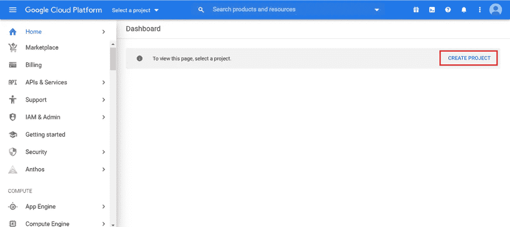

通过点击"创建项目"，您设置您的项目主要信息:

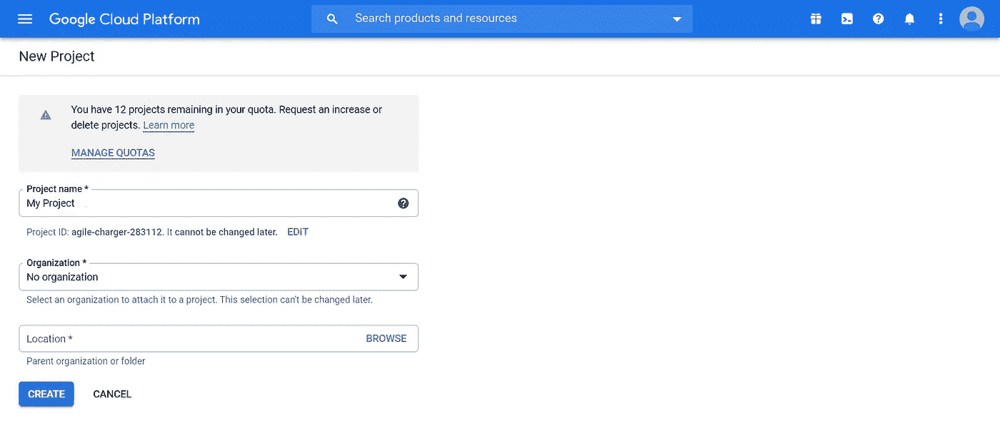

好了，您的项目已经创建好了。

## 1.2.创建您的项目凭据

现在你需要搜索“APIs & Services”。然后，单击“创建凭据”，然后单击“服务帐户”选项:

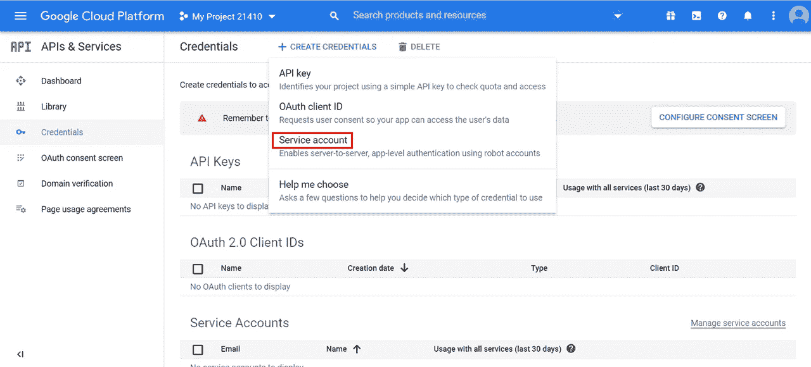

接下来，您需要输入一些基本信息:

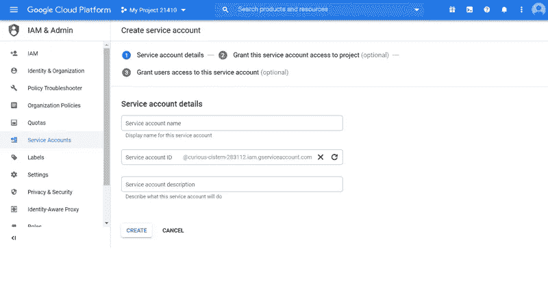

点击“创建”后，在“项目”选项下，点击“所有者”选项:

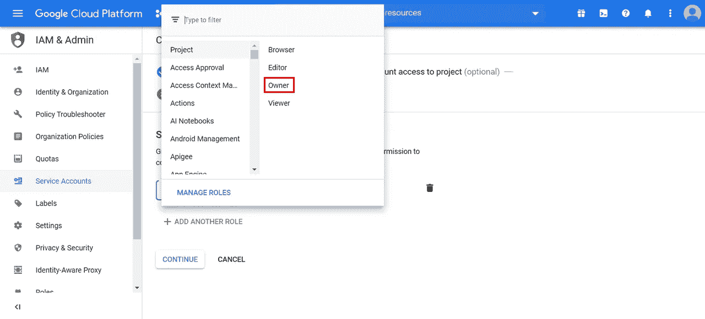

在页面底部，单击您的服务帐户电子邮件链接:

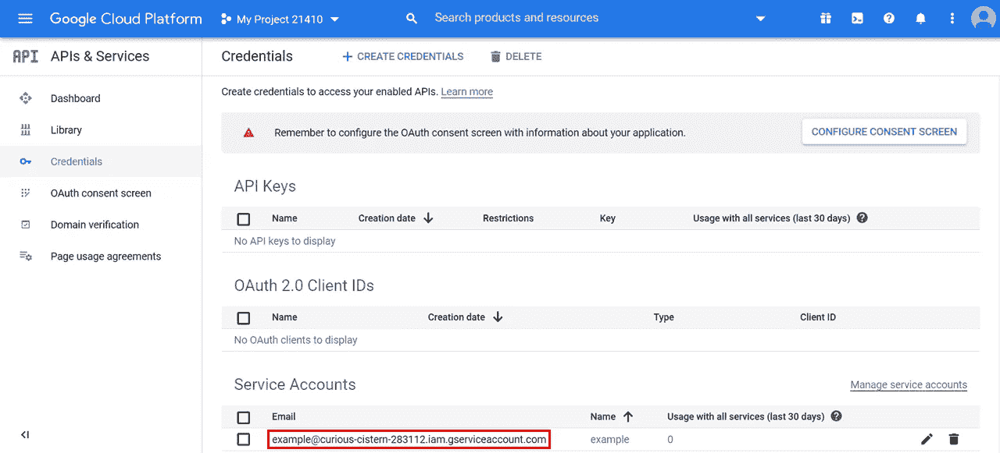

然后，点击“添加密钥”选项和“创建新密钥”:

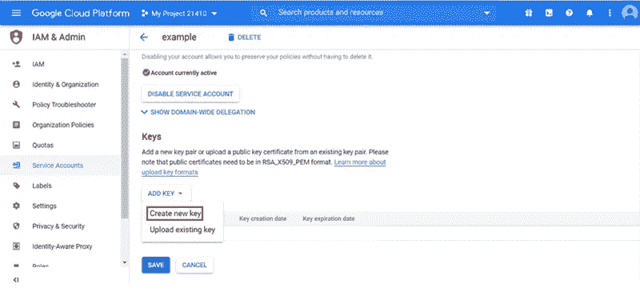

选择 JSON 选项:

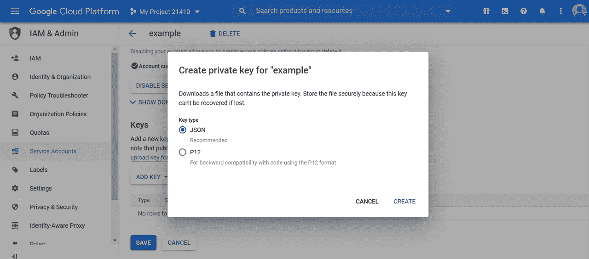

现在您已经下载了 JSON 项目的凭证文件。

## 1.3.启用 Google Sheets API 和 Google Drive API

你需要搜索“Google Sheets API”和“Google Drive API”(顺序不重要)。

例如，看看“Google Sheets API”页面。在这里，您必须单击“启用”按钮(确保您也为 Google Drive API 执行此操作):

两个 API 都已启用。

## 1.4.将您的项目凭据分配给 Google Sheets API 和 Google Drive API

启用 API 后，单击两者右上角的“CREATE CREDENTIALS”(再次强调，下面我只打印了 Google Sheets API):

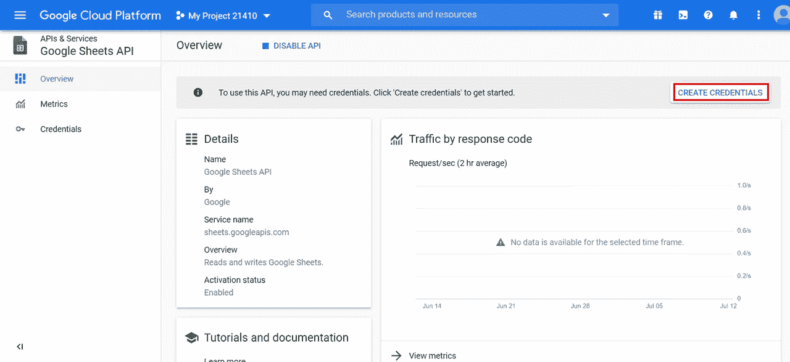

您将被重定向到以下两个屏幕(针对每个 API):

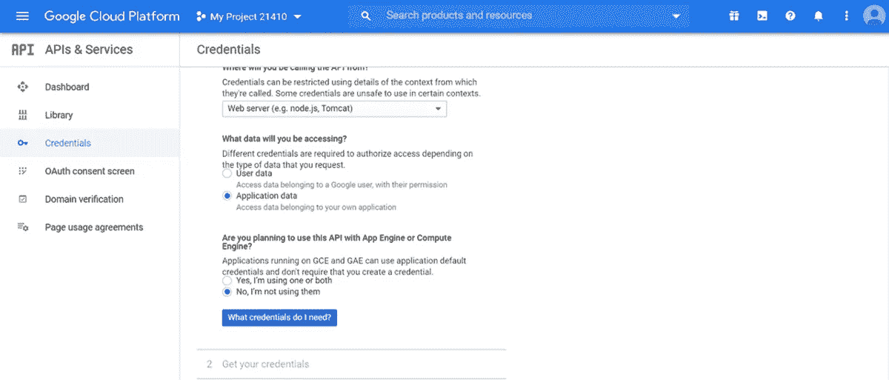

选择显示的选项后，Google Cloud Platform 将识别您已经创建的项目证书，并将其用于 API:

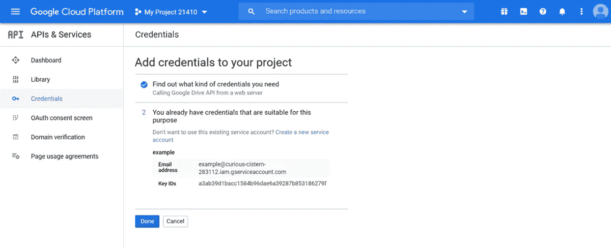

单击“DONE ”,现在两个 API 都已被正确识别。

# 2.Python 脚本

到目前为止，您已经允许外部应用程序通过两个 Google API 连接到 Google Sheets。现在，让我们来看看在 Python 脚本中需要考虑什么:

1.  需求和依赖性
2.  认证和授权
3.  应用程序脚本

## 2.1.需求和依赖性

你可能认为这是整个流程中最无聊的部分。你错了。

这里就直说了吧。您只需要满足一个要求，即导入两个库:`[gspread](https://pypi.org/project/gspread/)`和`[oauth2client](https://pypi.org/project/oauth2client/)`。确保您已经在本地下载了它们，然后这将是您的 Python 脚本的第一部分:

依赖关系呢？还记得在创建项目凭证时下载的 JSON 文件吗？这是依赖性之一。它主要包括您的私钥，这是身份验证过程所需要的。

另一种方式是通过你的服务账户电子邮件共享对你的 Google Sheets 电子表格的访问，就像你对朋友做的那样。你可以在 Google Cloud Platform 中的凭证会话上或者在最后一段提到的 JSON 文件(“client_email”)上查阅。

## 2.2.认证和授权

因此，如果 JSON 文件在同一个目录中，您将执行您的。py 文件，您可以考虑以下情况:

如果出于某种原因，您更愿意将 JSON 文件保存在不同的目录中，只需确保您指明了指向它的完整路径。

这就是认证和授权会话的全部内容。

## 2.3.应用程序脚本

我称之为“应用脚本”的是你在 Google Sheets 上对你的数据所做的事情。

这里有一个简单的例子，让我们检查你是否既能导入数据 Google Sheets 又能从中读取数据:

检查:

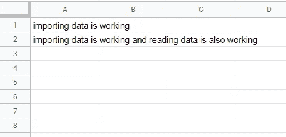

现在，在管理 Google Sheets 上的在线内容时，您可以继续使用 Python。