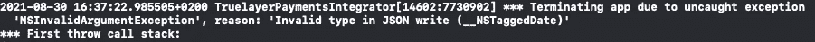

# 如何在 Swift 中安全地编码和解码任何 JSON

> 原文：<https://betterprogramming.pub/how-to-encode-and-decode-any-json-safely-in-swift-d5b2b8e2e1e3>

## 编码和解码无模式 JSON 而不失去类型安全性


劳伦·曼克在 [Unsplash](https://unsplash.com?utm_source=medium&utm_medium=referral) 上的照片

在开发应用或库时，我们可能需要解析没有固定或已知模式的 JSON。还可能发生这样的情况，我们需要编写一个 API，允许我们的用户向服务发送不同类型的数据。典型的例子是这样的跟踪 API:

```
func logEvent(named name: String, metadata: [String: Any])
```

在这里，用户可以在元数据中放入自己想要的`Any`东西:`String`、`Double`、`Boolean`甚至更复杂的对象。

iOS 自带的一些 API 可以帮助我们完成这项工作:`[JSONSerialization](https://developer.apple.com/documentation/foundation/jsonserialization)`。如果`Data`是有效的 JSON，这个 API 可以将`Data`转换成`[String: Any]`字典，反之亦然。

深入研究这个 API，我们会发现它并没有我们想象的那么好:

```
class func jsonObject(with data: [Data](https://developer.apple.com/documentation/foundation/data), options opt: [JSONSerialization](https://developer.apple.com/documentation/foundation/jsonserialization).[ReadingOptions](https://developer.apple.com/documentation/foundation/jsonserialization/readingoptions) = []) throws -> Any
```

`JSONSerialization`的这个类函数把一些`Data`转换成一个对象，对象的类型是`Any`。要使用它，我们必须这样做:

为了提取我们需要的数据，我们必须手动提取和转换 JSON 的每一层。我们需要预先知道数据类型，结果代码是危险的，或者很难阅读。

如果我们想使用补充的 API，可能会发生更糟糕的事情:

```
class func data(withJSONObject obj: Any, options opt: [JSONSerialization](https://developer.apple.com/documentation/foundation/jsonserialization).[WritingOptions](https://developer.apple.com/documentation/foundation/jsonserialization/writingoptions) = []) throws -> [Data](https://developer.apple.com/documentation/foundation/data)
```

这个函数接受一个类型为`Any`的对象，然后试图将其转换为某种`Data`。然而，如果我们试图将不能直接编码的东西转换成 JSON，例如`Date`，会发生什么呢？

这段代码看起来很合法。事实上，它编译没有错误。然而，当我们试图运行它时，应用程序崩溃，如下所示:



我们试图将一个不是 JSON 原语的类型强制放入字典。这是一个合法的操作，因为字典的`Value`是`Any`，所以我们可以在里面放任何我们想要的东西。然后，我们要求系统将其转换为 JSON。尽管在编译时一切看起来都很好，但事实并非如此。一个`Date`不能直接编码成 JSON 类型。

如果我们能在编译时捕捉到这些错误，那不是很好吗？幸运的是，我们可以编写一个好的、可扩展的解决方案来实现这一点。让我们看看如何！

# JSON 类型

解决方案是引入一种新的类型，我们称之为`JSON`。这种类型严格描述了所有可以转换成 JSON 的值，并且只允许使用它们。

我们可以使用下面的`enum`来实现这样一个类型:

这个`enum`描述了我们可以放入 JSON 的所有合法类型。我想强调三种特殊情况:

*   `case null` : JSON 允许属性带有`null`值，所以我们需要一种方法来表示它们。在 Swift 中，我们将这个值转换成一个`nil`值。
*   `indirect case array`和`indirect case object` : Swift 的枚举是值类型。编译器立即在内存堆栈上分配该值，因为它知道它占用了多少空间。然而，`JSON`枚举是一个**递归**枚举。通常，编译器会尝试为一个 JSON 值分配空间，因为它可以包含另一个 JSON 值。这个 JSON 值可以包含另一个 JSON 值。以此类推，直到内存填满，应用崩溃。Swift 需要一种方法来中断这种递归:关键字`indirect`打破了这种递归，并允许我们安全地使用这种强大的工具。

下一步就是让`JSON`符合`Codable`。`JSON`包含一些相关值，Swift 无法为我们合成`Codable`实施。

## 实现可编码

实现非常简单，代码如下所示:

当谈到编码部分时，我们预先知道我们想要在编码器的容器中插入的类型。我们可以切换`JSON`值，并将相关内容插入到`singleValueContainer`中。

如果我们考虑集合的情况(T0 和 T1)，实现不会改变——T3 的 T2 知道如何编码它自己和它的 T4，T6 的 T5 知道如何编码它自己和它的内容。

## **实现可解码**

然后，我们需要实现`Decodable`协议。代码如下所示:

在这种情况下，我们不知道我们将从容器中获取哪种类型。因此，我们需要运行一个试错算法，尝试每一种可能的类型，如果我们失败了，我们继续下一种类型，直到我们找到正确的类型。

解码时，我们需要注意为类型选择的顺序。例如，如果我们在尝试使用`Int`类型之前尝试将一个恰好是数字的值解码成一个`Double`，我们将永远不会从这个过程中获得任何`Int`。任何数字都可以放入一个`Double`，因此`Int`案例永远不会返回任何有意义的内容。如果我们尝试先解码`Int`，而这个数字恰好是一个`Double`，解码就会失败，因为它放不进一个`Int`。算法将转移到下一个类型，成功解码一个`Double`。

最后，我们需要处理无法解码接收数据的情况。在这种情况下，我们应该解码失败，抛出一个`DecodingError`。但是，如果我们认真考虑一下，我们应该永远不会看到这个错误。

## 使用 JSON

现在是时候使用我们的枚举了。我们的类型符合 Codable，所以我们可以使用标准的`JSONEncoder`和`JSONDecoder`来获得一个`Data`表示或者一个`JSON`表示。

当我们想将一些`Data`解码成 JSON 时，代码看起来是这样的:

我们知道 JSON 类型是一个 enum。因此，我们可以安全地切换它的类型并提取我们需要的值。这种方法增加了很多代码，但是我们可以简化它。我们可以编写一个带有一些计算属性的扩展来返回一个特定的可选类型。

下面是扩展的代码:

这是我们如何使用它:

由于可选的链接功能，这 25 行交换机变成了一行。

**注意:**我们甚至可以做得更好，通过实现几个下标:如果下标的索引是一个`Int`，我们可以假设类型是一个数组，我们可以移除所有的`.array`类型提取；如果下标索引是一个`String`，我们可以移除所有的`.object`类型提取，使用反序列化的数据作为字典。最终结果将如下所示:

```
let age = json["results"]?[0]?["userInfo"]?["age"]?.int
```

现在让我们来看看当我们有一个想要转换成`Data`的`JSON`对象时是什么样子的:

在这个代码片段中，我们创建了一个`JSON`字典。在其中，我们定义了另一个名为`person`的`object`，它有两个字段`name`和`age`。

然后，我们可以使用标准的`JSONEncoder`将其编码成一个对象。这就是我们一直在寻找的类型安全。

但是，的 API 看起来相当冗长，还有改进的空间。我们可以实现另一组扩展来使用文字创建`JSON`值。

Swift 提供了一系列我们可以使用的`ExpressibleBy<Type>Literal`协议:

通过这些小的扩展，我们可以重写编码:

请注意，代码基本上与`[String: Any]`字典没有什么区别。我们甚至将不同的类型混合在一起。然而，这个字典是非常类型安全的；如果我们试图添加一个没有出现在`JSON`枚举中的类型，它不会编译。

# 结论

在今天的文章中，我们探讨了如何创建类型安全的`JSON`实现。我们还探索了如何改进它的 API 以使它们更易于使用。

这种解决方案也易于扩展。为了支持其他类型，我们可以:

*   在枚举中添加新案例
*   实现一个编码策略
*   实施一个解码策略

说到解码，我们需要注意解码顺序。如果底层类型是一个数字，记得在`Double`之前尝试解码它。如果底层类型是一个具有特定格式的`String`，我们应该在尝试将其解码为普通的`String`之前尝试解码这个新类型。

有了这种方法，我们可以支持任何定制的数据类型，甚至`URL`可以成为 JSON 的第一公民！