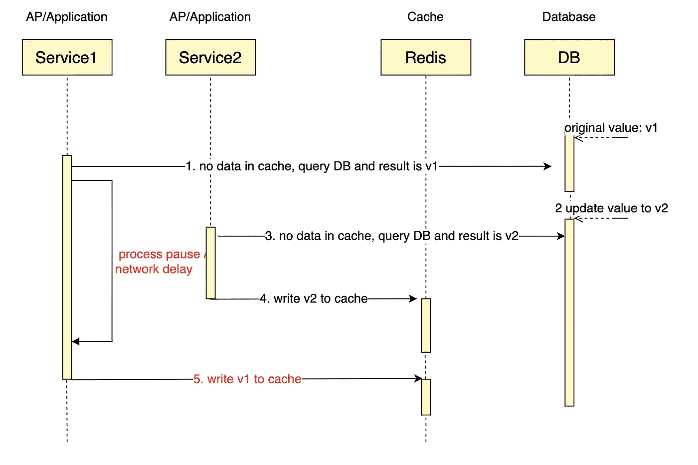
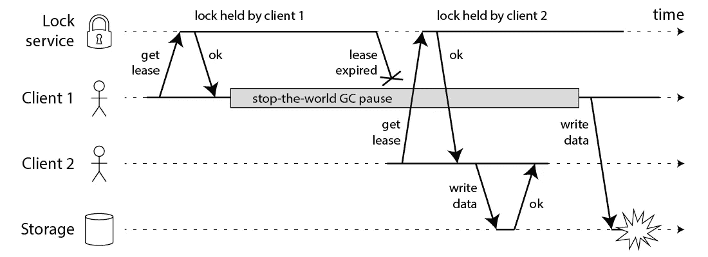

# 如何保证 Redis 与数据库的一致性

> 原文：<https://betterprogramming.pub/how-to-ensure-the-consistency-between-redis-and-database-62f09de0bdde>

## 保持联系的深度指南


玛利亚·特内娃在 [Unsplash](https://unsplash.com?utm_source=medium&utm_medium=referral) 上拍摄的照片

在大量的现实项目中，Redis 缓存被引入以减轻数据库查询的压力。由于数据存储在 Redis 和数据库中，因此存在数据一致性的问题。目前还没有一个成熟的解决方案来确保最终的一致性，特别是当以下场景发生时，这将直接导致缓存数据和数据库数据之间的不一致。

在上面的场景中，缓存中数据的最终版本是 v1，而数据库的最终版本是 v2，这可能会给应用程序带来重大问题。



即使您使用 lock 来进行更新，仍然存在可能导致不一致的情况。



图来自马丁·克莱普曼

[dtm-labs](https://github.com/dtm-labs) 致力于解决数据一致性问题，在分析业内现有做法后，新的解决方案[DTM-labs/DTM](https://github.com/dtm-labs/dtm)+[DTM-labs/rocks cache](https://github.com/dtm-labs/rockscache)，彻底解决了上述问题。

此外，作为一个成熟的解决方案，该解决方案还具有防渗透、防击穿、防雪崩的能力，还可以应用于需要强数据一致性的场景。

管理缓存的现有解决方案不在本文讨论范围之内，但是对于那些不熟悉它们的人，可以参考下面两篇文章

*   [https://yunpengn . github . io/blog/2019/05/04/consistent-redis-SQL/](https://yunpengn.github.io/blog/2019/05/04/consistent-redis-sql/)

# 问题和解决方案

在上面的时序图中，服务 1 有一个进程挂起(例如，由于 GC)，因此当它将 v1 写入缓存时，它会覆盖缓存中的 v2，从而导致不一致(v2 在 DB 中，v1 在缓存中)。

这类问题的解决方案应该是什么？现有的解决方案都没有完全解决这个问题，但是有几种选择，包括以下几种:

*   设置稍微短一点的到期时间:在这个到期时间内，会不一致。缺点是过期时间越短，意味着数据库的负载越大
*   双重删除:删除缓存一次，延迟几百毫秒再删除一次。这种方法只是进一步降低了不一致的可能性，但并不被禁止
*   在应用层引入类似版本的机制:应用层必须维护版本，因此这种解决方案限制了通用性，并且不容易重用

我们实现了一个名为“标记为已删除”的缓存策略，完全解决了这个问题，确保了数据在缓存和数据库之间保持一致。解决原理如下。

缓存中的数据是包含以下字段的哈希:

*   `value`:数据本身
*   `lockUtil`:数据锁定到期时间，当一个进程查询到缓存没有数据时，锁定缓存一段时间，然后查询数据库，然后更新缓存
*   `owner`:UUID 数据柜

查询缓存时，请执行以下操作:

1.  如果数据为空且被锁定，则休眠 100ms 并再次查询
2.  如果数据为空且未锁定，则同步执行“获取数据”并返回结果
3.  如果数据不为空，那么立即返回结果并异步执行“获取数据”

“获取数据”操作定义如下:

1.  确定缓存是否需要更新，如果满足以下两个条件之一，则缓存需要更新

*   数据为空且未锁定
*   数据锁定已过期

2.如果需要更新缓存，那么锁定缓存，查询 DB，如果锁持有者被验证为未更改，则更新并解锁缓存。

当 DB 数据被更新时，当数据通过 dtm 被成功更新时，保证缓存被标记为已删除(细节可以在后面的部分中找到)

*   `TagAsDeleted`将数据过期时间设置为十秒，并将锁设置为过期，这将在下一次查询缓存时触发“获取数据”

使用上述策略:

如果写入数据库的最后一个版本是 Vi，写入缓存的最后一个版本是 V，写入 V 的 UUID 是 UUIDv，则必须有如下事件序列:

*   数据库写 Vi
*   缓存标记为已删除的数据
*   一些查询锁定数据
*   写入 UUIDv
*   查询数据库结果`V`
*   缓存中的锁定程序是 UUIDv
*   写入结果`V`

在这个序列中，`V`的读取发生在 Vi 的写入之后，因此 V 等于 Vi，从而确保缓存数据的最终一致性。

dtm-labs/rockscache 已经实现了上述方法，能够确保缓存数据的最终一致性。

*   `Fetch`函数实现了之前的查询缓存
*   `TagAsDeleted`功能实现“标记为已删除”逻辑

有兴趣的可以参考 [dtm-cases/cache](https://github.com/dtm-labs/dtm-cases/tree/main/cache) 里面有详细的例子

# 数据库和缓存操作的原子性

对于缓存管理，业界通常使用在写入数据库后删除/更新缓存数据的策略。由于保存到缓存和保存到数据库的操作不是原子的，所以肯定有时间差，所以两个数据之间会有一个不一致的窗口，这个窗口通常很小，影响也很小。

然而，由于停机的可能性和两个操作之间的各种网络错误，可能一个操作完成而另一个操作没有完成，从而导致长时间的不一致。

为了说明上面的不一致场景，一个数据用户修改数据 A 到 b，应用程序修改数据库后，再删除/更新缓存，如果没有出现异常，那么数据库和缓存中的数据是一致的，没有问题。

但是，在分布式系统中，可能会发生进程崩溃和停机事件，因此，如果某个进程在更新数据库之后、删除/更新缓存之前崩溃，那么数据库和缓存中的数据可能会长时间不一致。

要彻底解决这里长时间的不一致并不是一件容易的事情，所以我们在下面提出了各种解决方案。

## 解决方案 1:设置一个短的过期时间

这个解决方案是最简单的，适用于低并发的应用程序。开发人员只需要将缓存的过期时间设置为一个很短的值，比如一分钟。这种策略很容易理解和实现，缓存系统提供的语义使得缓存和数据库之间不一致的时间窗口在大多数情况下都很短。当流程崩溃时，不一致的时间窗口可能会持续一分钟。

对于这个解决方案，数据库应该能够每分钟生成所有被访问的缓存数据，这对于许多具有高并发性的应用程序来说可能太昂贵了。

## 解决方案 2:消息队列

您可以按照以下说明进行操作:

*   更新数据库时，同时向本地表写入一条消息。两个操作都在一个事务中。
*   编写一个轮询任务，不断轮询消息表中的数据，并将它们发送到消息队列。
*   使用消息队列中的消息并更新/删除缓存

这种方法确保了在数据库更新后，缓存总是被更新。但是这种架构很笨重，这些部分的开发和维护成本也不低。您需要维护消息队列，开发和维护高效的轮询任务。

## 解决方案 3:订阅 binlog

该解决方案与场景 2 非常相似，其原理类似于数据库的主从同步，其中数据库的主从同步是通过订阅 binlog 并将更新从主服务器应用到辅助服务器来完成的。

而这种解决方案是通过订阅 binlog 并将更新从数据库应用到缓存来实现的。这由以下人员完成

*   部署并配置 [debezium](https://github.com/debezium/debezium) 来订阅数据库的 binlog
*   监听数据更新，并将更新/删除同步到缓存

这种解决方案也保证了数据库更新后缓存也会更新，但是和之前的消息队列解决方案一样，这种架构也很笨重。一方面，debezium 的学习和维护成本很高，另一方面，开发人员可能只需要少量的数据来更新缓存，订阅所有的 binlogs 来做这件事是对资源的浪费。

## 解决方案 4: DTM 二期 m

dtm 中的两阶段消息模式非常适合在这里修改数据库后更新/删除缓存，主要代码如下:

```
msg := dtmcli.NewMsg(DtmServer, gid).
	Add(busi.Busi+"/DeleteRedis", &Req{Key: key1})
err := msg.DoAndSubmitDB(busi.Busi+"/QueryPrepared", db, func(tx *sql.Tx) error {
  // update db data with key1
})
```

在这段代码中，`DoAndSubmitDB`将执行一个本地数据库操作来修改数据库数据，当修改完成时，它将提交一个两阶段消息事务，该事务将异步调用`DeleteRedis`。`QueryPrepared`，确保本地事务提交成功时`DeleteRedis`至少执行一次。

检查逻辑非常简单，只需复制如下代码:

```
app.GET(BusiAPI+"/QueryPrepared", dtmutil.WrapHandler(func(c *gin.Context) interface{} {
		return MustBarrierFromGin(c).QueryPrepared(dbGet())
	}))
```

这种解决方案的一些优点如下:

*   该解决方案使用简单，代码简短易读
*   dtm 本身是一个无状态的通用应用程序，依赖于存储引擎 redis/mysql，这是一个通用的基础设施，不需要额外维护消息队列或通道
*   相关的操作是模块化的，易于维护，不需要在其他地方编写消费者逻辑，比如消息队列或 debezium

## 二级缓存延迟

在上面的场景中，假设在缓存被删除后，服务在进行数据查询时总是能够查找最新的数据。但是在真实的生产环境中，可能会有一个主从架构，其中主从延迟是一个不可控的变量，那么如何处理这个问题呢？

一个是区分缓存数据的高一致性和低一致性，在查询数据时，高一致性的数据必须从主节点读取，低一致性的数据必须从次节点读取。

对于使用 rockscache 的应用程序，高度并发的请求在 Redis 层被拦截，对一段数据的最多一个请求将到达数据库。因此，数据库上的负载已经显著减少，主读取是一个实用的解决方案。

另一种选择是，主从分离需要没有分叉的单链架构，因此链末端的辅助节点必须是延迟最长的节点。此时，使用二进制日志监听解决方案，该解决方案需要监听链末端的二进制日志，并且当接收到数据改变通知时，根据上述方案，缓存被标记为已删除。

这两种选择各有利弊，商家可以根据自身特点采用。

# 抗击穿

rockscache 也是反崩溃的。当数据发生变化时，流行的方法要么更新缓存，要么删除缓存，这两种方法各有利弊。“标记为已删除”结合了两种方法的优点，克服了两种方法的缺点。

## 更新缓存 [#](https://en.dtm.pub/app/cache.html#update-cache)

通过采用更新缓存策略，然后为所有数据库数据更新生成缓存，而不区分热数据和冷数据，则存在以下问题:

*   在内存中，即使一段数据没有被读取，也会保存在缓存中，浪费了昂贵的内存资源。
*   在计算上，即使一段数据没有被读取，也可能由于多次更新而被计算多次，浪费了昂贵的计算资源。
*   上述不一致问题可能以更高的概率发生。

## 删除缓存

因为以前的更新缓存方法更有问题，所以大多数实践使用删除缓存策略，并在查询时按需生成缓存。这种方法解决了更新缓存中的问题，但是引入了新的问题。

*   如果在高度并发的情况下删除热点，大量请求将无法命中缓存。

防止缓存未命中的一种常见方法是使用分布式 Redis 锁，以确保只向数据库发出一个请求，并且一旦生成缓存，其他请求将被共享。这种解决方案适用于许多场景，但有些场景并不适用。

*   举个例子，如果有一个重要的热点数据，计算成本很高，需要三秒钟才能得到结果，那么上面的解决方案会删除一个热点数据。会有大量的请求等待三秒返回结果。一方面，它可能会导致大量请求超时；另一方面，很多连接都是在这三秒内被持有的，会导致并发连接数突然增加，可能会造成系统不稳定。
*   此外，在使用 Redis 锁时，用户群中没有获得锁的部分通常会定期轮询，这个睡眠时间不容易设置。如果您设置了一秒钟的相对较长的睡眠时间，那么返回缓存的数据就太慢了，因为结果是在 10ms 内计算的。如果您设置的睡眠时间太短，那么它对 CPU 和 Redis 性能非常敏感。

## 标记为已删除的方法

前面介绍的 [dtm-labs/rockscache](https://github.com/dtm-labs/rockscache) 实现的“标记为已删除”方法也是一种删除方法，但它完全解决了删除缓存中的缓存未命中问题以及附带问题。

1.  缓存崩溃问题:在 tag-as-deleted 方法中，如果缓存中的数据不存在，那么缓存中的这些数据将被锁定，从而避免多个请求命中后端数据库。
2.  上述大量请求花费三秒钟返回数据和定时轮询的问题在延迟删除中也不存在。当热数据被标记为已删除时，旧版本的数据仍在缓存中，并将立即返回，无需等待。

让我们看看标记为已删除的方法对于不同的数据访问频率是如何执行的:

1.  热点数据，1K qps，计算成本 5 ms:tag-as-deleted 方法会在首先更新 DB 时在大约 5~8ms 内返回过期数据—然后缓存也会在大约 0~3ms 内返回过期数据，因为更新缓存需要时间。所以，两者没有太大区别。
2.  热数据，1K qps，计算花费三秒钟:此时标记为已删除的方法，在大约三秒钟的时间内，将返回过期的数据。返回旧数据通常比等待三秒钟返回数据更好。
3.  正常数据，50 qps，一秒钟的计算成本:当分析 tag-as-deleted 方法的行为时，结果与上面的第二个类似。没问题。
4.  低频数据，每五秒访问一次，计算花费三秒:当标记为已删除方法的行为本质上与删除缓存策略相同时，没有问题
5.  冷数据，每十分钟访问一次:tag-as-deleted 方法和删除缓存策略基本相同，只是数据保存时间比删除缓存方法长十秒钟，不占用太多空间，没问题

有一种极端的情况，缓存中没有数据，但突然有大量请求到达，这种情况对更新缓存方法、删除缓存方法或标记为已删除方法都不友好。这是开发人员需要避免的场景；需要通过预热缓存来解决，而不是直接扔给缓存系统。

当然，tag-as-deleted 方法的性能并不比任何其他解决方案差，因为它已经最小化了命中数据库的请求数量。

# 防渗透和防雪崩

[dtm-labs/rockscache](https://github.com/dtm-labs/rockscache) 还实现了防渗透和防雪崩。

缓存渗透是指大量请求缓存或数据库中不可用的数据。由于数据不存在，缓存也不存在，所有请求都指向数据库。rockscache 可以设置`EmptyExpire`来设置空结果的缓存时间，如果设置为 0，则不缓存空数据，反穿透关闭。

缓存雪崩是当缓存中有大量数据，这些数据都在同一个时间点过期，或者在很短的时间内过期，当请求进来而缓存中没有数据时，它们都将请求数据库，这将导致数据库压力突然增加，如果它无法应对，就会崩溃。rockscache 可以设置`RandomExpireAdjustment`为到期时间添加一个随机值，以避免同时到期。

# 一致性强？

上面已经描述了缓存一致性的各种情况以及相关的解决方案，但是是否有可能保证缓存的使用，同时仍然提供高度一致的数据读取和写入呢？与前面的最终一致性需求场景相比，高度一致的读写需求不太常见，但是在金融领域有相当多的场景。

当我们在这里讨论强一致性时，我们需要首先弄清楚一致性的含义。

开发人员对强一致性最直观的理解可能是，数据库和缓存是相同的，最新的写入在写入期间和之后都是可用的，无论是直接从数据库读取还是直接从缓存读取。两个独立系统之间的这种“强一致性”在理论上是不可能的，因为更新数据库和更新缓存在不同的机器上，并且不能同时完成。无论如何都会有一个时间窗，在这个时间窗内肯定有不一致的地方。

然而，应用程序级别的高度一致性是可能的。简单考虑一下熟悉的场景:CPU 缓存作为内存的缓存，内存作为磁盘的缓存。在这些缓存场景中，不会出现一致性问题。为什么？这真的很简单:所有数据用户只需要从缓存中读取和写入数据。

对于 DB 和 Redis，如果所有的数据读取都只能由缓存提供，那么就很容易达到强一致性，不会出现不一致的情况。让我们根据 DB 和 Redis 的特点来分析它们的缓存系统的设计。

## 首先更新缓存或数据库

与 CPU 缓存或磁盘缓存类似，这两种系统都是先修改缓存，然后修改底层存储，那么对于当前的数据库缓存场景，我们是否也应该先修改缓存，然后再修改数据库？

在绝大多数应用场景中，开发人员会将 Redis 视为一个缓存，当 Redis 出现故障时，那么应用程序需要支持降级处理，并且仍然能够访问数据库并提供一些服务能力。在这种情况下，如果发生降级，在写入数据库之前写入缓存会有问题，因为如果数据没有写入数据库，Redis 中的数据可能会丢失。因此，在 Redis-as-cache 场景中，绝大多数系统都被设计为先写入数据库，然后写入缓存

## 写入数据库成功，但缓存失败

如果流程崩溃，写入数据库成功，但第一次标记为已删除失败，该怎么办？虽然它会在几秒钟后重试成功，但当用户在这几秒钟内读取缓存时，他们仍将拥有旧版本的数据。例如，如果用户发起资金转账，并且在数据库中成功更新了余额，而只有缓存更新失败，则从缓存中看到的余额仍然是旧值。

这种情况的处理非常简单:当对数据库的写入成功时，应用程序不会向用户返回成功，而是等待缓存更新也成功，然后向用户返回成功。如果用户查询 transfer 事务，必须查询 DB 和 cache 是否都成功(可以查询 rwo-phase 消息全局事务是否成功)，只有两者都成功才返回 success。

在上述策略下，当用户发起传输时，直到缓存被更新，用户看到事务仍在被处理，结果是未知的。这个过程符合强一致性要求:当用户看到事务已经被成功处理，即缓存已经被成功更新，那么来自缓存的所有数据都是更新的数据，这也符合强一致性要求。

[dtm-labs/rockscache](https://github.com/dtm-labs/rockscache) 已经实现了强一致性需求。当`StrongConsistency`选项打开时，rockscache 中的`Fetch`函数会提供一个非常一致的缓存读取。其原理与原始的 tag-as-deleted 方法没有太大的不同，微小的变化是，它不是返回旧版本的数据，而是同步等待“提取”的最新结果

当然，与最终一致的数据读取相比，这种更改会带来性能损失。一方面，强一致性读取必须等待当前“获取”的最新结果，从而增加读取延迟，另一方面，必须等待其他进程的结果，从而导致休眠等待并消耗资源。

# 缓存降级中的高度一致性

上述强一致性解决方案指出，强一致性的前提是“所有数据读取只能由缓存完成。”但是，如果 Redis 出现故障，需要降级，降级的过程可能很短，只需要几秒钟，但这个前提不满足，因为在那几秒钟内，会出现读缓存和读 DB 的混合。

然而，由于 Redis 很少出现故障，并且要求高度一致性的应用程序通常配备有专有的 Redis，因此遇到故障降级的可能性很低，并且许多应用程序在这种情况下不会提出苛刻的要求。

然而，数据一致性领域的领导者 dtm-labs 也深入研究了这一问题，并为这种苛刻的条件提供了解决方案。

## 升级和降级的过程

现在，让我们考虑将升级和降级应用于 Redis 缓存问题的过程。典型地，该降级开关位于配置中心，并且当配置被修改时，各个应用进程被相继通知降级配置改变，然后行为降级。

在降级的过程中，会出现缓存和数据库访问的混合，在我们上面的解决方案中可能会有不一致的地方。那么，我们如何处理这种情况，以确保应用程序在混合访问的情况下仍能获得一致的结果呢？

在混合访问的情况下，我们可以采用以下策略来保证 DB 和 cache 混合访问时的数据一致性:

*   更新数据时，使用分布式事务来确保以下操作是原子性的
*   将缓存标记为“锁定”
*   更新数据库
*   移除缓存“锁定”标志，并将其标记为已删除

在读取缓存数据时，对于标记为“锁定”的数据，在再次读取之前先休眠等待；对于标记为已删除的数据，不要返回旧数据，等待新数据完成后再返回。

读取数据库数据时，直接读取，不需要任何额外的操作

这种策略与之前不考虑降级场景的强一致性解决方案没有太大不同，读取数据部分完全不变，需要改变的只是更新数据。rockscache 假设更新数据库是一项可能在业务中失败的操作，因此使用 SAGA 事务来确保原子操作，参见示例[DTM-cases/cache](https:)github.com/dtm-labs/dtm-cases/tree/main/cacheT2

开启和关闭升级和降级有一个顺序要求。不可能同时打开缓存读取和写入。所以关键是，当我们从缓存中读取数据时，我们应该确保所有的写操作都必须同时写入数据库和缓存，使缓存提供最新的数据。

降级的详细过程如下:

1.  初始状态。

*   读取:混合读取
*   写:d b+缓存

2.读取降级。

*   读取:缓存读取。混合读取= >仅数据库
*   写:DB +缓存

3.写降级。

*   读:DB。
*   写:缓存注销。d b+缓存= >仅数据库

升级过程反向如下。

1.  初始状态。

*   读取:数据库
*   写:DB

2.写升级。

*   读取:数据库
*   写:写缓存打开。DB => DB +缓存。

3.读取升级。

*   读:读缓存打开。数据库= >混合读取
*   写:DB +缓存

[dtm-labs/rockscache](https://github.com/dtm-labs/rockscache) 实现了上述强一致性缓存管理方法。

对于感兴趣的人，请参见 [dtm-cases/cache](https://github.com/dtm-labs/dtm-cases/tree/main/cache) 获取详细示例。

# 摘要

这篇文章很长，而且许多分析相当晦涩，所以我将总结一下如何使用 Redis 缓存。

*   最简单的方法:只设置一个短的缓存时间，允许少量的数据库更改不同步到缓存中。
*   确保最终的一致性并防止缓存崩溃:两阶段消息+标记为已删除(rockscache)
*   强一致性:两阶段消息+标记为已删除(启用了强一致性)
*   最严格的一致性要求:两阶段消息+ rockscache +降级策略

对于后三种方法，我们建议使用 [dtm-labs/rockscache](https://github.com/dtm-labs/rockscache) 作为您的缓存解决方案。

*感谢阅读。敬请关注更多内容。*