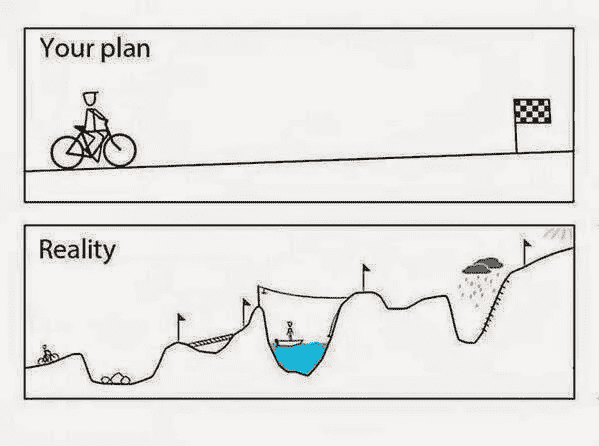

# 如何确保你的软件项目真正完成

> 原文：<https://betterprogramming.pub/how-to-ensure-your-software-projects-actually-finish-5e0dd7ea46fc>

## 避免他们变成僵尸

Jo Szczepanska 在 [Unsplash](https://unsplash.com/search/photos/management?utm_source=unsplash&utm_medium=referral&utm_content=creditCopyText) 上拍摄的照片

现在是星期一早上。

你挣扎着起床。

你的精力耗尽了。

是时候去工作了，再一次面对项目死亡行军。

不知何故，这个项目已经被传递给几个团队，然而…它似乎从来没有真正完成。

相反，就像一个不死的僵尸，它继续困扰着活着的人。每一个实现团队都把未完成的巨大努力交给了掌握范围和复杂性的人。

管理层已经投入了数百万美元来实现这项技术，但似乎没有任何进展。

他们没有分析问题的根本原因，而是简单地将更多的钱和时间投入到整个项目中。

几乎每一个大公司都会发生这种情况。公司花费数百万美元来实现技术，但有时技术从未交付。[问问赫兹吧，他正因为一个失败的项目](https://www.theregister.co.uk/2019/04/23/hertz_accenture_lawsuit/)起诉埃森哲索赔 3200 万美元！

那么如何让你的下一个项目不变成僵尸呢？

为了避免僵尸项目，保持前进的势头是很重要的。这意味着在出现障碍时快速清除，创建可管理的里程碑，并不断沟通以确保每个人都知道项目的状态。反过来，这保持项目向前发展，并确保所有的利益相关者在同一页上。

# **马上清除路障**

在科技项目中，障碍每天都在发生。

也许有人没有访问数据集的权限，团队 A 和 B 没有就设计达成一致，或者也许您正在等待一位刚刚度假的主管批准购买软件。

如果不尽快处理，障碍会悄悄地淹没项目。

在大公司中，大多数技术团队同时处理多个项目。这使得路障成为团队无法完成项目的借口；路障减轻了邻近队伍的压力。如果你是技术项目经理(TPM ),甚至是项目的技术负责人，你不能让障碍成为借口而失去动力。

一旦势头减弱，就很难重新开始。

团队必须记住他们为你的项目做了什么，他们需要回顾他们的代码/需求，他们可能会犯错误，因为工作在他们的脑海中并不新鲜。这就是为什么路障对项目来说是致命的。忽略他们并假设他们会照顾好自己是确保你的项目永远不会结束的一种方法。

相反，一旦你的团队遇到障碍，采取行动清除它们是很重要的。指派一个团队负责路障，并确保定期跟进团队，让他们知道这项工作很重要。

# 创建里程碑

被追究责任并不总是感觉很好，但这是必要的。

我们都避免它，我们中的一些人说服领导我们不需要它。

当你是一个全员生产性维护时，很容易认为你不需要让人们负责，你毕竟不想成为坏人。当然，团队中有一个工程师因为这样或那样的原因一直推迟完成一个模块，你意识到你必须设置明确的里程碑。

里程碑让我们保持诚实，并帮助我们了解自己的能力。与日期相关的里程碑会产生压力，从而迫使优先化。当然，这是一种微妙的平衡，因为一些经理会决定一切都是优先事项，让他们的团队疲于奔命。但是优秀的经理会把他们的目标和优先顺序放在一起，然后向上传达接下来几个月实际要做的事情。

它为每个人提供了更多的信息，它提供了实际上可以做什么的真实期望。此外，它只强制完成需要完成的工作。有很多项目可能是不必要的，可以被砍掉。

是的，管理层总是推动事情更快地完成，但是你的工作速度确实是有限度的。设定里程碑不仅让技术团队负责，还迫使管理层重新评估他们自己的需求。

在一天结束时，好的项目经理将开始了解团队和个人的工作速度，这反过来允许他们更好地评估未来的工作。

里程碑可能会有压力，但它们让你清楚地了解每个人都有能力做什么。

# 沟通是关键

这是老生常谈的概念吧？

大概有成千上万的文章在谈论每个技术领域的交流价值。

那么为什么人们一直这么说呢？

因为沟通做好了，有助于大家理解是怎么回事。

沟通让每个人都了解情况。

它帮助 TPM 知道哪里有障碍，以及实际上做了什么。大多数 TPM 只是从更高的层面来看待事情。这意味着他们信任各个团队的工程师诚实地交流状态。

没有沟通，就很难知道哪些步骤可以前进，哪些步骤被阻止了。

# 阐明你的终点

如果你不知道你要去哪里，不知道你想从你完成的项目中得到什么，那么你怎么知道你什么时候到达那里？

尤其是技术项目，有一个令人讨厌的习惯，那就是永无止境，因为有时没有终点是未定义的。相反，新的利益相关者会出现，要求新的特性，并迫使你满足他们的用例。

也许当前的利益相关者只是不停地改变他们想要的。

这就是所谓的范围蔓延。

起初，它开始时很小，似乎没什么大不了的。

"嘿，我们能不能在这里多加一栏，或者在那里多加一个按钮？"

当然，这些可能是很小的请求，但是不用多久，每个人都会认为他们可以随时提出新的请求。

达到一个移动的目标是很难的，对代码添加一些看起来很小的改变可能会对代码库造成巨大的改变。

这并不是说项目和需求不能改变。在因为有意义而改进最终产品和因为有人认为这是个好主意而增加功能之间有一个平衡。

因此，确保有一个商定的目标可以确保产品的第一个版本是重要的和必要的。

一旦你完成了最初的版本，你就会发现哪些功能是真正需要的。花太多时间在后端，试图预测终端用户将如何使用产品，并试图满足每一个用例，只会增加失败的可能性。

# **结论**

防止项目变得僵尸化并不总是容易的。

它需要一名工程师或全员生产性维护(TPM)来领导，并确保每个人都朝着一个共同的目标努力。此外，他们确保快速减少障碍，以保持动力，避免团队变得陈旧或陷入另一个项目。

事实是保持项目向前发展很容易，直到它不容易。这就是伟大的 TPM 发挥作用的地方。就像管弦乐队前的大师一样，他们控制着大局。