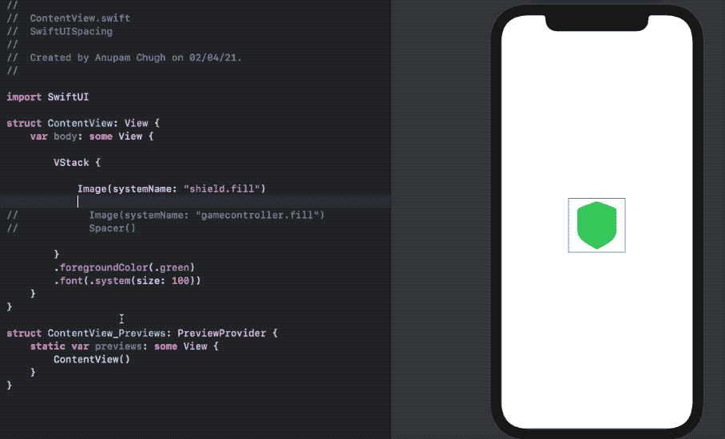
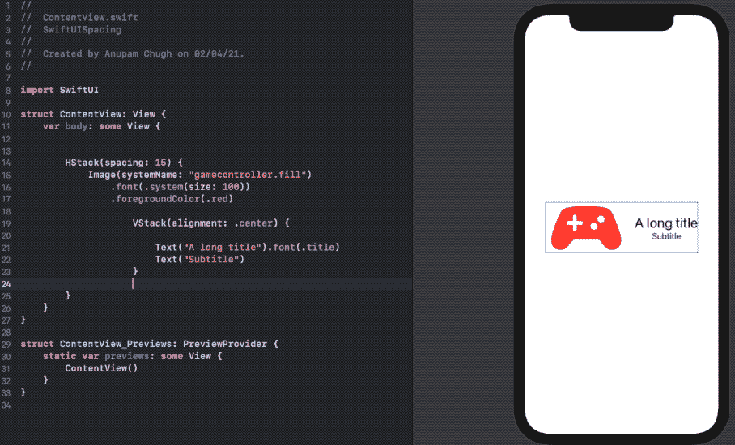
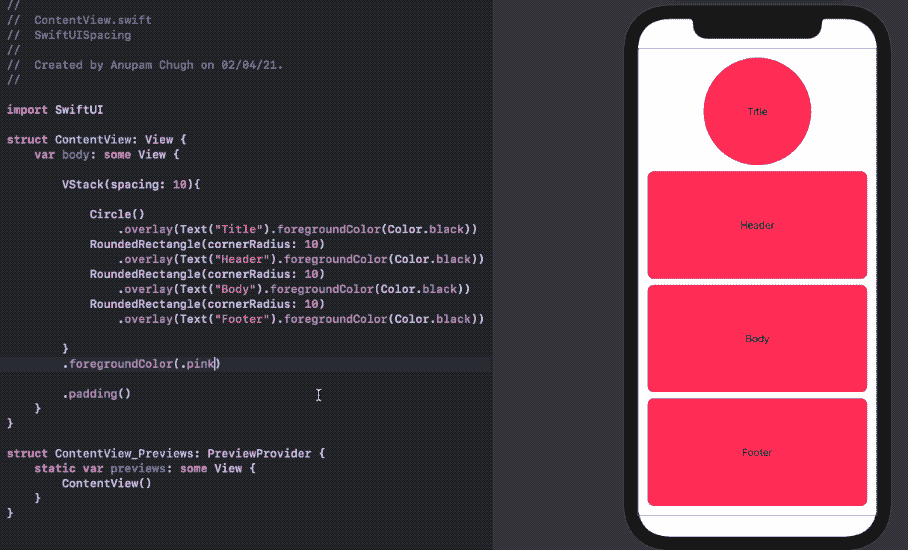
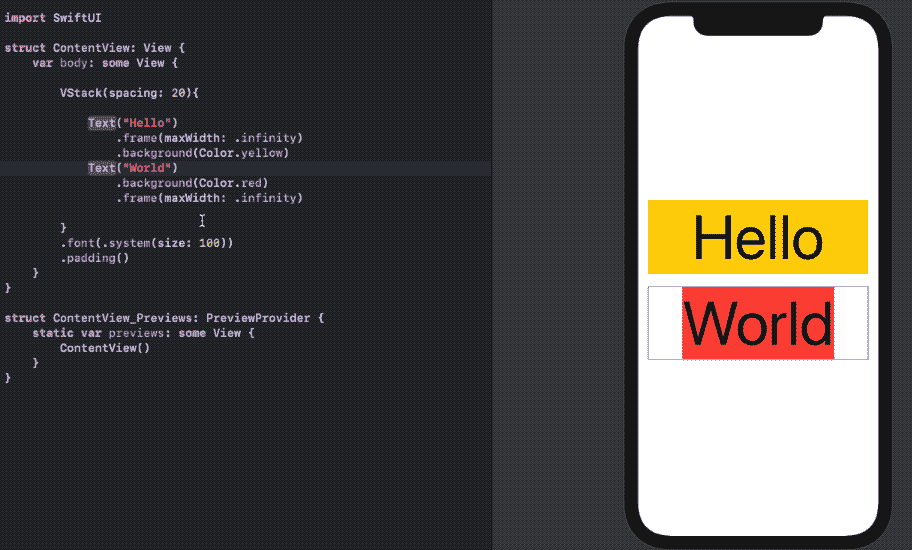
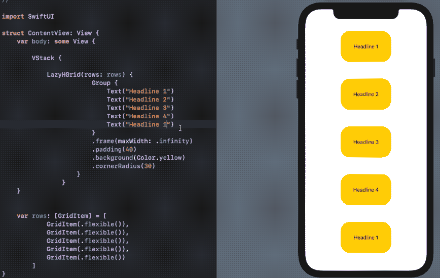

# 如何在 SwiftUI 中均匀分布视图

> 原文：<https://betterprogramming.pub/how-to-evenly-space-views-in-swiftui-260965280368>

## 4 种不同的视图定位方式


照片由 [La-Rel Easter](https://unsplash.com/@lastnameeaster?utm_source=medium&utm_medium=referral) 在 [Unsplash](https://unsplash.com?utm_source=medium&utm_medium=referral) 上拍摄。

前几天，我在一个 UIKit 项目上停滞了几个月之后，又回到了 SwiftUI 开发中。奇怪的是，我花了一段时间来构建最基本的原型:在我的图像过滤 SwiftUI 应用程序中均匀地间隔两张图像。

我试着在我的`HStack`中的两个`Images`上设置`resizable()`和`aspectRatio()`修改器，但是没有成功。事实上，由于实际的图像资产如此之大，其中一个实际上占满了整个屏幕。当然，你可以对宽度和高度进行硬编码，但是这并不适用于所有的屏幕尺寸和方向。

现在我已经掌握了 SwiftUI，我很高兴分享一些不同的技术来在 SwiftUI 中分隔您的视图。让我们开始吧。

# 使用垫片、堆叠间距和对齐方式

顾名思义，`Spacers`占据可利用的空间。它们填充空间的方式取决于它们是被包裹在`HStack`还是`VStack`中。

这里有一个简单的例子:

```
VStack {
Image(systemName: "shield.fill")
Spacer()
}
```



作者截屏。

如您所见，`Spacer`垂直占据了可用空间。第一个`Spacer`将`Image`推到屏幕顶部。为了使所有视图的间距相等，在它们之间添加一个`Spacer()`。

我们还可以在`Stacks`内增加间距，并以某种方式对齐视图。更好的是，我们可以结合使用`Stack`间距和`Spacers`来为视图的排列带来更多的灵活性。

例如，在下面的代码中，我们使用了一个`Spacer`将`HStack`向屏幕左侧对齐。另外，我们还使用了`Stack`间距和对齐来安排 SwiftUI `Text`:



现在，如果我们在两个`Text`视图之间放置另一个`Spacer()`会发生什么？它会占据整个屏幕空间还是仅仅占据`HStack`的可用高度？

回答:由于我们没有指定`HStack`的高度，它实际上会占据整个屏幕空间。为了确保`VStack`不会占用超过`HStack`的空间，我们可以设置一个固定的`frame`高度。

# 使用形状

虽然我们已经看到 SwiftUI 中的`Texts`和`Images`只占据了内容空间，但另一方面，`Shapes`却扩展到覆盖尽可能多的空间。

因此，为了填充堆栈的可用空间，或者为了平均分配我们的视图，我们可以将它们放在一个`Shape`视图中。

这里有一个例子:



形状是平等填充空间的好方法。您也可以使用它们快速创建自定义的类似单元格的视图。

除了使用`overlay`视图修改器来放置子视图，您还可以使用`ZStack`。

# 使用帧修改器

通常，我们希望创建等宽或等高的视图。在这种情况下，使用将`maxWidth`或`maxHeight`设置为`.infinity`的帧修改器通常是强制宽度和高度成为最大可用空间的首选方式。

这里有一个`frame`布局修改器的例子:



注意:在`frame`之前设置`background`修饰符会导致`VStack`仍然有一些空间。这是因为`background`修改器应用于框架的视图，而不是整个堆栈。因此，正确排序视图修改器是至关重要的。

# 使用网格

虽然以上三种方法足以以任何方式分隔视图，但通常当有太多视图需要排列时，使用`Spacer`或框架修饰符会导致一些样板代码。

谢天谢地，在这种情况下，我们可以利用 SwiftUI 的`LazyVGrid`和`LazyHGrid`，它们是在 iOS 14 中引入的[。](/swiftui-grids-in-ios-14-49df6aa28541)



在上面的代码中，由于我们创建了水平网格项，每个包装在 SwiftUI `Group`中的`Texts`具有相同的宽度。

# 结论

在本文中，我们看到了管理视图之间空间的四种不同方式。在构建视图时，均匀分布视图是一个相当常见的需求。现在你知道什么时候使用这些技术。

这一次到此为止。感谢阅读。