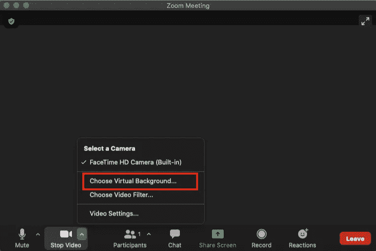
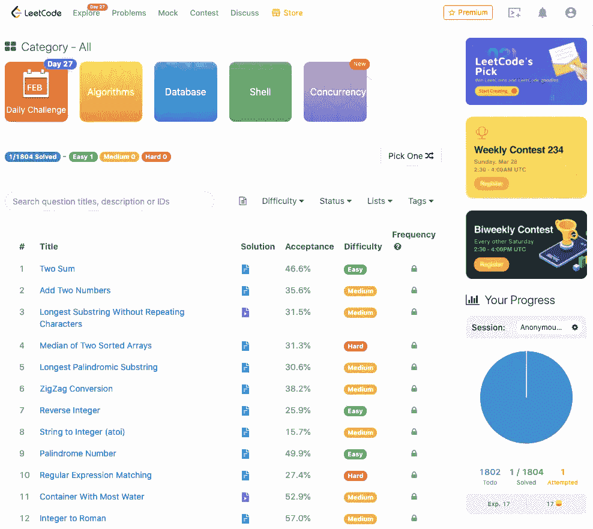
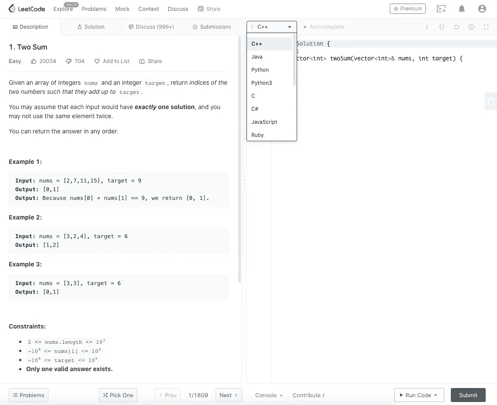
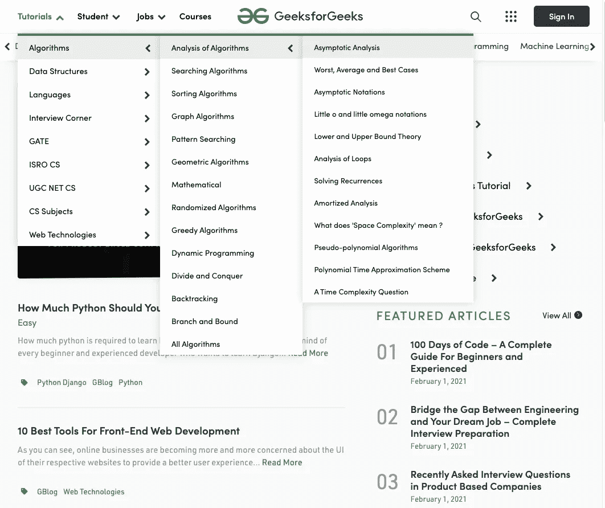
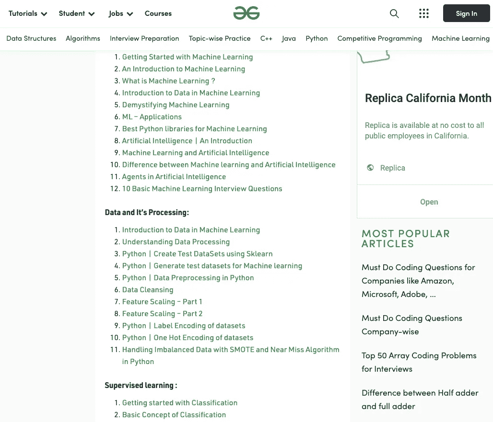
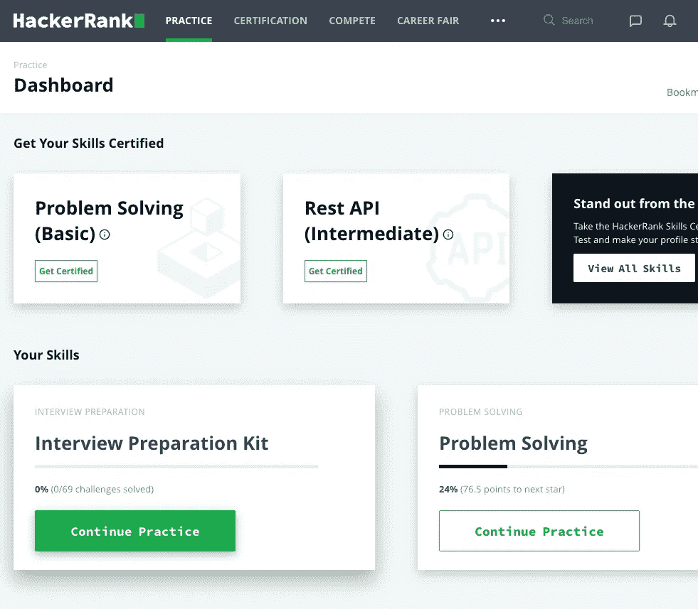
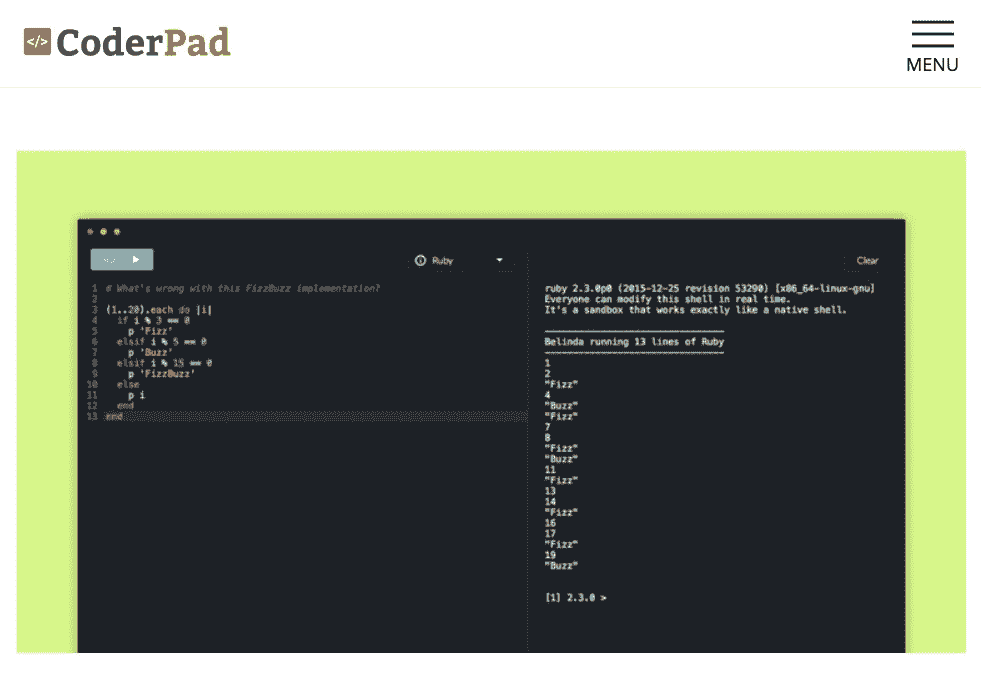
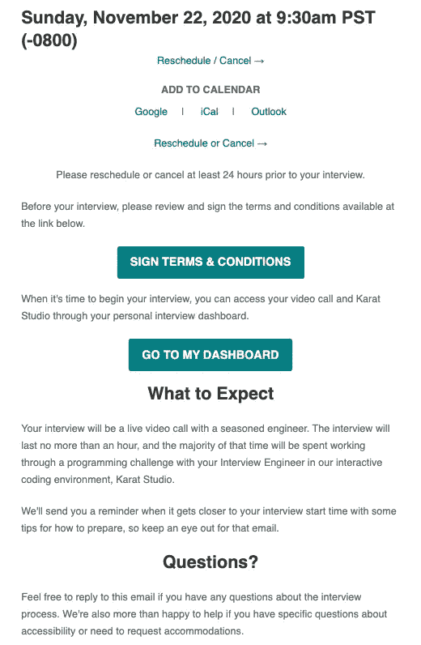
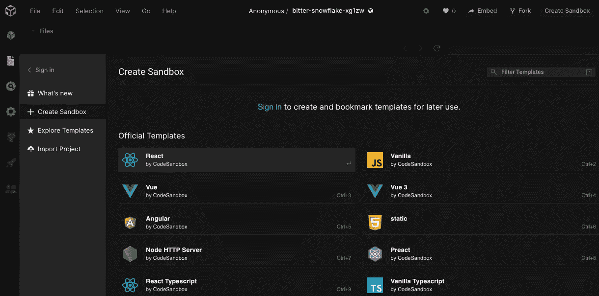
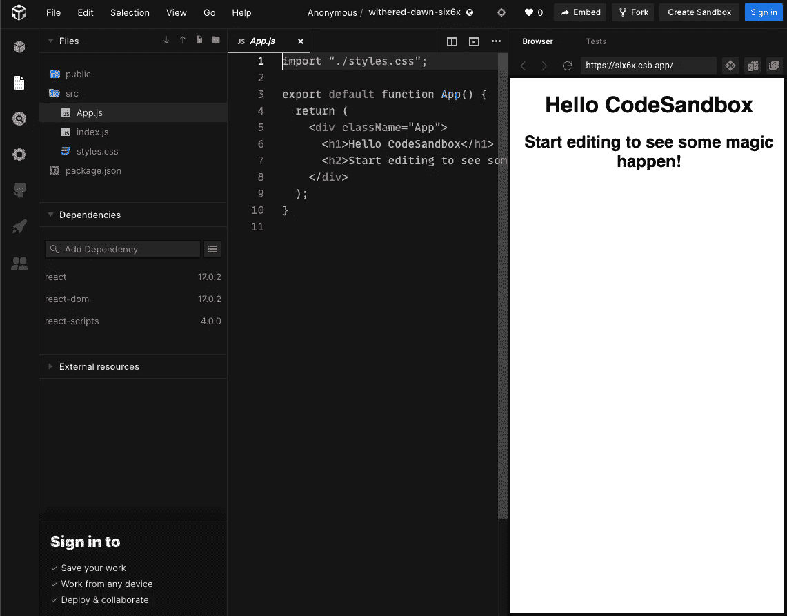

# 如何在 2021 年的编码面试中脱颖而出

> 原文：<https://betterprogramming.pub/how-to-excel-at-coding-interviews-in-2021-aadabb427655>

## 分享一些软件开发工作的在线面试经验

Amy Hirschi 在 [Unsplash](https://unsplash.com?utm_source=medium&utm_medium=referral) 上拍摄的照片。

不管当前的社交距离协议如何，软件开发就业市场都很火爆。大公司开始看到在家工作提高了生产力。

对于软件开发者来说，这是一个不同的景观。突然间，我们对这个国家的任何职位都开放了。成为远程员工不再是一个问题。我们可能永远也见不到自己的同事，在疫情之后被雇佣的员工也还没有机会去参观他们的公司。

远程，远程，远程。

疫情永远地改变了软件业。不可避免的是，面试过程也适应了这种情况。在经历了这些前所未有的面试和被面试的经历后，我们想分享一下我们在这个虚拟面试环境中学到的东西。

# 变焦已经成为常态

以前面试的时候站在白板前很正常，要么解释一个架构图，要么写一些真/伪代码。今天，白板没了，伪代码死了。一个程序需要被成功编译，并且在面试中得到正确的答案。

你正对着一台变焦相机。着装规范仅限于肖像部分。没人能看到你是否穿着睡裤。如果你不想暴露你的家庭办公室，从 Zoom 中选择一个[虚拟背景](https://support.zoom.us/hc/en-us/articles/210707503-Virtual-background)。

面试期间你需要一个安静、不受干扰的环境。在出现意外噪音或入侵者时，快速响应静音和停止视频。

熟悉聊天，面试官与受访者交流信息(如编码挑战链接)。

你可能需要在面试过程中进行屏幕分享。准备好架构图或一些其他文档，并使它们易于共享。您的工作和正在进行的编码通常通过共享屏幕呈现。

如果你需要写或画些东西，准备好软件工具，如[微软 365](https://www.microsoft.com/en-us/microsoft-365) 、[谷歌文档](https://www.google.com/docs/about/)、 [Skitch](https://evernote.com/products/skitch) 等。

如今，在线编码是一件大事。以下是你如何正确准备面试的方法:

*   提高你的编码能力。
*   增加你筛查成功的几率。
*   通过正式的在线面试。

# 提高您的编码能力

编码面试是一种基于技术问题的工作面试技巧，用于评估潜在员工。它用于测试候选人的技术知识、编码能力、解决问题的技能和创造力。这些技能来源于每个人的教育背景和工作经验。

然而，适当的准备可以在面试中帮助你。

## LeetCode

强烈推荐 [LeetCode](https://leetcode.com/problemset/all/) ，这是一个提高编码掌握度的在线编码平台。目前，它有 1804 个问题。它们被分为容易、中等或困难。

LeetCode 为实践提供了一个很好的编码环境。以下是 LeetCode 上的#1 问题，由第一个选项卡描述。右侧的下拉列表允许您选择一种编程语言来解决问题。

解决方案选项卡公开了官方解决方案。

“讨论”选项卡显示围绕该问题的讨论。看其他开发者的解决方案总是让人大开眼界。

Submissions 选项卡捕获您提交的所有内容，以及执行速度和内存使用情况。

如果您支付会员费，您就可以访问目标公司的独家优质问题/文章。

通常情况下，如果你通过 LeetCode 的中等水平的问题，你应该可以确定一份工作。

## 极客论坛

[GeeksforGeeks](https://www.geeksforgeeks.org/) 是另一个在线面试准备中心，提供软件问题解决的指导和课程。以下是算法的教程列表:

图片来自 [GeeksforGeeks](https://www.geeksforgeeks.org/) 。

GeeksforGeeks 的编码环境与 LeetCode 不兼容，但网站上有解释清楚、经过深思熟虑、写得很好的计算机科学和编程文章。对某个具体话题的深入了解很有帮助。

以下是关于机器学习的文章:

图片来自 [GeeksforGeeks](https://www.geeksforgeeks.org/machine-learning/?ref=shm) 。

# 增加你筛查成功的几率

如今，如果没有通过筛选测试，你可能就找不到编码面试官。在与人力资源代表交谈后，你通常会被要求进行 1-2 小时的在线测试。

## 黑客银行

HackerRank 是一家专注于竞争性编程挑战的科技公司。它为参与公司主持在线编码评估。有各种语言的模拟测试。熟悉平台并知道如何使用提供的测试用例进行调试是一个好主意。在线访谈不提供断点，您需要阅读控制台输出进行调试。

图片来自 [HackerRank](https://www.hackerrank.com/) 。

## 代码簿

[CoderPad](https://coderpad.io/) 是一个面试和筛选工具，旨在让候选人编写可以运行的程序。向候选人提供一次性登录凭据以执行在线评估。

图片来自 [CoderPad](https://coderpad.io/) 。

## 卡拉

[Karat](https://karat.com/) 是一家在线面试测评公司。它不只是把你扔给一台机器。取而代之的是，它会指派一名人类采访者来指导你完成一段录像。

你的面试通过一封类似下面的邮件得到了确认:

卡拉特的采访是一个 60 分钟的会议。前 10-20 分钟用于项目讨论和/或知识问题。对于 JavaScript，你会被问到诸如闭包之类的语言概念。

接下来的 30-45 分钟是关于编程的。你会遇到一个类似于中级 LeetCode 的问题。你有机会澄清问题。选择你的测试语言，用 CoderPad 编写你的算法。调试，修复 bug，通过测试用例。一旦解决方案完全运行，您将被要求描述解决方案的时间和空间复杂性。

如果你完成了一个给定的问题，还有剩余时间，Karat 的面试官会给你一个新的问题。通常情况下，解决一个问题就足够了。

# 通过正式的在线面试

你练习过在线测试，并通过了特定公司的筛选测试。

恭喜你！

现在你需要通过正式的变焦面试(假设我们的远程工作情况继续)。通常情况下，会有两轮正式面试，但每个公司都不一样。每次正式面试可能会有几个由不同面试官主持的环节。

重要的是要相信面试官是你的朋友。他们会和你进行结对编程，尽可能指导你准确评估自己的优缺点。

如果你没有得到问题，不要惊慌。要求面试官澄清。向面试官介绍你的思考过程。沟通是面试过程的一部分。

注意面试官的反馈。他们可能会试图给你提示。试着找到一个最佳的解决方案，但不要纠结于此。先解决问题，只要时间允许就可以改进。展示你如何处理问题和克服障碍是至关重要的。

正式面试的在线测试工具取决于面试官的偏好。

## CodeSandbox

CodeSandbox 在前端正式面试中经常使用。它为快速 web 开发创建并共享一个协作沙箱。

图片来自 [CodeSandbox](https://codesandbox.io/) 。

在拿起 React 模板后，架子工就开始工作了。您可以自由添加依赖项和更改 React 版本。

# 结论

在这次疫情期间，我们采访了又被采访了。希望这篇文章有所帮助。

以下面试指南适用于前端技术面试:

*   [琴弦操纵技术面试指南](https://medium.com/better-programming/the-technical-interview-guide-to-string-manipulation-92f4c4649cd)
*   [动态编程技术面试指南](https://medium.com/better-programming/the-technical-interview-guide-to-dynamic-programming-3ce755d99849)
*   [JavaScript 面试问题:将罗马数字转换成数字](https://medium.com/javascript-in-plain-english/javascript-interview-question-convert-roman-numerals-to-numbers-47e2020cf36a)
*   [回溯式技术面试指南](https://medium.com/better-programming/the-technical-interview-guide-to-backtracking-e1a03ca4abad)
*   [阵列转换技术访谈指南](https://medium.com/better-programming/the-technical-interview-guide-to-array-transformations-91e23839d19c)
*   [面试准备:使用 HTML、CSS 和 JavaScript 构建 Web 应用程序](https://medium.com/javascript-in-plain-english/interview-prep-build-web-application-using-html-css-and-javascript-d6489132daaf)

感谢阅读。