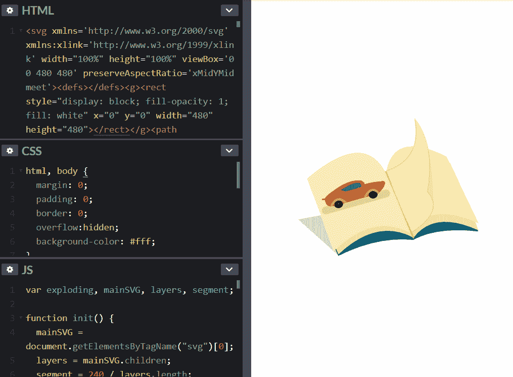
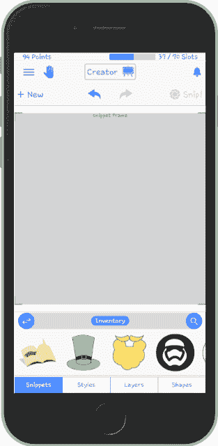
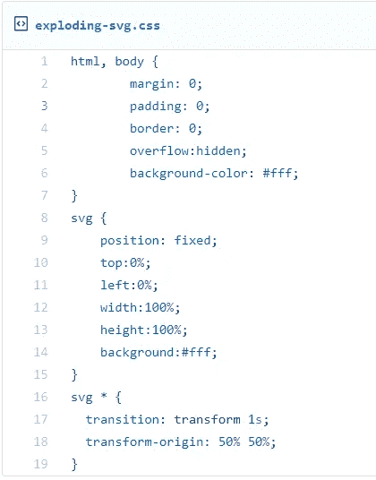

# 如何用简单的 JavaScript 和 CSS“分解”一个 SVG 图像

> 原文：<https://betterprogramming.pub/how-to-explode-an-svg-image-in-simple-javascript-and-css-3d2c7f0968b2>

克里斯多夫·高尔摄于 [Unsplash](https://unsplash.com/photos/m_HRfLhgABo)

去年，我写了一篇[帖子](https://medium.com/@sergey.rudenko/exploded-isometric-view-of-an-svg-image-58be3ca73a57)，在那里我考虑构建一个解决方案的原型，它将允许 SVG 图像“爆炸”当然不是字面上的意思，但是由于 SVG 格式在层中呈现其元素(组和单个形状，如“路径”、“矩形”和“组”)，我认为可能有一种方法可以通过简单的 CSS 转换和 JavaScript 实现“分解视图”。

是时候交付这个原型了。我们将在下面构建它:

# 先决条件

首先，我们需要一个 SVG 图像来实现“爆炸”。最好使用一个 SVG 文件，它有一个相当浅的树“结构”,只有一层“嵌套”。例如:

现在，对于实际的 SVG 文件，我使用我自己创建的— Morphistic.app —来创建这样一个 SVG 文件:

使用 Morphistic.app 另存为 SVG

我用记事本打开 SVG 文件，复制了它的 XML 结构。然后粘贴到[我的 codepen.io 项目](https://codepen.io/cmer41k/pen/XLEPwg/)，现在已经有完整的实现了。

# 履行

首先，我添加了 CSS 规则，使我们的 SVG 扩展到整个可用空间。然后，我为所有主要的 SVG 元素子元素添加了一秒钟的 CSS 过渡。我还确保变换原点是每个变换元素的中心:

这是我如何设置我的 CSS

实际的 JavaScript 代码非常简单。这是它的要点:

没有什么特别的或者高效的，但是代码完成了它的工作。您可以将它提供给不同的 SVG 文件(XML 内容)。它应该适用于几乎所有具有 480x480 视口的 SVG，其中图形元素位于屏幕中央。

下一次我将尝试构建一个小角度的“指令”,当附加到 SVG 文件时，它可以帮助“分解”SVG 文件。