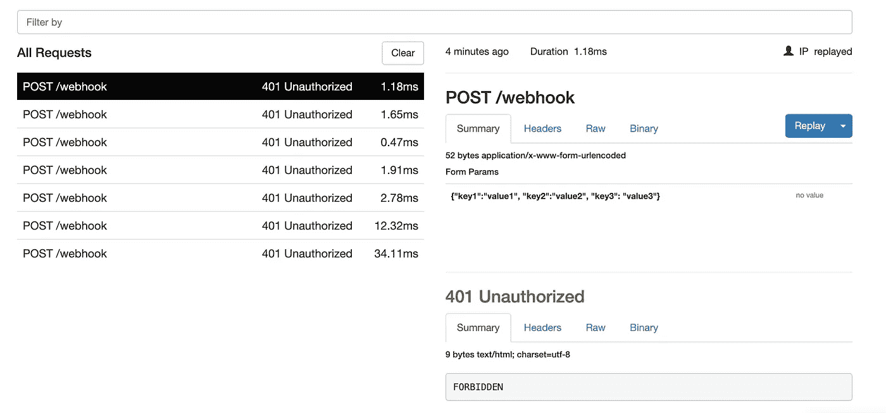

# 如何向您的本地 Web 服务器公开安全的 HTTPS URL

> 原文：<https://betterprogramming.pub/how-to-expose-a-secure-https-url-to-your-local-web-server-eddf780be515>

## 使用 ngrok 建立到本地主机的安全隧道


Christian Holzinger 在 [Unsplash](https://unsplash.com/s/photos/modern?utm_source=unsplash&utm_medium=referral&utm_content=creditCopyText) 上拍摄的照片

我最近不得不为 Intuit webhooks 设置一个集成。

这意味着我需要我的应用程序通过一个 HTTPS URL 可用，这样我就可以在他们的开发人员 UI 中设置它。

每当我必须做出更改时，我需要将我的应用程序部署到某个地方，触发 webhook 操作，然后等待请求。然后我会查看日志，看看发生了什么以及失败的原因。

最后，我会重新部署和重新触发我的更改。太麻烦了！

幸运的是，有一个解决方案:`ngrok`(网络怪人，懂了吗？).

# ngrok 是什么？

`ngrok`是一个轻量级的工具，它允许你在本地机器上创建一个安全的隧道以及一个公共的 URL，你可以用它来访问你的本地 web 服务器。

## 你能用它做什么？

有很多情况下你会用到`ngrok`。也许您想在不部署的情况下向同事演示您的网站。或者，您可能想测试一个连接到本地运行的后端的移动应用程序。

我用它开发了一个使用 webhooks 的服务。`ngrok`捕获所有流量进行详细检查，甚至允许您重放 HTTP 请求。

# 如何让它发挥作用？

建立`ngrok`不费吹灰之力。`ngrok`以存档下载的形式出现——你需要提取它以获得实际的应用程序。你可以把它放在任何地方，只要它在你的路径或符号链接中。

从那以后，监听你的网络服务器就很简单了。假设您在`port 8000`上运行本地 web 服务器。在终端中，你可以输入:`ngrok http 8000`。

`ngrok`开始监听`port 8000`并创建安全隧道:

```
ngrok by [@inconshreveable](http://twitter.com/inconshreveable)                                                                                                        (Ctrl+C to quit)Session Status                online
Account                       meriam (Plan: Free)
Version                       2.3.35
Region                        United States (us)
Web Interface                 [http://127.0.0.1:4040](http://127.0.0.1:4040)
Forwarding                    [http://](http://9d758a07.ngrok.io)[ab12cd34](http://ab12cd34.ngrok.io)[.ngrok.io](http://9d758a07.ngrok.io) -> [http://localhost:8000](http://localhost:8000)
Forwarding                    [https://](https://9d758a07.ngrok.io)[ab12cd34](http://ab12cd34.ngrok.io)[.ngrok.io](https://9d758a07.ngrok.io) -> [http://localhost:8000](http://localhost:8000)Connections                   ttl     opn     rt1     rt5     p50     p90
                              9       0       0.00    0.00    0.00    0.27HTTP Requests
-------------
```

它还创建了两组映射到本地 web 服务器的公共可用 URL:

```
Forwarding [http://ab12cd34.ngrok.io](http://ab12cd34.ngrok.io) -> [http://localhost:8000](http://localhost:8000)
Forwarding [https://ab12cd34.ngrok.io](https://ab12cd34.ngrok.io) -> [http://localhost:8000](http://localhost:8000)
```

在您的浏览器中调用`[http://ab12cd34.ngrok.io](http://ab12cd34.ngrok.io)`或`[https://ab12cd34.ngrok.io](http://ab12cd34.ngrok.io)` (SSL)应该会调出您的本地站点。

这些是`ngrok`在每次重启时创建的唯一的 URL，使得在整个团队中共享这些一次性的测试会话变得容易。

有了这个公共 URL，我能够测试 Intuit webhooks，而不需要部署我的 web 应用程序，并且我能够在我的本地 web 服务器上接收回调。

# 监视

`Ngrok`带有一个 web 界面，允许您监控本地 web 服务器的传入流量:

```
Web Interface [http://127.0.0.1:4040](http://127.0.0.1:4040)
```



ngrok 接口中传入请求的详细检查

如果你正在测试 webhooks，`Replay`功能会让你的生活变得更加轻松。您可以通过向本地服务器重新发送请求来快速开发 webhook 集成。对我来说，这意味着我不必去服务的 UI 并触发动作:我可以简单地点击重放按钮！

[艾伦·史瑞夫](https://inconshreveable.com/)是`ngrok`背后的开发者。在 SIGNAL 2015 大会上，他做了一个关于 ngrok 制作的精彩演讲，他解释了他是如何开始制作这个工具的，以及他在这个过程中做出的产品决策。

Ngrok 是一个开源项目。

文件:[https://ngrok.com/docs](https://ngrok.com/docs)

github:[https://github.com/inconshreveable/ngrok](https://github.com/inconshreveable/ngrok)