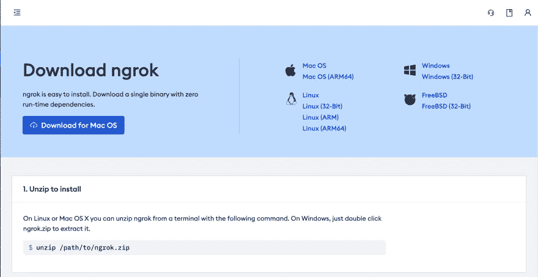
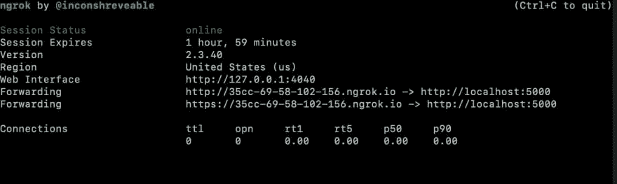

# 如何将您的本地主机 URL 公开为公共 URL

> 原文：<https://betterprogramming.pub/how-to-expose-your-local-host-url-as-a-public-url-30ea4ff79c0e>

## 有时，您可能希望使用公共 URL 来访问 API 或 React 项目，但又不想麻烦地部署它


照片由 [Aaron Burden](https://unsplash.com/@aaronburden?utm_source=unsplash&utm_medium=referral&utm_content=creditCopyText) 在 [Unsplash](https://unsplash.com/s/photos/tunnel?utm_source=unsplash&utm_medium=referral&utm_content=creditCopyText)

基本上，代替 [http://127.0.0.1:5000/](http://127.0.0.1:5000/) ，你会想要类似于[http://35cc-69-58-102-156 . ngrok . io](http://35cc-69-58-102-156.ngrok.io/)这样其他人也可以访问它。本文将讨论实现这一点的两种方法。

# 公开您的本地主机 URL 意味着什么？

*   首先，是暂时的。除非您选择付费选项，否则大多数公共 URL 将在几小时后过期。你总是可以生成一个新的。
*   公开的 URL 将基本上与您的本地主机 URL 同步。对您的本地主机 URL 的任何请求也将被发送到公开的 URL，反之亦然。
*   只有当您的本地 API 或 React 项目处于活动状态时，您的公共 URL 才会处于活动状态。

# 为什么要公开您的本地主机 URL？

*   使用 web hook:web hook 需要一个公共 URL。公开您的本地主机 URL 会为您生成一个公共 URL。可以向这个公共 URL 发出 Webhook 请求，您的本地主机 URL 也将收到该请求。查看本文以了解更多关于 webhooks 以及如何在 Python 中使用它们的信息。
*   在其他设备上测试您的项目:您可能想要在实际的移动设备或任何其他设备上测试您的 React 项目。
*   让其他人可以访问您的服务器:公开您的本地主机 URL 将允许任何拥有该 URL 的人访问它。这可以帮助您与他人共享您的 server/React 项目，以获得反馈或调试。

我们将查看两个免费选项来公开您的本地主机 URL。第一个选项将需要您下载软件，而第二个选项将需要一个 NPM 软件包。

# 选项 1: Ngrok

你需要注册 [ngrok](https://ngrok.com/) 。注册后，你必须下载软件。



ngrok 主页截图

下载完成后，解压文件。记住你解压文件的目录。这将是下一步需要的。

打开终端，使用“cd”命令导航到解压缩文件的位置。一旦您的终端位于解压缩文件所在的目录中，请键入以下命令:

```
ngrok  http <PORT NUMBER>
```

如果您的 React 项目在端口 3000 上运行，您必须键入以下内容:

```
ngrok http 3000
```



运行 ngrok 后的终端屏幕截图

您应该在终端中看到类似的输出。公共网址是“转发”旁边的网址我的情况是[http://35cc-69-58-102-156 . ngrok . io](http://35cc-69-58-102-156.ngrok.io/)。如果您访问您的公共 URL，您应该看到与您访问您的本地主机 URL 时看到的一样的东西。请注意“会话过期”旁边的值在分配的时间后，公共 URL 将过期，您必须生成一个新的 URL。

# 选项 2:本地隧道

[Localtunnel](https://localtunnel.github.io/www/) 是一个可以使用节点安装的 npm 软件包。键入以下命令进行安装:

```
npm install -g localtunnel
```

我们使用`-g`标签来全局安装它，这样它可以被多个项目访问。安装完成后，键入以下命令以显示您的本地主机 URL:

```
lt --port 3000
```

如果成功，您应该会看到如下类似的 URL:

```
your url is: [https://fast-cow-24.loca.lt](https://fast-cow-24.loca.lt)
```

如果您收到以下错误消息

```
command not found: lt
```

找到节点安装程序包的位置。它应该位于节点模块文件夹中。找到节点模块文件夹后，cd 到以下位置:

```
cd node_modules/localtunnell/bin
```

并键入以下内容:

```
./lt.js --port 3000
```

如果您正在寻找关于公开本地主机 URL 的更详细的文章，我推荐[这篇文章](https://chenhuijing.com/blog/tunnelling-services-for-exposing-localhost-to-the-web/#%F0%9F%91%9F)。

在 [Twitter](https://twitter.com/rahulbanerjee99) 上与我联系。