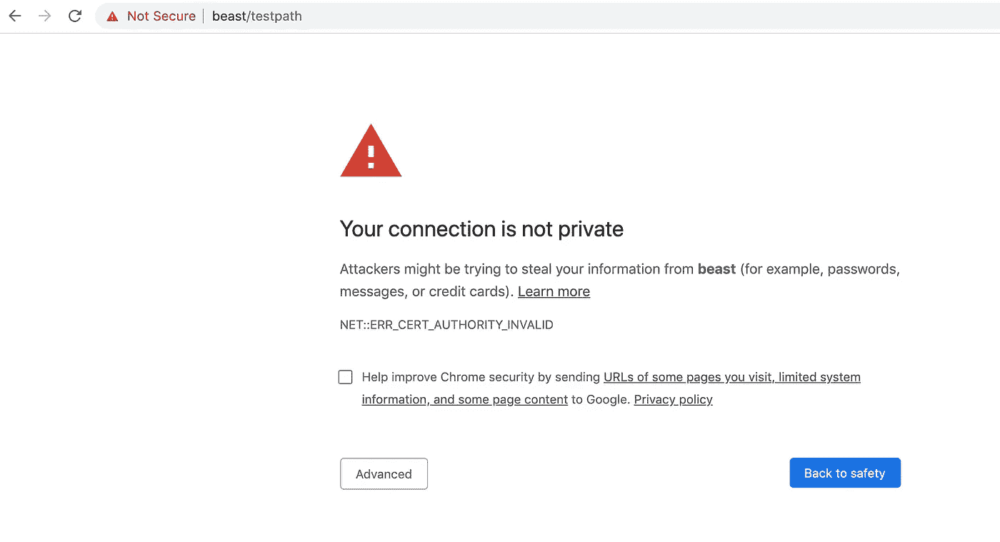
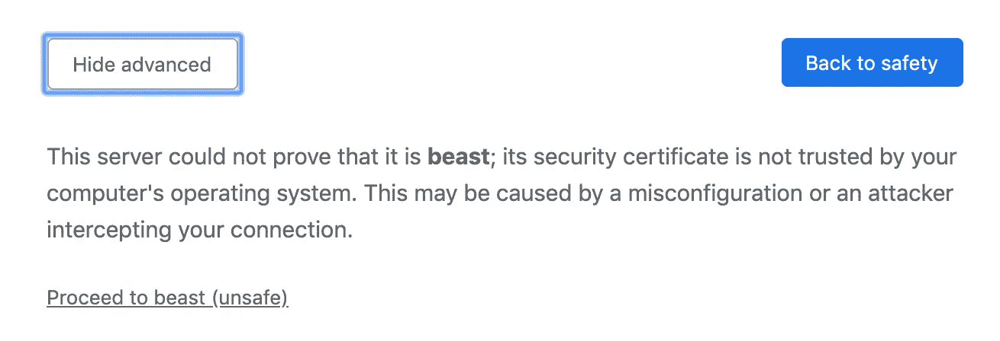
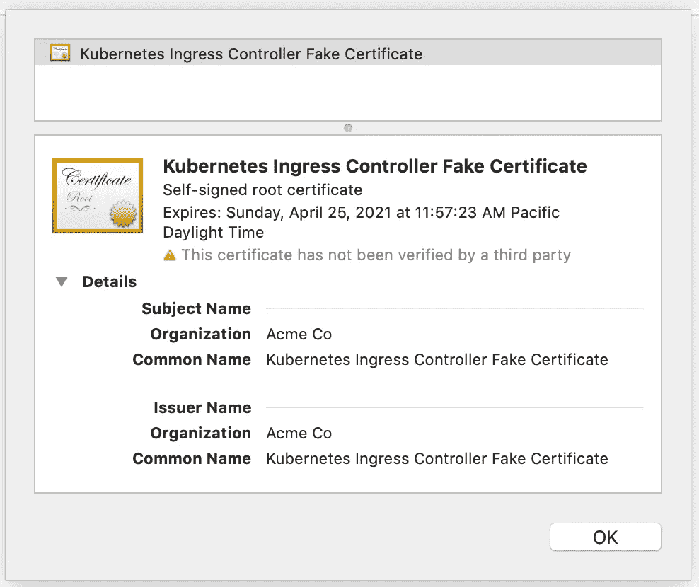
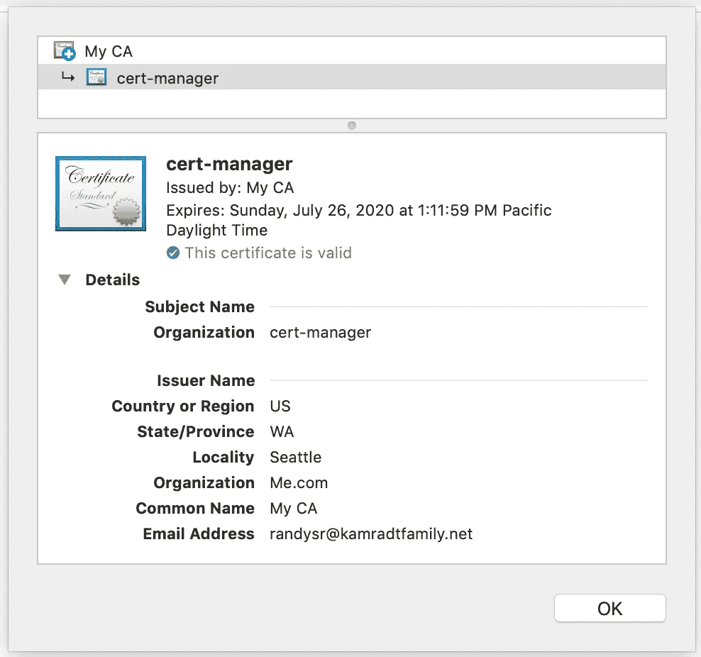

# 如何使用 Kubernetes Ingress 公开您的服务

> 原文：<https://betterprogramming.pub/how-to-expose-your-services-with-kubernetes-ingress-7f34eb6c9b5a>

## 允许你的应用程序与外界交流


由[马頔·佩丘林](https://unsplash.com/@pechka?utm_source=unsplash&utm_medium=referral&utm_content=creditCopyText)在 [Unsplash](https://unsplash.com/s/photos/door?utm_source=unsplash&utm_medium=referral&utm_content=creditCopyText) 拍摄的照片

在我之前关于 [Kubernetes](https://medium.com/better-programming/kubernetes-from-scratch-part-2-e30b48f7ca6b) 的帖子中，为了向我的家庭网络公开我的服务，我使用了一个名为 [MetalLB](https://metallb.universe.tf/) 的负载平衡器服务向 VM 桥公开服务，并在主主机上公开一个 Nginx 实例，作为我的家庭网络的反向代理。但是这也有一些限制。Kubernetes 不知道 Nginx，也不能控制它的配置，所以你必须手动配置。此外，MetalLB 从 VM 桥窃取了一些 IP 地址，您必须猜测它配置的 IP 数量。如果您需要的数量超过分配的数量，您必须返回并再次配置 MetalLB。

将服务定义为直接暴露于您的家庭网络的入口路由是很好的。为此，您需要一个入口控制器和一条从主网络到 Kubernetes 桥接网络的路由。我们将从入口控制器开始。

要阅读本文，您需要一个类似于我在文章[*Kubernetes from Scratch*](https://medium.com/better-programming/kubernetes-from-scratch-4691283e3995)中创建的设置。在这篇文章中，我在裸机上运行的虚拟机上创建了一个基本的 Kubernetes 系统。我写这篇文章的目的是通过不使用预打包系统或云提供商提供的系统来帮助理解幕后发生的事情。我还试图成为云提供商不可知论者，因此无论您使用什么云提供商，从本文中收集的知识都将帮助您更好地理解 Kubernetes。您还需要了解 Linux 系统，尤其是网络。

首先，我们需要一个入口。我正好有一个简单的服务，它监听 HTTP get 请求并以“hello world”作为响应。创建一个名为`simple-service.yaml`的文件，并添加以下内容:

```
apiVersion: apps/v1
kind: Deployment
metadata:
  name: hellok8s-deployment
  labels:
    app: hellok8s
spec:
  selector:
    matchLabels:
      app: hellok8s
  template:
    metadata:
      labels:
        app: hellok8s
    spec:
      containers:
      - name: hellok8s
        image: docker.io/rlkamradt/hellok8s:latest
        ports:
        - containerPort: 8080
---
apiVersion: v1
kind: Service
metadata:
  name: hellok8s-service
spec:
  type: ClusterIP
  selector:
    app: hellok8s
  ports:
  - port: 8080
    targetPort: 8080
```

这就像你在 Kubernetes 得到的一样简单。现在，运行`kubectl apply -f simple-service.yaml`来启动服务，并公开端口 8080。但是暴露在哪里？如果在主机上运行`curl [http://localhost:8080/](http://localhost:8080/)`，将一无所获。你可以看看服务:

```
rkamradt@beast:~/scratch$ kubectl get service hellok8s-service
NAME               TYPE        CLUSTER-IP      EXTERNAL-IP   PORT(S)    AGE
hellok8s-service   ClusterIP   10.111.98.155   <none>        8080/TCP   80s
```

请注意，它有一个集群 IP，但没有外部 IP。你可以用集群 IP 试试冰壶，但是什么也得不到。

让我们试试另一个选择。如果你可以访问你的节点(我的节点被称为 kube 1–4 ),你可以`ssh`它们。现在用您的集群 IP 运行 curl:

```
rkamradt@kube1:~$ curl [http://10.111.98.155:8080/](http://10.111.98.155:8080/)
Hello World
```

你可以在每个节点上尝试，你会得到相同的答案。因此，入口控制器的功能之一是向主机公开服务。

现在，我们必须选择一个入口控制器，其中有几个。如果您使用云提供商，他们通常会有一个首选提供商(或者只有一个)。但是既然我是自己的云提供商，我必须选择一个。我挑的是半官方的 Nginx ingress 控制器。您可以直接从 Kubernetes GitHub 页面安装它:

```
kubectl apply -f [https://raw.githubusercontent.com/kubernetes/ingress-nginx/master/deploy/static/provider/baremetal/deploy.yaml](https://raw.githubusercontent.com/kubernetes/ingress-nginx/master/deploy/static/provider/baremetal/deploy.yaml)
```

这就创建了一个名为`ingress-nginx`的名称空间。你可以看到它用`kubectl get all -n ingress-nginx`创建的所有对象。

```
rkamradt@beast:~/scratch$ kubectl get all -n ingress-nginx
NAME                                            READY   STATUS      RESTARTS   AGE
pod/ingress-nginx-admission-create-lfc2b        0/1     Completed   0          89s
pod/ingress-nginx-admission-patch-rmcvq         0/1     Completed   0          89s
pod/ingress-nginx-controller-5f98fb55b8-7pnjt   1/1     Running     0          99sNAME                                         TYPE        CLUSTER-IP      EXTERNAL-IP   PORT(S)                      AGE
service/ingress-nginx-controller             NodePort    10.96.223.195   <none>        80:32688/TCP,443:32569/TCP   99s
service/ingress-nginx-controller-admission   ClusterIP   10.100.112.59   <none>        443/TCP                      99sNAME                                       READY   UP-TO-DATE   AVAILABLE   AGE
deployment.apps/ingress-nginx-controller   1/1     1            1           99sNAME                                                  DESIRED   CURRENT   READY   AGE
replicaset.apps/ingress-nginx-controller-5f98fb55b8   1         1         1       99sNAME                                       COMPLETIONS   DURATION   AGE
job.batch/ingress-nginx-admission-create   1/1           8s         99s
job.batch/ingress-nginx-admission-patch    1/1           8s         99s
```

有几件事需要注意:首先，它有两个运行一次的作业，然后将它们的 pod 留在周围，也许是为了诊断的目的。他们可能有一个 TTL，或者我们可能只是需要在一段时间后摆脱他们。当我看到他们在附近闲逛而感到十分恼火时，我将不得不对此进行调查。

另一件需要注意的事情是，它创建了一个`NodePort`服务，这将需要您使用`kubectl port-forward`进行转发。我认为它这样做是因为它不能期望配置负载平衡器，但在我们的情况下，我们有 MetalLB。我们需要通过编辑`service/ingress-nginx-controller`服务来纠正这一点。运行`kubectl edit service ingress-nginx-controller -n ingress-nginx`。找到`spec.type`字段，将其从`NodePort`更改为`LoadBalancer`。现在，当我们运行`kubectl get all -n ingress-nginx`时，我们可以看到类型已更改为`LoadBalancer`，并且它有一个外部 IP 地址。

```
service/ingress-nginx-controller             LoadBalancer   10.96.223.195   192.168.122.240   80:32688/TCP,443:32569/TCP   4m36s
```

IP 地址是从 MetalLB 分配的，您的地址可能会有所不同。如果我们把地址卷起来，我们会得到:

```
rkamradt@beast:~/scratch$ curl [http://192.168.122.240](http://192.168.122.240)
<html>
<head><title>404 Not Found</title></head>
<body>
<center><h1>404 Not Found</h1></center>
<hr><center>nginx/1.17.8</center>
</body>
</html>
```

现在我们可以配置我们的入口点。有许多不同的选项，包括虚拟主机、路径重定向和 https 终止。但是我们会从非常简单的开始。创建一个名为`simple-ingress.yaml`的文件，并向其中添加以下内容:

```
apiVersion: networking.k8s.io/v1beta1
kind: Ingress
metadata:
  name: test-ingress
  annotations:
    nginx.ingress.kubernetes.io/rewrite-target: /
spec:
  rules:
  - http:
      paths:
      - path: /testpath
        pathType: Prefix
        backend:
          serviceName: hellok8s-service
          servicePort: 8080
```

用`kubectl apply -f simple-ingress.yaml`启动。这将配置摄取服务将所有以`/testpath`为路径的请求转发到`hellok8s-service`。尝试一下:

```
rkamradt@beast:~/scratch$ curl [http://192.168.122.240/testpath](http://192.168.122.240/testpath)
Hello World
```

但是没有路径再次卷曲`/testpath`它仍然是 404 页:

```
rkamradt@beast:~/scratch$ curl [http://192.168.122.240](http://192.168.122.240)
<html>
<head><title>404 Not Found</title></head>
<body>
<center><h1>404 Not Found</h1></center>
<hr><center>nginx/1.17.8</center>
</body>
</html>
```

我们可以更改入口规则，让不同的路径连接到不同的服务，或者使用虚拟主机连接到基于`Host`报头的不同服务。如果你不喜欢标准的 Nginx 404 页面，你也可以定义一个默认入口。

但是还有一个问题:如果我用笔记本电脑上的浏览器去`[http://192.168.122.240/testpath](http://192.168.122.240/testpath,)` [，](http://192.168.122.240/testpath,)我会得到一个错误。我们需要以某种方式从我们的家庭网络路由到`192.168.122.0/24`网络。这需要一点 Linux 网络方面的技能。

`192.168.122.0/24`网络从何而来？这是 KVM 的默认桥接网络。我们创建的所有虚拟机都获得分配给该范围的 IP 地址。MetalLB 也使用该网络来分配某个池中的地址(我的配置是`192.168.122.240-192.168.122.250`)您可以通过运行`sudo virsh net-edit default`找到 KVM 分配的地址。您可以看到输出，并确保它不会干扰 MetalLB 使用的范围:

```
<network>
  <name>default</name>
  <uuid>dc658641-aded-465d-b472-1cc427c76626</uuid>
  <forward mode='nat'/>
  <bridge name='virbr0' stp='on' delay='0'/>
  <mac address='52:54:00:1d:5b:25'/>
  <ip address='192.168.122.1' netmask='255.255.255.0'>
    <dhcp>
      <range start='192.168.122.2' end='192.168.122.232'/>
    </dhcp>
  </ip>
</network>
```

我将我的`dhcp`范围设置为在`192.168.122.232`处结束，这样它就不会干扰 MetalLB 的范围。您还会看到转发模式是`nat`，因此它的行为类似于您的家庭路由器，流量可以出去，但外部世界无法发起连接。

但是主主机有一个到这个网络的“入口”,它可以不通过 NAT 访问网桥。如果主主机能看到的话，我应该可以玩玩`iptables`和 port forward。确保关闭您的主主机上可能正在监听端口 80 或 443 的任何服务。下面是我用来完成这一任务的命令:

您必须使用`sudo /bin/bash`以 root 用户身份运行所有这些命令(或者给每个命令加上前缀`sudo`)。在浏览器中打开`http://<mainhost>/testpath`进行测试。我第一次就成功了！然后，您可以使您的更改永久化。我可以使用`apt-get install iptables-persistent`将规则保存到`/etc/iptables/rules.v4`中，这些规则会在重启时自动加载。您的特定 Linux 发行版可能需要不同的保存方式。

您可能也想开放额外的端口，但是通过只开放两个端口，您可以保持简单的入口安全。我甚至可能会移除端口 80 的入口，并强制人们使用 443。也就是说，只要我把 HTTPS 安顿好。

这就把我带到了下一个部分:设置 HTTPS。现在，HTTPS、SSL 和 TLS 为互联网提供了极大的安全性。但是他们也让很多程序员拔了头发。即使你写的应用程序不会终止 HTTPS，最终你也会被要求用一个奇怪的证书给 HTTPS 的服务打电话。为什么证书这么难处理？首先，它们需要来自官方认证机构(CA)。其次，证书中的通用名称(CN)值必须与主机名匹配，以确保您在浏览器中键入的主机名与服务器提供的证书匹配。这不仅适用于浏览器访问，也适用于应用程序访问。

缓解这种情况的一种方法是让一台服务器提供所有的入口和终端 HTTPS。当我说“终止 HTTPS”时，这意味着入口服务器提供证书，然后以普通 HTTP 将请求转发给应用程序。这就是我喜欢称之为“外骨骼安全”的东西，因为你的安全是由你只有一个入口这一事实提供的，而且它可以被锁得很紧。

事实上，我们无法路由到 KVM 桥接网络，除非在主主机的 IP 表中制定特定的规则，这为我们提供了安全性。当您有多个主机或云主机，而您不知道它们的确切位置时，这就有点困难了，但是子网隔离仍然存在，应该可以提供您需要的外骨骼。它还减少了在应用程序中进行 HTTPS 处理的需要，而这本身就是一个安全风险。

如果我们在 Chrome 上使用 HTTPS 浏览我们的新服务，我们会看到这个屏幕:



其他浏览器可能会显示不同的屏幕。这是为了看起来吓人；如果这是互联网上的一个真实网站，我肯定会点击“返回安全”按钮。安装 Nginx 时，它会创建一个自签名证书。单击“高级”按钮可以获得更多信息:



现在你可以设置 Chrome 来信任你的证书，但是因为没有存储可信证书的标准位置，你可能使用的每个浏览器(以及可能从这个 URL 读取的每个编程语言)都需要配置为信任这个证书。

通过点击“前进到野兽(不安全)”链接，你会得到你的“你好世界”。如果你点击网址旁边的“不安全”，它会告诉你为什么它认为它不安全。


点击“证书(无效)”链接，您将看到 Nginx 为您创建的证书。



因此，不仅这个证书没有经过第三方(CA)的验证，通常的名称(应该是主机名)是“Kubernetes Ingress Controller 假证书”。

如上所述，这不是一个创建生产系统的教程。这是为了学习 Kubernetes 的基本知识，所以你可以更好地准备创建一个生产系统。我们可以让它保持原样，让你在每次访问时点击警告。(我经历过很多让你这样做的工作场所)。但是让我们更进一步，在 Kubernetes 中安装一个证书管理器，它将允许我们从 CA 为每个入口创建证书。

我们将使用最初命名的[证书管理器](https://cert-manager.io/)作为我们的证书管理器。要安装基本管理器系统所需的所有工件，请使用以下命令:

```
kubectl apply --validate=false -f [https://github.com/jetstack/cert-manager/releases/download/v0.14.2/cert-manager.yaml](https://github.com/jetstack/cert-manager/releases/download/v0.14.2/cert-manager.yaml)
```

这将创建名称空间调用`cert-manager`。用`kubectl get all -n cert-manager`可以看到所有的神器。

```
rkamradt@beast:~/scratch$ kubectl get all -n cert-manager
NAME                                          READY   STATUS    RESTARTS   AGE
pod/cert-manager-74d6c4d49b-md4lf             1/1     Running   1          22h
pod/cert-manager-cainjector-77bc84779-7vhgj   1/1     Running   1          22h
pod/cert-manager-webhook-5b5485577f-6csgf     1/1     Running   1          22hNAME                           TYPE        CLUSTER-IP      EXTERNAL-IP   PORT(S)    AGE
service/cert-manager           ClusterIP   10.100.138.27   <none>        9402/TCP   22h
service/cert-manager-webhook   ClusterIP   10.97.218.179   <none>        443/TCP    22hNAME                                      READY   UP-TO-DATE   AVAILABLE   AGE
deployment.apps/cert-manager              1/1     1            1           22h
deployment.apps/cert-manager-cainjector   1/1     1            1           22h
deployment.apps/cert-manager-webhook      1/1     1            1           22hNAME                                                DESIRED   CURRENT   READY   AGE
replicaset.apps/cert-manager-74d6c4d49b             1         1         1       22h
replicaset.apps/cert-manager-cainjector-77bc84779   1         1         1       22h
replicaset.apps/cert-manager-webhook-5b5485577f     1         1         1       22h
```

现在我们应该有一个来自 CA 的证书。我们将创建自己的 CA 并生成一个根证书，证书管理器可以用它来签署单个证书。它们仍然不会被您的浏览器信任，但是您只需在浏览器上安装一个根证书，就可以信任由此创建的任何证书，而且离使用真正的 CA 只有一步之遥。

这将创建两个文件，ca.key 和 ca . CRT。`key`文件是你的私人密钥，需要保密。`crt`文件是您的公共根证书，您可以将其安装在浏览器中。代表您的新 CA 创建证书需要`key`文件，因此需要绝对保密。你必须让任何你想信任的人拥有`crt`文件。`crt` 文件是 base-64 编码的，所以它只是文本，如果你想的话可以打印出来。

上面代码片段的最后两行将允许它被用作一个秘密。第三行删除密码短语，第四行在 Kubernetes 中创建秘密。证书管理器将使用这个秘密来创建一个`Issuer`。创建一个名为`issuer.yaml`的文件，并插入以下内容:

```
apiVersion: cert-manager.io/v1alpha2
kind: Issuer
metadata:
  name: ca-issuer
spec:
  ca:
    secretName: ca-key-pair
```

这创建了一个名为`ca-issuer`的`Issuer`，并关联了我们刚刚创建的 CA 证书秘密。现在可以根据需要要求发行者发行证书。让我们创建一个将使用虚拟主机名并为其颁发证书的入口。创建一个名为`vhost-ingress.yaml`的文件，并添加以下内容:

```
apiVersion: networking.k8s.io/v1beta1
kind: Ingress
metadata:
  name: test-ingress
  annotations:
    cert-manager.io/issuer: ca-issuer 
spec:
  rules:
  - host: helloworld.local
    http:
      paths:
      - backend:
          serviceName: hellok8s-service
          servicePort: 8080
        path: /
  tls:
  - hosts:
    - helloworld.local
    secretName: myingress-cert
```

在这个文件中，`cert-manager.io/issuer`注释告诉它使用哪个发行者来发行证书，在本例中，就是我们刚刚创建的那个。在`spec.rules`下，我们将主机设置为`helloworld.local`。最后，我们添加了`tls`部分，说明为`helloworld.local`创建一个证书，并将其存储在 secret `myingress-cert`中，供 Nginx ingress 使用。

现在，我们可以以正常方式将它们添加到系统中:

```
kubectl apply -f issuer.yaml
kubectl apply -f vhost-ingress.yaml
```

运行`kubectl get secrets myingress-cert`查看生成的证书。

回到您的开发机器上，您可以在`/etc/hosts`文件中添加`helloworld.local`作为主主机的别名。然后浏览到[https://hello world . local](https://helloworld.local)。您应该会得到同样的警告，因为我们的系统还不信任新的根证书。但是点击通过警告，并再次看看证书。应该是新证书，而不是伪 Nginx 证书。

如果你在 macOS 上运行 Chrome，你可以将它添加到 Mac 钥匙串上的可信证书中。打开钥匙串工具并选择系统标签。然后，在“文件”菜单下，选择“导入项目”。选择您从主主机复制的证书(ca.crt)。导入后，它应该出现在您的证书列表中，但应该有一个红色的 X，表示它还不可信。双击它，并将信任设置为全部。现在，如果您刷新 [https://helloworld.local，](https://helloworld.local,)它应该显示为可信。如果您点按 URL 旁边的锁图标，您将看到证书及其受信任根的详细信息。



它将在三个月后到期，但如果我理解 cert-manager，它将根据需要创建一个新的。相当漂亮！如果您运行的是另一个浏览器或另一个操作系统，我相信您可以找到安装根证书的说明。

仅仅为一个虚拟主机创建一个 CA 并安装一个证书管理器可能有点过了。但是现在，我可以通过添加另一个入口和更新我的`/etc/hosts`文件，用虚拟主机和 https 为我的系统添加服务。虽然我们离生产系统还很远，但我们已经走了很长的路，并解决了许多问题。如果你有一个域名，你可以很容易地使用像 LetsEncrypt 这样的服务。cert-manager 组件具有内置的 LetsEncrypt 配置。

这是一篇又长又复杂的文章，我希望你坚持到底。我们解决了很多问题，我知道我学到了很多。我希望你也有，谢谢你与我分享这段旅程。所有用到的脚本都可以在我的 [GitHub 页面](https://github.com/rkamradt/KubernetesFromScratchScripts/tree/v1.1)上找到。