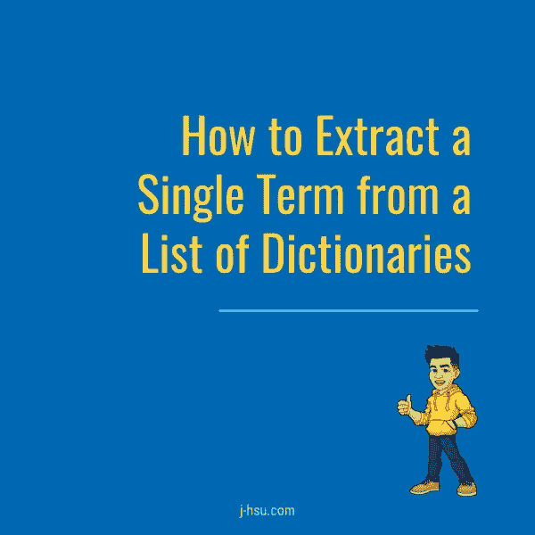
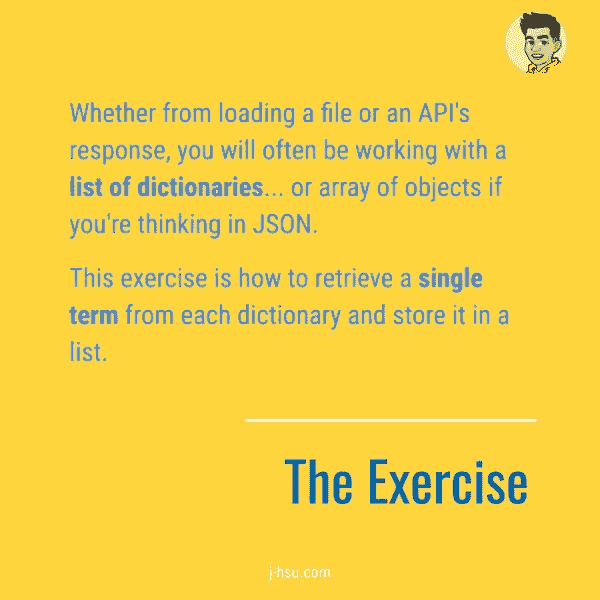
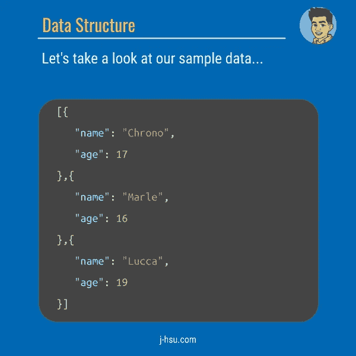
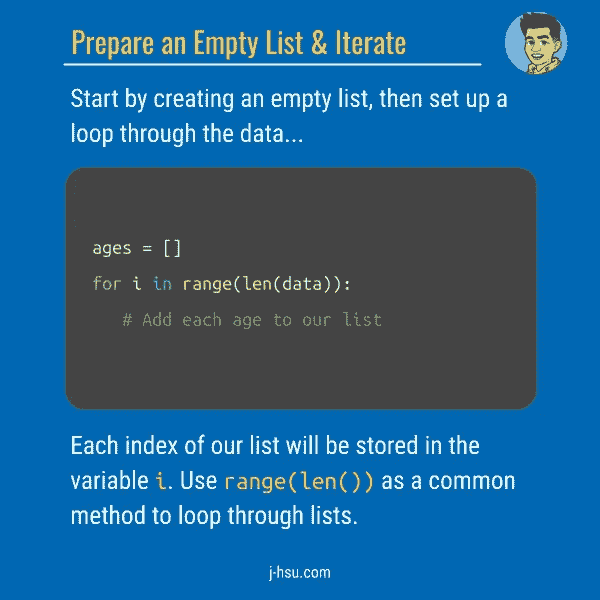
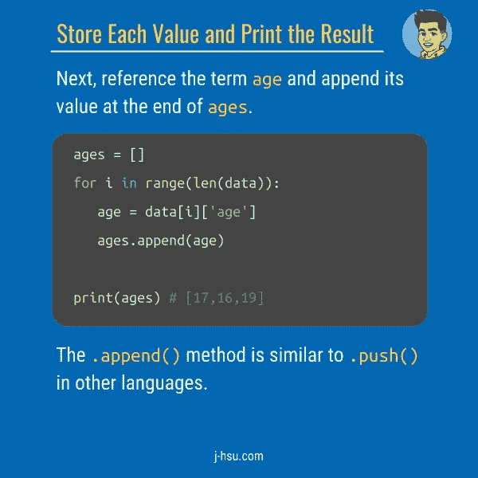
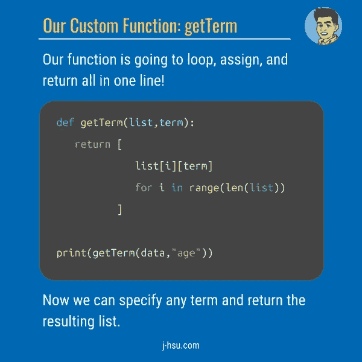

# 代码卡:如何从字典列表中提取单个术语

> 原文：<https://betterprogramming.pub/how-to-extract-a-single-term-from-a-list-of-dictionaries-c1c6c959dfed>

您最喜欢的从字典列表或数组对象中提取数据的技术是什么？

*   [如何使用 Python 字符串文字修饰符](https://medium.com/better-programming/code-cards-how-to-use-python-string-literal-modifiers-19551a600074)
*   [如何删除列表中重复的词典](https://medium.com/better-programming/how-to-remove-duplicate-dictionaries-in-a-list-df8d75abb24)
*   [如何在 Python 中反转一个字符串](https://medium.com/better-programming/how-to-reverse-a-string-in-python-6ebb0cb2a99c)