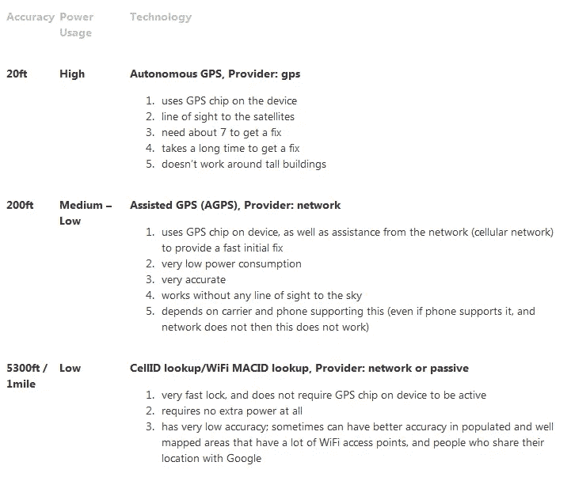
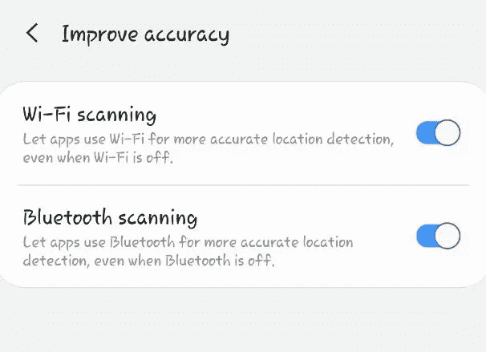

# 如何通过编程伪造自己的位置，避免被公司跟踪

> 原文：<https://betterprogramming.pub/how-to-fake-your-location-programmatically-and-avoid-being-tracked-by-companies-37447ec8f740>

## 阻止公司监视你

来自[dribble](https://dribbble.com/)的 [Gaspart](https://dribbble.com/Gaspart) 拍照

八年来，在 [Navigine](https://clc.to/navigine) 团队中，我们一直在提供室内和室外定位移动技术，实现先进的室内导航和邻近解决方案。

今天我们想讨论一个与追踪人们位置相关的话题。这主要是由于 COVID，然而，有很多人想跟踪你的位置，例如你的应用程序中的广告网络。如果你正在[开发一个使用用户位置的应用](https://navigine.com/developers/)，这也可能是有用的。在这篇文章的最后，你会发现一个链接，链接到一个假 GPS 应用程序的开源例子。

顺便说一句，我们想指出，欺骗不是一个好的决定，有很多方法可以获得你的真实位置，例如，通过使用你的手机运营商。

# 跟踪技巧

让我们从了解应用程序如何跟踪我们开始。下面是 Android 中主要的两个位置提供商。

*   GPS — **(GPS，AGPS)**:GPS 定位提供商的名称。该提供商使用卫星确定位置。需要权限`android.permission.ACCESS_FINE_LOCATION`。
*   网络— **(AGPS，CellID，WiFi MACID):** 网络位置提供商的名称。该提供商根据手机信号发射塔和 WiFi 接入点的可用性来确定位置。需要权限`android.permission.ACCESS_COARSE_LOCATION`或`android.permission.ACCESS_FINE_LOCATION`。

截图来自[https://developerlife.com/](https://developerlife.com/2010/10/20/gps/)

此外，值得注意的是，应用程序可以扫描 WiFi 和 BLE 信号，并将其用于更好的导航，但我们将进一步讨论这一点。与此同时，让我们弄清楚如何使用这两个提供商来改变智能手机的位置。

# GPS 和网络提供商以及模拟位置

“模拟位置”是 Android 操作系统中的一个隐藏的开发者设置，允许设备所有者出于测试目的设置任何 GPS 位置。尽管这是一个开发者设置，但任何人都可以通过点击设备设置中的几个按钮来使用它。或者，您可以编写几行代码，将用户直接转移到这些设置。以下是启动这一意图的代码—用户应该允许将您的应用程序用作模拟位置:

获得此权限后，您现在可以更改 GPS 和网络位置。顺便说一下，你可以从`EditText`获得纬度和经度，或者输入硬编码的，在我们的演示应用程序中，我们增加了两个选项:输入坐标或在地图上锁定你的点。下面是模拟设置函数的代码示例:

如您所见，您可以自定义许多不同的参数，并了解为什么要使用这些参数。在我们的案例中，经过许多测试案例，我们决定这些参数将是最合适的，并留下它们。若要取消自定义位置，可以移除测试提供程序。

## BLE 和 WiFi，以及与谷歌的战斗

正如我上面所说，为了改善你的位置的结果，你附近可以使用 BLE 和 WiFi 信号。而在这种情况下，你所有的努力可能都白费了。同时，需要注意的是，你不能以任何方式取代 BLE 和 WiFi 信号，所以这个数据肯定会是准确的，除非你使用第三方设备来帮助提供定制信号。

我的设备截图

然而，这已经是一个太复杂的路径，普通用户没有必要钻研它。有一种更简单的方法——你可以在手机设置的“提高准确度”部分禁用使用这些信号的功能。

还有一个困难。你只更换一次提供商是不够的，因为在同一个谷歌地图上，你的点会很快回到它的真实位置。这是因为他们经常更新提供商的网络，您的定制提供商的数据将被销毁。所以，你必须运用一个技巧——例如，以一定的频率添加来自测试提供商的数据，以便谷歌没有时间用真实的数据替换它。

# 结论

我们开发了一个用于测试目的的演示应用程序，它也将继续在后台工作，并将您的位置更改为您想要的位置。如果你打算创建一个假的 GPS 应用程序，你可以使用它或者偷看一下代码。你可以在我们的 GitHub 资源库 的 [**中找到更多的细节和演示 APK。**](https://github.com/Navigine/Android-tricks)

总之，我想说的是，我们反对监视和任何可能影响人们个人空间的行为。