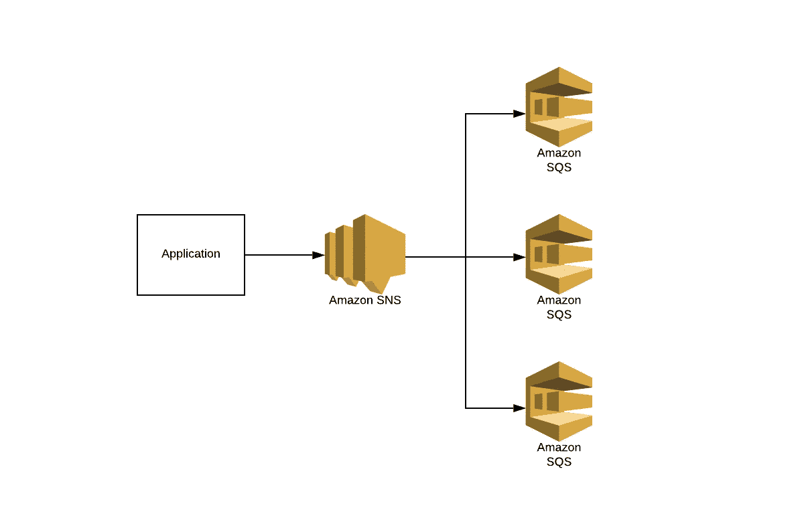
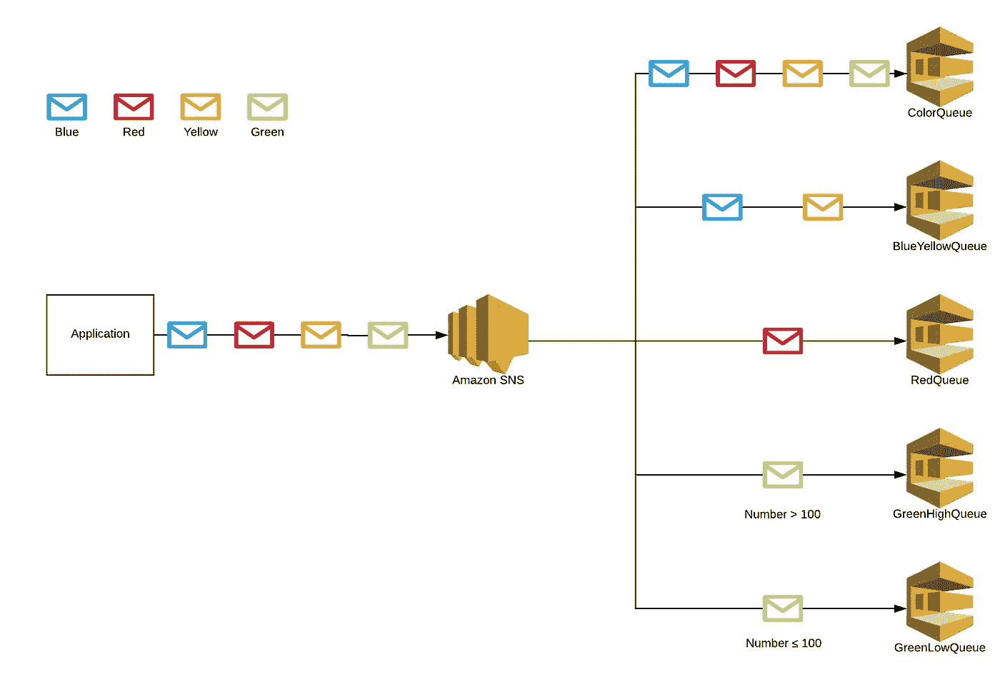
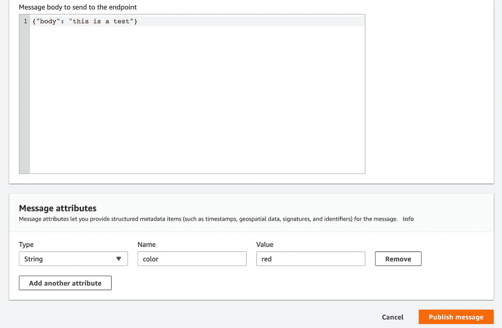
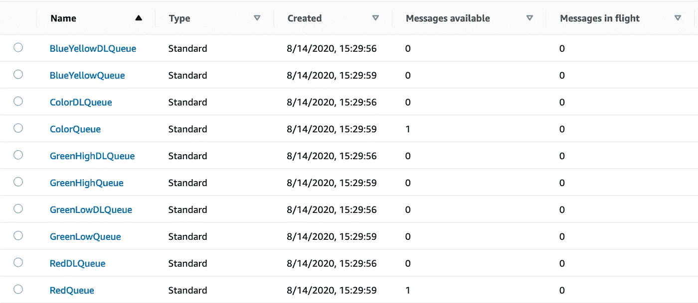
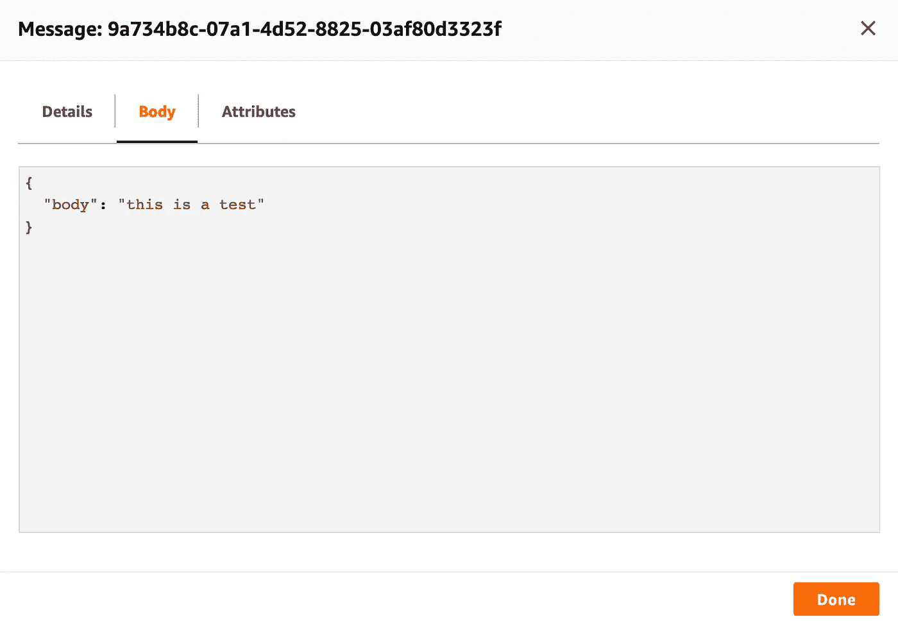
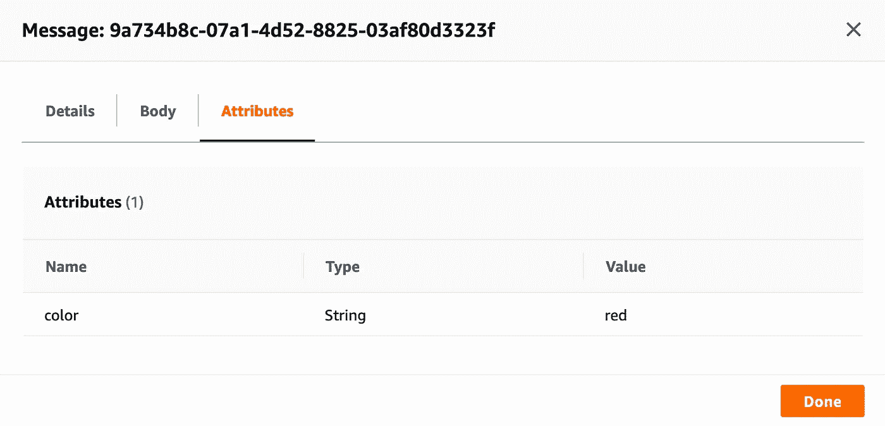
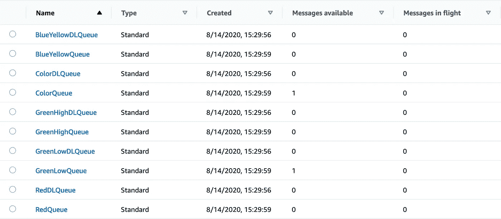
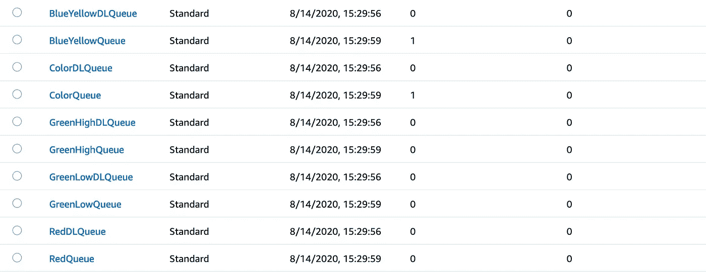
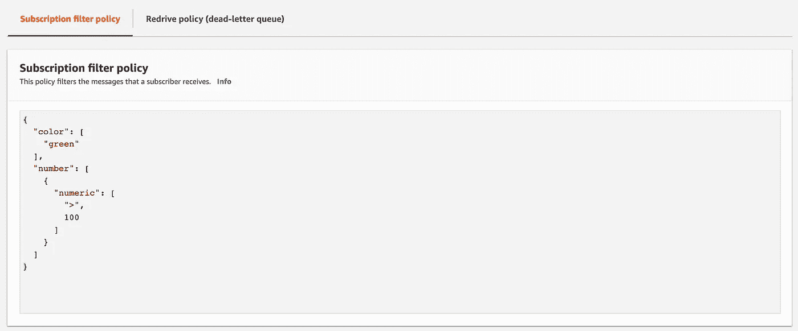

# 如何使用 SNS 消息过滤扇出到不同的 SQS 队列

> 原文：<https://betterprogramming.pub/how-to-fan-out-to-different-sqs-queues-using-sns-message-filtering-84cd23ed9d07>

## 确保你的信息到达它们该去的地方



SNS-SQS 扇出将一条消息复制到所有订阅队列(图片来源:作者)

SNS 和 SQS 是 AWS 服务，常用于事件驱动的架构中。这些服务的组合提供了扇出消息的可能性。在将这些消息复制到多个队列之前，通常需要对它们进行过滤。现在我想解释一种方法，通过充分利用这些 AWS 服务来实现这一点，并且不需要编写任何自定义代码。

让我们先快速回顾一下 SNS-SQS 扇出。SNS 是一种 AWS 服务，它协调和管理向订阅端点传递或发送消息。它为你提供了到创建一个“SNS 话题”的可能性，这是一个充当沟通渠道的逻辑接入点。通过使用 AWS CLI、SDK 或 web 控制台，您可以开始向该主题发布消息。SNS 主题会将消息转发给它的订阅者。其中一个可能的用户是 SQS，这是 AWS 的排队服务。您可以为同一个主题订阅多个队列，以便通过多个队列复制一条消息。这称为扇出。

上面的场景将一条消息复制到所有队列，这允许并行异步处理。现在，如果您希望根据某些消息属性，仅将消息复制到某些队列，该怎么办呢？SNS 为这种情况提供了一个很好的解决方案。

在本例中，我们将筛选两个属性:

*   颜色
*   数字

ColorQueue 将接收所有与 color 属性值无关的消息。BlueYellowQueue 将接收属性颜色设置为蓝色或黄色的所有消息。红色队列将只接收属性颜色设置为红色的消息。最后，有两个队列可以接收属性设置为绿色的消息。这取决于第二个属性(number ),即一个消息最终是出现在 GreenHighQueue (number > 100)还是 GreenLowQueue (number ≤100)上。



图片来源:作者

我已经创建了一个 [CloudFormation 模板](https://github.com/lvthillo/sns-sqs-fanout/blob/master/template.yaml)，因此我们可以轻松地部署这个设置。该模板包含 SNS 主题和 SQS 队列(以及相应的死信队列)的创建。这都是非常基本的。稍微先进一点的是 SQS 政策。该策略授予我们的 SNS 主题对五个队列的`SendMessage`权限。

现在唯一剩下的事情就是创建 SQS 的社交网络订阅。这也是我们定义过滤器策略的地方。

ColorQueue 没有过滤策略，它只订阅主题。

其他订阅包含筛选器策略。这是我们的 BlueYellowQueue 的一个例子，它可以接收具有蓝色或黄色属性的消息。

GreenHighQueue 和 GreenLowQueue 使用两种过滤策略。下面你可以看到一个绿色队列。

您可以使用以下命令来部署整个堆栈。

```
$ aws cloudformation create-stack --template-body file://template.yaml --stack-name sns-sqs-fanout-filter-example
```

为了验证它是否有效，我们将向 SNS 发布一条消息。我们从 AWS web 控制台发布开始。



正如我们所期望的那样，该消息在 ColorQueue 和 RedQueue 上是可用的。



我们使用了`RawMessageDelivery`，所以我们应该在 SQS 队列中收到完全相同的消息。



我们还可以检查属性。



现在，您可以使用 AWS CLI 做类似的事情:

```
$ aws sns publish \
--topic-arn "arn:aws:sns:eu-west-1:123456789012:Topic" \
--message "\"body\": \"{this is a test}\"" \
--message-attributes '{ "color":{ "DataType":"String","StringValue":"green" }, "number":{ "DataType":"Number","StringValue":"100"} }'
```

同样，我们得到了预期的结果。该消息出现在 ColorQueue 和 GreenLowQueue 上，因为 number 属性小于或等于 100。



最后一个例子，我将使用 Python SDK。

我们再次看到了预期的结果。



这个基本的例子应该已经清楚了 SNS 过滤是如何工作的。我们看到了一个 AND 逻辑的例子(例如，颜色是绿色，数字> 100)和 or 逻辑的例子(例如，颜色是蓝色或黄色)。最后，我们可以看一些更高级的过滤示例。

对于字符串，您可以有一个精确的匹配，就像我们的例子一样。

```
FilterPolicy:
  color:
    - green
```

也可以相反，这意味着策略匹配任何不包含任何策略属性值的消息属性。

```
FilterPolicy:
  color:
    - anything-but:
      - green
```

您也可以只检查某个属性是否存在，而不知道真正的值。

```
FilterPolicy:
  color:
    - exists: true
```

也可以检查属性值的前缀。

```
FilterPolicy:
  color:
    - prefix: bas
```

对于数字属性，也可以根据范围进行过滤。以下匹配 0 到 100 之间的所有数字。

```
FilterPolicy:
  number:
    - numeric:
      - ">"
      - 0
      - "<="
      - 100
```

当您想在 AWS 控制台中更新过滤器策略时，您需要使用 JSON 符号。还需要注意是，过滤策略更新并不是立即发生的。对订阅筛选器策略的添加或更改最多需要 15 分钟才能完全生效。



通过使用 SNS 过滤策略，您可以轻松过滤特定的 SNS 属性。没有必要编写定制代码来定制您的扇出场景。

我们讨论了一个基本的例子，以及如何在 CloudFormation 中进行设置。之后，我们检查了一些更高级的过滤示例。

我希望你喜欢它。感谢您的阅读，并随时询问任何问题！