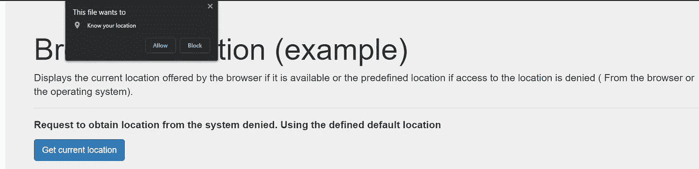
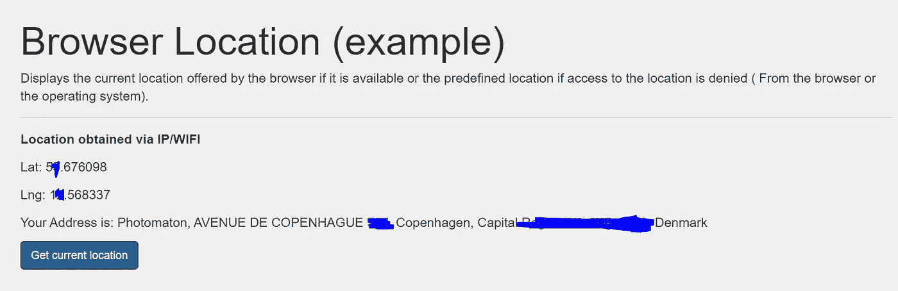
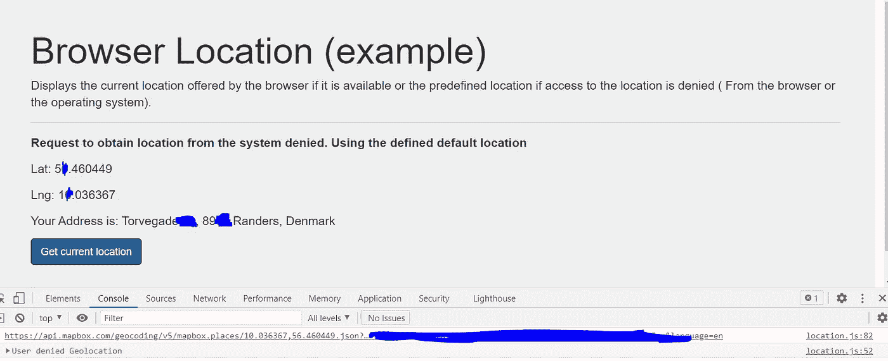

# 如何用 JavaScript 获取浏览器位置

> 原文：<https://betterprogramming.pub/how-to-fetch-browser-location-with-javascript-9f6d64a2fc26>

## 具有反向地理编码以及具有或不具有本地化权限

由[像素](https://www.pexels.com/es-es/@pixabay?utm_content=attributionCopyText&utm_medium=referral&utm_source=pexels)在[像素](https://www.pexels.com/es-es/foto/ipad-blanco-38271/?utm_content=attributionCopyText&utm_medium=referral&utm_source=pexels)上拍摄的照片。

在本文中，我将解释如何用 JavaScript 获取当前位置(坐标和地址),并展示如果浏览器没有权限访问它，您可以做些什么。

为了获得坐标，我们只能使用普通的 JS。为了通过坐标获得地址(反向地理编码)，我将使用 Mapbox 的 API。为此，我需要一个 API 访问令牌。你可以在 Mapbox 的网站上获得一个[。](https://docs.mapbox.com/help/getting-started/access-tokens/)

# 定义页面

首先，我们创建我们的`index.html`文件并导入我们将要使用的依赖项。这意味着我们的`location.js`文件和引导样式，因为我们将使用它们来给页面一个最小的外观。

index.html

*   第 14-15 行:包含引导样式。
*   第 17 行:我们将我们的`location.js`文件与页面将使用的函数包含在一起。
*   第 29-32 行:这些行将显示最终结果。
*   第 34-35 行:我们调用函数来获取当前位置，并在前面的部分中显示在屏幕上。

# Location.js 脚本

location.js -1

我们定义了将要在函数中使用的常数。前两个常数用于定义所获得的位置有效的时间。`MAPBOX_API_TOKEN`常量将包含 Mapbox 的令牌，以访问其 API 并对获得的坐标进行逆地理编码，从而获得地址。最后两个常量是默认位置。

location.js -2

我们定义了一个方法，我们将把`timeout`和`promise`参数传递给它，它返回第一个完成的东西。也就是说，如果获取我们位置的`Promise`在`timeout`之前解决了，它就返回我们这个`promise`。否则，触发`reject`(第 6 行)。

## 为什么我们要这样做？

浏览器需要权限才能访问我们的位置。如果我们拒绝它们，浏览器将抛出一个异常，并且`promise`将自动解决一个错误。

另一方面，如果我们在操作系统级别拒绝位置许可，那么`promise`将永远不会被解析，并将永远等待下去。这就是为什么我们使用带有前缀时间的`timeout`。如果我们不能及时获得位置，`promise`将自动出错。

location.js -3

*   第 2-4 行:我们在将要写入位置的地方获取 DOM 元素。
*   第 7 行:我们试图得到我们的位置。
*   第 11-12 行:如果`Promise`在给定的时间内成功解析，则获得的坐标显示在屏幕上。
*   第 14 行:我们获得相应的地址并写在屏幕上。
*   第 18-22 行:如果因为我们拒绝了浏览器对我们位置的访问权限而发生错误，我们进入 catch 块并加载默认的预定义位置。

location.js -4

*   第 1-10 行:`getPosition`方法调用一个浏览器方法，如果浏览器可以访问它，该方法返回位置。
*   第 12-15 行:`reverseGeocoding`方法使用经度、纬度和访问令牌参数调用`reverseExternalGeocoding`方法，并获取对应于这些坐标的地址。
*   第 16 行:我们写入在`elAddress`元素中获得的地址。

location.js -5

`reverseExternalGeocoding`方法使用经度、纬度和访问令牌参数对 Mapbox API 执行一个`Fetch`，并返回对应于这些坐标的 JSON 对象。

# 完整代码

location.js

# 结果

我们必须在浏览器中打开与`location.js`脚本在同一个文件夹中的`index.html`文件，将显示以下屏幕。

当你点击“获取当前位置”按钮时，浏览器会询问是否允许访问该位置。该位置将通过我们的 IP、GPS 或当时可用的任何东西获得。

要求进入该地点

## 允许访问该位置

如果我们授予浏览器权限，我们将在屏幕上显示与获得的坐标相对应的结果:

结果

## 拒绝访问该位置

如果我们拒绝访问我们的浏览器或在系统级别禁用该位置，我们将显示默认位置:

结果

# 结论

在本文中，我们看到了如何获取执行脚本的 web 浏览器的当前位置的坐标，以及如何使用反向地理编码来获取与这些坐标对应的地址。

希望你觉得有用。