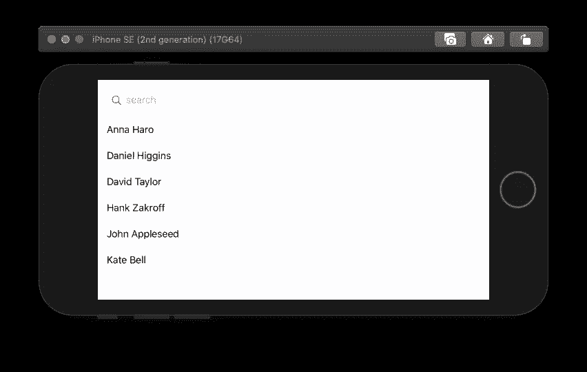
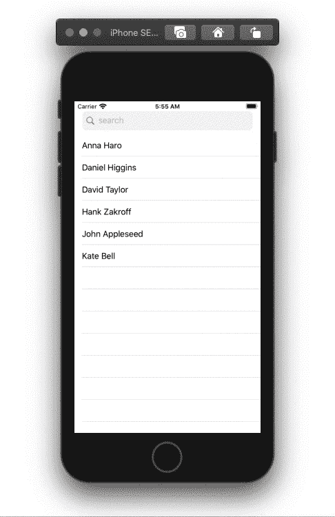

# 如何在 SwiftUI 中获取联系人列表并创建搜索栏

> 原文：<https://betterprogramming.pub/how-to-fetch-contact-lists-and-create-a-searchbar-in-swiftui-35713daaf25a>

## 如何让你的用户获取和搜索他们自己的联系人列表

搜索栏和联系人列表(作者照片)。

# 联系信息解析

为我们的联系信息创建一个可识别的结构。为 ID、名字、姓氏和电话号码声明变量，如下所示:

# 获取联系人

创建一个包含获取联系信息的函数并返回我们的`ContactInfo`结构数组的类。每个联系人可以有多个电话号码。在本教程中，我只使用了第一个电话号码。在返回`contacts`数组之前，我们可以按名字、姓氏或电话号码对其进行排序:

# 操作键盘

在 UI 上开始之前，我们需要添加一个`UIApplication`的扩展，用于在编辑结束时重新签名键盘:

# 联系人行视图

为联系人行创建一个结构，该结构采用一个`ContactInfo`并在一个`Text`视图中显示名字和姓氏:

# 主视图(内容视图)

在我们的`ContentView`中，我们需要声明以下三个变量:

*   将保存我们的联系人列表的数组。
*   `searchText`将用于搜索文本字段。
*   `showCancelButton`将决定何时在视图中显示取消按钮。

添加下面的函数，使用我们之前的`FetchContents`类获取内容列表。使用`DispatchQueue.main.async`加快性能:

# 许可

在`info.plist`中，我们需要添加下面的键和值来获得使用用户联系信息的权限。该值需要描述您访问联系人列表的需求。

我们仍然需要检查权限是否被拒绝或限制，并请求访问联系人。一旦我们被授权访问联系人列表，我们就可以使用我们的`getContacts`函数来获取联系人:

# 搜索栏

在下面的 SwiftUI 中创建搜索栏。使用放大镜和`x`标记系统符号来模仿手机应用程序中搜索栏的外观:

将上面的代码嵌入到一个`VStack`、*、*中，然后将下面的代码添加到同一个`VStack`中。`List`视图包含我们获取的每个联系人的`ContactRow`。使用`onAppear`启动我们的`requestAccess`功能:

搜索栏和联系人列表

全部完成！感谢您阅读这篇文章。