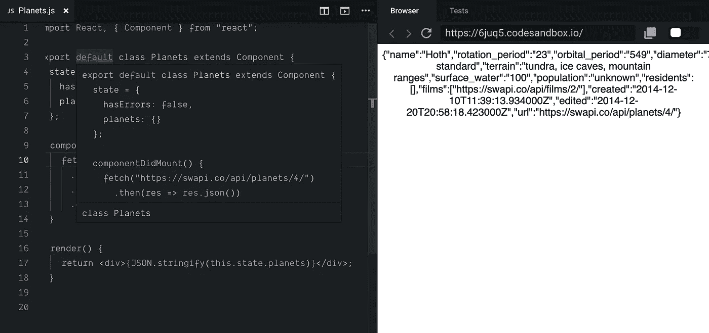
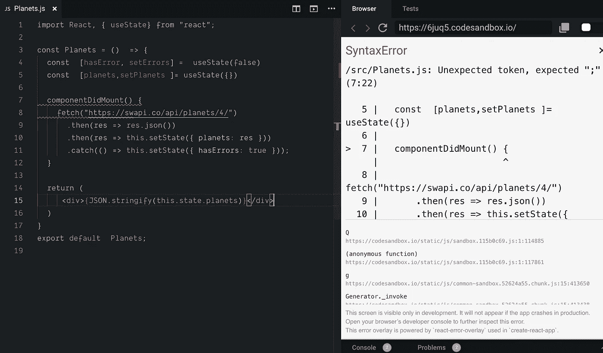
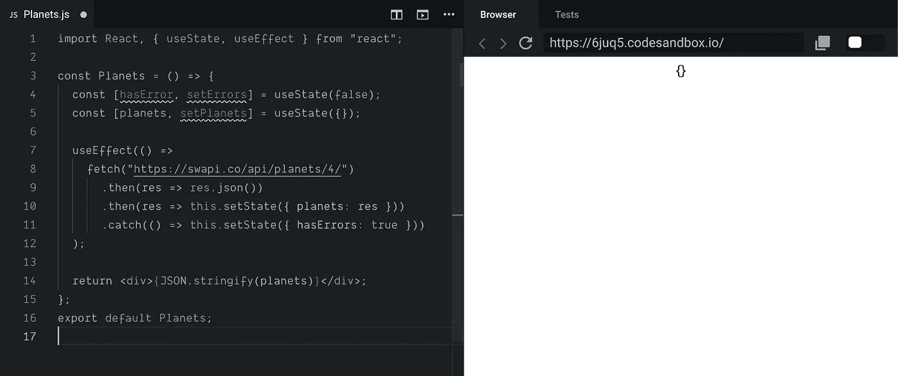
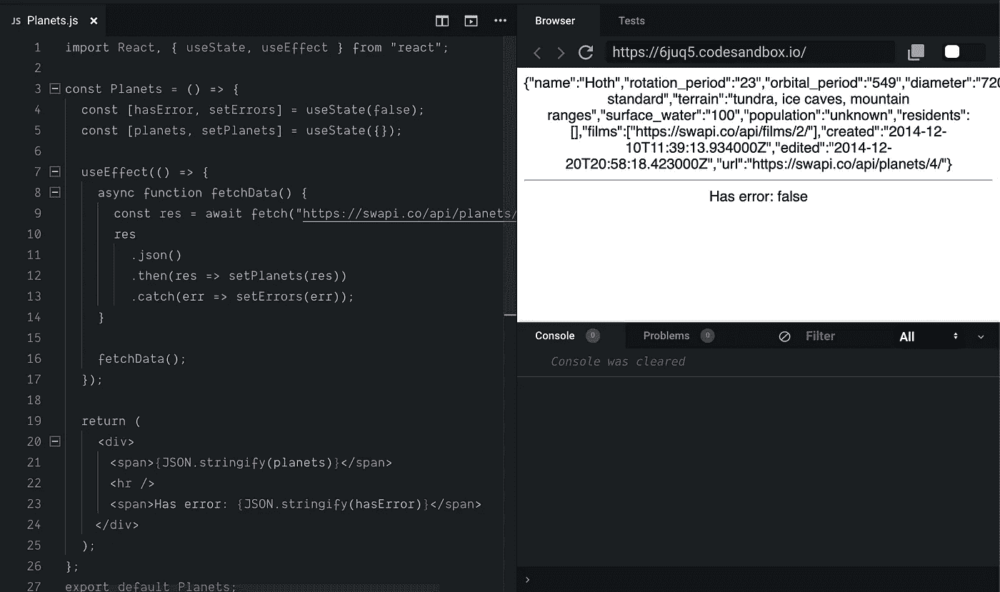
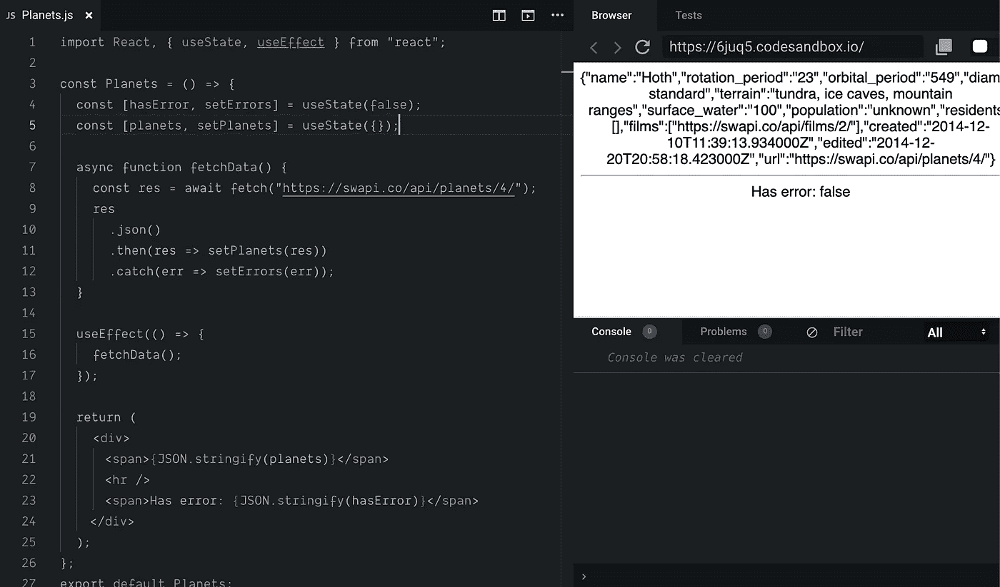

# 如何用 React 钩子从 API 获取数据

> 原文：<https://betterprogramming.pub/how-to-fetch-data-from-an-api-with-react-hooks-9e7202b8afcd>

## 功能数据提取

React 钩子让我们不用使用类语法就可以编写纯函数组件。通常，但不总是，我们必须写的代码越少，我们构建应用程序的速度就越快。

如果你是钩子的新手，可以看看这篇教程中关于钩子的介绍。

 [## 揭秘 React 挂钩

### 钩子如何节省你的时间并提高你代码库的质量

medium.com](https://medium.com/better-programming/demystifying-react-hooks-a0b56a6254c2) 

[使用我的推荐链接](https://trevorlasn.medium.com/membership)随时成为中级会员。你的会员费直接支持我和你看的其他作家。你也可以在媒体上看到所有的故事

# 第一步。从类到功能组件的重构

以这个简单的基于类的 React 组件为例。我们使用钩子的第一步是将其重构为一个功能组件。记住，你只能对功能组件使用钩子。

组件有一个`hasError`和一个`planets`状态。如果组件挂载了，我们调用[星球大战 API](https://swapi.co/) 并获取信息。

使用获取 API 和 React 类组件获取数据

下面是我们如何将组件转换成功能组件。

Tada！带有挂钩的功能组件。不过，只有一个问题。钩子没有生命周期效果，比如`componentDidMount`或者`componentWillMount`。

在功能组件中使用 componentDidMount

我们现在要干嘛？

# 第二步。使用效果

[效果挂钩](https://reactjs.org/docs/hooks-effect.html)允许您在功能组件中执行副作用。

数据获取、设置订阅和手动更改 React 组件中的 DOM 都是副作用的例子。

`useEffect`是一个 React 钩子，它接受回调作为第一个参数。在第一个参数中，我们执行所有与效果相关的任务。

从 React 包中导入`useEffect`，用新的吊钩替换`componentWillMount`。

`useEffect`是做什么的？

通过使用这个钩子，你告诉 React 你的组件需要在渲染之后做一些事情。React 将记住您传递的函数(我们称之为“效果”)，并在执行 DOM 更新后调用它。

使用`useState to fetch data`

好了，我们继续编译。但是为什么状态还是我们的初始状态`{}`？

简单，功能组件内部没有`this.setState({})`功能。

# 第三步。从 this.setState({})移动到 Hooks

请注意我们是如何在回调函数中放置函数的。该函数被命名为`fetchData`,并完全按照它的名字来做。

用钩子获取数据

如果这看起来更复杂，我向你保证它不是。就像我们如何在`componentDidMount`中编写函数一样，我们在`useEffect`钩子中也是如此。

为了说明它实际上有多简单，让我们将`fetchData`完全移出钩子。

而且还能用！这里什么都没有。

用钩子获取数据

如果你对解释`useEffect`钩子的深度文章感兴趣，我推荐从这篇文章开始[。](https://daveceddia.com/useeffect-hook-examples/)

 [## useEffect 挂钩如何工作

### 想象一下:你有一个非常好的功能组件，然后有一天，你需要给它添加一个生命周期方法…

daveceddia.com](https://daveceddia.com/useeffect-hook-examples/) 

注意:如果您希望`useEffect`的行为类似于`componentDidMount`生命周期事件，请传递一个数组作为第二个参数，如下所示:

将第二个参数视为该效果的*依赖项*。如果自上次以来其中一个依赖关系发生了变化，该效果将再次运行。

# 恭喜

感谢阅读！

**附言:寻找更多的编码思路？永远不要耗尽编码的想法，永远不要。** [**在这里获取权限来一堆前端挑战被我。**](https://gumroad.com/l/IuqKc)

在代码沙箱中玩原始代码[。](https://codesandbox.io/s/react-hooks-api-6juq5)

 [## react-hooks-api - CodeSandbox

### 为 web 应用程序定制的在线代码编辑器

codesandbox.io](https://codesandbox.io/s/react-hooks-api-6juq5) 

[使用我的推荐链接](https://trevorlasn.medium.com/membership)随时成为中级会员。你的会员费直接支持我和你看的其他作家。你也可以在媒体上看到所有的故事