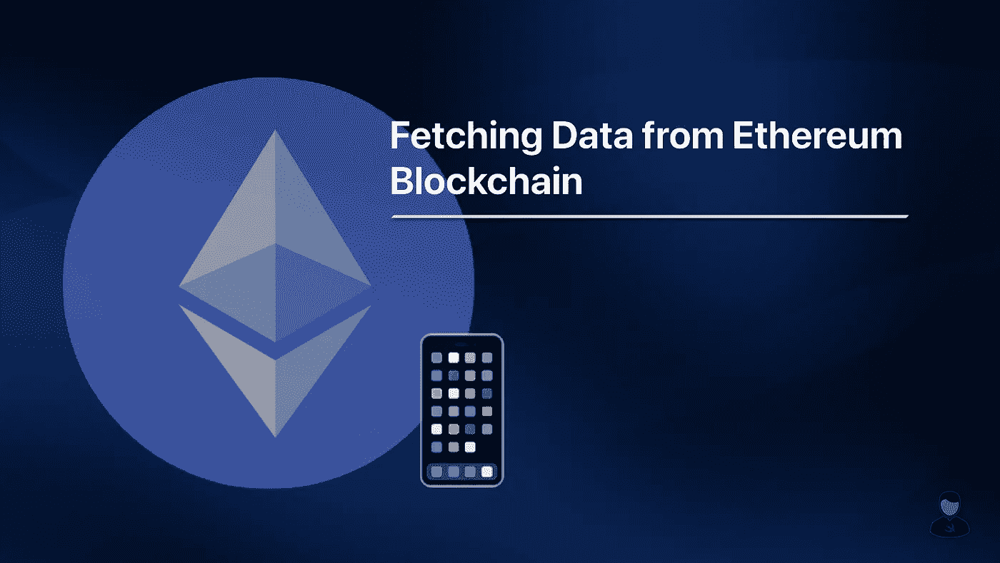
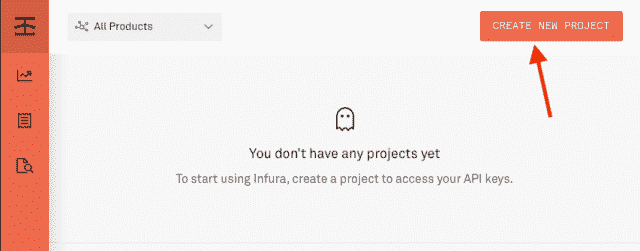
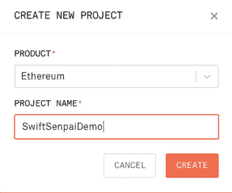
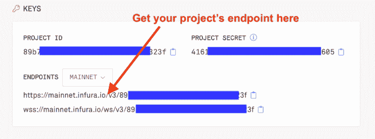
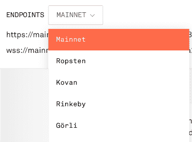

# 如何在 iOS 中使用 Web3.swift

> 原文：<https://betterprogramming.pub/how-to-fetch-data-from-the-ethereum-blockchain-using-swift-46138b290ac>

## 使用 Swift 从以太坊区块链获取数据



自从以太坊区块链在 2015 年推出以来，它已经彻底改变了整个软件开发行业。这是第一个具有智能合约功能的区块链，允许开发人员创建和部署与以太坊区块链交互的分散式应用程序(dApps)。

现在大多数 dApps 都是基于网络的应用。然而，我确实相信，随着时间的推移，当区块链技术得到更多的采用时，移动原生 dApps 将变得越来越受欢迎。

在本文中，我将向您展示如何创建一个简单的 dApp，从以太坊 Mainnet 获取最新的天然气价格。在整个过程中，您将学习如何访问公共节点，在 Xcode 项目中应该使用什么库，以及如何从 Mainnet 连接和获取数据。

事不宜迟，让我们直接开始吧！

# 基本概念

如果你正在阅读这篇文章，我想你已经对什么是区块链有了一些基本的概念。如果你不知道，你可以把它想象成一个巨大的服务器，由分布在世界各地的数千个节点组成。

> 专家提示:查看这个页面，了解目前全球可用的以太坊节点。

从以太坊区块链获取数据的方式与从中央服务器获取数据的方式非常相似。我们将连接到一个以太坊节点，而不是连接到一个集中式服务器，这个以太坊节点公开了 JSON-RPC 方法 (API 端点)的[列表。通过使用提供的 API 端点，我们可以执行一些操作，比如获取当前的天然气价格或者获取地址的余额。](https://docs.infura.io/infura/networks/ethereum/json-rpc-methods)

这是否意味着我们需要建立自己的以太坊节点才能入门？嗯，没必要。

有一些第三方服务，比如向公共节点提供 API 的 [Infura](https://infura.io/) 和 [Alchemy](https://www.alchemy.com/) 。我们需要做的就是订阅他们的免费服务，然后我们就可以开始了。对于这篇文章，Infura 将是我们的主要焦点，但是如果你喜欢的话，你可以使用炼金术。

一旦我们有了合适的节点，从以太坊区块链获取数据只是调用 API 端点的问题。对于我们的示例应用程序，我们将使用由 [Argent Labs](https://www.argent.xyz/) 开发的 [web3.swift](https://github.com/argentlabs/web3.swift) 库来简化我们与以太坊区块链的交互。

有了基本的概念之后，让我们前往 [Infura](https://infura.io/) 开始吧。

# 使用 Infura

正如您可能已经猜到的，您需要做的第一件事是创建一个 Infura 帐户。你可以在这里[做](https://infura.io/register)。

一旦您的帐户启动并运行，前往仪表板并创建一个新项目:



Infura 仪表板

在“新建项目”对话框中，选择“以太坊”作为产品，并填写您想要的项目名称:



在 Infura 中创建新项目

创建项目后，您将被重定向到项目设置页面。您可以在这里获得项目的 JSON-RPC 端点:



获取 Infura 中的项目端点

如果您不想在以太坊主网上测试您的 dApp，您可以使用下拉菜单切换到测试网，如 Ropsten 和 Rinkeby，以获得它们各自的端点。



Infura 中的交换端点

至此，我们已经成功设置了 Infura，现在可以开始使用给定的端点与以太坊区块链进行交互了。

# 从以太坊区块链获取数据

我们可以用来获取当前以太坊气价的 JSON-RPC 方法是`eth_gasPrice`。如果您看一下该方法的 [API 规范](https://docs.infura.io/infura/networks/ethereum/json-rpc-methods/eth_gasprice)，您会注意到响应体如下所示:

```
{
  "jsonrpc": "2.0",
  "id": 1,
  "result": "0x12a05f200"
}
```

其中气价(`result`)用一个整数的十六进制代码表示。

您完全可以对`eth_gasPrice`方法执行 post 请求，并手动将给定的十六进制代码解析回整数，但这太麻烦了！让我向您介绍一种更好的方法来处理这种情况——使用 [web3.swift](https://github.com/argentlabs/web3.swift) 库。

## web3.swift 库

如前所述， *web3.swift* 库是由 Argent Lab 开发的，该团队是著名的移动 DeFi wallet“[Argent](https://apps.apple.com/app/argent-defi-in-a-tap/id1358741926)”的幕后团队。他们开源该库的主要目标是通过 Swift 本地库方便地访问以太坊区块链，主要用于创建分散的 iOS 应用程序。因此，如果你喜欢这个库，并且愿意支持团队正在做的事情，请随时给他们你的反馈，为这个库做贡献。

现在回到库本身，它基本上是以太坊区块链的一些最常用方法的包装类。它为我们处理所有繁重的任务，比如 API 调用和 JSON 解析。最好的部分是它甚至支持新的 [Swift Concurrency](https://swiftsenpai.com/swift/swift-concurrency-get-started/) ( `async/await`)语法。

> 专业提示:
> 
> 安装完这个库之后，查看在`EthereumClient.swift`中定义的`EthereumClientProtocol`,查看这个库支持的所有 JSON-RPC 方法。

为了从以太坊区块链获得天然气价格，我们需要做的就是使用从 Infura 获得的端点创建一个`EthereumClient`的实例，并相应地调用相应的客户端方法。

需要注意的一点是，`eth_gasPrice()`方法返回的类型是`BigUint`，是一个比`UIntMax`更宽的整数类型。因此，我们可以使用`BigUint`提供的`quotientAndRemainder(dividingBy:)`函数将给定的气价从 wei 转换为 Gwei。

至此，你已经成功地创建了第一个运行在以太坊区块链上的去中心化 iOS 应用。好样的。

# 包扎

在本文中，我只介绍了您使用 Swift 开始 dApp 开发所需了解的最基本的内容。围绕移动 dApp 开发仍然有很多话题，比如连接到钱包、处理交易等。我还没讲到。

此时此刻，我还处于探索和学习的阶段。我将继续在 Medium 上分享我在这里学到的东西，所以请在不久的将来继续关注更多类似的文章。

感谢阅读。

```
**Want to Connect?**In the meantime, you can follow me on [Twitter](https://twitter.com/Lee_Kah_Seng) and check out my website for articles related to [Swift](https://swiftsenpai.com/category/swift/) and [iOS development](https://swiftsenpai.com/category/development/).
```