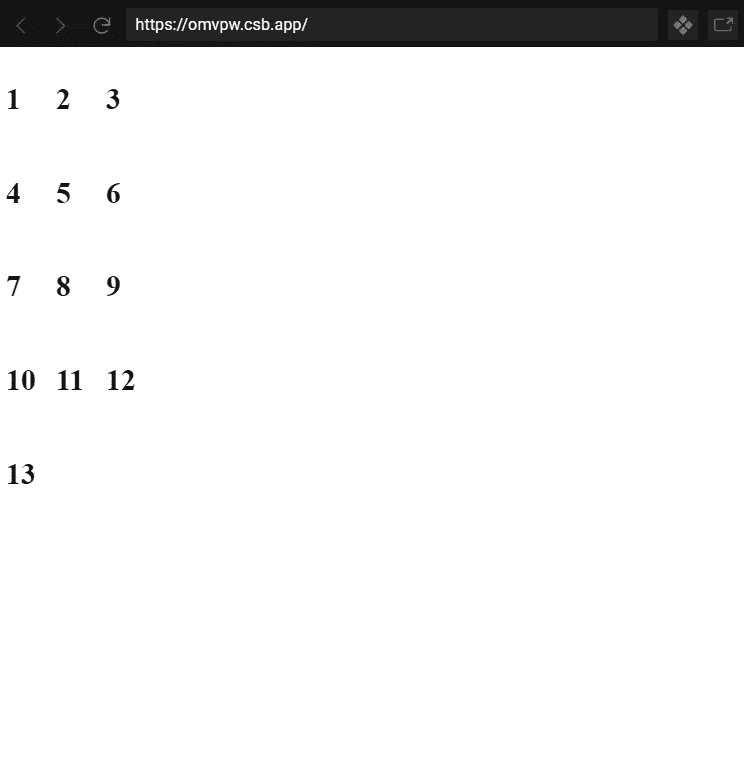
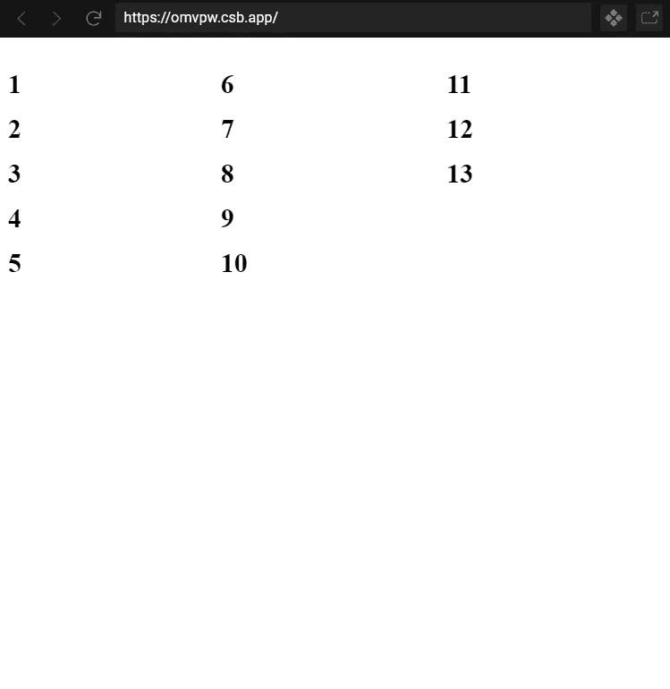

# 如何在 CSS 网格布局中填充列中的项目

> 原文：<https://betterprogramming.pub/how-to-fill-items-in-columns-in-a-css-grid-layout-f3178187f0c1>

## 具有固定数量的列

马丁·多施在 [Unsplash](/s/photos/grid-layout?utm_source=unsplash&utm_medium=referral&utm_content=creditCopyText) 拍摄的照片。

假设我们有 *n* 个项目，我们必须在网格布局中按列排列这些项目。列数是固定的，我们还必须确保网格布局中的行数最小化，以便有效地填充网格。

在这篇文章中，我们将把数字视为项目。我们将根据我们的要求在网格布局中安排 1-13 的数字。列数固定为三列。

我将使用React 和 [SCSS](https://sass-lang.com/documentation/syntax) 来解释这一点。

# 编码部分来了

## 如果按行排列…

如果必须按行排列，那就非常简单了。为此，CSS 将如下所示:

用于按行排列的 CSS 代码

完整的代码，包括 CSS 部分，如下所示:

网格组件的完整反应代码

## **输出**

网格项目的行方式排列

如你所见，数字是按行排列的。这里，网格项沿水平方向流动，根据需要自动创建新行。当网格项目流到达列的末尾时，会创建一个新行。这也称为行优先排列，因为只有当前一行完全填满时，一行才开始。

## 但是我们的要求是按列排列项目…

要按列排列项目，我们需要知道网格布局中的行数。

我可以解释为什么我们需要知道行数。在行式排列中，只有当前一行被完全填充时，一行才开始(即，前一行中的项目数等于列数)。

类似地，在逐列排列中，只有当前一列被完全填充时(即，前一列中的项目数已经等于行数)，新列才开始。所以，我们需要知道行数。

## **怎样才能知道网格布局中要做的行数？**

通过使用基础数学！

我们知道网格项目的数量。我们知道列的数量。因此，`Math.ceil(itemsCount/columnsCount)`将给出要制造的行数。该公式还将确保行数最小化。

我们需要最小化行数，因为如果我们采用任何更大的随机整数作为行数，网格将不能有效地填充。布局上会有空洞。

下面的 CSS 是按列排列的，因为我们必须动态设置`grid-template-rows`字段，所以它没有出现在下面的代码中:

用于按列排列的 CSS 代码

完整的代码，包括 CSS 部分，如下所示:

网格组件的完整反应代码

在第 16 行，计算行数。

在第 17 行，`grid-template-rows`字段被动态设置。

网格项目的列式排列

在这里，您可以看到这些数字是以固定的列数(3)按列排列的。此外，最小化的行数是五。如果行数少于 5，这种排列是不可能的。如果行数大于 5，布局中将会有空白空间。只有当前一列完全填满时，一列才开始。

# 结论

计算网格布局中的行数并动态设置它的技巧很容易解决这个问题。因为我们需要知道在一个列式排列中的行数，我们可以说在这个问题中，既需要行数也需要列数来安排项目。

*注意:当布局的宽度——而不是列数——固定时，可以实现稍加修改的相同类型的解决方案。*