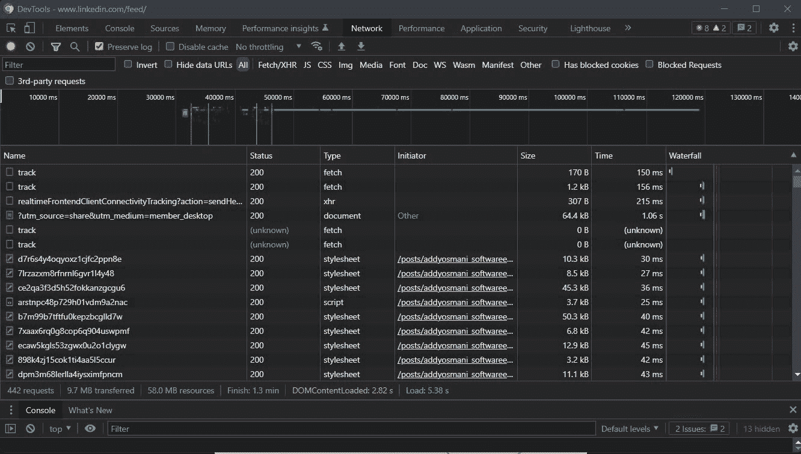
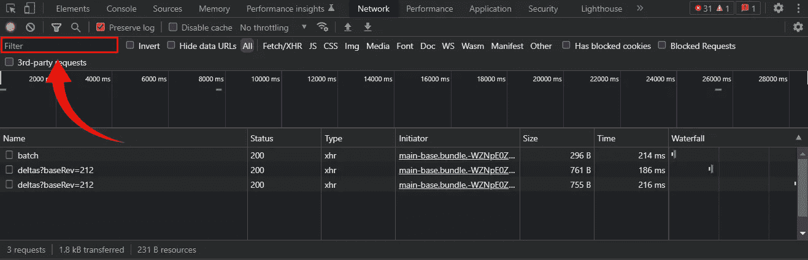
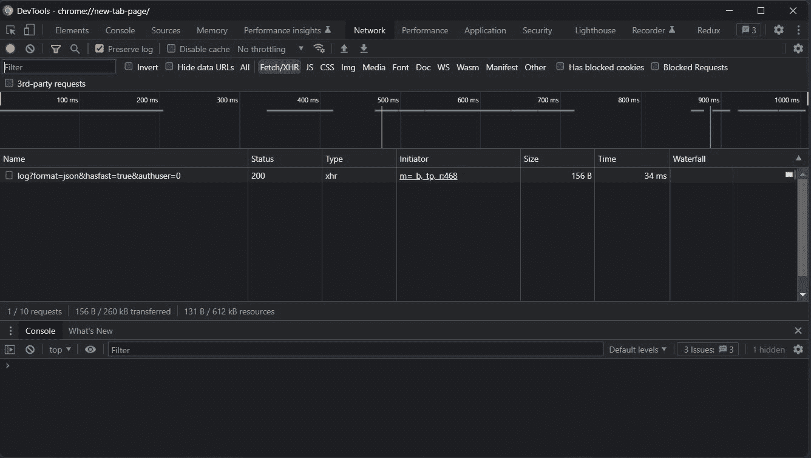

# 如何在 Chrome DevTools 中过滤请求和资源

> 原文：<https://betterprogramming.pub/how-to-filter-requests-and-resources-in-chrome-devtools-491976d85ad1>

## 像专业人士一样开始使用 Chrome DevTools 网络面板



获取所有大于 100kb 的请求和资源

作为一名 web 开发人员，很可能你熟悉 [Chrome WebTools](https://developer.chrome.com/docs/devtools/) 并且每天都在使用它们。具体来说，你可能会在 Chrome DevTools 的网络面板上花费数小时的时间。你可能不知道网络面板有几个很酷的功能。知道如何使用它们可以让你的生产力更上一层楼。

现在让我们学习如何通过 Chrome DevTools 的特殊过滤命令在网络部分过滤请求和资源。

# 在 Chrome DevTools 网络面板中应用过滤器

乍一看，Chrome DevTools 网络中似乎没有太多值得探索的内容。如您所见，它只是按时间顺序显示了浏览器请求及其响应的列表。然而，网络部分可以提供更多。让我们学习如何利用现有的最有用的特性之一。

具体来说，Chrome DevTools 网络面板允许你过滤资源和请求。这对于查找可能引起麻烦的特定资源或排除您不感兴趣的请求特别有用。在网络面板中过滤请求很容易，但是你必须学习一些关键字。

在网络面板的左上方，您可以看到一个输入字段，如下所示:



Chrome DevTools 网络面板中的输入字段

请记住，该输入字段接受文本、关键字和特殊命令。以下是一些最有用的过滤器命令示例:

*   `method:POST` →返回所有 POST 请求。
*   `is:from-cache` →返回从缓存中检索到的所有资源。
*   `is:running` →返回所有不完整或无响应的请求。
*   `larger-than:200k` →返回所有大于 200Kb 的资源。
*   `-larger-than:200k` →显示所有小于或等于 200Kb 的资源。
*   `domain:web.dev` →返回来自“web.dev”域的所有资源和请求。
*   `-domain: web.dev` →它从“web.dev”域中过滤出所有资源和请求。
*   `has-response-header:Cache-Control` →返回所有包含“Cache-Control”报头的请求。
*   `-has-response-header:Cache-Control` →返回所有不包含“Cache-Control”报头的请求。
*   `mixed-content:` →返回所有使用 HTTP 而不是 HTTPS 的资产和请求。

请注意，所有过滤器命令都可以与空格字符组合，如下所示:

```
<command_1> <command_2> ... <command_n>
```

例如，`method:GET larger-than:100k`将返回所有大于 100Kb 的 GET 请求。另外，请注意,`-`字符激活一个命令的否定版本。

你可以在这里找到所有可用过滤器的完整列表[。您也可以在过滤器输入中键入`Cmd/Ctrl + Space`来获得所有可用命令的自动完成预览。](https://developer.chrome.com/docs/devtools/network/reference/#filter)



在过滤器输入中键入`Cmd/Ctrl + Space`

# 结论

Chrome DevTools 是 web 开发中最有用和最受欢迎的工具之一。然而，您可能不知道如何使用它的所有功能。具体来说，您学习了如何使用 Chrome DevTools 在网络面板中过滤请求和资源。由于一些特殊的过滤器命令和关键字，这是可能的。在本文中，您有机会看到了最重要的几个。

感谢阅读！我希望这篇文章对你有所帮助。请随意留下任何问题、评论或建议。