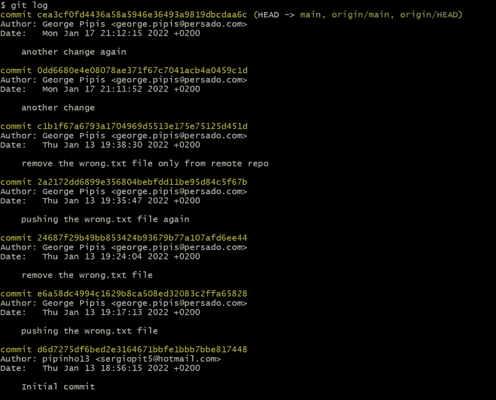
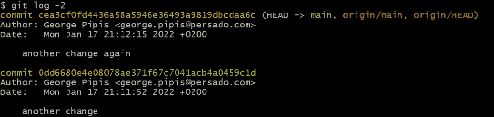
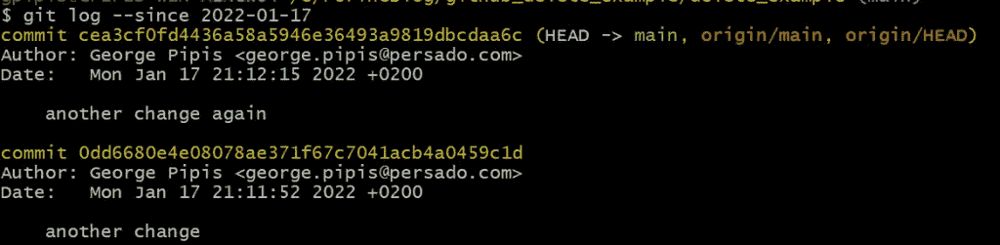
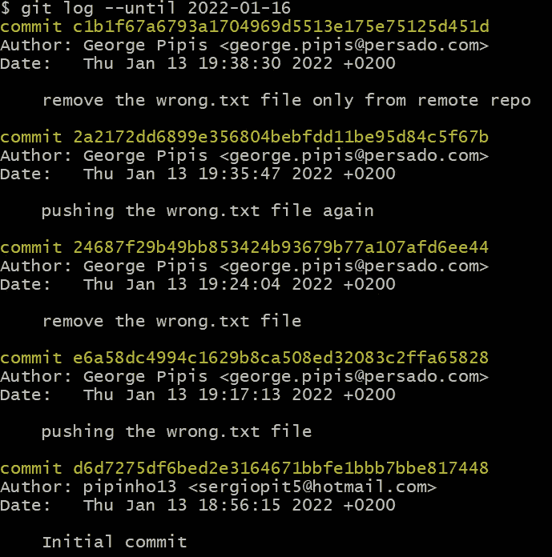
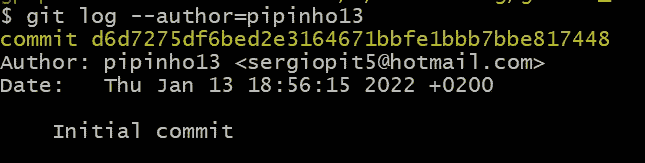
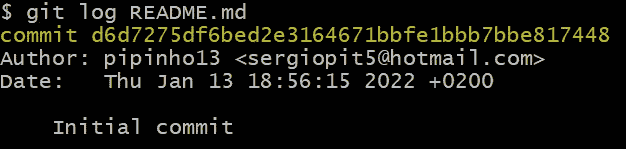
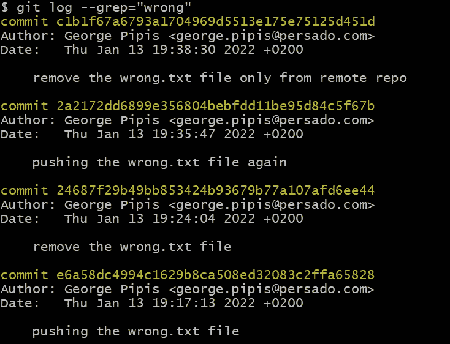

# 如何过滤 Git 日志

> 原文：<https://betterprogramming.pub/how-to-filter-the-git-logs-2dcebf3d12>

## 如何过滤 Git 日志的实际例子


由[马库斯·斯皮斯克](https://unsplash.com/@markusspiske?utm_source=medium&utm_medium=referral)在 [Unsplash](https://unsplash.com?utm_source=medium&utm_medium=referral) 上拍摄的照片

[](https://jorgepit-14189.medium.com/membership) [## 用我的推荐链接加入媒体-乔治皮皮斯

### 阅读乔治·皮皮斯(以及媒体上成千上万的其他作家)的每一个故事。您的会员费直接支持…

jorgepit-14189.medium.com](https://jorgepit-14189.medium.com/membership) 

# 获取所有提交

我们可以用`git log`命令获得 git 提交日志。

```
git log
```



# 获取最新的 n 次提交

我们可以通过运行`git log -n`获得最新的 n 次提交。假设我们想要获得最近的两次提交。

```
git log -2
```



# 获取自某个日期以来的所有提交

我们可以根据时间过滤提交。假设我们想要所有来自**2022–01–17**的提交。

```
git log --since 2022-01-17
```



# 获取某个日期之前的所有提交

类似地，我们可以获得特定日期之前的所有提交，如下所示:

```
git log --**until** 2022-01-16
```



# 获取一个作者的所有提交

我们可以让特定的作者完成所有的提交。例如:

```
git log --author=pipinho13
```



# 获取两个 sha 之间的所有提交

我们可以获得两个 sha 之间的日志，如下所示:

```
git log <XXX>...<YYY>
```

其中 XXX 和 YYY 是相应的 sha。请注意，如果我们想从<xxx>获得到目前为止的所有提交，我们可以用 HEAD 替换<yyy>。即</yyy></xxx>

```
git log <XXX>...HEAD
```

# 获取与文件相关的所有提交

我们可以通过文件过滤提交日志。假设我们想要获得 README.txt 的日志

```
git log README.md
```



# 使用表达式获取所有提交

我们可以使用强大的“grep”命令来过滤提交。通常，我们在提交消息中搜索一个表达式。例如，让我们获取提交消息中包含单词“错误”的所有提交:

```
git log --grep="wrong"
```



最初发布于[预测黑客](https://predictivehacks.com/?all-tips=how-to-filter-the-git-logs)