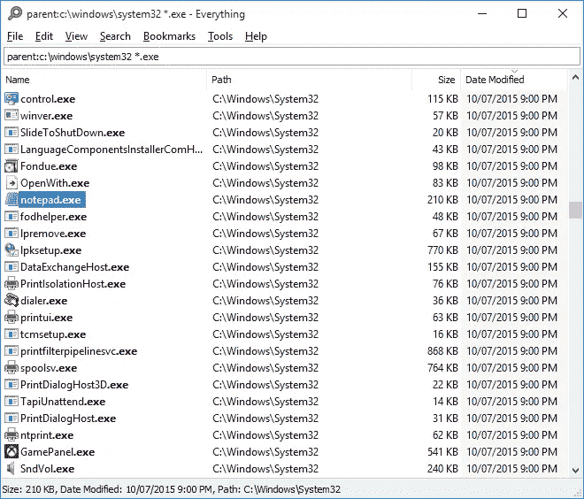

# 如何在你的 Windows 机器上立即找到任何文件

> 原文：<https://betterprogramming.pub/how-to-find-any-file-on-your-windows-machine-instantly-ff862a340762>

## 使用 Voidtools！


照片由[韦斯利·廷吉](https://unsplash.com/@wesleyphotography?utm_source=medium&utm_medium=referral)在 [Unsplash](https://unsplash.com?utm_source=medium&utm_medium=referral) 拍摄

曾经希望你能像搜索谷歌一样搜索你的电脑吗？现在你可以了！

[void tools](https://www.voidtools.com)‘一切都是 Windows 文件的搜索引擎。有了一切，您可以搜索 Windows 文件和文件夹的文件名或内容。

如果你熟悉互联网搜索引擎的工作方式，你就会知道什么是索引。像谷歌这样的搜索引擎建立一个已知互联网文件的数据库，然后通过建立一个基于关键字和路径名等标准的索引来组织这些信息。对于您的本地文件系统来说，一切都是一样的。

# 设置一切

安装一切都很简单。在这里下载安装文件[，然后按照安装向导的说明进行设置。](https://www.voidtools.com/downloads)

当你第一次运行所有的东西时，它会索引你的本地文件系统。一旦索引完成，您就可以开始搜索所有内容了！

# 搜索所有内容

你可以在顶部的搜索栏中输入部分文件名。(图片摘自 Everything 的文档这里:[http://www . void tools . com/support/Everything/using _ Everything/](http://www.voidtools.com/support/everything/using_everything/)。)



您应该看到符合条件的文件和文件夹出现在底部窗口中。所有内容都将在平行的列中显示每个文件的名称、路径、大小和修改日期。您可以通过单击每列的标题对结果进行排序。

# 高级搜索

除了使用单个关键字进行搜索之外，还可以使用通配符搜索文件系统。通配符运算符`*`可以在搜索中用来表示“任何东西”。只需将通配符插入您的搜索词中，如下所示:

```
*.exe (This will search for all files with an .exe entension.)C:\Windows\ *.dll (This will search for all files in C:\Windows\ with the .dll extension.)
```

请注意，您可以通过将路径添加到搜索词中来搜索特定文件路径中的文件。

您还可以使用搜索功能来优化您的搜索。例如，您可以使用`ext`功能来搜索特定的文件类型。

```
ext:FILE_EXTENSIONext:gif
```

或者使用`dm`功能过滤在某个时间范围内修改过的文件。您可以使用`content`功能搜索文件内容。

```
dm:DATE_MODIFIED
content:KEYWORD_IN_FILE_CONTENT*.exe dm:today
*.txt dm:thisweek content:hello
```

## 布尔运算符

一切还支持布尔运算符来组合搜索词。您可以使用三个布尔运算符:`AND`、`OR`和`NOT`。`AND`运算符用空格表示:

```
*.exe dm:today (Both "*.exe" AND "dm:today" has to be true.)
```

`OR`运算符是一个管道字符:

```
*.exe|dm:today ("*.exe" OR "dm:today" has to be true.)
```

`NOT`操作符是一个感叹号字符:

```
*.exe !dm:today ("*.exe" but NOT "dm:today".)
```

## 使用正则表达式

最后，您可以使用 regex 来进一步优化您的搜索词。使用前缀`regex`用正则表达式搜索。该搜索字符串将搜索以`test`开头并以`txt`结尾的文件名。

```
regex:^test.*txt$
```

# 结论

一切都是索引和搜索文件系统的工具。它让你搜索你的文件系统，就像你用搜索引擎搜索互联网一样。它允许您使用正则表达式、布尔运算符进行搜索，并根据不同的标准对结果进行排序。更多的搜索选项，请务必阅读 [Everything 的文档](http://www.voidtools.com/support/everything/searching/)。

感谢阅读！