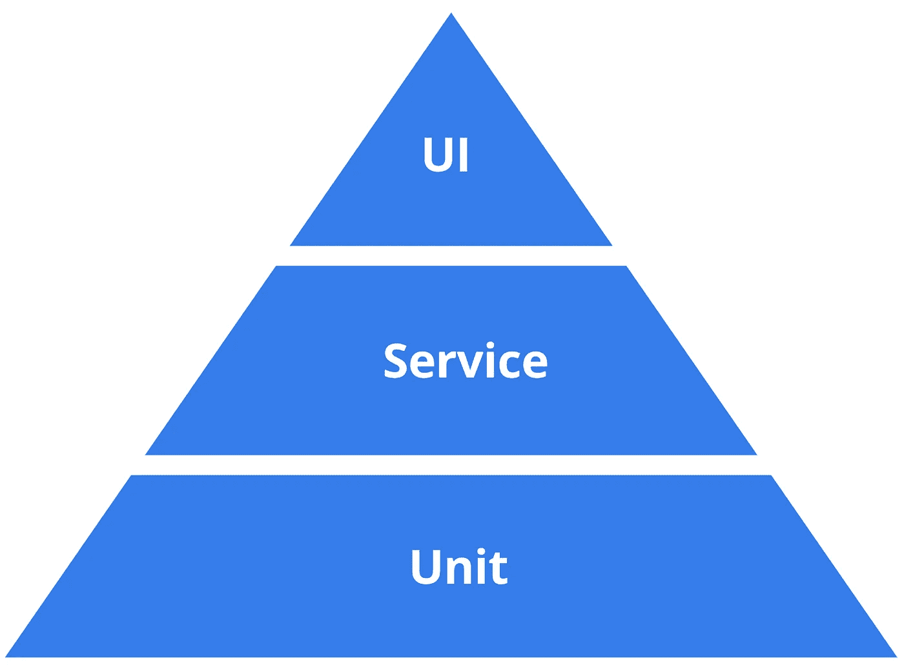

# 如何在软件测试中找到平衡

> 原文：<https://betterprogramming.pub/how-to-find-balance-in-software-testing-c9649cb131bf>

## 软件测试

## 在单元测试、集成测试和端到端测试之间找到平衡

照片由[表格](https://unsplash.com/@theformfitness?utm_source=unsplash&utm_medium=referral&utm_content=creditCopyText)上的 [Unsplash](https://unsplash.com/s/photos/work-balance?utm_source=unsplash&utm_medium=referral&utm_content=creditCopyText)

在混乱时期，我们都渴望找到某种平衡。软件开发中的平衡呢？我们希望经过可靠测试的软件投入生产。需要在部署之前发现错误和缺陷，并且测试需要自动化。

这是汤姆的故事:他的公司得到了越来越多的客户。与此同时，软件开发人员的队伍越来越小。超级讨厌。Tom 的团队对更快的产品发布感到沮丧，无法跟上产品的质量。

该公司随后决定削减开支，裁掉自动化人员。他们用廉价的海外团队取而代之。新团队希望在一个实时系统上无人值守地运行自动化测试。

汤姆的团队礼貌地说*不*离岸团队继续进行并连夜开始测试。更糟糕的是，这发生在冠状病毒爆发期间。

想象一下，刚刚成功地将他的团队转变为远程工作的 Tom 现在也会醒来。该系统整夜无人值守。当警报响起时，他没有醒来。他只是太累了，因为他的孩子整天跑来跑去。现在地狱失控了。

他需要修复损伤，恢复稳定，同时让孩子们平静下来。你现在不想成为汤姆。

不，不，不…良好的测试实践和经验丰富的测试团队是不可或缺的。

我们需要控制冠状病毒。但是我们也需要控制我们软件的质量。

开发团队不再拥有数百万手动软件测试人员，而是将他们的大部分测试工作自动化。

自动化测试与敏捷开发实践、持续交付和 DevOps 文化携手并进。有了有效的软件测试，开发人员可以快速而自信地前进。

但是单元测试、集成测试和 e2e 测试之间的最佳平衡是什么呢？我们能找到这个问题的统一答案吗？

在回答这个棘手的问题之前，让我们提醒自己什么是有效的测试:

*   在有效的测试实践中，目标是发现错误——而不是编写测试
*   成功的测试用例是检测到尚未发现的错误

那么，我们的问题的最佳答案是什么呢？

# 如何在单元、集成和端到端测试之间找到平衡

找到编写多少单元、集成和端到端(e2e)测试的正确平衡并不容易。每个团队和应用程序都是不同的，需要不同的比率。

大多数项目受益于各种自动化测试的平衡组合来捕获不同类型的错误。确切的组成取决于项目的性质。

[测试金字塔](https://martinfowler.com/bliki/TestPyramid.html)是十多年前推出的，它是一个很棒的相关模型。

金字塔称较低层次的测试编写和维护更便宜，运行更快。它建议了三种测试类型:单元测试、服务测试和 UI 测试。上层测试的编写和维护成本更高，运行速度也更慢。因此，您应该有大量的单元测试、一些服务测试和很少的 UI 测试。

在过去的 10 年里，我们目睹了许多变化——从微服务到云，再到无服务器，再到 Kubernetes。说测试金字塔模型不是所有类型的应用程序的最佳选择是不是很愚蠢？说我们应该拥抱新的测试技术是不是很疯狂？

测试金字塔、TDD 和单元测试仍然是强大的技术，可能是许多应用程序的最佳匹配。

但就像所有事情一样，例外证明了规律。

让我们来看一个像 Kafka/MQTT 那样将数百万个事件发射到消息总线中的物联网应用程序。然后，事件被存储到某个数据仓库中，并由某个分析 UI 进行查询。这个 app 集成了服务，几乎没有逻辑。你认为坚持编写我们的大部分单元测试仍然是明智的吗？

像聊天机器人、Alexa Skills 或加密应用程序这样的应用程序呢？在所有这些应用中，测试金字塔并不是最佳匹配。

有了像 React、Angular 和 Vue.js 这样的前端框架，很明显 UI 测试不必在金字塔的最高层。您可以在所有这些框架中对您的 UI 进行单元测试。

如果你想跟上步伐，你必须寻找在不牺牲质量的情况下更快交付软件的方法。

测试金字塔超级简单，可以作为许多项目的指南。科恩最初的测试金字塔中有两件事值得记住:

1.  用不同的粒度编写测试。
2.  你的水平越高，你应该做的测试就越少。

不要过于依赖科恩测试金字塔中各层的名称。

科恩还谈到了他的观察结果，即[许多开发人员完全忽略了服务层](https://www.mountaingoatsoftware.com/blog/the-forgotten-layer-of-the-test-automation-pyramid)。这个观察仍然是正确的。

那么，我们的问题的答案是什么:你如何在单元测试、集成测试和 e2e 测试之间找到平衡？看情况。让我们进一步讨论这个问题。

# 团队中更好的软件测试的三个步骤

1.  了解更多关于软件测试、持续交付和开发运维的信息。您可以从这里开始:

[弗吉尼亚大学连续交付&devo PS](https://bit.ly/39dLvAo)

**2。与您的团队一起确定最佳策略的一个好方法是分析和思考如下问题:**

*   在你的代码库中，哪些测试产生了巨大的影响？
*   哪些措施让您的应用在生产中免于崩溃？

花点时间和你的团队一起回答这两个问题。

**3。谷歌搜索:**

*   [测试自动化](https://www.google.com/search?q=test+automation)
*   [敏捷和开发运维](https://www.google.com/search?q=Agile%20and%20DevOps)
*   [无代码自动化测试](https://www.google.com/search?q=Codeless%20Automation%20Testing)
*   [测试自动化](https://www.google.com/search?q=Test%20Automation)
*   [敏捷测试](https://www.google.com/search?q=Agile%20testing)
*   [DevOps 测试](https://www.google.com/search?q=DevOps%20testing)
*   [测试中的人工智能和机器学习](https://www.google.com/search?q=Artificial%20Intelligence%20and%20Machine%20Learning%20in%20Testing)

您可能也会喜欢的一些文章:

 [## 100 位最好的工程师、开发人员、编码人员和企业家在线关注

### 100 个聪明的头脑

medium.com](https://medium.com/better-programming/100-of-the-best-engineers-developers-coders-and-entrepreneurs-to-follow-online-e2cedcea17d7)  [## 如何让你的团队成员和客户听你的

### 前联邦调查局谈判专家克里斯·沃斯教授一项有价值的技能，可以帮助你的工程生涯

medium.com](https://medium.com/better-programming/how-to-get-your-team-members-and-clients-to-listen-to-you-51856b9463b1)  [## 来自 5 位远程工作领导的最佳建议

### 我们能从多年来成功远程工作的公司学到什么

medium.com](https://medium.com/better-programming/the-best-tips-from-5-remote-work-leaders-8a73c9f3ea4f)  [## 如何通过发现自己的优势成为一名更好的程序员

### 如何通过了解自己和依靠自己的优势成为更好的开发人员

medium.com](https://medium.com/better-programming/how-to-become-a-better-programmer-by-discovering-your-strengths-fc8f78e86628)  [## 如何在家和孩子一起写代码

### 你和孩子被锁在家里了吗？这里有一些建议可以帮助你保持理智，做一些工作，并且仍然保持微笑…

medium.com](https://medium.com/better-programming/how-to-write-code-with-your-kids-at-home-f7959fa22dbe) 

有一个伟大的，平衡的一天。