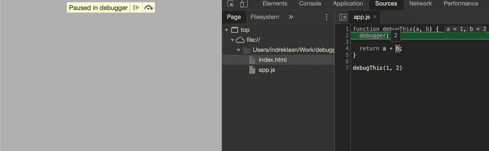
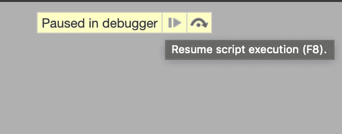
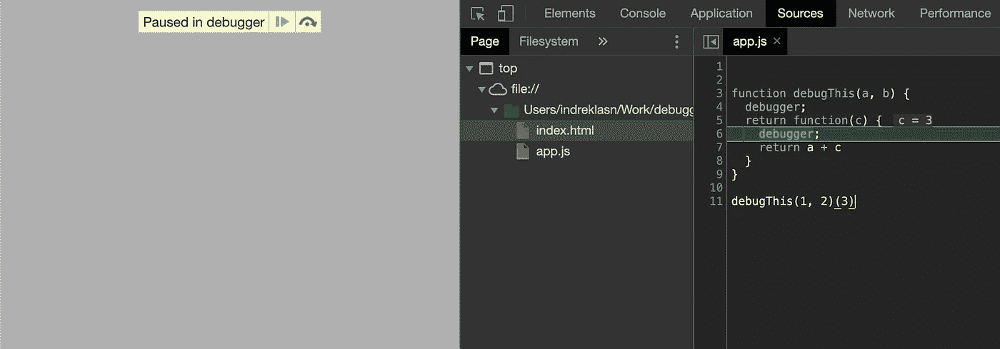
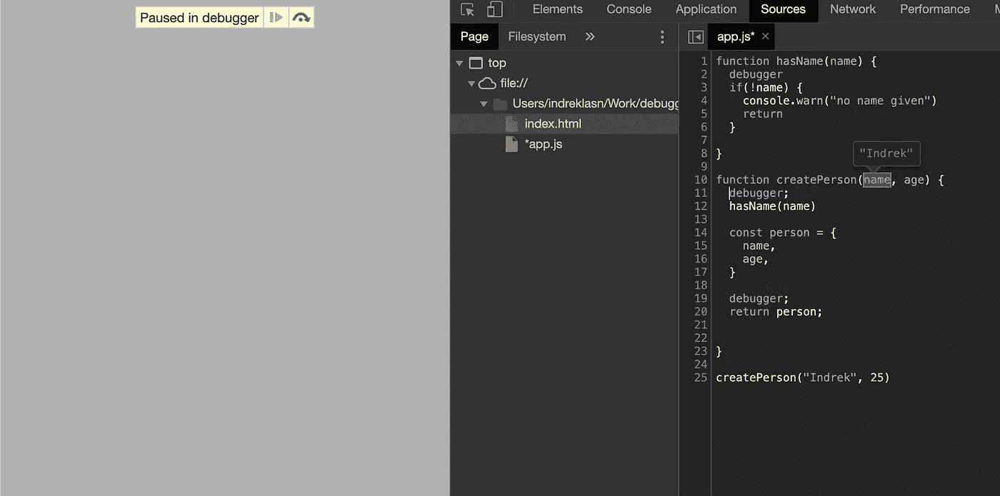
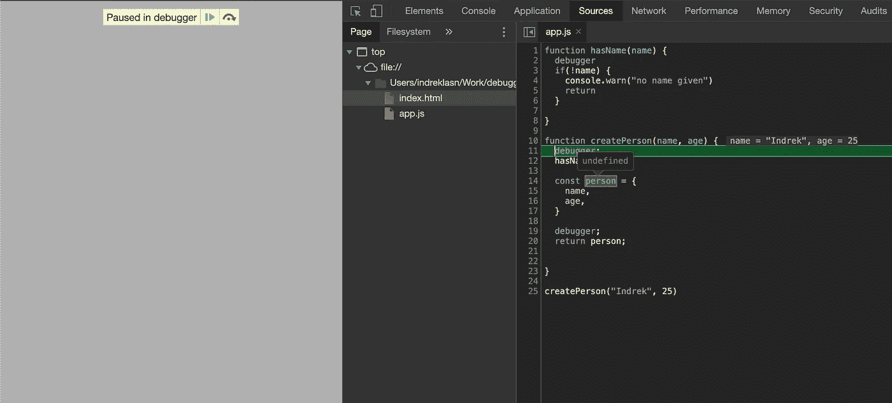
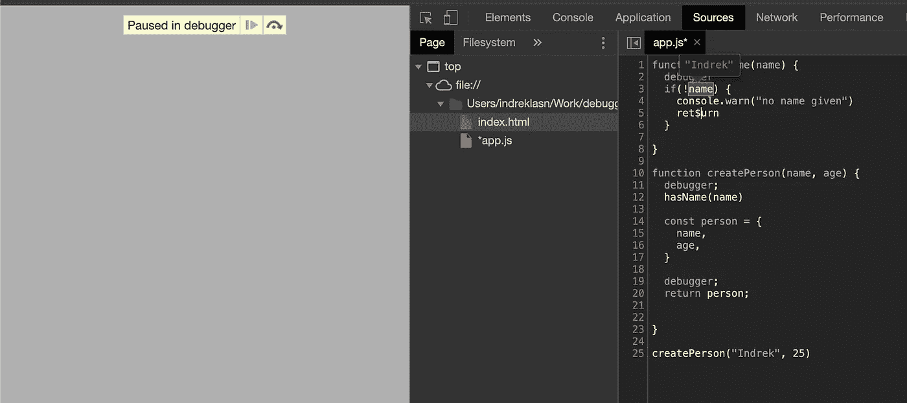
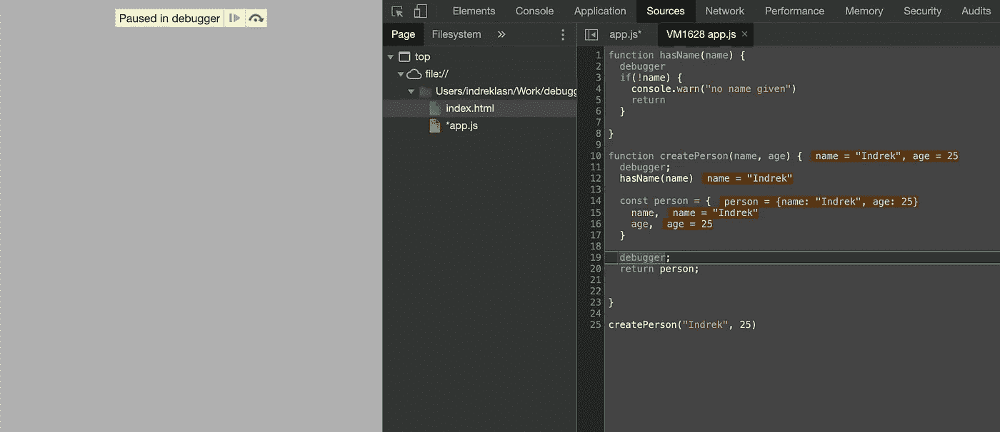
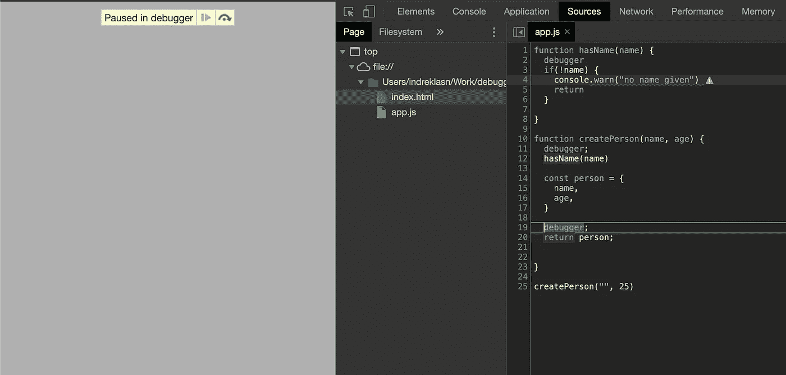

# 如何用调试器发现 JavaScript 代码中的错误

> 原文：<https://betterprogramming.pub/how-to-find-bugs-in-your-code-with-the-debugger-a7f739ea98>

## JavaScript 中的调试器语句到底是什么？

约翰·施诺布里奇在 [Unsplash](https://unsplash.com?utm_source=medium&utm_medium=referral) 上拍摄的照片

您知道 JavaScript 内置了一个调试器吗？调试器在查找 bug 和跳过嵌套的回调、承诺等方面非常有用。`debugger`语句适用于客户端和服务器端呈现的 JavaScript 代码。

# 句法

调试器

`debugger`语句让我们停止代码执行并检查任何变量、值等。本质上，它充当了`return`键并阻止函数执行。

调试 JavaScript

当我们执行上面的代码时，这就是我们应该看到的。注意“调试器中暂停”文本和右边的`resume`和`loop-over`按钮。在左边的面板上，我们看到“sources”选项卡和带有我们传入的值的`debugThis`函数。如果你将鼠标悬停在变量`a`和`b`上，你会看到它们的值。

当我们有更复杂的事情发生，我们需要检查哪里出错时，说这是一个方便的工具是一种保守的说法。更复杂的应用程序可能从十个不同的数据源获取数据，但其中一个可能会失败。为什么和如何？`debugger`来救援了！

要恢复正常，请按“恢复”按钮。

`debugger`语句调用任何可用的调试功能，比如设置断点。如果没有可用的调试功能，则该语句无效。

# 多个调试器

当我们有不止一个`debugger`语句和大量的回调或承诺时，调试器真的会发光。以下面的例子为例，我们有一个闭包函数。我们获取外部函数的`a`值，并将其传递给内部函数:

调试器为我们提供了一种灵活的方法来检查函数的所有值。在闭包内部，我们可以检查`a`、`b`和`c`参数值。将鼠标悬停在函数参数上，亲自查看。

闭包内的调试器

现在我们已经掌握了`debugger`的窍门，让我们来看一个更复杂的例子。首先，我们检查是否将`name`参数传递给了`createPerson`函数。如果没有，我们停止所有的代码执行，并向控制台发出警告。如果有一个`name`，用传递给它的参数创建一个`person`对象。

注意:如果你不熟悉对象速记语法，我建议你看看这篇文章。

 [## 如何使用析构和箭头函数来改进您的 JavaScript 代码

medium.com](https://medium.com/better-programming/use-these-javascript-features-to-make-your-code-more-readable-ec3930827226) 

一旦我们用给定的参数调用了`createPerson`函数，调试器就会弹出。让我们看看它告诉我们什么。

启动我们的第一个调试器

第一个`debugger`确实启动了，并让我们可以检查`createPerson`参数。你能说出如果我们检查`person`物体会发生什么吗？

人员对象未定义

未定义？为什么`person`没有定义？很简单——因为我们还没有执行那部分代码。我们在函数的第一行停止了代码执行。我们没有对`person`对象的范围访问权，因为它不存在。

如果我们按下蓝色的 resume 按钮，我们的第二个调试器就会启动，这次是在`hasName`函数内部。

第二个调试器启动

现在我们进入了`hasName`函数——这个函数快速检查是否有一个`name`传递给了`person`函数。将它放在一个单独的函数中没有多大意义，因为我们可以检查`createPerson`中的单个属性——但是对于调试器演示来说，这是一个如何实际应用调试器的有用展示。我们的`person`对象仍然是`undefined`，因为我们正在执行`hasName`函数，还没有到达创建`person`对象的部分。

最后，按 resume 按钮，启动第三个调试器:

启动我们的第三个调试器

瞧啊。我们应该能够看到所有的变量和对象值，因为实际上，我们的代码已经执行完毕。如果我们不向`createPerson`函数传递一个`name`会发生什么？

如果我们不向我们的 **createPerson** 函数传递名称会发生什么

显然，这里有一个关于我们如何忘记传递一个`name`给函数的警告。一个`person`不可能没有名字——除非一个`person`什么都不是(至少在《权力的游戏》中)。

下次，在你准备写`console.log`之前，试着找借口使用调试器。在纸面上，您可以设置您的 web bundler，如 [webpack](https://webpack.js.org/) 或 [parcel](https://parceljs.org/) 来删除生产中默认的`debugger`语句。调试器也在[节点](https://nodejs.org/en/)环境中工作。

如果您想使用 Node 的调试器，[请查看我之前写的这篇文章。](https://medium.com/better-programming/supercharge-your-debugging-experience-for-node-js-3f0ddfaffbb2)我将深入探讨如何调试服务器端 JavaScript 代码。

 [## 增强 Node.js 的调试体验

### 当控制台日志不够用时

medium.com](https://medium.com/better-programming/supercharge-your-debugging-experience-for-node-js-3f0ddfaffbb2) 

# 摘要

如果我们被给予有用的工具来使我们的生活更容易，我们应该使用它们并且经常使用它们。在适当的时候，调试器是您工具箱中的一个方便工具。

如果您喜欢这篇文章，并想了解更多关于如何有效调试 JavaScript 代码的信息，请查看下面的文章。

 [## 使用这些控制台技巧提高您的 JavaScript 调试技能

### JavaScript 给了我们很多调试代码的工具

medium.com](https://medium.com/better-programming/boost-your-javascript-debugging-skills-with-these-console-tricks-ab984c70298a) 

如果你是 JavaScript 新手，想学习这门语言，我建议你从阅读书籍和构建东西开始。从“ [*学习 JavaScript 的更聪明的方法*](https://amzn.to/2LOkzjj) ”这本书和[开始吧，这里有一个要开发的有趣应用的列表](https://medium.com/better-programming/the-secret-to-being-a-top-developer-is-building-things-heres-a-list-of-fun-apps-to-build-aac61ac0736c)。

开心编码，保持牛逼！