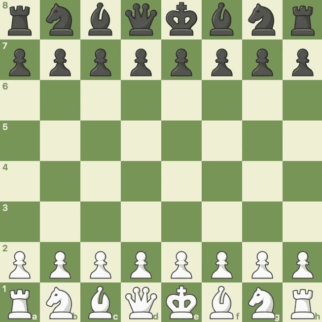
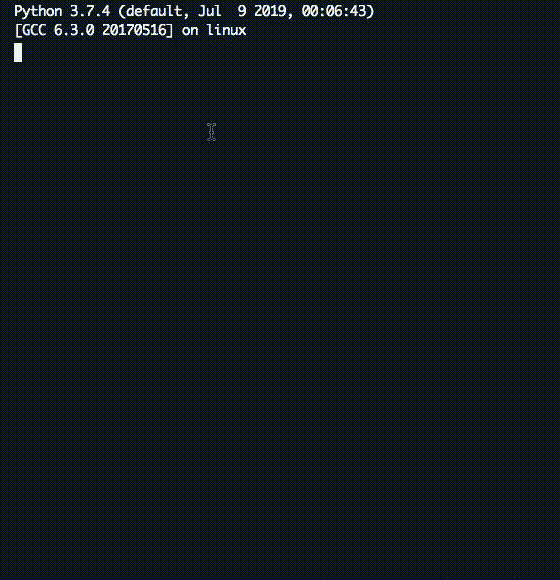
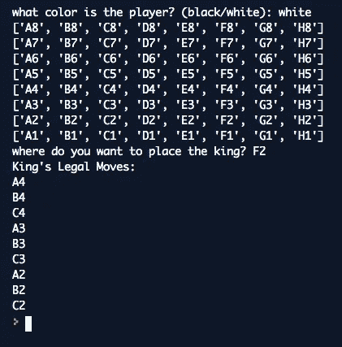

# 如何用 Python 在象棋中找到国王的合法走法

> 原文：<https://betterprogramming.pub/how-to-find-the-kings-legal-moves-in-chess-with-python-1267192cf089>

## 一个有趣的练习来磨砺你的大脑和你的代码


照片由 [Pixabay](https://www.pexels.com/@pixabay?utm_content=attributionCopyText&utm_medium=referral&utm_source=pexels) 从 [Pexels](https://www.pexels.com/photo/battle-black-blur-board-game-260024/?utm_content=attributionCopyText&utm_medium=referral&utm_source=pexels) 拍摄

你有没有想过如何用 Python 在棋盘上找到国王的合法走法？可能不会，但在列表构成的网格中跳来跳去是一种有趣的练习。

国王只能向任何方向移动一格。这意味着它可以做八个合法动作，除非它在边缘或角落里。

最后我也给你增加了一个挑战。你会接受吗？

## 在本课程中，我们将:

*   为用户创建一个菜单，这样他/她可以在棋盘上放一个国王
*   打印从黑色或白色视角看到的纸板
*   根据用户放置国王的位置打印国王的合法移动

# 董事会



来自[chess.com](http://chess.com)的板

为了编写这个程序，我们将使用一个在`board.py`中名为`Board`的类和一个`main.py`来运行它。

创建电路板非常容易，但仍然有一个非常好的触摸它。我将使用列表理解来填充一个包含八个列表(行)的列表。这些将有八个项目内(列)。

棋盘是 8×8 的正方形。行被编号，列由字母 A-H 标识。

# 这是班牌

## def __init__(自身)

*   你首先注意到的是`self._letters`列表。这只是棋盘上可能出现的字符串范围，例如 A-H。
*   下一个名单是`self._board_grid`。这个列表现在是空的，将用几个代表行的列表填充。
*   循环`for letters in self._letters:`使用列表理解来执行以下操作:

```
append_list = [(letter + str(x)) for x in range(1,9)]
```

后半部分`(for x in range(1,9))`，告诉我们要做八次动作。从 1 到 9 的范围是从 1 到 8。

如果你不熟悉列表理解， [Rupesh Mishra](https://medium.com/u/b2d3629d2415?source=post_page-----1267192cf089--------------------------------) 在这里写了一篇关于它的好文章[。](https://medium.com/better-programming/list-comprehension-in-python-8895a785550b)

第一部分告诉我们，我们希望将字母列表中的字母`self._letter`与一个数字连接起来。`letter + str(x)`将选择*“A”*并添加*“1”*进行范围(1，9)的第一次迭代，然后是 A2、A3，依此类推。

当它完成 A 时，它会跳到 B，因为它会继续遍历整个`self._letters`列表。

因为我们正在循环遍历整个字母列表，所以我们将得到:

```
['A1', 'A2', 'A3', 'A4', 'A5', 'A6', 'A7', 'A8']['B1', 'B2', 'B3', 'B4', 'B5', 'B6', 'B7', 'B8']etc....
```

它们被一个接一个地追加，所以它们会建立一个包含列表的列表，直到我们完成— A1-H8。

## def print_board(自身)

这个只是遍历新创建的`self._board_grid`中的列表并打印行。

结果是:

```
['A1', 'A2', 'A3', 'A4', 'A5', 'A6', 'A7', 'A8']
['B1', 'B2', 'B3', 'B4', 'B5', 'B6', 'B7', 'B8']
['C1', 'C2', 'C3', 'C4', 'C5', 'C6', 'C7', 'C8']
['D1', 'D2', 'D3', 'D4', 'D5', 'D6', 'D7', 'D8']
['E1', 'E2', 'E3', 'E4', 'E5', 'E6', 'E7', 'E8']
['F1', 'F2', 'F3', 'F4', 'F5', 'F6', 'F7', 'F8']
['G1', 'G2', 'G3', 'G4', 'G5', 'G6', 'G7', 'G8']
['H1', 'H2', 'H3', 'H4', 'H5', 'H6', 'H7', 'H8']
```

我知道你在想什么:这块板是颠倒的/从布莱克的角度看。是的，就目前而言，这是因为列表就是这样创建的，但我们稍后会处理这个问题。

你可以写一个超级短的`main.py`来测试这段代码到目前为止:

```
from board import Boarddef main():
    board = Board()
    board.print_board()main()
```

这个程序中最难的方法函数是寻找国王合法走法的函数。

我们将允许用户将他/她放置国王的实际方块(例如 E5)作为字符串传递。

这意味着我们必须对输入进行一些调整，以便能够在网格中正确地移动。

这是代码，但是在你攻击它之前让我解释一下。

我想把它分成两部分，一部分在循环之前，另一部分是循环本身，最后是打印结果。

因为我们将允许用户输入一个字母和一个数字，我们给自己制造了一点困难。我们需要用数字来表示它。想上 E5，就得输入`self._board_grid[4][4]`。

这意味着我们必须把 E 转换成 4。但是我们必须让它成为不可知论者。我们还希望 F 自动转换成 5，以及 A 转换成 0 (A 是第一个列表)。在 Python 中，列表中的第一个索引是 0。

```
upper_input_letter = coordinates[0].upper()    
get_letter_index = self._letters.index(upper_input_letter)
get_number_index = int(coordinates[1])-1
```

第一个表达式`upper_input_letter`，确保无论用户输入什么，我们都将使用大写字母。如果用户输入“a1”，我们希望将其视为 A1。

`get_letter_index`检查用户输入实际上是原始字母列表中的什么索引。e 将把索引 4 作为 int 返回。

`get_number_index`只是为了确保当用户键入一个数字时，我们减去一，以使该数字在列表中正确显示。还记得 Python 中列表的第一项是 0，而不是 1 吗？如果用户输入 A1，我们需要[0][0]。

## 循环

这里我们跳到字母行，然后跳到列号。

合法移动列表将存储所有合法移动，并最终返回自身。

搜索路径用于定义我们想要搜索的深度。对于国王，我们希望在两个方向上搜索一行，在每个方向上搜索一列。这是一个范围(-1，2)，因为这样我们就可以返回到前面的行:(-1，0)将检查当前行，1 将检查下一行。柱子也是一样。

例如，当我们键入命令 E5 时，我们搜索的相邻字母和数字将是我们传入的索引号。但是我们必须记住范围。因此，我们添加范围从-1 到 2 的范围数。

我们确保能加减一个数的方法是总是加法。如果你加上一个负数，你就减去。如果你加一个正数，你加。

```
neighbour_square_letter = get_letter_index + letter_row
neighbour_square_number = get_number_index + column_number
```

合法方块的状态默认设置为`True`。然后，我们检查它是否落在板外。< 0 或> 7 在板外，行列均有。当这种情况发生时，这些方块将接收值`False`。

合法方块是附加的，最后，我们从合法移动列表中删除原始输入，因为我们不想要我们站在上面的方块。

我必须将坐标重构为一种可以比较的格式。

## print_kings_legal_moves

我们可以把它放在`find_king_legal_moves`中，但是返回结果比打印结果更好。如果我们返回它，我们可以将它存储在一个变量中，如果我们愿意，可以用不同的方式打印它。

我现在选择的方法是逐行打印，遍历列表。您也可以只打印列表本身。两者都是很好的表现。


Christopher Machicoane-hurt aud 在 [Unsplash](https://unsplash.com?utm_source=medium&utm_medium=referral) 上拍摄的照片

还记得棋盘是怎么印倒的吗？

我们来看一下`main.py`文件:

我们可以创建一个菜单，玩家可以告诉我们他们是黑人还是白人。这就是`player_color`的输入。

然后我们创建板子，当我们打印它时，我们将`player_color`传递给方法。

这是更新后的 board 类的外观:

用户可以选择白色或黑色，这里有一些有趣的事情发生:

```
if color.upper() == 'WHITE':
    board = self._board_grid[::-1]
```

我们可以使用`.upper()`来确保任何小写/大写问题不会影响我们。然后通过使用`[::-1]`，我们翻转列表，使其正确地为白人玩家打印。

程序的功能保持不变，只是表现方式不同。



# 但是等等！

你能编辑代码以获得正确的合法移动吗？

敏锐的观察者或棋手可能会注意到棋盘是如何横向印刷的。


照片由 [Kat Jayne](https://www.pexels.com/@katlovessteve?utm_content=attributionCopyText&utm_medium=referral&utm_source=pexels) 从 [Pexels](https://www.pexels.com/photo/adult-alone-anxious-black-and-white-568027/?utm_content=attributionCopyText&utm_medium=referral&utm_source=pexels) 拍摄

我修改了代码以使其更好地工作:

*   黑/白——玩家的身份决定了棋盘的抽签方式
*   更少的黑客攻击来让电路板印刷
*   移除膨胀的代码，将它简化为几个方法

要特别注意`generate_board()`方法。挺好玩的。请注意，只有当我有黑色`user_color`时，它才会有不同的打印效果。这意味着你可以在最初的`self._board_grid`中做所有的检查，而它会根据玩家的颜色显示不同。这意味着查找动作的代码更少，打印更灵活。

新的`board.py`:

新`main.py`:


纸板印刷正确



需要调整代码的合法移动

# 你准备好迎接挑战了吗？

你能把代码编辑成:

1.  让用户键入 0 或 1，而不是“黑”和“白”这将减少出错的可能性，让用户更快地使用程序。
2.  给用户一个继续放置国王的选项，直到他/她不想再放为止。
3.  最重要的是……让`find_king_legal_moves()`正确使用新的画板方法。

我向你保证:如果你投入到挑战中，当你解决它的时候，你会得到回报。感谢阅读！