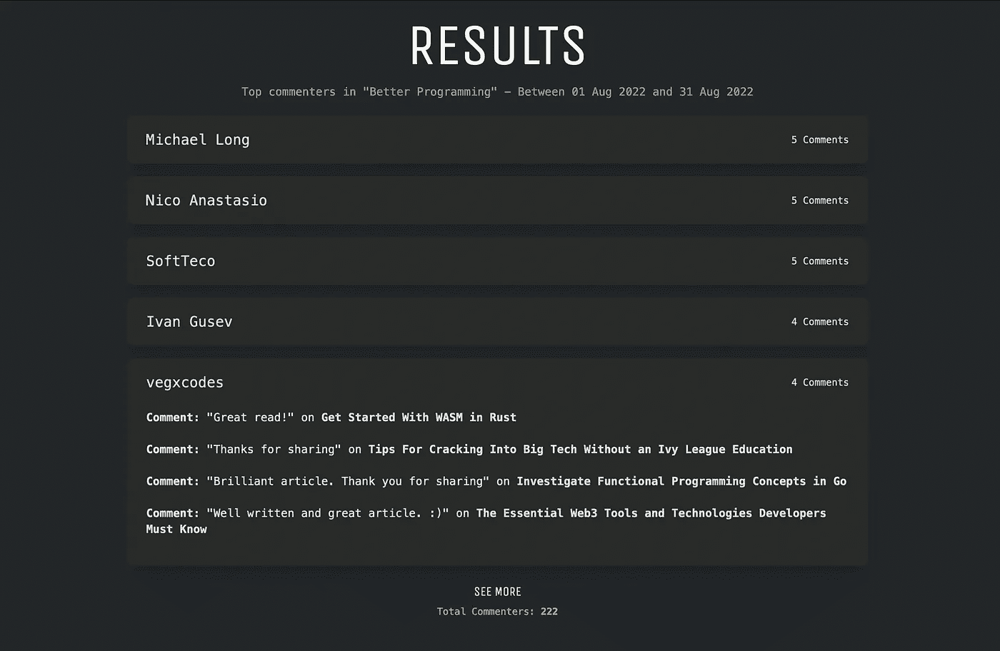
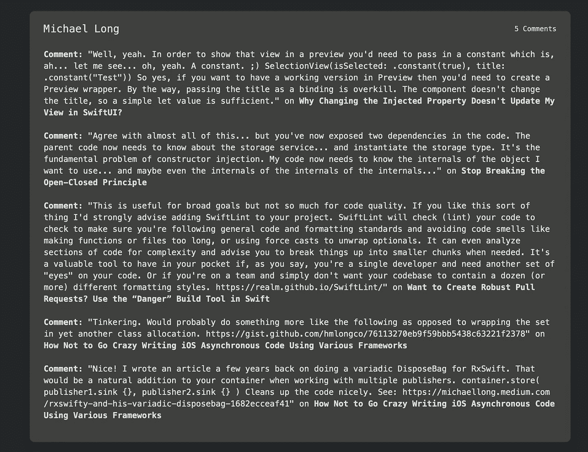
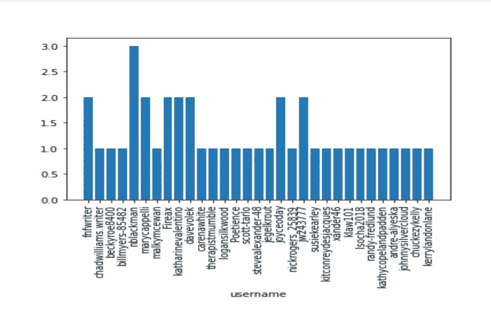

# 如何使用 Python 找到中型出版物的顶级读者

> 原文：<https://betterprogramming.pub/how-to-find-the-top-readers-of-a-medium-publication-using-python-5862946047c0>

## 谁对你的出版物的文章评论最多？

作者图片

在前互联网时代，每个家庭都订阅某种出版物。孩子们过去喜欢看漫画，而成年人喜欢看杂志——从美食家看食谱到技术人员看多端口调制解调器。

我们都有一个找到“我们的东西”的地方

读者过去常常给出版商发邮件，批评和欣赏这些文章。他们会散布谣言，大多数出版物都有专门针对这些读者意见的板块(有点像旧版本的评论)。

这些杂志经常提到他们的“顶级读者”，承认并认可读者的反馈，这产生了巨大的积极效果，因为他们觉得与出版商更有联系。这也证明了出版商能够提供读者想要的东西。

今天，同样的情况也适用于媒体出版物。但不幸的是，由于每月评论和文章的数量如此之多，没有简单的方法来确定他们的“顶级读者”。

通过确定你的出版物上的顶级评论者，并承认他们参与了你的时事通讯和出版物的主页，你可以激励成千上万的其他人，并与他们建立真正的关系。

社区就是这样建立起来的。但是不要担心…

现在媒体出版物也可以这样做！

# 怎么做？

假设一个刊物每月发表 100 篇文章，每篇文章平均得到两条评论。总共有 200 条评论。

两百条评论并不意味着它们来自 200 个不同的媒体用户。会有人多次发表评论，比如那些真正喜欢你出版物上的东西并被它感动的人。

*你的重点应该是找出那些人，给他们一点认可。也许以后联系他们，问问他们对你的出版物还有什么要求。*

那么，你是怎么做到的呢？这看起来像是大量的手工工作。

为了简化这个过程，我创建了一个简单的工具，任何人都可以用它在一分钟内找到所有的顶级读者。

# 介绍“顶级读者”实用程序

【https://apps.mediumapi.com/top_readers 

[“顶级读者”实用程序](https://apps.mediumapi.com/top_readers)是一个单页工具，您可以在其中输入两项内容:

*   指向在您的目标出版物下发布的任何文章的 URL 链接。例如:这里有一篇文章[发表在“更好的编程”栏目下](/add-an-ai-to-your-discord-server-with-node-js-and-gpt-3-198b538cc05b)
*   日期范围。例如，2022 年 8 月 1 日至 2022 年 8 月 31 日。

一个月成绩截图—[https://apps.mediumapi.com/top_readers](https://apps.mediumapi.com/top_readers)

一年成绩截图—[https://apps.mediumapi.com/top_readers](https://apps.mediumapi.com/top_readers)

在结果中，您将得到所有评论者，按他们评论频率的降序排列。当你点击它，你会得到他们的确切评论和相应的文章。

*简单吧？*

评论者的扩展视图—查看他们对相应文章的每个评论

如果您希望进行更深入的分析，并且不怕弄脏自己的手，那么您也可以通过编程来做同样的事情。

# 如何编程实现？

> **注意:**我将使用 Python 来完成这项工作，但是您可以使用任何您想要的语言。请在这里查看 [API 文档](https://medium.com/geekculture/medium-api-documentation-90a01549d8db)。

## 步伐

1.  使用`pip install medium-api`安装`medium-api` Python 包。
2.  创建一个新的 Python 文件并开始编码。
3.  首先，导入所需的库

来源: [GitHub Gist(哭泣的天使)](https://gist.github.com/weeping-angel/35c9d29c3e9ecae5aa30cbea1addfbbd)

4.使用你的 [API 键](http://hub.mediumapi.com)初始化`Medium`对象。这将使您能够访问构建该程序所需的所有高级功能。

来源: [GitHub Gist(哭泣的天使)](https://gist.github.com/weeping-angel/35c9d29c3e9ecae5aa30cbea1addfbbd)

5.使用`publication_id`创建一个发布对象。如果你不知道`publication_id`，你可以从它下面发表的任何文章中得到它。使用端点[获取文章信息](https://medium.com/geekculture/medium-api-documentation-90a01549d8db#eda6)检索`publication_id`。

来源: [GitHub Gist(由哭泣的天使)](https://gist.github.com/weeping-angel/35c9d29c3e9ecae5aa30cbea1addfbbd)

6.在该出版物下，获取最近 30 天内发表的文章。

来源: [GitHub Gist(由哭泣的天使)](https://gist.github.com/weeping-angel/35c9d29c3e9ecae5aa30cbea1addfbbd)

7.筛选有回复的文章，以便我们稍后可以检索它们。

来源: [GitHub Gist(哭泣的天使)](https://gist.github.com/weeping-angel/35c9d29c3e9ecae5aa30cbea1addfbbd)

8.从所有筛选出的文章中检索所有评论(`responses`)，并保存其对应的作者(或`responders`)。一旦完成，使用`Counter`根据频率得到结果。

来源: [GitHub Gist(由哭泣的天使)](https://gist.github.com/weeping-angel/35c9d29c3e9ecae5aa30cbea1addfbbd)

9.(可选)您可以使用`matplotlib`绘制一个条形图:用户名与评论数量。

来源: [GitHub Gist(哭泣的天使)](https://gist.github.com/weeping-angel/35c9d29c3e9ecae5aa30cbea1addfbbd)

Matplotlib 输出

# 完整代码

来源: [GitHub Gist(哭泣的天使)](https://gist.github.com/weeping-angel/35c9d29c3e9ecae5aa30cbea1addfbbd)

# 参考

 [## 中等 API —文档

### 中型 API 入门

medium.com](https://medium.com/geekculture/medium-api-documentation-90a01549d8db)  [## GitHub——pieping-angel/Medium-API:位于 Medium API 之上的 Python 包装器，用于快速提取数据…

### Medium API 之上的 Python 包装器(由 Nishu Jain 开发),用于快速从 Medium 网站提取数据(…

github.com](https://github.com/weeping-angel/medium-api) 

*   [https://apps.mediumapi.com/top_readers](https://apps.mediumapi.com/top_readers)

感谢您的阅读，祝您愉快！

**PS:** 我们发布与 Medium 和 Medium API 相关的教程、视频、代码片段和见解。所以一定要跟着我们

*   推特:[**twitter.com/medium_api**](https://twitter.com/medium_api)
*   领英:[www.linkedin.com/company/medium-api](https://www.linkedin.com/company/medium-api)

如果你喜欢阅读这些故事，我相信你会很乐意成为一名中等付费会员。每月只需 5 美元，你就可以无限制地接触成千上万的故事和作家。你可以通过 [***支持我，使用这个链接***](https://nishu-jain.medium.com/membership) ，*注册，我会赚一点佣金，这将帮助我成长并出版更多这样的故事。*