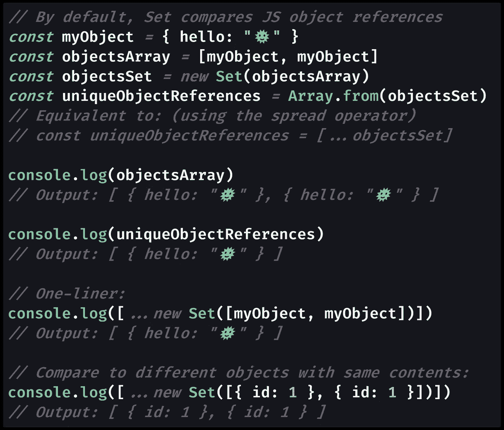
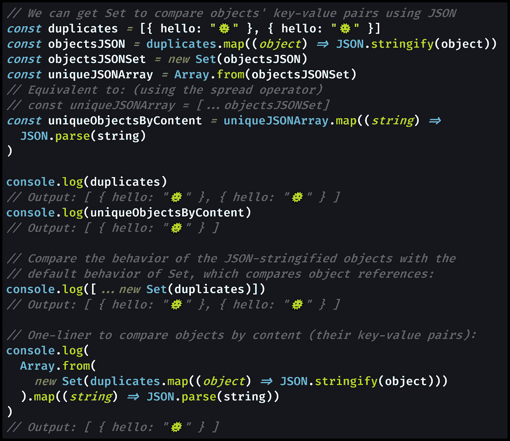

# 如何在 JavaScript 中通过对象引用或键值对找到数组中唯一的对象

> 原文：<https://betterprogramming.pub/how-to-find-unique-objects-in-an-array-in-javascript-by-object-reference-or-key-value-pairs-131338898d7a>

## 我将使用`Set`通过对象引用从数组中移除重复的对象。然后我将通过查看键值对来查找对象。

照片由[乔·格林](https://unsplash.com/@jg?utm_source=medium&utm_medium=referral)在 [Unsplash](https://unsplash.com?utm_source=medium&utm_medium=referral) 上拍摄

# 在 JavaScript 数组中寻找唯一的对象

强大的 ES6 特性`[Set](https://medium.com/coding-at-dawn/how-to-use-set-to-filter-unique-items-in-javascript-es6-196c55ce924b)`只接受添加到其中的每个值的一个副本，这使得它非常适合在 JavaScript 中查找不同的对象。

> "`**Set**`对象允许你存储任何类型的唯一值，无论是原始值[还是对象引用."](https://developer.mozilla.org/en-US/docs/Glossary/Primitive)
> 
> — [MDN 文档](https://developer.mozilla.org/en-US/docs/Web/JavaScript/Reference/Global_Objects/Set)

在本教程中，您将确切地了解如何在处理包含可能重复的 JavaScript 对象的数组时最好地使用`Set`。

我将探索使用`Set`从数组中移除任何重复的对象。首先，我将根据对象的[变量名](https://developer.mozilla.org/en-US/docs/Learn/JavaScript/First_steps/Variables)找到唯一的对象(具有相同*对象引用*的对象)。然后，我将过滤具有相同键值对的对象(具有相同的*内容*但是不同的对象引用)。

在我开始编码之前，让我们讨论一下对象引用和对象内容之间的区别，因为它阐明了`Set`在 JavaScript 中是如何工作的。

# 使用`Set`寻找独特的物体

您可能已经熟悉了`Set` 的基本思想——您只能将每个值添加到`Set`中一次，只留下唯一项的列表。

然而，与处理 [JavaScript 对象](https://developer.mozilla.org/en-US/docs/Web/JavaScript/Guide/Working_with_Objects)相比，`Set`处理[原始值](https://developer.mozilla.org/en-US/docs/Glossary/Primitive)的方式有所不同。

那是因为 JavaScript 对象，即使是内容完全相同的对象，在内存中也有不同的[对象引用](https://developer.mozilla.org/en-US/docs/Glossary/Object_reference)，也称为 [*指针*](https://developer.mozilla.org/en-US/docs/Mozilla/js-ctypes/Using_js-ctypes/Memory_Management) 。

`Set`对于从数组中移除重复的对象仍然非常有用，因为可以将一个存储在变量中的对象多次添加到一个数组中。在这种情况下，如果同一个对象被多次添加，`Set`将帮助您删除不唯一的对象引用，只留下一个副本。

然而，您也可以在使用`Set`比较对象内容的同时过滤对象数组。这样，您可以通过删除任何具有重复键值对的对象来找到不同的对象。我将此称为通过内容查找唯一对象，其中*内容*表示*键-值对*(也称为 [*条目*](https://developer.mozilla.org/en-US/docs/Web/JavaScript/Reference/Global_Objects/Object/entries) )。

# 通过对象引用查找唯一的 JavaScript 对象

JavaScript 中的每个变量都存在于计算机内存的某个部分中，无论这台计算机是服务器(运行 [Node.js](https://nodejs.org/en/) )还是网络浏览器。

当你用一个给定的名字定义一个变量时，这个名字就和内存中的一个位置相关联了。对于作为变量存储的对象，内存中的这些位置被称为*对象引用*——每个对象都有一个唯一的引用。

尽管如此，您仍然可以将这个惟一的对象引用多次添加到给定的数组中。这可能不是您希望在代码中出现的行为，所以下面介绍如何从数组中移除重复的对象引用。

[查看原始代码](https://gist.github.com/DoctorDerek/7e8ba7a07b0aea05020e1c7ed73bb860)作为 GitHub 要点

使用`Set`使得解决这个问题比你自己遍历数组，比较每个对象要简单得多。

# 按内容(键值对)查找唯一对象

由于默认情况下`Set`想要比较对象引用，我们需要将我们的对象转换成`Set`能够比较的格式。

要提取对象的内容进行比较，可以利用`[JSON.stringify()](https://medium.com/javascript-in-plain-english/how-to-use-stringify-and-parse-in-javascript-6b637b571a32)` [和](https://medium.com/javascript-in-plain-english/how-to-use-stringify-and-parse-in-javascript-6b637b571a32) `[JSON.parse()](https://medium.com/javascript-in-plain-english/how-to-use-stringify-and-parse-in-javascript-6b637b571a32)`。这些伟大的方法将 JavaScript 对象转换成 [JSON 格式](https://medium.com/swlh/what-is-json-used-for-in-javascript-programming-9d71284359a9) (JavaScript 对象符号)字符串。

`Set`非常适合[在数组](https://medium.com/coding-in-simple-english/how-to-find-unique-strings-in-an-array-using-javascript-e698b7957736)中寻找唯一的字符串，这样我们就能够将唯一的 JSON 字符串转换回 JavaScript 对象。

[查看原始代码](https://gist.github.com/DoctorDerek/0d3587f2374f343d5c9980a6b24f9f36)作为 GitHub 要点

在这里，您需要了解 JSON 是如何处理数据转换的，因为某些值不是 JSON 安全的。

> "`[undefined](https://developer.mozilla.org/en-US/docs/Web/JavaScript/Reference/Global_Objects/undefined)`、`[Function](https://developer.mozilla.org/en-US/docs/Web/JavaScript/Reference/Global_Objects/Function)` s 和`[Symbol](https://developer.mozilla.org/en-US/docs/Web/JavaScript/Reference/Global_Objects/Symbol)` s 不是有效的 JSON 值[…]
> 
> `[Date](https://developer.mozilla.org/en-US/docs/Web/JavaScript/Reference/Global_Objects/Date)`【对象】被视为字符串。
> 
> 数字`[Infinity](https://developer.mozilla.org/en-US/docs/Web/JavaScript/Reference/Global_Objects/Infinity)`和`[NaN](https://developer.mozilla.org/en-US/docs/Web/JavaScript/Reference/Global_Objects/NaN)`，以及数值`[null](https://developer.mozilla.org/en-US/docs/Web/JavaScript/Reference/Global_Objects/null)`，都被认为是`null`。"
> 
> — [MDN 文档](https://developer.mozilla.org/en-US/docs/Web/JavaScript/Reference/Global_Objects/JSON/stringify#Description)

对于像[数字](https://medium.com/javascript-in-plain-english/how-to-check-for-a-number-in-javascript-8d9024708153)、[字符串](https://medium.com/javascript-in-plain-english/how-to-check-for-a-string-in-javascript-a16b196915ff)和[布尔](https://medium.com/javascript-in-plain-english/how-to-check-for-a-boolean-in-javascript-98fdc8aec2a7)值这样的原始类型，您会发现这种使用`Set`和`JSON.stringify`和`JSON.parse`的方法非常适合根据内容查找不同的对象，甚至是嵌套的对象。

# 结论:找到不同的 JavaScript 对象

当 JavaScript 中有一组对象时，您通常希望使用唯一的对象——您不希望有任何可能导致错误或糟糕用户体验的重复对象。

然而，JavaScript 对唯一对象有两种定义:

1.  对象的引用(它的变量名或在内存中的位置)
2.  一个对象的内容(它的键值对或*条目*

具有唯一引用的对象是内存中不同的对象，即使它们有完全相同的内容，就像 JavaScript 对象的[深度克隆。要找到具有唯一引用的对象，您需要从数组](https://medium.com/javascript-in-plain-english/how-to-deep-copy-objects-and-arrays-in-javascript-7c911359b089)中[生成一个](https://medium.com/coding-at-dawn/how-to-use-set-to-filter-unique-items-in-javascript-es6-196c55ce924b) `[Set](https://medium.com/coding-at-dawn/how-to-use-set-to-filter-unique-items-in-javascript-es6-196c55ce924b)` [。通过引用比较对象是`Set`的默认行为。](https://medium.com/coding-at-dawn/how-to-use-set-to-filter-unique-items-in-javascript-es6-196c55ce924b)

为了让`Set`根据对象的内容来比较对象，您需要利用`JSON.stringify()`和`JSON.parse()`将对象转换成 JSON 格式的字符串原语，以便`Set`进行比较。如果你的对象是 [JSON 安全的](https://developer.mozilla.org/en-US/docs/Web/JavaScript/Reference/Global_Objects/JSON/stringify#Description)，那么这将非常有效，甚至对于嵌套的对象也是如此。相当甜蜜！

希望本文能帮助您理解在 JavaScript 数组中寻找不同对象时，对象引用和对象内容之间的区别。

要了解更多关于`Set`的内容，请参考我的[在 JavaScript](https://medium.com/coding-at-dawn/how-to-use-set-to-filter-unique-items-in-javascript-es6-196c55ce924b) 中使用 `[Set](https://medium.com/coding-at-dawn/how-to-use-set-to-filter-unique-items-in-javascript-es6-196c55ce924b)` [的完整指南。](https://medium.com/coding-at-dawn/how-to-use-set-to-filter-unique-items-in-javascript-es6-196c55ce924b)

**快乐编码！**🎄🎁🎅🥂🎇

德里克·奥斯汀博士是《职业规划:如何在 6 个月内成为成功的 6 位数程序员》一书的作者，该书现已在亚马逊上出售。