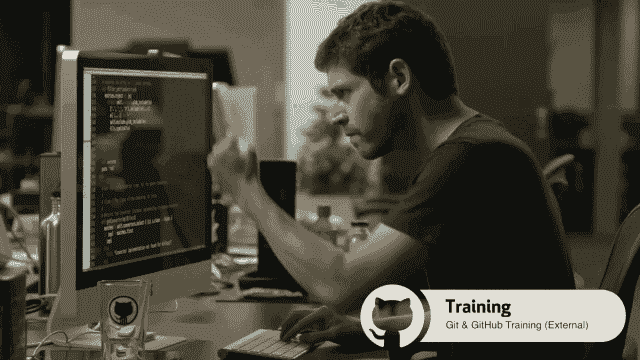

# 学习编码和获得报酬的终极指南

> 原文：<https://betterprogramming.pub/how-to-find-your-first-software-engineering-job-in-2019-the-ultimate-guide-to-learning-code-and-b12289658edd>

## 2019 年如何找到自己的第一份软件工程工作

制造者在 [Unsplash](https://unsplash.com/?utm_source=unsplash&utm_medium=referral&utm_content=creditCopyText) 上 [NESA 的照片](https://unsplash.com/photos/kwzWjTnDPLk?utm_source=unsplash&utm_medium=referral&utm_content=creditCopyText)

# 介绍

几年前，我在一家初创公司担任销售工程总监。一天，我走进办公室，一个存有我们产品演示的 u 盘放在了我的手里。从那一刻起，我就拥有了演示和代码。我的第一个任务是为即将到来的销售电话进行调整。

我的手心开始出汗。我的心开始狂跳。*我不知道如何做这个*，我想。

恐慌。

我深吸了几口气，坐下来谷歌。我知道一点 HTML 和 CSS，但不多。我不知道这个项目是用 JavaScript 或 jQuery 构建的。我不知道从哪里开始。我可以*谈论*技术，当然，我了解编码的*，并且在我的整个职业生涯中一直围绕着开发人员工作。*

然而，我没有做这项工作的实际技能。我是项目经理。我是个销售员。我不是开发商。

那天，我坐下来开始学习 JavaScript，它彻底改变了我的生活。这是我希望那天拥有的指南。

# 关于我

自 2005 年以来，我一直在技术部门工作。我的起点是作为一名制作人进入视频游戏世界，在那里我很快学会了敏捷流程。我大部分空闲时间都和游戏开发者在一起。

一晃 5 年过去了，我工作的游戏公司被收购了，我获得了工商管理硕士学位，并创办了自己的移动应用咨询公司。我曾参与招聘和管理我们游戏世界中的远程团队，并将同样的原则应用于我自己的公司。

在接下来的 8 年里，我管理团队，雇佣工程师。我对编码有所涉猎，2013 年开始更认真对待。在朋友的帮助下，我学会了几种语言，并开始编写代码。

大约一年前，我无意中找到了一份教初级软件工程师的全职工作。我在奥斯汀的[激励](https://www.galvanize.com/web-development)为一个精彩的沉浸式项目工作。然而，并不是每个人都能负担得起沉浸式项目所需的资金或时间(我们的工作时间是早上 9 点到晚上 8 点，一周 6 天！)

我希望你们所有人都有一个全程向导。即使你计划参加一个面对面的项目，或者有一个导师，你也可以把它作为一个路标，确保你正在学习所有必要的技能。

每个人都可以学习编码。是的，**大家**。

如果有任何问题，请告诉我！如果你发现了其他惊人的资源，请与我分享。这是一份活的文档，我随时欢迎反馈。

# 如何使用本指南

我的建议是，你先浏览一遍，然后评估你在旅程中的位置。如果你刚刚开始，那太好了——从最高层开始。如果你已经在这条路上，找到与你目前所处位置最相关的部分。解决这些问题，并寻求他人的反馈。

我在这个项目中的目标是做一个参考指南。也许你需要 3 个月才能完成，也许 3 年。那就*好了*。软件不会去任何地方。

我自己或我的学生已经测试了每一个环节。以下是我发现的对教授特定主题最有帮助的资源。我很高兴成为课程的会员，但仅限于我参加过并相信的课程。下面有几个附属链接。

存在信息过载的风险，这会导致瘫痪。我希望你集中注意力——不要花时间阅读或看视频，而不是*做*。当你陷入困境或深陷挣扎时，我想提供能让你重回正轨的资源！

## 目录

*   [简介](https://medium.com/p/b12289658edd#51b4)
*   [关于我](https://medium.com/p/b12289658edd#eb7b)
*   [如何使用本指南](https://medium.com/p/b12289658edd#423e)
*   [本帖 4 个板块概述](https://medium.com/p/b12289658edd#eed9)
*   [目录](https://medium.com/p/b12289658edd#31bf)
*   软件工程师是做什么的？
*   [培养成长心态学习软件工程](https://medium.com/p/b12289658edd#4953)
*   [成长心态概述](https://medium.com/p/b12289658edd#fa3c)
*   [斗争模式](https://medium.com/p/b12289658edd#1f51)
*   [如何实践软件工程](https://medium.com/p/b12289658edd#756d)
*   [找到导师和社区](https://medium.com/p/b12289658edd#8490)
*   [常见陷阱(以及如何避免)](https://medium.com/p/b12289658edd#e3a0)
*   [心态资源](https://medium.com/p/b12289658edd#836b)
*   [学习编码](https://medium.com/p/b12289658edd#4a34)
*   [先学什么编程语言？](https://medium.com/p/b12289658edd#79cb)
*   [8 个学习领域概述](https://medium.com/p/b12289658edd#7312)
*   [什么是互联网？](https://medium.com/p/b12289658edd#9450)
*   [如何学习 HTML 和 CSS](https://medium.com/p/b12289658edd#3980)
*   [学习 HTML & CSS](https://medium.com/p/b12289658edd#cb9e) 的资源
*   [如何学习 JavaScript](https://medium.com/p/b12289658edd#ea52)
*   [基础 JavaScript 学习资源](https://medium.com/p/b12289658edd#f41a)
*   [高级 JS](https://medium.com/p/b12289658edd#d12a)
*   [学习高级 JavaScript 主题的资源](https://medium.com/p/b12289658edd#91ba)
*   [如何学习前端 Web 开发](https://medium.com/p/b12289658edd#07a6)
*   [什么是前端框架？](https://medium.com/p/b12289658edd#92b6)
*   [学习资源反应](https://medium.com/p/b12289658edd#85d1)
*   [如何学习节点和表达](https://medium.com/p/b12289658edd#9d59)
*   [学习节点和表达式的资源](https://medium.com/p/b12289658edd#9f25)
*   [如何学习数据库:MySql、Postgres、Mongo 和 Redis](https://medium.com/p/b12289658edd#5a7b)
*   [学习数据库资源](https://medium.com/p/b12289658edd#cec8)
*   [如何学习 Dev Ops(或者至少足够危险)](https://medium.com/p/b12289658edd#b2c8)
*   [开发运营精简版学习资源](https://medium.com/p/b12289658edd#808a)
*   [开发者工具(或杂项部分)](https://medium.com/p/b12289658edd#4da4)
*   [学习命令行](https://medium.com/p/b12289658edd#803f)
*   [学习 Git](https://medium.com/p/b12289658edd#5edf)
*   [学会使用 SSH](https://medium.com/p/b12289658edd#13de)
*   [学习测试你的代码](https://medium.com/p/b12289658edd#cddc)
*   [如何准备技术面试](https://medium.com/p/b12289658edd#dee3)
*   [总体时间表和求职时的期望](https://medium.com/p/b12289658edd#af85)
*   [常见陷阱及如何避免](https://medium.com/p/b12289658edd#2ee5)
*   [什么是冒名顶替综合征？](https://medium.com/p/b12289658edd#2817)
*   [什么是足够好综合症？](https://medium.com/p/b12289658edd#d52c)
*   [寻找第一份工作的时间表示例](https://medium.com/p/b12289658edd#ec42)
*   [如何学习算法和数据结构](https://medium.com/p/b12289658edd#0cde)
*   [如何写一份技术简历](https://medium.com/p/b12289658edd#f1f8)
*   [技术简历 Dos](https://medium.com/p/b12289658edd#dd0b)
*   [技术简历不要](https://medium.com/p/b12289658edd#7461)
*   [如何撰写技术简历或求职信](https://medium.com/p/b12289658edd#ef5d)
*   [如何使用 LinkedIn 找到你的第一份软件工程工作](https://medium.com/p/b12289658edd#c883)
*   [如何通过 LinkedIn 认识人](https://medium.com/p/b12289658edd#f62b)
*   [求职网站](https://medium.com/p/b12289658edd#7daf)
*   [现场技术面试的准备方法](https://medium.com/p/b12289658edd#f334)
*   [如何制定解决问题的策略](https://medium.com/p/b12289658edd#7b7a)
*   [如何写伪代码](https://medium.com/p/b12289658edd#801e)
*   [白板](https://medium.com/p/b12289658edd#fe27)
*   技术面试那天你会期待什么
*   [结论](https://medium.com/p/b12289658edd#e7d5)
*   [你可以这样做](https://medium.com/p/b12289658edd#946f)
*   [懈怠组邀请](https://medium.com/p/b12289658edd#f039)
*   [最后一个字](https://medium.com/p/b12289658edd#c89e)

# 这篇文章的 4 个部分概述

**第一节:**软件工程师是做什么的？什么是软件工程师？一个软件工程师挣多少钱？这些是我每天听到的常见问题。

如果你对是否从事这一职业犹豫不决，这一部分将回答一些高层次的问题。

努力工作的软件工程师

**第二部分:**心态和如何练习——这一部分的目标是给你一种不同的方式来看待你的学习过程。我认为新开发人员最常见的障碍是他们学习的方式。

这通常与消极的自我对话、学校养成的习惯以及缺乏对人类如何学习新技能的认识有关。

我将介绍一些资源和技巧，帮助人们学得更快，并且乐在其中！在学习和找工作的过程中，总会有低谷和艰难的日子——我们会帮你度过它们。

**第三节:**学习编码——你必须学习制作网站和应用，句号。学习的唯一方法就是去做。

我鼓励你从 JavaScript 开始，因为大多数角色要求你至少知道基本的 JS。它也是唯一可以用来编写整个应用程序的语言。Python 是一个不错的选择，取决于你想走的职业轨迹。

**第四部分:**求职过程——我会一一介绍。从制作简历，到你需要的开发人员技能，技术面试和白板。

成为一名入门级软件工程师最困难的事情之一是找到工作的实际过程。从代码的角度来看，你可能需要 3-6 个月才能感觉到*准备好了*。保持这一势头至关重要。

我正在创建一个社区来帮助解决这个问题。点击查看[。](https://nickfredman.com/join-slack-community/)

# 软件工程师是做什么的？

软件工程师的日常工作往往不是人们想象的那样。一个孤独的开发人员坐在昏暗的房间里，数小时编码，周围是红牛罐头和香烟的日子已经一去不复返了。现在大多数人在团队中工作。

你应该期待你的第一份工作是在一个团队中(接合同工作来练习是很棒的，但我鼓励每个人都为他们的第一份工作找一个团队)。原因很简单:你从同龄人和导师那里学到了更多。你的第一份工作是这个旅程的第一步。

你的时间将有不同活动的组合。会有会议——这是企业界的现实。在这些会议上，你可能会讨论你正在做什么，计划未来的工作，解释过去的工作，向用户展示或测试产品。

此外，你将花时间编码。你需要捍卫这一次——它是神圣的。把时间挡在外面，弄点好的降噪耳机，养成一个很强的习惯。

你将被要求解决问题。有时候这些会是代码中的 bug。有时它们会是一个新的特性或者一个全新的工具。通常，你需要学习一些全新的东西来解决这个问题。

我见过的人们最大的困扰之一就是永远不知道一切的感觉。在许多职业中，在某一点之后，你知道了大部分需要学习的东西。

作家不会在职业生涯的后期花几个小时去谷歌如何写作。木匠不会花几个小时在工作网站上看 YouTube 视频。像这样的职业还有很多，但我从未见过如此轻松地让最伟大的人谦逊的职业。

很多时候，聪明与否无关紧要。你需要不断学习新技术。拥有一个*可重复的*流程可以确保你在一段时间内感到舒适。事实上，你应该期望定期学习新的东西——即使你一直使用完全相同的技术。这需要一个完全的精神转变，我将在下一节讲述。

人们容易产生的其他问题是:

## 一个软件工程师挣多少钱？软件开发人员的工资是多少？

这些问题很难回答，但我会给出一些大致的指导方针。最重要的一点是，这取决于你所关注的市场。这里有一个粗略的想法，你可以期待什么样的起薪，或者开始时薪，如果你这样做的话。

1.  **主要市场(旧金山、纽约、洛杉矶)**:作为一名大三学生，你的年薪大约是 10 万美元，具体取决于公司。这可能低至 9 万美元，也可能高达 12 万美元。在这些市场上，每小时你会看到 50-75 美元。随着你的晋升，作为中层，你的工资大约是 1.5 倍，而作为高级工程师/团队领导/架构师，你的工资可能是起始工资的 2 倍。顶级科技公司支付更多，包括期权和奖金。
2.  **中端市场(美国前 20 大城市，奥斯汀、波特兰、丹佛、芝加哥、达拉斯等。)**:作为一名大三学生，你的年薪是 7-8 万美元，时薪是 30-60 美元。除非你在找实习或者在你梦想的公司找到工作，否则我不会接受低于 65000 美元的第一份工作。你的技能太有价值了。
3.  其他市场:如果你住在小城市，或者想在偏远的地方工作，那就完全取决于公司了。在一个小城镇，我不会接受低于 5 万美元的年薪(你总能找到至少这么多的远程工作)。每小时，我不会少于 30 美元，但仍然希望每小时 40-50 美元。按小时计算有固定成本，比如健康保险，所以我不会接受太低的报价。

最后，在欧洲或者像泰国这样更偏远的地方工作怎么样？这完全取决于公司和市场。

我强烈建议你去找一家拥有强大技术领导力和乐于接受指导的高级开发人员的公司。这会让你的第一份工作成为一个不断成长的好机会。我还建议与朋友交谈，并在 GlassDoor 上查找类似公司倾向于支付的费用。

## 初级软件工程师 vs 高级软件工程师是什么意思？

这是一个非常随意的问题。简单地说，成为高级软件工程师意味着你犯了更多的错误。多一个数量级。你尝试了很多行不通的东西，更快更有能力解决更难的问题。

公司经常试图用年来衡量这一指标，但这很难。我见过有两年经验的开发者比有七八年经验的强很多。这取决于个人走出舒适区的频率，是否愿意接受反馈并加以应用。

如果你能做公司需要的工作，并且有三分之二的技能和经验，那么就去争取一个高级职位。这总是值得一试——如果你没有通过面试，也没关系。这是很好的练习！

## 我如何找到软件工程实习或入门级的工作？

我很高兴你问了！没有一个正确的方法。错误的方式是投出大量简历，不使用 LinkedIn 或跟进个别公司。

找工作的最好方式，即使是工程师，也是亲自与人交谈。每个行业都是如此。如果你不能亲自去做，打电话是一个很好的第二选择。你可以这样跳过面试过程的第一步。

# 培养一种成长的心态来学习软件工程

# 成长心态概述

让我们开始吃这块肉(或者土豆，给外面的素食者！)问题是，为什么*应该*发展成长型思维？这和成为一名软件工程师有什么关系？

我很高兴你问了！它与 T4 有着千丝万缕的联系。我不知道我是否曾经在某一天花了 2 个多小时编程，而不需要谷歌一些东西。我必须不断地这样做。经常卡壳，或者忘了什么东西，或者某个地方打错了，因为前一天晚上睡眠不足而错过了。

我选择不为自己的无知而沮丧。那是因为我培养了一种*成长心态*。

成长心态是相信你不是一个固定的人。你的技能、能力和热情会随着时间而发展。很多人，我的意思是我们很多人在谈到技术或数学时都有一个固定的信念。人们经常说，“我只是不擅长数学，从来都不是。”

这是胡扯。这实际上意味着你不喜欢在你不懂的数学问题上纠结。或者使用技术让你觉得自己很蠢。尤其是你不容易理解的时候。你猜怎么着？我们大多数人都不知道。这是后天习得的行为，不是天生的。

小时候，我喜欢摆弄录像机来编程。篮球训练时录制的一集《辛普森一家》让我觉得值得。我也没能把事情记录下来。我回家后会找到一盘空白的磁带，或者一盘仍在录制并覆盖了整个节目的磁带。哎呦！

我觉得这令人沮丧吗？当然了。但是我放弃了吗？我是不是一怒之下弄坏了录像机，把它扔出窗外，扔进了我们白雪皑皑的后院？没有。也许我想去一次或两次，但总的来说，我不在乎。我从未因此而生自己的气，我对机器设计者的选择感到不安。

我在尝试编程的时候很开心。我喜欢看它是否能在夜间工作，或者夏令时会发生什么。说到遥控器，我培养了一种游戏意识。随着年龄的增长，这让我对电脑做了一些类似的事情。

如果我爸爸因为我没有录制节目而对我大喊大叫，会发生什么？或者他是不是把我禁足了？还是惩罚了我？我不会喜欢这个过程，相反，我会太在乎把事情做好，不再从浪费时间中寻找乐趣。

在生活的许多不同领域，我们很多人都会遇到这种情况。我们在某个领域产生了恐惧，不再愿意去玩和失败。说到编码，抛弃这种态度是*必须*的。

你必须*享受*失败和犯错。为什么？因为你有一个不同于那些制造你的计算机、编写你正在使用的语言和库的人的思维模式。你知道是谁设计了整个互联网吗？他们的动机是什么？在那个时间点的约束？我当然不知道。

这意味着你是错的还是坏的？不要！因此，他们有一个与你不同的工作模式。基于你在这个世界上的经验，有一个合乎逻辑的理由让你相信你的代码会工作。只是碰巧和最初创造技术的人不一样而已。

这没问题。我们都有这个。你的目标是试图理解*为什么*他们会做出这样的决定。它会建立同理心，而不是自我厌恶。它会鼓励你尽情地玩代码。你会发现这样你可以学得更快。

这是培养成长思维背后的核心理念。正确答案从来都不重要。你用来学习和适应错误认知的过程才是重点。总而言之，*努力胜过天赋！*

# 斗争模式

我们教给学生的核心模型之一被称为**最佳斗争领域**。你在某一领域有一定的知识。想象这是一个圆。要增长见识，你需要把这个圈子增长 10%到 25%。

当你在这个更大的圈子里有所作为时，你将能够弥合你当前的理解和你期望的结果之间的差距。这是一场有趣的斗争！目标是尽可能多的花时间在这个奋斗地带。我们称之为未来的绿色区域。

另一方面，假设你试图做一些大大超出你现有知识或舒适区的东西。如果我给你 3 天时间写一个比谷歌搜索更好的算法。呀！你会恐慌的。手心出汗和焦虑随之而来。

这是红色区域。你不知道从哪里开始。在最初的几次尝试中，你可能会发现完全没有出路，也不知道下一步该怎么做。红色区域是我们在学习时想要避免的。

在没有帮助的情况下呆在红色区域会导致精疲力竭。这是人们努力学习软件工程的很大一部分原因。有很多主题，很难找到路线图——当你完全陷入困境时会发生什么？

我希望你尽可能多的呆在绿区。要记住的重要事情是*应该*是一场斗争。

这意味着不仅要解决你有能力解决的问题。这意味着每个项目你都应该学习一到两个新东西。这意味着你应该在每个项目上花时间搜索和寻求帮助。这不仅仅是好，这很好！

稍后我会再次提醒你，但是要寻找绿色区域。当你处于红色区域时，要学会保持警惕。这并不意味着当遇到挑战时就放弃——相反，根据你目前的技能水平确定合适的挑战。

# 如何实践软件工程

这是我建议你如何真正学习的部分。常见的途径是要么读一整本书，要么看一整本教程，然后自己去尝试。几乎同样常见的途径是跟着书或教程走——在没有完全理解的情况下编写你被告知要编写的代码。

这两者都是对你时间的浪费。你只有这么多时间了！明智地使用它们。不使用这两种策略中的任何一种，这里有一种新的方法可以尝试:

尝试建造一些东西或完成一项任务，至少 15-30 分钟。如果你运气好的话会更多。请随意查看技术文档，或者使用您在 Google 上找到的参考资料或备忘单。两个都好。目标是让你开始你想学的任务，直到你卡住为止。

一旦你陷入困境(已经花了 20-30 分钟没有进展)，是时候寻求帮助了。找到书中解释你所坚持的内容的部分或教程的一部分。

当你对技术的心理模型与创造技术的人不同时，你通常会陷入困境。这是可以的，你阅读或观看的目的是让*成为一个新的心智模式*。

记住——你的目标不仅仅是键入别人希望你键入的东西。这是为了理解*为什么*他们要你打那些东西。当你明白为什么的时候，你就会解脱了！

有时候你在书上或视频里找不到答案。这是可以的。不要惊慌。发生这种情况有两个原因，并且都有解决方案:

1.  资源过时了，技术也变了。这种情况经常发生。检查日期和版本，看它们是否相似，如果不相似，寻找更新的资源。
2.  你试图学习的技术是建立在你还不了解的多个概念之上的。

想象一下，我让你用面条、虾、蟹、蔬菜和白酒酱做一道复杂的意大利面。你不知道怎么自己做这些东西。将每一部分整合在一起会很困难，而且你很可能会失败。即使你成功了，你也不会明白你为什么要做某些动作。我建议你先学习如何做虾，或者适当地炒蔬菜，然后再做整道菜。

软件开发也是如此。如果你正在处理的事情离你现在的位置太远，有两个选择:回到更容易的事情，或者从更远的导师或朋友那里获得真正的帮助。这样就可以了！我仍然一直寻求帮助，我也鼓励你这样做。你去寻求帮助的人甚至可能有一个更好的项目给你。

# 找到一个导师和社区

我在这一部分的最后一条建议是双重的。

首先，找一个你遇到困难时可以去找的人。通常这是你熟悉的已经在这个行业工作的人，比如朋友或亲戚。他们不一定是你每天寻求帮助的资源，而是当你情绪低落或需要指导下一步该做什么时可以倾诉的人。

我创建这个指南的主要目的是提供一个资源，帮助学生了解所有要做的事情(以及按什么顺序做)。

第二，你至少应该找一个人一起学习。这一点非常重要，原因有很多。独自一人整天写代码，或者找工作时没有人可以交谈是很困难的。人类是群居动物。

此外，向同伴学习和教导也是有益的。检查你是否理解某事的最好方法是把它教给另一个人——这很难。

它还会让你练习技术交流，这是求职的关键技能之一。简而言之，这是你用正确的语言谈论代码和技术的能力。这是其他人如何决定你的能力的一个重要因素。

你应该一有机会就练习这项技能。每当你试图解释一个技术概念，并使用像“它”、“事物”或“东西”这样的词，这是一个警告标志。花一分钟学习正确的术语。当你与更有经验的开发人员交谈时，你会显得更有能力。

与他人一起编写代码也是一种享受！我最喜欢的时光还是和朋友一起做项目。

# 常见陷阱(以及如何避免)

*   独自编码太多。出于我上面给出的原因，找到其他人一起编码是很重要的。我建议使用 meetup.org，询问朋友或家人，或者寻找一个在线社区。面对面是最好的选择，但不管怎样，找到其他人一起学习是很重要的。
*   休息一下！这一点经常被忽视，尤其是新手。睡眠和散步是你的大脑真正学习的时候。您的流程应该是这样的。奋斗>散步休息放松>奋斗>散步>奋斗>睡觉。这让你的大脑有时间在各种模式之间切换，也有时间愈合。
*   你的大脑有两种模式:聚焦和扩散。阅读或编码时，您处于聚焦模式。淋浴或散步时，你处于弥散模式——每当你有做白日梦的感觉时。你需要在两种模式之间切换来解决问题。睡眠是你从短期记忆中获取信息并将其添加到长期记忆中。这也给你的大脑一个愈合的机会。
*   下面我会给你一些资源，让你更多地了解心态和学习方法。这些有可能帮助你成倍增长——我怎么推荐都不为过。
*   每个人都有冒名顶替综合症。这是你怀疑自己的时刻，你会想我做不到，为什么我会在这里？在某个时候，你可能会质疑自己的能力。甚至在做了一个 app 之后，你可能回过头来看，觉得自己只是运气好而已。这是可以的。承认它，然后继续前进。
*   不要让这种感觉改变你的行动——目标是意识到你有这种感觉。告诉朋友或爱人。一定要休息一下，奖励你对这个思考过程的认识。*你不是骗子*。每个人都可以学会这样做——只是需要时间和承诺。

# 资源

在每个部分之后，我会列出我提到过的或者我认为相关的资源。

我不想让你不知所措——尽你所能地解决它们，它们在很大程度上是相互依赖的。如果你觉得你已经掌握了某一部分的概念，那就进入下一个资源。不过，对自己要诚实。*所有这些高层次的概念对你的求职都很重要。但是你不需要通过每一个资源来学习它们——这是关于积极的实践。*

*   卡罗尔·德韦克的书，[心态](https://amzn.to/2Q80B28)。
*   [学习如何学习 Coursera 上的](https://www.coursera.org/learn/learning-how-to-learn)课程。如果你想深入了解，还有一本[配套书](https://amzn.to/2YqQ7Oy)。
*   [马克·曼森的书](https://amzn.to/2Q87XD0)。我认为这在实际找工作时会有所帮助，当你面对很多拒绝的时候。

# 学习编码

这部分是一个野兽——毕竟，你将被测试你的编码能力。你对工作的信心很大程度上来自于你的实际技能。尽管如此，编码并不是你唯一需要学习的东西。

太多成为软件开发人员的指南只关注这一部分。令人欣慰的是，有很多学习编码的惊人资源。我的目标是给你一个学习的顺序，并给你指出最佳资源的方向。

我想重申一下我之前提到的一些事情。你的手指和大脑必须完成这项工作。阅读书籍或博客、观看视频或做代码不会教你该做什么。他们可以填补知识上的小空白，但是你需要能够自己动手制作东西。

谷歌将永远是一个奇妙的资源。我强烈鼓励每个人练习谷歌符。你需要一个你想要建立的心智模型，你可以向朋友或面试官解释。网络资源可以帮助你理解这些概念以及解释它们的最佳方式。

另一个很好的练习方法是向你的父母或祖父母解释你正在学习的东西。如果你不能描述技术让他们理解，你还没有拥有知识。

我的建议是，每当你被困超过 15 分钟时，就休息一下。散散步，读读书，和你的狗玩玩——随便什么。学习是马拉松，不是短跑。午睡也很棒！

首先尽最大努力自己学习(你不想过度依赖他人的帮助)，但是如果你尝试了几次还是不能解决问题，那就该在网上寻求帮助了。如果你不能理解某件事，不要觉得不好或愚蠢或哑。

记住，你的心智模型与创造这项技术的人的心智模型是不同的。大不了。这些都不能反映出你是一个怎样的人。

在你开始这段旅程之前，我希望你购买或下载以下内容(今天或明天):

1.  [白板和记号笔](https://amzn.to/2YECKdR)
2.  便利贴和[抽认卡](https://amzn.to/2LMx4gb)(或者练习术语的抽认卡应用——我喜欢 Anki)
3.  为你的手机准备一个小三脚架，这样你就可以录制视频了
4.  一个关于 [zoom](https://zoom.us/) 的账户(或者练习使用 quicktime 录制视频，如果在 Mac 上的话)。不要在这上面花钱
5.  [VS 代码](https://code.visualstudio.com/)和括号对着色插件
6.  [邮递员](https://www.getpostman.com/)

这些工具会帮助你练习。经常用白板写出概念！下面有一整节是关于白板的。使用笔记和抽认卡来记录重要信息。用你的摄像机练习演讲技巧，为面试做准备。这是你接下来几个月的工具箱。

# 应该先学哪种编程语言？

我经常听到这个问题。简单回答就是:*没关系*。更长的答案是:*这取决于你的目标*。对于作为软件工程师的第一份工作，我的建议是 JavaScript，其次是 Python。

为什么是 JavaScript？每个浏览器都用。有数百万个 youtube 视频、堆栈溢出线程和博客帖子，涵盖了各个方面。还有一个庞大的教 it 的群体。你可以在栈中的任何地方使用它。就这么简单。

Python 呢？这取决于你的职业目标。如果你希望你的第一份工作是做数据库工作或任何类型的数据分析，那么 Python 是非常棒的。许多新程序员也在学习和管理 Python 2 和 Python 3 之间徘徊。这不会永远是一个问题，但它导致了今天更陡峭的学习曲线。

我建议你从 JavaScript 开始，在你对 JS-land 有了足够的了解后，再转向 Python，但这取决于你自己！

本指南涵盖了 JavaScript。

# 8 个需要学习的领域概述

1.  **HTML/CSS** :任何网站的面包和黄油。我们不会在这里疯狂深入，但在继续之前，你需要对一个网站如何工作有一个相当好的理解。
2.  JavaScript 基础知识:“如何编程”的主要部分。学会建造东西，感觉自己几天就有超能力了！
3.  **高级 JS** :学习 JavaScript 的棘手部分。这些是面试官喜欢问的问题。我将向您展示我推荐的掌握每个常见面试话题的资源。
4.  **React (Frontend)** :我打算推荐你学习 React 作为你的第一个前端框架。这将增强用户对应用程序的了解。
5.  **Node/Express (Servers)** :这是处理云中数据的代码。既然我们在 JS-land，我们就用 Node 和 Express。我将解释它们的区别，并向你展示一些掌握它们的好课程。
6.  **MySql，Postgres，Mongo，和 Redis (DBS)** :这是我们的数据存储部分。所有的网络都是关于数据的，我建议你使用一些不同类型的数据库。练习这些将有助于你在面试中自信地说话。
7.  **特拉维斯、Docker、Heroku、AWS (DevOps Lite)** :足够的部署是危险的。理解如何部署和更新代码对于你的第一份工作来说一般就足够了，除非你想从事 DevOps 职业。
8.  **Git、CLI、测试** **(开发人员工具)**:这些工具不适合任何其他工具，但却是你每天都会用到的工具。我们将回顾一下我是如何建议你在第一天上班感到不知所措之前学习这些*的。*

# 什么是互联网？

人们纠结的一个主要问题是他们对网络构建方式的心理模型。我在教学时倾向于关注的一块是*数据*。一切都是数据。

这是什么意思？

这意味着你要在互联网上创建一个网页。它可能有收集用户数据的表单。它可以从一个用户向另一个用户显示数据。

当用户提交表单时，它会将数据发送到服务器。服务器将把数据发送到数据库，数据库存储这些数据以备后用。差不多就是这样。

大多数网络都是这样工作的——既不可怕也不复杂。当您访问一个页面时，它向服务器发出请求，服务器向数据库发出请求。然后，它将数据发送回谷歌浏览器或 Safari 浏览器。这些应用程序显示数据并让您与之交互。

当然，这也有细微差别。不过，整个过程很简单。没有必要害怕或不知所措！

要了解更多，我建议您首先观看可汗学院的[课程。它在 5 分钟的视频中很好地概述了互联网是如何工作的。](https://www.khanacademy.org/partner-content/code-org/internet-works)

接下来，我建议你通读一下 MDN 的文章。MDN 来自 Mozilla(做火狐的人)。这是整个网络上 HTML、CSS 和 JavaScript 的最佳资源。

如果我不记得 CSS 属性是做什么的，或者不记得如何使用特定的 JavaScript 方法，我会参考 MDN。我推荐*反对*使用 w3schools。他们有很好的搜索引擎优化，将显示在顶部，但参考 MDN 代替。与其他同类网站相比，MDN 在更新文章和获取用户反馈上花费了更多的时间，而且他们有很棒的文档。

在你对互联网本身的工作原理有了一个大致的概念之后，是时候开始学习 HTML 和 CSS 了。

# 如何学习 HTML 和 CSS

这是每个网站的基础。我将花一点时间给你们一个高层次的概述，然后送你们去学习。

请记住，对于本部分和本模块的其余部分，*您必须完成工作*。没有捷径可走。你的大脑只会通过你制造东西，打破它们，然后再把它们组装起来来学习。挖掘孩子般的玩耍意识！

HTML 就像一本非小说类的书。页面上有文字，有时还有图像。章节有封面和标题。通常，会有到本书其他部分的链接或对其他书籍的参考。

web 上的 HTML 大致有三个目的:

1.  向网站用户显示数据。这些数据可以是任何东西，视频、图像、文本。您的浏览器下载数据并显示在页面上。
2.  从你的用户那里收集数据。它通过使用表单、字段和输入来实现这一点，这些输入包括用户名、密码或博客文章的评论。有时您希望向其他用户显示这些数据，有时您希望保存这些数据以备后用。
3.  通过链接(超链接)将您的网站连接到其他网站。如果你的网站有很多页面，你可以用链接把它们连接起来。大多数现代应用程序都是一个页面，并模仿这种行为。您还可以链接到 web 上的其他网站或其他网站上的特定页面。

如果我们回到我们的书籍类比，CSS 是书籍及其文本的外观和感觉。它回答了诸如“封面看起来像什么？”"文本是什么颜色和大小？"“图像有多大？”它还回答了其他一些关于网络的问题。

CSS 有三个主要组成部分，页面的样式，页面的布局，以及页面上的任何动作。将 CSS 分成这些不同的部分并花时间练习每一个是值得的。对于初学者来说，CSS 可能相当令人沮丧。在学习如何选择单个元素以及如何布局整个页面时，要有耐心。

建议你一点一点的坚持练习。每当你做一个新的应用程序，花一些时间尝试 CSS 的不同部分来学习它。每当你偶然发现一个你认为很酷的网站，试着重新创建它。你可以随时下载网站的 CSS，并在遇到困难时作为参考。

## 学习 HTML 和 CSS 的资源

*   首先，我建议学习一点谷歌浏览器中的开发者工具。你花越多的时间练习这些，你就越容易掌握更高级的 JavaScript。[谷歌有一个很棒的网站](https://developers.google.com/web/tools/chrome-devtools/beginners/html)让你开始。如果你更喜欢视觉学习， [Traversy Media](https://www.youtube.com/watch?v=x4q86IjJFag) 在 YouTube 上有精彩的视频。在整个课程中，我会大量引用他和网络忍者的视频，因为他们制作了一些高质量的免费内容。
*   来自 Google 的[开发工具的完整参考。](https://developers.google.com/web/tools/chrome-devtools/)
*   接下来，花点时间学习用 HTML 构建简单的东西。任何你觉得有趣的事情——试着做出来并在你的浏览器中浏览。
*   Mozilla 有一个很棒的学习 HTML 的书面资源。
*   [Udacity](https://share.udacity.com/x/DnxOvj) 有一个关于[学习 HTML 和 CSS](https://www.udacity.com/course/intro-to-html-and-css--ud001) 的很棒的视频系列。
*   我*高度*推荐修完[谢伊·豪的课程](https://learn.shayhowe.com/)。它的结构与本课程不同，重点是使用 HTML 和 CSS 制作东西。通常人们在钻研 JavaScript 之前没有投入足够的时间来学习 HTML 和 CSS 我认为这是一个错误。这两者是现代网络的基础。
*   此时，自测一下。如果你能想到一个想法，并能做出一个粗略的近似值，你就准备好继续前进了。如果你还需要更多的练习，没关系——再花一两天时间创建网站！
*   如果你想要更多的语法练习，请查看代码库[。我只推荐这个网站作为最后的资源，因为它制造了一种虚假的学习感。你通常输入一个东西，却不知道它是如何工作的。这就是我要你避开的陷阱！](https://www.codecademy.com/learn/learn-html)
*   说到深入研究 CSS，我是 Wes Bos ' free[CSS Grid](https://CSSGrid.io/friend/FREDMAN)课程的超级粉丝，也是 Flexbox 和 Grid 的 CSS 技巧站点。
*   玩玩 [Flexbox Froggy](https://flexboxfroggy.com/) 和 [Grid Garden](https://cssgridgarden.com/) 。为了练习这两种布局工具，我会在以后的项目中使用它们。

# 如何学习 JavaScript

*造东西*

就是这样。好吧，也许没那么容易，但这是我的建议。越早在项目中应用你所学的东西，你就能越快掌握它。

观看视频或阅读一些内容，然后自行测试。JavaScript 最强大的一点是，你可以用浏览器来测试你的任何想法。控制台给你一个 [REPL](https://stackoverflow.com/questions/13603021/what-is-a-repl-in-javascript) (阅读评估打印循环)环境，和一些其他漂亮的铃铛和哨子。

你在这一阶段和下一阶段的任务是创造和打破东西。每隔一个小时左右问自己一次“最近我破了什么事来测试自己的理解力？”不要为了测试假设而破坏代码。

培养一种修修补补的意识。如果你想阅读并理解事物是如何工作的，这很好，但你的理解需要来自你自己的实验。这会让你有能力在工作面试中解释你的理解。

我们所做的一切都回到这个中心目标。问:“我如何尽快获得知识，以便能够向他人展示这些知识？”

让我们开始吃吧。

## 学习基础 JavaScript 的资源

*   [如果你喜欢视频内容，Udacity](https://www.udacity.com/course/intro-to-javascript--ud803) 有很棒的免费课程。我认为这门课程是一个很好的起点，但是你需要更多的实践来掌握基础知识。
*   [雄辩的 JavaScript](https://eloquentjavascript.net/) 是一本非常棒的免费书籍。它很全面，所以我建议现在只看前 6 章。但是，您可以将此作为本指南其他几节的参考。在高级 JavaScript 部分和学习 Node 时，请随意参考。
*   当你试图构建一个项目时，使用 MDN 作为你的资源，尤其是在语法方面(那个方法是如何工作的？)
*   目标是不断练习构建东西，直到你对给定的主题感到舒服为止。有两个很棒的实践网站: [Repl.it](https://repl.it/) 非常适合简单的 JS 实践，而 [CodeSandbox](https://codesandbox.io/) 非常适合构建小型应用程序并在浏览器中查看它们。如果你想弄乱纯 JS，使用 repl.it，如果你想看看你在 DOM 试用 CodeSandbox 中构建了什么！
*   玩具问题的几个好地方是[代码大战](https://www.codewars.com/)和[代码信号](https://codesignal.com/)。现在，我通常会坚持简单的挑战，以获得更多的重复。把比较难的留到以后，我们会在工作准备部分再来讨论它们。
*   作为最后的手段，我会说你可以使用[Codecademy](https://www.codecademy.com/learn/introduction-to-javascript)——但是同样，我认为不学习这个资源太容易打字了！

当您觉得能够展示以下三点时，您就可以进入高级部分了:

1.  您可以轻松地操作对象和数组中的数据。
2.  您可以创建函数并将其传递给其他函数。
3.  你很乐意向不知道如何编码的人解释你的代码在做什么。

# 高级 JS

这是最重要的部分之一，如果不是最重要的部分。很多人在深入学习前端和后端之前，最终只学习了 JavaScript 的基础知识。这是一个*巨大的*错误。为什么？因为到了找工作的时候，人家想知道你懂不懂高级功能。

您用来编写前端代码的工具和服务器的模块将随着项目的变化而变化。然而，JavaScript 的基础部分没有改变。这就是为什么有经验的面试官喜欢问 JavaScript 和互联网作为一个整体是如何工作的。有道理对吧？

我希望你们花时间学习的关键领域是:

*   *这个*关键字(和上下文)
*   JS 中的面向对象编程
*   JS 中的函数式编程
*   异步代码(回调、承诺、异步/等待)
*   事件循环
*   继承模式
*   结束和范围
*   Dom 操作
*   ES6

根据我的经验，面试中大多数难回答的 JavaScript 问题都是基于你对其中一个话题的理解。你如何着手研究它们？两种方式的结合。首先，你需要能够把它们编码出来。第二，你应该练习白板。如果你现在只写代码也没关系。把你觉得最有挑战性的事情列一个清单，这样你就可以在本指南的白板部分练习它们。

## 学习高级 JavaScript 主题的资源

我有一堆这个。很可能你需要看到一些不同的解释来完全理解它。通过创建小项目来练习，并根据你对某个主题的概念性理解来测试自己。使用`console.dir`深入挖掘你的功能。能够用代码解释这些主题！

*   韦斯博斯有几门很棒的课程。我推荐他免费的 Dom 操作 Javascript 30 T1 课程。花时间做这样的小项目是我最喜欢的学习方式。他的 [ES6 课程](https://ES6.io/friend/FREDMAN)也很棒。
*   我是 YouTube 上 Fun Fun 功能频道的超级粉丝。这里是学习高级主题的一些最好的免费内容(尽管都是理论性的，所以你仍然需要练习来掌握概念！)查看[什么是高阶函数](https://www.youtube.com/watch?v=BMUiFMZr7vk)播放列表。
*   泰勒·麦金尼斯的[博客](https://tylermcginnis.com/blog)和[课程](https://tylermcginnis.com/courses/advanced-javascript/)非常有用。我会学习他的高级 JS 课程和现代 JS 课程。他在个别话题上的博文也很棒。他在 YouTube 上有很多关于这些主题的视频。他的解释可能具有挑战性，但他使用清晰的语言。
*   Will Sentence 在 [Frontend Masters](https://frontendmasters.com/courses/javascript-hard-parts/) 上的课程是关于如何用白板演示困难概念的*最好的*。该课程是在现场课堂上进行白板演示。他现在有三门课了。我将完成第一个( **JS 的硬部分**)，然后在你深入研究 OOP 和异步代码的时候回到另外两个( **JS 新的硬部分**)。他还有几门其他课程即将推出！威尔开办了一所编码学校，里面有一些很棒的材料，我稍后会链接到那里。我是 FEM 的超级粉丝！
*   MDN 对[事件循环](https://developer.mozilla.org/en-US/docs/Web/JavaScript/EventLoop)有很大的读取。
*   这是菲利普·罗伯茨在 JS Conf 上关于[事件循环](https://www.youtube.com/watch?v=8aGhZQkoFbQ&vl=en)的经典演讲。
*   NetNinja 有一个关于[异步代码](https://www.youtube.com/watch?v=YxWMxJONp7E)的相当不错的系列。有一些更新的技术，但他以学生们认为有用的方式解释它们。
*   这是一本非常棒的 JavaScript 函数式编程指南:[弗里斯比教授的函数式编程指南](https://github.com/MostlyAdequate/mostly-adequate-guide)。
*   对于 ES6，我喜欢斯蒂芬·格里德的 [ES6 课程](https://www.udemy.com/javascript-es6-tutorial/)。他做了很多课程，很多人都喜欢他。然而，很容易陷入和他一起编码的陷阱，而不理解他在做什么。本课程在各部分之间有小测验来测试你的知识，这也是我推荐它的原因。上面列出的韦斯博斯的课程是免费的，也很棒。
*   最后，我将链接我最喜欢的关于回调、承诺和异步/等待的文章。我*高度*推荐你掌握处理异步代码的所有三种方式。
*   我知道有些面试官仍然会问复试和承诺之间的区别。这里有一个简短的[概述文章](https://medium.com/front-end-weekly/callbacks-promises-and-async-await-ad4756e01d90)，是一个很好的入门。这是 Tyler M 的一个很棒的[视频/博客帖子](https://tylermcginnis.com/async-javascript-from-callbacks-to-promises-to-async-await/)，它非常深入。最后，这是我最喜欢的帖子比较了所有 3 个——每一个的代码示例和解释都棒极了！

# 如何学习前端 Web 开发

我建议每个人都从学习 React 开始。为什么不是 jQuery？还是棱角分明？还是 Vue？一个原因是:现在 React 的工作比其他任何工作都多，而且差距很大。这使它成为一个实用的起点。还有一个很棒的大型 React 开发人员社区，React 文档绝对、令人惊讶、令人愉快地漂亮(你能看出我是一个粉丝吗？)

在阅读本指南的过程中，您会看到许多不同框架和库的文档。[反应文件](https://reactjs.org/docs/getting-started.html)是金标准。我建议在去其他地方之前先浏览一下他们的教程。

你阅读或探索的很多东西一开始可能没什么意义，这没关系。我这里有很多资源给你，找到最适合你风格的。

关于 React 钩子的一个警告。稍后学习它们是很好的，但是您仍然需要理解如何使用基于类的组件。你在工作中最终会用到的大部分代码都是基于类的！学习 Redux 也是一样——你应该现在就开始学习。如果这个建议发生变化，我将在以后更新这个指南。

## 什么是前端框架？

在我开始列出我推荐你学习 React 的方法之前，让我们来谈谈它解决了什么问题。到目前为止，您一直在本地文件或浏览器中为自己编写代码。这对于开始来说很好，但是在某些时候，你会希望全世界的人都可以访问你的代码。

更重要的是，不管他们的浏览器或操作系统如何，你都希望他们的体验是相同的(或者几乎相同)。您还希望他们能够实时获得网站的更新。还记得你曾经不得不点击浏览器上的刷新按钮来获取新消息吗？如果没有，你真幸运！

React 是管理为客户端代码编写单页应用程序(SPA)的解决方案之一。SPAs 的主要优势在于它们如何管理应用程序的状态。状态是应用程序在给定时间点的条件(数据、用户交互)。这篇[博文](https://thedaylightstudio.com/blog/2018/03/14/what-is-state-in-web-application-development)对状态做了很好的解释。

React 有一种很酷的方式在内部处理状态，并将其传递给应用程序中的不同组件。我推荐阅读 [React 的](https://reactjs.org/docs/thinking-in-react.html)关于它如何工作的定义和[栈溢出](https://stackoverflow.com/questions/27991366/what-is-the-difference-between-state-and-props-in-react)的这篇文章。

现在你已经对基础有了大致的了解，我鼓励你开始构建东西。本模块和接下来的 4 个模块的目标是相同的——尽可能多地构建小型实践项目来测试您的想法和理解。

如果你陷入困境，谷歌是你的朋友。每当你理解了一个话题——向朋友解释或者写一篇关于它的博客来练习你的技术交流。我不断提出这种练习方法的原因只有一个:你口头表达你对技术的理解的能力对于工作面试来说是至关重要的，而我只有通过练习才能得到！

## 学习资源反应

*   作为一个初学者，我最喜欢的学习 React 的课程来自 [WesBos](https://ReactForBeginners.com/friend/FREDMAN%09) 和 [Frontend Masters](https://frontendmasters.com/courses/complete-react-v4/) 。
*   有一些很棒的免费资源。我最喜欢的两个 YouTube 课程是来自 Traversy Media 和 T2 网络忍者的。Redux 对初学者来说很难，在掌握 Redux 之前，先努力掌握 React。Redux 之所以具有挑战性，是因为它结合了管理数据流的新语法和新概念。
*   对于以上所述，关注状态和道具——巩固你对如何传递功能和事件的理解。每当你遇到困难时，参考 React 文档或使用谷歌。有很多很棒的博客帖子和 [Stack Overflow](https://stackoverflow.com/questions/27991366/what-is-the-difference-between-state-and-props-in-react) 的答案来帮助解决常见问题。
*   当你觉得自己掌握了窍门时，我建议你深入学习泰勒·麦金尼斯的课程，学习反应和恢复。这些让你使用 JavaScript 从头开始构建这两项技术。它们帮助你发展内在的理解，这对于在工作面试中解释技术是至关重要的！
*   我还喜欢另外两家课程提供商。我已经提到过斯蒂芬·格里德，他有很多内容。我不反对他的教学风格，但是跟着他一起写代码可能很容易，而且实际上并没有学到材料，所以要小心。第二个我推荐的是斯科特·托林斯基。斯科特有一个很棒的 YouTube 频道，在过去的几年里，他把精力都放在了升级教程上。他有一些很棒的面向设计的内容，并且深入研究了高级 React 主题。
*   一旦你开始感到舒适，我建议你练习构建几个小应用程序。一个很好的起点是 [JSON 占位符 API](https://jsonplaceholder.typicode.com/)——它有带 RESTful 端点的 blog 和 todo 数据。每当测试新东西时，我都把它作为我的首选。这里是的[公共 API 的大列表。使用大列表中的数据制作有趣的项目，并与朋友分享！](https://public-apis.xyz/)
*   使用 [CodeSandbox](https://codesandbox.io/s/new) 创建练习项目，或者使用 [create-react-app](https://github.com/facebook/create-react-app) 在本地构建项目。练习，练习，练习！

一旦您对父子组件、作为道具传递状态和事件处理程序感到满意，您就准备好继续前进了！不要在这里浪费时间，如何在本地应用程序中移动数据的概念很重要。

# 如何学习节点和表达式

在本节结束时，你会觉得自己拥有超能力！对于初学者来说，编写服务器代码似乎是最困难、最奇怪的事情。我们倾向于认为服务器是某个神秘的计算机，位于地下深处的某个中心——这与事实相去甚远。

服务器只是一个监听外界请求的文件。外部世界甚至可以在你自己的电脑上。使 JavaScript 成为伟大的第一语言的一部分是 Node.js. Node 是使 JavaScript 在 Chrome 浏览器中运行的同一引擎。它允许您在任何文件系统上使用 JavaScript 代码。

要运行一个节点文件，在安装了 node 的系统上，输入`node FILE_NAME.js`，它就会执行这个文件。这就像在浏览器的<脚本>标签中运行文件一样，只不过你不需要浏览器！

这个为什么这么厉害？出于显而易见的原因，浏览器中的 JavaScript 并不是用来访问计算机文件系统的。想象一下，如果有任何网站可以访问你的文档或下载目录中的所有文件！

另一方面，Node 编写了访问系统内部文件的模块。这允许您的服务器访问存储在服务器上的 HTML 或 JavaScript 文件，以便将它们发送到客户端。相当强大。

学习 Node 的主要挑战之一是你将会处理大量的异步代码。这就是为什么我们在上面的高级 JS 部分花了这么多时间来讨论它。如果你对复试和承诺感到生疏，回去练习。

另一个大挑战是学习理解节点包管理器(NPM)。NPM 提供了世界各地其他开发者编写的大量软件包。这是福也是祸！它允许您轻松地扩展您的项目，但这意味着添加大量代码，而不了解它实际上是做什么的。当你开始使用一个新的包时，我鼓励你看看这些包的原始源代码。

随着时间的推移，你会看到同样的软件包被反复使用。你对它们是如何被书写的理解将会提高。这不会一夜之间发生，但值得曝光，所以早点开始。

一点提醒:我*高度*推荐您使用[节点版本管理器](https://github.com/creationix/nvm#installation-and-update) (NVM)来安装节点。这需要更多的工作来设置，但从长远来看会让你的生活更容易。

## 学习节点和 Express 的资源

*   我鼓励你至少花几天时间使用 Node *而不使用* Express。这有点令人沮丧，但是它将向您显示 Node 结束和 Express 开始的位置。我在工作面试中注意到，很多新开发人员不明白这条线在哪里。Traversy Media 的这个教程是一个很好的起点。
*   和往常一样，NetNinja 在 Node 和 Express 上有一个[奇幻系列](https://www.youtube.com/watch?v=w-7RQ46RgxU)。花点时间浏览一下 [Express 文档](https://expressjs.com/en/4x/api.html)中关于路由和中间件的一些教程。中间件可能是一个具有挑战性的概念，但它非常强大。简而言之，如果请求符合特定的模式，您可以使用中间件来拦截请求并进行转换。 [BodyParser](https://github.com/expressjs/body-parser) 是开始学习中间件的好地方。
*   本节中有几个主题你应该了解，但不需要掌握整个课程。第一个是从这篇关于 Codecademy 的文章中撰写 [RESTful routes](https://www.codecademy.com/articles/what-is-rest) 。第二个是[语义版本](https://semver.org/)如何工作以及 [NPM 如何使用语义版本](https://docs.npmjs.com/about-semantic-versioning)。
*   如果你已经购买了 Frontend Masters 订阅(我非常鼓励)，那么我推荐两个课程。第一个是[对节点](https://frontendmasters.com/courses/node-js/)的介绍，第二个是[如何用节点](https://frontendmasters.com/courses/api-design-nodejs-v3/)写一个 API。
*   我想确保您也能放心使用文件系统！Node 的一大好处就来源于这种超能力！Devslopes.io 有一个[完整的 Node.js 课程](https://www.devslopes.com/courses/the-complete-node-js-course)。Stephen Grider 有一门叫做[高级节点](https://www.udemy.com/advanced-node-for-developers/)的深度课程(这包括 Redis 和一些 AWS 工具)。
*   最后几个主题是加密、散列和认证。你现在不需要深入这些话题，但是它们是如何工作的是常见的面试问题。这里有几个我会看的视频:
*   [公钥加密](https://www.youtube.com/watch?feature=youtu.be&amp=&v=YEBfamv-_do&app=desktop)
*   [网页加密](https://www.youtube.com/watch?v=clWEKq8CVOk)
*   [SSL](https://www.youtube.com/watch?v=33VYnE7Bzpk)
*   [散列法](https://www.youtube.com/watch?v=cczlpiiu42M)
*   来自 Traversy Media 的 [Passport.js](https://www.youtube.com/watch?v=Z1ktxiqyiLA)
*   来自网络忍者的 OAuth

像往常一样，我的建议是建立很多很多的小项目。练习构建一个小型服务器，创建路由，将内容保存到本地文件，然后将它们发送回客户端。

熟悉异步代码！这是一个挑战，也是初学者练习不够的地方。最常见的带回家的项目是构建 RESTful API，这是有原因的。这表明您拥有一系列技能，能够将服务器的各个部分组装在一起。

# 如何学习数据库:MySql、Postgres、Mongo 和 Redis

对你们中的一些人来说，这将是最具挑战性的部分。我们倾向于用心智模型来使 CSS 变得简单或困难，使社交和面试变得简单或困难，使数据库变得简单或困难。

我相信这和你小时候喜欢做的、花时间最多的事情有关。如果你喜欢数学，现在喜欢电子表格，那么学习如何使用数据库将是很自然的。如果没有，那么你应该承诺多练习一点。在这个过程中，对自己要有耐心。在下面的人际关系和面试部分，我会再次给出同样的建议。

此时，您希望处于“播放”模式。如果你还没有，你应该开始写开发日志。写下你的战争故事——哪些有用，哪些没用——这样你就可以在以后的求职面试中告诉他们。你也想把这些变成你简历上的要点。

从学习 SQL 开始，先学 MySQL，再学 Postgres。两个都很棒，都有很多教程。语法几乎是相同的，但是它们被设置并可以不同地处理您的数据。记住，您将使用一个连接器包——它是从 NPM 安装来实际连接到数据库的。这意味着你也必须阅读 DB 和 NPM 包的文档。

我要再说一遍:数据库对新工程师来说可能很难。玩得开心，如果事情没有马上进展，不要沮丧。有许多第三方工具，称为 ORM(或 ORDs ),可以帮助您编写更干净的代码。我鼓励您从编写原始 SQL 开始，这样当事情不按您预期的方式运行时，您可以进行故障排除。

使用一个数据库创建了几个小项目后，应该切换到另一个数据库。您可以将这一部分换出来，并在您的服务器上插入一个不同的数据库。

一旦熟悉了 SQL，就用 Mongo(& mongose)重复这个过程。Mongo 被认为是 NoSQL(可怕的名字)，这意味着它不是 SQL。

使用不同的数据库有其利弊，但是您的目标是熟悉它们如何构造数据(模式)以及如何存储和查询数据。

在继续之前，花一点时间学习 Redis。缓存的概念很重要——人们喜欢在面试的系统设计问题中检查你对它的理解。

## 学习数据库资源

*   [MySQL 文档](https://dev.mysql.com/doc/)仅供参考(记得我说过 React 文档有多棒吗！？)这些不要花太多时间，放在后兜里。Mongo 和 Postgres 的博士更好。
*   Traversy Media [MySql 带节点教程](https://www.youtube.com/watch?v=EN6Dx22cPRI)。一个很好的免费 YouTube 课程，你可以跟着学。
*   MySql [NPM 包](https://www.npmjs.com/package/mysql)作为参考。
*   [Codecademy 的教程](https://www.codecademy.com/learn/learn-sql)其实学 SQL 还过得去。我会通过它工作，然后只是练习建造东西。转换到 Postgres 应该是轻而易举的。
*   如果你喜欢图形用户界面，看看[续集专业版](https://www.sequelpro.com/)——这是一个免费的工具！我用的是[表加](https://tableplus.io/)，是付费的，但是*惊艳*！
*   [Postgres docs](https://www.postgresql.org/) 。这实际上是一个可靠的参考，我经常使用它。
*   [NPM 上的 Pg 包](https://www.npmjs.com/package/pg)。出色的套餐和优秀的医生。
*   一个漫长而奇妙的免费 freeCodeCamp.org 课程。
*   我认为你不需要为任何数据库特定的课程付费。你已经购买的应该足够了。Frontend Masters 有一个很棒的 [SQL 课程](https://frontendmasters.com/courses/sql-fundamentals/)和我目前发现的最喜欢的 [Mongo 课程](https://frontendmasters.com/workshops/intro-to-mongodb/)。
*   另一个[蒙戈课程](https://www.youtube.com/watch?v=9OPP_1eAENg)来自我们的网络忍者朋友。
*   一个 [Redis 路线](https://www.youtube.com/watch?v=Hbt56gFj998&t=1695s)来自 Traversy 媒体，一个[带有节点](https://www.youtube.com/watch?v=9S-mphgE5fA&t=6s)。
*   一个来自 [Redis 团队](https://www.youtube.com/watch?v=_4HwUVNl9Nc)。
*   同样，有许多免费的数据库内容。付费是不必要的，除非你想深入数据库优化，或者正在寻找你在教程中找不到的东西。Stephen Grider 在 Udemy 上有一门 Mongo 课程, Colt 在 Udemy 上有一门 MySQL 课程。

# 如何学习 Dev Ops(至少足够危险)

开发者运营是一个*深*的话题。我仍然认为自己是这方面的新手，我认识的大多数开发人员都属于这一类。除非您想深入研究 AWS 和大规模数据管理，否则掌握本节中的任何主题都不重要。然而，接触部署和其他一些工具会让你的求职*更容易。*

如果你以前使用过 Docker 并部署到 AWS，它通常会给公司留下深刻印象——它给你提供了精彩的战争故事，这是每个人在面试中想要的！

此外，面试官喜欢问系统设计问题。你需要知道什么是[负载均衡器](https://www.nginx.com/resources/glossary/load-balancing/)以及一个[虚拟机](https://www.youtube.com/watch?v=2v_3f_jjLL4)。*你的目标是花一点时间使用这些工具，以便了解它们能解决什么问题。当你在面试中被问到这些问题时，你就会知道他们想要的答案。*

你可能会发现你喜欢开发运营和处理这类工具——如果是这样，我鼓励你深入这一领域并寻找工作。有很多开发运营的工作，而且报酬很高！

下一个合乎逻辑的问题是，“我应该首先学习哪些开发运营工具？”这是一个很难回答的问题。我为这篇文章挑选了 5 个我认为值得初学者理解的地方。如果你发现自己特别喜欢其中任何一个，那就进一步探索。

## 学习开发运营精简版的资源

1.  [网络包](https://webpack.js.org/)。目前最受欢迎的打包工。Webpack 用于许多项目的前端和后端。它非常强大，有很多定制选项，对于新开发人员来说通常是一件痛苦的事情。*我发现的关于 Webpack 的最好的教程是 Sean Larkin 的关于前端大师的 3 集系列教程[——一个关于 Webpack 如何做和为什么做的精彩入门。](https://frontendmasters.com/courses/webpack-fundamentals/)*
2.  [Heroku](https://www.heroku.com) 。对于初学者来说，有一系列的部署选项，Heroku 已经成为一个经典。这是一个很好的第一选择，因为您需要了解环境变量并构建代码来部署它。这里有一个不错的教程，但是 Heroku docs(T21)也不错。
3.  [特拉维斯 CI](https://travis-ci.org/) 。在某些时候，您会听说持续集成或持续部署。现在您已经在 Heroku 上部署了一些东西，假设您在再次部署之前有一个想要运行的测试套件。
4.  对代码进行 lint 处理是个好主意。您还需要密钥，可能还需要团队中的几个人来部署。您希望确保每个人每次部署时都会发生这些事情。他们还需要运行相同的测试——您可以看到这将走向何方！
5.  特拉维斯(或詹金斯，圈 CI，或其他几个工具)来救援！Travis 是一个很好的起点，很容易学习，也很容易启动你的第一个项目。[试一试](https://docs.travis-ci.com/user/deployment/heroku/)。
6.  太好了！你有在线的实时代码，只要你更新 master，它就会更新！这是一个强有力的时刻——一个值得庆祝的时刻！在我们变干之前，让我们在码头和 AWS 游泳池里泡一会儿吧。
7.  [这是一个很棒的 Docker 教程](https://docker-curriculum.com/)，我的学生通常用它来启动和运行。如果你喜欢视觉上的东西，有很多课程和 YouTube 视频。上面的教程也向您展示了如何用 AWS 来做这件事。
8.  此外，我的一个学生使用 Docker 和 AWS 编写了一个关于[的精彩教程，所以我想给他一个插件！通过这两个教程，你应该准备好摇滚了。如果您发现任何特别有帮助的资源，请告诉我，我很乐意添加它们！](https://jaykannaiyan.com/how-to-deploy-node-app-docker-aws/)

# 开发人员工具(或其他部分)

不要等到本指南结束时才开始学习这一部分！如果你采纳了我的建议，并且在开始阅读前略读/通读一遍，请将这一部分加入书签，并经常查阅。

这个区域是你作为软件工程师在日常工作中需要的所有工具的参考。他们也会在你学习的时候帮助你。我不希望你一次花太多时间在他们身上。相反，我建议每周花一点时间在它们上面。

本节中的工具是:使用命令行界面(或 CLI)，git/github，在带有 SSH 的服务器上工作，以及测试。这些中的每一个都可以单独成为一个完整的部分。但是由于在面试中你很少被直接问到测试这些技能的问题，我把它们放在一个部分。

记住，本指南的重点是让你为第一天的工作做好准备。你需要*掌握*这些技能还是本指南中的大部分技能？不要！但你需要知道足够多的信息，才能让人觉得你有能力。这需要熟悉和练习。

## 学习命令行

希望您已经花了一些时间学习命令行界面(CLI)。我建议你在 HTML/CSS 阶段花几天时间了解命令行是如何工作的。首先， [Codecademy](https://www.codecademy.com/learn/learn-the-command-line) 教程很棒，正如 [Learn Bash The Hard Way](https://leanpub.com/learnbashthehardway) 一样。

如果你想要更多的练习，网上有很多好的教程。有一门关于开发者工具的杀手级[麻省理工课程](https://hacker-tools.github.io/)让我大吃一惊。我仍然在学习所有的内容，但是我从这个课程中学到了很多。初级开发人员不需要如此深入的理解，但是看到您的操作系统如此强大会非常令人惊讶！

## 学习 Git

Git 是一个很难自己练习的东西。最好的学习方法是和朋友一起做项目或者为开源做贡献。这两种途径都有助于你找到工作——工程经理希望看到你能和其他人一起做项目。

我喜欢这个[可视化 git 教程](https://marklodato.github.io/visual-git-guide/index-en.html)，这样你就可以看到发生了什么。Pro Git 也是一本很棒的书。我鼓励人们在第一次学习时在两者之间来回切换。很可能所有这些看起来都很抽象和怪异——没关系。

和一个伙伴一起开始一个项目，试着弄乱代码。打破东西，谷歌如何修复它们。几天后，当你开始感觉舒服时，是时候尝试向 Github 上的开源项目提交代码了。

我的建议是首先选择一个较小的项目，并查看他们提交拉请求的规则。你甚至可以联系维护者，让他们知道你正在学习，并要求一个好的第一期。人们很好——假定他们是无辜的！

## 学习使用 SSH

这里有一个关于使用 [SSH 进入 EC2 实例](https://99robots.com/how-to-ssh-to-ec2-instance-on-aws/)的简短而快速的指南。根据你想学的东西，有关于更具体的东西的教程。我会练习在 EC2 上安装一些软件，并尝试运行服务器。刚开始会有点尴尬。看你能做什么，不能做什么。尝试测试环境的极限。

## 学习测试你的代码

这一部分的最后一节是测试。测试非常重要。我会在求职申请的任何代码挑战中添加测试。有许多与测试相关的方法和工具。

我的建议是，你回到过去几个月一直在构建的应用程序，并开始向它们添加测试。这篇中型文章是一个猛兽——它给出了一个写得很好的全面的测试指南。通过研究里面列出的不同测试风格，并把它们添加到项目中，来完成它。

您还应该掌握单元测试和集成测试。 [Frontend Masters](https://frontendmasters.com/workshops/testing-practices-principles/) 也有来自 Kent C. Dodds 的很棒的测试课程。

我会推荐你继续使用 [Jest](https://jestjs.io/) 作为你的测试员，但是你可以自己研究其他选项。享受测试的乐趣——它可以挑战你如何编写代码！

通过 TDD 进行你的下几个小项目(在写任何代码之前写测试),看看它如何改变你的思维过程。

如果你找到任何你喜欢的资源，请告诉我！一个有趣的练习是[镀金玫瑰](https://github.com/emilybache/GildedRose-Refactoring-Kata)(做 js-茉莉或 js-摩卡玫瑰)。

# 如何准备技术面试

熟能生巧！或者至少更好…

## 求职时的总体时间表和期望

有很多指南提供如何学习你的第一语言的信息。或者如何学习。出于某种原因，人们不喜欢讨论如何实际应用这些技能来获得报酬！

有一种被误导的想法是这样的:如果你努力学习，学会如何编码，你就会找到工作。任何尝试过这种方法的人都知道它不是那样工作的。当你开始工作时，你实际知道的只是你工作所需技能的一小部分。

您可能会问，“为什么我要花这么多时间来学习您上面列出的工具！?"这个问题问得好。那是因为你需要学会如何学习！有一个关于 *web* 如何工作以及构建应用程序如何工作的通用框架。不管你选择什么语言，不管你是在做一个移动的还是基于网络的项目，不管是哪个行业，这个框架都是存在的。

本质上，一旦你学会了如何做好这件事，你就可以将同样的原则应用到任何项目中。一旦你建造了几栋相同风格的大房子，建造一栋不同风格的房子并不困难。房子的内部基本上是一样的，外观上的差异不应该太令人头疼。

这与软件工程职位的面试有什么关系？如果我是招聘经理，我想知道你是否掌握了如何建造一种风格的房子。我还想知道你会如何处理我对这些计划的破坏——你会如何处理定制版本。

我想知道你的思维过程是怎样的——你如何处理一个你从未见过的问题，以及你将如何向我解释那个问题。我还想知道你如何处理说“我不知道”的问题

那么，当你开始找工作时，这一切对你意味着什么呢？会很艰难的。

这是可以的！你面试的工作年薪从 75，000 美元到超过 100，000 美元不等！对大多数人来说，这比他们以前的收入增加了很多。我培训过星巴克的咖啡师、图书管理员和音乐老师，他们几乎入不敷出。如果他们可以获得这些技能并找到工作，你也可以！

一路上有一些捷径。最终，你在这个阶段越努力，事情就越容易。人们往往不喜欢听到这些。你知道多少并不重要，重要的是你有多努力工作，有多愿意走出你的舒适区。

这个部分有三个阶段。首先是准备好你的材料，这样你就可以开始工作了。二是准备现场技术面试。你将通过练习白板和进一步发展你的口头解决问题的过程来做到这一点。最后一部分是上路，申请尽可能多的工作。

# 常见陷阱及如何避免

在这个阶段，我看到学生们陷入了两个常见的陷阱。第一种是冒名顶替综合症，第二种我称之为足够好综合症。

## 什么是冒名顶替综合症？

这里有一个很棒的 [TED 演讲](https://www.ted.com/talks/elizabeth_cox_what_is_imposter_syndrome_and_how_can_you_combat_it?language=en)。几乎每个人都在这个旅程中的一个或多个点上受到它的折磨。你会和一个比你更了解 T4 的人交谈，这让你觉得自己是个骗子。或者你被困在一个问题上，认为自己不够聪明来解决它。这些思维模式是一个陷阱。

你的知识是时间的快照——你今天所知道的。没有人什么都知道。没有天生的天才从娘胎里出来就懂得如何与计算机交流。学习一个系统如何工作对一些人来说可能更容易，但是他们今天所知道的仍然是一个快照。

在自我怀疑的时候，你的挑战是双重的。

1.  意识到此刻你在怀疑自己和自己的能力。深呼吸。感受这种怀疑，接受它。这很好——有这些感觉是正常的，你有这些感觉没有错，我们都有。去散散步或做一些跳跃运动。当你有这种感觉时，不要沉溺其中，移动你的身体。
2.  采取行动。接受你目前的处境，并采取行动改变它。这可能意味着问一个朋友你如何能更好地回答面试问题。也许这意味着这个周末要花额外的时间来练习。或者这意味着你需要休息一天来重新设定，因为你已经把自己逼得太紧了。不要低估长途跋涉或与伴侣约会的价值。

在找工作的过程中，你很有可能会有冒名顶替综合症。现在平静下来，提前写下当你开始有这种感觉时你会做什么。如果你现在就想出一个策略，在它发生之前，它会在那一刻更容易处理。

和所爱的人交谈来寻求再次保证也总是好的。请记住，你的知识只是时间的快照，今天不知道也没关系。

## 什么是足够好综合症？

“足够好综合症”是一个陷阱，在这个旅程中，我看到几乎每个人都掉进了这个陷阱。这是一种拖延走出舒适区的方法。看起来是这样的…

你看到一份看起来很棒的工作——一家很酷的公司，有很好的福利。也许你的朋友在那里工作。当你看到这份工作时，你开始想，“一旦我的简历更好，我就去申请。他们希望我了解 xyz-framework，所以我会花几天时间学习，我需要润色我的 LinkedIn 个人资料。”在你意识到之前，你已经说服自己不要申请这份工作三个月，直到一切都很完美。

没有完美的 T2，只有足够好的。这意味着你需要尽你所能利用你今天所拥有的，并承担风险来获得反馈。在简历和 LinkedIn 上尽你所能，但同时申请工作，看看会发生什么。未来没有一个神奇的时刻会让你拥有第一份工作所需的所有技能和经验。这是恐惧驱使下的幻想。每当你觉得自己开始滑入这个位置时，是时候检查一下现实了——你不会因为在纸上表现完美而找到你的第一份工作。

我已经数不清有多少次看到公司为不符合条件的人破例或创造新的角色。公司这样做的原因是，个人通过表现出主动性和努力追求它。每个人都尊重这一点。当你努力时，你会惊讶于所发生的一切。

这是不是意味着你会一直成功？*没有*，但是你应该总是寻求反馈，这样你才能改进。这意味着你最终会成功，而且会更快。

假设你需要 15 次面试才能找到第一份工作。如果你多等了一个月才进行第一次面试，那么你已经把你的开始日期(和你的第一份薪水)推迟了整整一个月。

在我们开始之前，我还有最后一个建议。在继续下一步之前，选择 3-5 家目标公司。即使你最终没有在其中任何一家工作，你也会有一个目标。为什么这很重要？你可以研究他们会问什么类型的面试问题，你可以查看他们最近雇佣的人的 LinkedIn/AngelList(有时还有简历)。用他们现在的员工作为衡量标准。这并不意味着你应该为他们做过的你没有做过的事情感到难过，而是把他们在网上的表现作为你自己的模板。

## 寻找第一份工作的时间表示例

1.  5-6 个月除了编码什么都没有！一开始，这应该是你唯一的关注点。在此期间，我强烈建议你开始编写社交代码。要么加入一个 meetup 小组，要么找一个在线社区。和*谈论*代码和学习写代码一样重要。我有一个针对求职者的[社区](https://nickfredman.com/join-slack-community/)。
2.  你还会遇到一些人，他们可能会通过这些团体中的一个打开你第一份工作的大门。
3.  两周的时间把你的工作申请材料放在一起。这意味着你的简历、履历、LinkedIn、AngelList 个人资料，如果你愿意，还有一个个人网站。准备好所有材料的时间不要超过两周。稍后您将使用反馈来迭代它们。
4.  用 2 天时间练习白板和用算法型问题解决问题。稍后我会让你花更多的时间学习这些，但我只希望你在开始申请工作前花两天时间。在申请下一部分的工作时，每天花 1-2 个小时练习。
5.  每天申请工作 3-6 个月。下面我会更深入地探讨这意味着什么，但我希望你每天至少花 30 分钟来申请，以保持这种势头。理想情况下，这更像是每天 2-4 个小时，取决于你目前的生活承诺是什么样的。
6.  这包括咖啡信息会议和 meetup 小组。在此期间，您还将学习白板数据结构和算法。在这两者之间分配你的时间。

这是基本结构，从*零*经验到你的第一个全职软件工程职位大约需要 9-12 个月。这对任何愿意投入时间的人来说都是现实的。有时人们运气好，通过朋友很快找到了第一份工作。有时需要更长的时间，尤其是如果这是你的第一份专业工作。我观察过 18 岁的人和 60 多岁的人都遵循这个策略。

# 如何学习算法和数据结构

算法可以很漂亮

在阅读本节中的任何资源之前，我希望您创建一个 GitHub Repo。这是一个很好的主意，跟踪你在这里做的工作，并保存它供以后使用。这也将是你在找工作时要做的大量编码工作。因此，你既想在 Github 上保持绿色标记，又想积极地为一个更大的项目工作。

这一部分的另一个技巧是——要有耐心。计算机科学学位教授大量的信息。期望在几个月内学会这一切是天真的。相反，我们将专注于获得最大的性价比。有一些常见的面试问题，也有很棒的资源可以帮助你准备这些问题。

从长远来看，如果你喜欢这些，那么我建议你深入研究。你将获得一个关于系统实际上如何运作的广泛的心智模型。

1.  从[搜索算法](https://amzn.to/2JJYzEA)开始。这本带插图的书是获得基本数据结构和算法的视觉感受的好方法。用 JavaScript 编写代码来解决所提出的问题。
2.  当你准备好进行更深入的探索时，我推荐几个不同的资源。柯尔特·斯蒂尔在 Udemy 上有一门很棒的课程——[JavaScript 算法和数据结构大师班](https://www.udemy.com/js-algorithms-and-data-structures-masterclass/)。如果你喜欢斯蒂芬·格里德，他也有一门[课程](https://www.udemy.com/coding-interview-bootcamp-algorithms-and-data-structure/)。
3.  如果你已经购买了 [Frontend Masters](https://frontendmasters.com/courses/practical-algorithms/) 订阅，那么你可以在那里学习比安卡的课程。对我来说有点慢，但她很细心。
4.  麻省理工学院和其他学校也有*很棒的*开放课件涵盖这个话题。[麻省理工的](https://ocw.mit.edu/courses/electrical-engineering-and-computer-science/6-006-introduction-to-algorithms-fall-2011/lecture-videos/)，[斯坦福的](https://lagunita.stanford.edu/courses/course-v1:Engineering+Algorithms1+SelfPaced/about)(还有关于 [Coursera 的](https://www.coursera.org/specializations/algorithms)，[哈佛关于 edx 的课程](https://www.edx.org/course/cs50s-introduction-to-computer-science)。我会看一两个不同教练的视频，然后选择一个你最喜欢的。同样，我们的目标是*练习*而不是被动地观看这些。
5.  *经典巨著，如果你有耐心，想做大量练习——[算法简介](https://amzn.to/2w88cod)。*
6.  *当然，还有精彩的[破解编码面试](https://amzn.to/2JJYQaA)。这是最好的资源，因为你的面试官很可能会从这本书里引出他们的问题。出轨？有点，但这表明你愿意做这份工作。*
7.  *我最喜欢练习的两个网站是 [CodeSignal](https://codesignal.com/) 和 [LeetCode](https://leetcode.com/) 。我更喜欢 CodeSignal 的风格，但 LeetCode 有各种各样的问题。两个都很棒。如果你需要特定算法或数据结构的帮助，你可以随时打开 YouTube。如果你没看过[分拣舞者](https://www.youtube.com/channel/UCIqiLefbVHsOAXDAxQJH7Xw)之前就没活过！*
8.  *最后一点小注意。如果你想学习 Python，这是一个绝佳的时机。有大量学习 Python 的资源使用数据结构和算法。我向学生们推荐这是一个有意的挑战，让学习 Python 变得有趣。*

# *如何写一份技术简历*

*由于各种各样的原因，这部分很难写，最大的原因是我不知道你的背景和以前的经历！我会给你一些一般的注意事项，包括人们最容易犯的错误。如果你想了解更多细节，我的博客上有一篇关于简历的文章。*

## *Dos:*

1.  *写下你最近创建的项目——如果它们没有全部部署好也没关系。你最得意的那两三个都没问题。为此创建一个标题为“最近的应用”的部分。如果你一直在和朋友一起创作，这是一个完美的地方。*
2.  *把你的技能覆盖清楚。如果你对 React、Node/Express 和 Docker 有信心，那么把它们列在简历的顶部。像 REST 和 OOP 这样的主题在这里也很重要。*
3.  *为了对这些话题有所了解，研究一下你感兴趣的公司。看看他们在招聘信息中寻求的技能。把你认识的人添加到你的列表中。*
4.  *列出任何相关的工作经历。你以前和开发人员一起工作过吗？或者你在高中的时候做过网站？如果你没有，也没关系，写下最近的工作经历，但是不要太过火。你应该把简历的重点放在你一直在构建的应用程序上。*
5.  *使用简洁明了的格式——来自谷歌文档、Canva 或苹果页面的东西就可以了。我一般不推荐 Microsoft Word，因为它很难格式化，但是如果你是一个向导，这也很好。*
6.  *保存 PDF 版本，因为您可能会通过电子邮件发送或上传到申请人跟踪系统，机器人将首先读取和分析该系统。你需要易于浏览的清晰关键词。*
7.  *每个项目写 2-4 个要点。以前的工作经验也是如此。这些要点应遵循以下一般格式:|动作动词|一些技术上的东西|以便/为了|增加价值或解决特定问题。*
8.  *这里有一个例子:*用 Jest 编写了 300 多个单元测试，允许对应用*的 V2 的 XYZ 组件进行全面重构。*
9.  *如果你能说得具体一点，那太好了。我知道这有时很难，对一些人来说也不是不可能的。*
10.  *包括你的 Github、LinkedIn、你的电子邮件地址、你现在的地址和电话号码的链接。*
11.  *让你的简历与你申请的职位相关。看看帖子寻找的关键词——如果你有这些技能，一定要突出它们！*
12.  *有几个版本的简历是好的，但只有一个通用版本就太可惜了。努力吧！*
13.  *与你的朋友和家人分享你的简历，以获得他们的反馈，尤其是如果你是一个制作简历的新手或者以前从未在“专业”岗位上工作过。接受他们的反馈，不要自我防卫。记住——当你申请工作时，会有技术人员和非技术人员一起阅读你的简历。*
14.  *在简历中分享一点你的个性*没什么，但我不会做得太过分。有些兴趣爱好或者好玩的事实还行，但是这方面少就是多。**

## *不要:*

1.  *不要用米、图或图表来展示你的技能。在反应技能测试中，你的分数是 3.5 分，这无关紧要。要么你有一技之长，被问技术问题以示理解也没关系，要么你没有。如果你没有，那就不要把它写进你的简历。*
2.  *同样，不要列出任何你不熟悉的技能。不要撒谎。如果你想在简历中列出，花一个周末去学习一门语言或图书馆。*
3.  *不要试图给某人留下太深的印象。如果你尝试太多，这将会发生。真诚而微妙，清楚地列出你的成就。*
4.  *不要在简历中表现得愚蠢或滑稽。有时人们会成功做到这一点，但这很难*，不是我通常会采取的策略。让你的个性亲自展现出来。开发人员并不以善于理解言外之意而闻名——这就是我们写这么多评论的原因！**
5.  **不要在格式上发疯。记住，机器可能需要阅读你的简历——如果它不能，你的简历就会被扔进垃圾桶！**

# **如何写技术简历或求职信**

**我将保持这一部分非常简单。不过，在这里我总是乐于接受建议！你应该写三小段。**

1.  **在第一段写下公司吸引你的地方，给你留下深刻印象的团队、项目和角色的细节。对他们正在做的事情感到兴奋。**
2.  **在第二段中，写下你与公司具体要求相关的具体技能。展示你如何实现*真正的*价值。**
3.  **在第三段中，总结他们为什么要面试你，并提出切实可行的要求。在所有三个部分都要清晰直接。**

**确保为你申请的每份工作写一份不同版本的简历。这需要一段时间，但最终你会得到适合未来应用的模板。**

# **如何使用 LinkedIn 找到你的第一份软件工程工作**

**这一部分有两个部分。首先是如何创建你的 LinkedIn 和 AngelList 个人资料。第二个问题是如何接触到参加咖啡会议的人。这是目前为止最有效的求职策略，我来详细解释一下。**

**在这一部分，我不会像写简历一样给你太多的规则。相反，我建议你在 LinkedIn 和 AngeList 上找到一些你尊敬的开发人员(比如那些在你的目标公司工作的人),然后复制他们个人资料的格式。它不需要看起来像你的简历一样专业，要点突出。**

**包括你职业生涯的亮点，或者如果你还没有职业经验，包括学术生涯。你的页面的目标是吸引招聘人员，而不是在另一个工程师看你的时候显得很奇怪。把这作为一个资源，让发冷信息的人去喝咖啡——你想看起来很正常。用一张漂亮的照片，在上面写一点关于你自己的情况。**

**我鼓励你不要说“找新工作”之类的话。相反，把软件工程师作为你的头衔。列出你最近正在建设的项目，并突出所使用的技术。**

**关于招聘人员的快速说明。使用 LinkedIn 的招聘人员有两种类型:内部和外部。内部招聘人员为一家公司工作，他们会在整个招聘过程中支持你。如果一家公司的内部招聘人员主动出击，他们会是一个极好的资源。**

**外部招聘人员可能是一个大杂烩。*有些*很棒——他们了解你所从事的技术，并代表你感兴趣的公司——然而，许多人对技术并没有很强的把握。**

**许多联系我的外部招聘人员正在寻找 Java 职位，并在我的个人资料中看到 JavaScript，这不是一个很好的选择。但是，不要马上拒绝招聘人员，先问他们几个关于这个职位的问题。我让一些学生用这种方法找到工作，我用它们在我过去工作过的公司招聘技术人员，非常成功！这取决于人。**

## **如何通过 LinkedIn 认识人**

**这一部分可能会把你推出你的舒适区。人们会雇用你，因为他们与你这个人有联系。这意味着你的第一个软件工程角色最有可能找上你，因为你已经和某人建立了关系。**

**这可能是一个朋友或家庭成员。然而，与尽可能多的业内人士建立联系是一个很好的策略。我看到很多人通过 LinkedIn、AngelList 和 Meetups 找到了他们的第一份工作。**

**你可以使用这些工具与他人建立面对面的联系。一开始对你来说可能会有点奇怪和尴尬。这没问题。**

**我希望你培养的心态是，你相信你能为任何愿意雇佣你的人提供巨大的价值。这意味着与朋友和家人交谈，询问他们是否认识什么人。也意味着给 LinkedIn 和 AngelList 上的人发冷冰冰的信息。**

**学习如何给人们发信息并说服他们来见你是一门艺术，需要练习。没关系——在这个领域，你不应该期待立竿见影的效果。如果你找到愿意见你的人，那就太好了！**

**以下是一些拓展业务的基本规则:**

*   **友好一点，不要期待什么。**
*   **给很多人发信息，如果 10 个人中有 1 个回复那太好了！**
*   **让你的信息个性化，看看他们的 GitHub，看看你和你的过去是否有什么共同点(或者赞美他们的代码)。**
*   **你可能会主动提出帮助完成一个项目，但我会等到你们见面后再这样做。**
*   **联系你想为之工作的公司工程部门的任何人。如果公司很小，这意味着首席技术官，否则，董事，副总裁和工程经理都是公平的游戏。**
*   **让他们知道你愿意带他们去喝咖啡或者打 20 分钟的电话，更多地谈论他们的工作经历。尽量明确电话和会议的焦点是他们，而不是你。**
*   **如果你能以某种方式帮助他们，那么就提供帮助——尽管这不是必须的。**
*   **要尊重。有时人们同意见面，但很忙，不得不取消。这是可以的。**
*   **测试几种不同的信息，找出一两条效果最好的！**

**你是否愿意走出自己的舒适区，与他人接触，将决定你多快找到第一份工作——就这么简单。我把这句话告诉和我一起工作的每一个学生，因为这是真的。当你的简历被交给招聘经理或团队领导时，比在网上提交更容易被录用。你仍然应该在网上提交简历，但是要注重与人接触。**

# **求职网站**

**这是人们寻找第一份软件工程工作的最佳网站列表。使用不同的搜索词——不同的公司会称同一个角色为软件开发人员或 UI 工程师。专注于公司正在寻找的技术和技能，并应用到你至少有 50%能力胜任的任何事情上。我的学生中有 15% — 25%最终担任了高级职位。这将取决于你的背景、你的自信和你推销自己的意愿。**

**列表如下:**

*   **[LinkedIn](https://www.linkedin.com) (见上，很多公司都在这里列出工作岗位)。**
*   **[AngelList](https://angel.co/) 。如果你正在寻找创业公司，这是最好的资源。你通常可以直接向领导推销自己。**
*   **确实如此。看看你是否能在[上找到真正的 prime](https://www.indeed.com/prime) ，它往往会有不错的列表。**
*   **[内置网络](https://builtin.com/)。如果你住在大城市或者想在大城市工作，你的城市可能会有一个内置的。**
*   **[远程工作](https://remote.co/)或[我们远程工作](https://weworkremotely.com/)。如果你想在不同的地方找一份工作，这些都是很好的资源。他们通常倾向于更高级的角色，但低级角色确实会不时出现。**
*   **特定公司职业页面。公司通常会先在这里发帖。**
*   **[玻璃门](https://www.glassdoor.com/index.htm)。在这个网站上查找每一家公司。他们也有招聘广告。**

# **如何准备现场技术面试**

**要想在面对面的技术面试中脱颖而出，你需要练习三个不同的硬技能领域:**

1.  **展示你解决问题的策略**
2.  **如何伪代码**
3.  **如何写白板**

**对于这三个领域中的任何一个，你可能都没有可重复的过程，但是如果你确实给自己一个鼓励的话！在接下来的部分中，我将分解这些技能，并提供学习资源。**

**和其他部分一样，精通没有捷径。有意识的反复练习是获得舒适感的关键。在这种情况下，有两种方法效果很好。**

**为了练习可重复的策略和伪代码，使用你正在解决的玩具问题来学习数据结构和算法。如果你能把 CodeSignal 或 LeetCode 中的一个问题分解成一个过程，你就会做得很好。对每个问题使用相同的过程。**

**我还建议用你的手机或笔记本电脑记录下同样的问题。你不需要做所有的事情，但是任何破解编码面试的问题都可以。**

**然后是你的软技能。努力讲述自己的故事，吸引听众。参加聚会和社交活动。观察你是否能让别人有兴趣了解你更多。这可能不容易，如果是这样的话，你需要更多的练习。**

# **如何制定解决问题的策略**

**最容易被忽视的实践领域之一是解决问题的策略。这类似于练习体育或艺术中的形式或基础。你开始几个月甚至几年的任何新的身体努力通常都是在教你的身体基本动作。同样，你需要教会你的头脑一个解决技术问题的可重复的策略。**

**为什么这如此重要？它将帮助您确定解决任何问题所需的信息。这在两个方面有所帮助。首先，如果你正在接受采访，它会促使你问一些问题来填补信息的空白。第二，这会给你一种自信，因为你的很多工作都是自动驾驶的。**

**第二部分可能有点难以解释，但这就像开车一样——如果每次你坐在方向盘后面，就像你第一次开车一样，从头再来，从你家到杂货店会困难得多。有点像在国外开租来的车。**

**谢天谢地，这是不必要的。有一个可重复的策略可以用来解决任何新问题。我猜你现在:**

1.  **看过一遍题。**
2.  **尝试一个解决方案。**
3.  **尝试修复一段时间，如果不起作用，删除一切，重新开始。**

**这是我开始的地方，也是我们大多数人开始的地方。我向你挑战，试着用不同的方法做这件事。您的新流程应该是这样的(并且可以随意对其进行一些调整，使其感觉良好):**

1.  **阅读问题并写下所有重要信息。**
2.  **想想你是否遗漏了什么信息，如果是的话，再读一遍这个问题。**
3.  **使用示例数据绘制一些快速草图——2 个或 3 个，或者更多，如果您可以看到潜在的边缘情况。**
4.  **把问题分成几个部分。找出可以使用帮助函数的地方。**
5.  **写伪代码。**
6.  **写代码，调试。**
7.  **清理你的代码。**

**我发现这个过程对学生非常有效。当你这样做了一两个星期后，当你在最初的通读中遗漏了什么时，你会开始有一种蜘蛛侠式的感觉。这可以节省由于误解而浪费的几分钟或几小时的工作。面试官希望你提问，所以这个过程给了你一个模式去匹配。**

**分解成块也需要一些练习，但是随着时间的推移，你会更好地分析助手函数应该用在哪里。如果这和伪代码在你的第一次使用中感到尴尬，不要灰心丧气。变得容易了。**

*   **这里有一篇很好的[文章，在抽象的层面上解释了问题解决](https://medium.freecodecamp.org/how-to-think-like-a-programmer-lessons-in-problem-solving-d1d8bf1de7d2)(带有对调试的坚实描述)。**
*   **这是一篇我很喜欢的[长文章](https://www.codeproject.com/Tips/833768/The-Beginner-Programmers-guide-to-Problem-Solving)，有一个分解的例子。**
*   **我也喜欢这个关于解决问题的[短片](https://www.slideshare.net/RonaChong/tips-on-how-to-break-down-a-programming-problem)。**
*   **这里是[另一个框架](https://codeburst.io/10-steps-to-solving-a-programming-problem-8a32d1e96d74)。它与我的有些不同，但你可能会发现它很合你的意——我们的目标是找到适合你的东西。**

**花一两天的时间做实验，但不要太久。目标是找到一个你喜欢的过程，然后实践它。在接下来的几个月里，它会变得牢固——习惯的养成需要大约 5 周的时间。**

# **伪代码怎么写**

**伪代码需要成为你解决问题过程中自然的一部分。这将使白板更加容易。你会发现你遇到的困难更少了，因为你已经把问题分解成了更小的块。**

**和这篇文章中的其他技巧一样，这需要练习。通常感觉有点尴尬。在写得模糊和写得太具体之间找到平衡，是经典的金发姑娘故事。您的目标是编写伪代码，将问题分解成逻辑块，并解释每个逻辑块的控制流。**

**这是否意味着你需要命名变量？参数？这取决于你。不过，您确实需要助手函数和任何 if 块或 for 循环的逻辑。**

**有一些很好的资源可以帮助你练习。我建议查看以下内容:**

*   **极客 4Geeks。一个伟大的网站，有大量关于算法和数据结构的解释。他们的[伪代码指南](https://www.geeksforgeeks.org/how-to-write-a-pseudo-code/)不错(也看看他们的其他内容吧！)**
*   **这是一个关于写伪代码的[快速阅读](https://blog.usejournal.com/how-to-write-pseudocode-a-beginners-guide-29956242698)。我并没有 100%遵循它，但是它给出了一个很好的想法，就是我之前所说的“恰到好处的量”。**
*   **这是一个不错的视频，开始很慢，但是他用视觉的方式很好地解释了事情。**

**同样，不要花太多时间担心流程*应该如何工作。相反，当你挑出玩具问题时，集中精力练习。此外，每当你开发一个新的应用程序时，都要使用伪代码。***

# **白板**

**白板是庞然大物。它让人害怕，带来眼泪，粉碎信心。我见过许多伟大的程序员在走向白板时感到恐惧。在没有调试器的情况下被迫解决问题时，大声说出你的思维过程，会立即凸显出你理解能力的不足。**

**谢天谢地，有一个行之有效的方法。我有几个链接供你阅读或观看，然后是时候让你的手脏了！在电脑或手机摄像头前练习，或者在朋友或爱人面前练习更好。你希望能够解释这个问题，以便任何人都能理解。**

**记得问尽可能多的问题。从面试官的角度来看，看你写白板的目的是看你如何解决问题。他们想知道你是否能解释你的想法。更重要的是，他们想知道你如何处理陷入困境或不知道答案的情况。**

**说起来容易做起来难。以下是我的过程:**

1.  **在心里将白板分成三个部分。第一部分是你的笔记——输入、输出、解决问题的策略、关键信息、图表。第二个是你的伪代码。第三个是您的实际代码。我通常把图表放在第一部分，有些人把它和伪代码放在第二部分。哪一个都可以。尽管你想有一段代码。**
2.  **通过提问来完成第一部分。确保你得到任何相关的信息，并意识到什么样的战略是必要的。这是递归问题吗？while 循环？**
3.  **画一些图表——通常是相关的数据结构以及它如何随时间变化。也添加一些边缘案例。**
4.  **伪代码和提问。如果你知道这不是最佳解决方案，那就说出来。你可以说“我知道有一个固定的时间方法来做这件事，我记不起来了。那么我能线性地解决它，然后我们一起进行重构吗？”获得关于伪代码的反馈。**
5.  **一旦他们批准了你的策略，*然后*继续写代码。这是你的最后一步。在你开始走这条路之前，你需要一个明确的解决问题的方法。这就是为什么有一个好的解决问题的过程是如此重要！**

**白板上有太多好的资源。我很高兴他们的存在！以下是我的最爱:**

*   **来自 SkillCrush 的精彩[概述。在深入研究视频内容之前，这是一个很好的起点。](https://skillcrush.com/2016/03/29/rock-your-next-whiteboard-test/)**
*   **这是我之前在博客中描述的的视觉版本[(有一些不同的措辞)。我喜欢测试部分——这不是我通常会做的事情，但对于某些类型的问题来说，它非常棒。](https://medium.freecodecamp.org/how-to-organize-your-thoughts-on-the-whiteboard-and-crush-your-technical-interview-b668de4e6941)**
*   **Irfan 有一个 [youtube 频道](https://www.youtube.com/watch?v=bMF2fG9eY0A)，里面有很多白板解决方案。**
*   **这是《T4 破解编码》的作者采访了解决一个完整问题的。密切注意她如何描述她的过程。**
*   **我非常喜欢 YK 的 youtube 频道。他有很好的解释和白板。这不完全是求职面试的风格，但他的演讲很有效果。**

**如果你发现任何你喜欢的资源，让我知道。这是一个人们为之奋斗的领域，因为同时思考、绘画、写作和说话是多么困难。很可能你会找到*点击*的材料，找到你正在努力的领域。**

# **技术面试那天你会期待什么**

**这是你面试的前一天晚上，你躺在床上想象第二天会是什么样子。你怎么知道的？有时招聘人员会提前告诉你——例如，你将会见 4 个人，每个人一个小时。通常是半天或一整天。你如何处理这个？**

**至少在你面试的两天前，你应该问一下你会期待什么。询问是否有你应该研究的特定主题，以及你将进行什么样的面试。**

**公司通常有三种不同类型的面试，尽管有时两种类型结合在一起。这些是:**

1.  **纯技术面试。在本课程中，您将与工程师一起结对编程或坐在白板前。面试官正在评估和你一起工作会是什么样子。他们想听听你的思维过程，看看你是如何解决问题的，他们想知道你是如何处理压力和挣扎的。当你不确定要做什么时，记得深呼吸，说“我不知道，但是……”这比假装要好。**
2.  **纯软技能面试。这个会议可能是与人力资源或经理。他们在评估你是什么类型的人，你的动机和驱动力。本节课的目标是看看你将如何处理困难的情况，以及你过去是如何处理的。他们想回答这个问题，“你在工作中是谁？”**
3.  **文化契合面试。这通常是在午餐时，或者有时是在喝啤酒时。这是经典的我会喜欢这个人足够与他们每周工作 40 小时的测试！在此期间放松，分享你的激情和微笑。我们的目标不是让人眼花缭乱，而是成为一个对生活充满激情的普通人(这可以是与代码相关的副业或书籍、视频游戏、旅游或健身)。做一个兴奋版的自己，问他们问题，了解他们的激情。**

**这里有几个很好的资源，但是亲自练习是消除紧张的最好方法。记住不要吹牛或炫耀——要谦虚和关心。**

**我最喜欢的资源是:**

*   **涵盖 TI 大部分方面的丰富资源——这是一个很好的起点，可以让你全面了解一切。**
*   **[采访蛋糕](https://www.interviewcake.com/coding-interview-tips)太棒了，这么多好内容。下面是他们的[第二篇精彩文章](https://www.interviewcake.com/getting-the-most-from-coding-interview-practice-sessions)。**
*   **软技能问题的一个好资源。**
*   **一个[怪物 GitHub repo](https://github.com/h5bp/Front-end-Developer-Interview-Questions) 与前端工作问题练习。**
*   **另一个[怪物 GitHub 资源](https://github.com/MaximAbramchuck/awesome-interview-questions)有一大堆问题要练习——这些问题很宽泛，但是如果你需要了解这项工作的新技术，它们会有所帮助。**

# **结论**

## **你能做到的**

**我想强调这一点。人们经常错误地限制自己。我听到诸如“我数学不好”，或者“面试太吓人”之类的话。我明白了。它会有这种感觉。那些消极的想法都是自说自话。**

**我已经看到很多来自不同行业的人完全改变了他们的职业。那些我认为不可能成功的人已经多次证明我错了，所以我不再这样想了。**

**归结起来就是两件事:你有多想要，你愿意多努力。如果你愿意投入时间，推动自己去认识你舒适区之外的人，一年后你会自豪地回顾过去。**

**我见过有人在短短 6 个月内找到工作，如果他们愿意牺牲其他一切的话。我也看到有孩子和很多生活责任的人在 18 个月内做到了。晚上工作，偶尔周末加班。**

**我相信任何人都能做到这一点。我喜欢以这种身份与人一起工作的很大一部分原因是来自学习技术的授权感。它有一种神秘感。你的父母和祖父母会把你看成一个不同的人。你将拥有超能力。**

## **最后一句话**

**如果你想更多地了解我或我的旅程，请访问我在 nickfredman.com 的个人网站。在我学会如何构建 web 应用程序之前，我已经和工程师一起管理和工作了十多年。我已经建立了几次自己的团队，我对提升工程师(和人类)充满热情！)我在会议上和公司里演讲。如果您有任何问题，请联系我们！**

**谢谢你读到这里。如果您有任何资源添加，发现任何错别字或有进一步的问题，请让我知道！祝你旅途好运。**