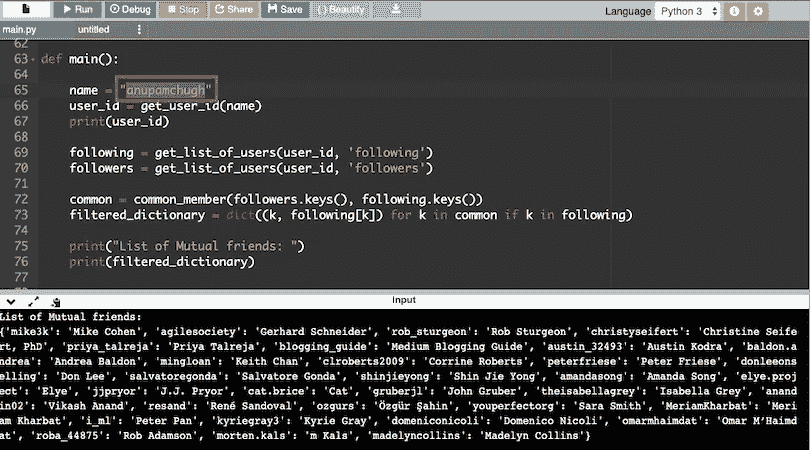
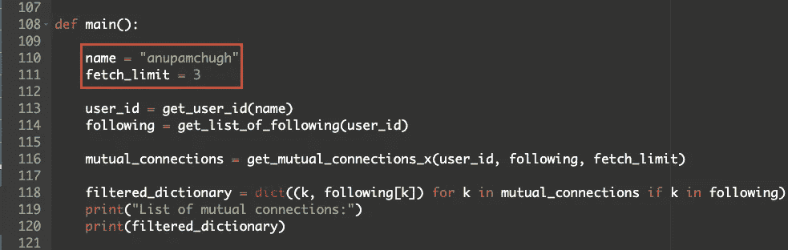
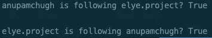

# 如何在媒体上找到你们的相互联系

> 原文：<https://betterprogramming.pub/how-to-find-your-mutual-connections-on-medium-d0c586c04e6f>

## 使用 Python 脚本和指令——不需要编码知识


照片由[佩里·格罗内](https://unsplash.com/@perrygrone?utm_source=medium&utm_medium=referral)在 [Unsplash](https://unsplash.com?utm_source=medium&utm_medium=referral) 上拍摄

脸书明确地告诉你谁是你的朋友。Instagram 巧妙地让你知道你关注的人是否也在关注你。

虽然 Medium 确实显示了关注者和你关注的人的列表，但你可能想知道如何检索“相互联系”的列表，这是我使用的一个术语，指的是相互关注的用户(类似于脸书朋友)。

寻找相互联系的无聊、乏味且耗时的方法是浏览你不断增长的关注者列表，希望偶然发现那些绿色的勾号(或者黑色的，如果你在网络浏览器上的话)。但是如果你浏览其他人的个人资料，这并不容易——你必须记下普通用户的关注者*和*关注者列表中的普通人。

幸运的是，您可以节省一些精力，用一小段代码自动完成这些任务。最棒的是，你不需要成为一个程序员来理解它是如何工作的或者运行程序。

我们将要使用的逻辑是基于我们在高中都学过的有趣概念——文氏图。

这里有一个如何在 Medium 上找到你的相互联系的例子:


为了将这个维恩图付诸实施，我们已经用 Python(一种流行的编程语言)编写了一个脚本来 pings 一个 URL。作为回报，我们得到该媒体用户的列表`followers`和`following`。

通过使用集合的基本原理，我们创建了一个`followers`和`following`的交集，并将相互连接列表导出到一个 CSV 文件。以下是 Python 脚本，您可以将其下载到您的系统中:

我们可以用两种方式运行这个程序:

*   在您的系统上使用命令行。
*   通过将脚本复制粘贴到在线编译器中。

# 使用命令行

让我们启动我们的命令行终端或提示符，并确保安装了 Python3。

## 对于 Windows 用户

键入`python –version`,如果安装了的话，它会显示一个版本号。如果没有，或者版本号在 3 之前，请从[这里](https://www.python.org/downloads/windows/)找到最新的稳定版本。

下载完 Python 安装程序后，按照安装向导进行操作，几分钟后，Python 将安装到您的系统上。

## 对于 macOS 用户

Python 已预装在您的系统中。做一个`python --version`来确定版本。如果是 2.7 左右的话。*或小于 3，粘贴以下命令，按回车键，并输入您的管理员密码来安装它:

```
/usr/bin/ruby -e "$(curl -fsSL https://raw.githubusercontent.com/Homebrew/install/master/install)"
```

我们刚刚安装了家酿，这让我们可以进一步安装我们需要的东西。在我们的例子中，它是 Python3:

```
brew install python3
```

我们都用 Python3 设置好了。现在输入单词`python`(如果你在 Windows 上)或`python3`(如果你在 macOS 上)，按下 space，将文件拖放到终端中，再次按下 space，然后输入你的 Medium 用户名(你的个人资料 URL 中的用户名，在`@`之后)。


只需拖放文件，并在其后输入介质用户名

最后，当脚本搜索你们的相互联系时，按回车键(enter 按钮)去冲一杯咖啡。生成的 CSV 文件显示了您的每个连接及其媒体配置文件 URL。以下是我运行上述脚本时的截屏:


# 通过在线编译器中的复制粘贴

如果命令行不是你的菜，跳到这个[在线编译器](https://www.onlinegdb.com/online_python_interpreter)上，复制粘贴[修改过的脚本](https://gist.github.com/anupamchugh/0ad2c9dfbaa8e7d8dbf2bf10f515b0fa)。现在，您需要确保两件事:

*   确保在右上角选择的语言是 Python3。
*   将您的中级用户名放在特定行(下面突出显示的行):



这个问题的唯一限制是您不能轻松地导出 CSV 文件。最终结果打印在屏幕底部。

# 如何找到第 X 个相互连接

也许你很着急，或者你有太多的追随者，想在程序找到前 X 个相互连接时停止运行。逻辑很简单:

*   先获取`following`的列表(假设低于关注者)
*   在获取列表`followers` (它以 8 个为一批从 URL 到达)时，您只需搜索来自`following`集合的任何内容是否属于它。
*   一旦从`followers`列表中检索到前 X 个`following`用户，程序就打印它们并停止。

## 在命令行上运行

这里是[链接](https://gist.github.com/anupamchugh/c738e8f76431ac81b31db30a458c41bf)来查看和下载寻找前 X 个相互连接的脚本。

要运行它，只需在终端上的 python 命令中的 medium 用户名后面添加一个数字(比如 10)。如果你不在里面放一个数字，它将获取你所有的相互联系。以下是该命令的示例:

```
#Find first 10 mutual connections
python3 script_file_name.py anupamchugh 10
```

## 在在线编译器上运行

下面是[修改后的脚本](https://gist.github.com/anupamchugh/a87e5317083c59acacca9229b3f2a364)，你可以用自己的用户名和选择号在在线编译器中运行:



# 如何找到两个媒体用户之间的联系

有时候，你只需要知道两个中型用户是如何联系的，而不是总是获取你们相互联系的完整列表。例如，为了知道用户 A 和 B 之间的联系，我们将在 B 的`following`列表中查找 A，反之亦然。以下四种状态中的任何一种都是可能的:


使用这个逻辑，我们想出了这个 Python 脚本[这个脚本](https://gist.github.com/anupamchugh/9833a433b51ea32fecb3dcd276a50567)，它要求您为每个中级用户传递两个`username`参数。

该脚本在 B 的`following`列表中搜索 A 的`username`，反之亦然(假设你关注的人数少于你的关注者)。

让我们在 macOS 命令行提示符下运行以下命令，看看会得到什么输出:

```
python3 two_medium_users.py anupamchugh elye.project
```



使用这个[修改后的脚本](https://gist.github.com/anupamchugh/3431328b6c07c02d1a70cdcb86e8de10)复制粘贴并在你的[在线编译器](https://www.onlinegdb.com/online_python_interpreter)中运行，用你选择的用户名替换`name1`和`name2`。

同样的技术可以应用于在别人的关注者列表中找到你认识的人。

# 结束语

您可以利用 API 或查看网站来构建更多的分析工具并发现模式。例如，介质`user`的数据由以下值组成:`isMembershipTrialEligible`、`isWriterProgram`、`mediumMemberAt`等。

使用会员度量，你可以计算出你的追随者/追随者有多少是会员。这里有一篇[优秀的文章](https://medium.com/@elye.project/know-how-many-of-your-medium-fans-are-medium-member-ca36e90f4bc4)向我们展示了如何做到这一点(它也启发了我写这篇文章)。

这一次到此为止。我希望你喜欢它。