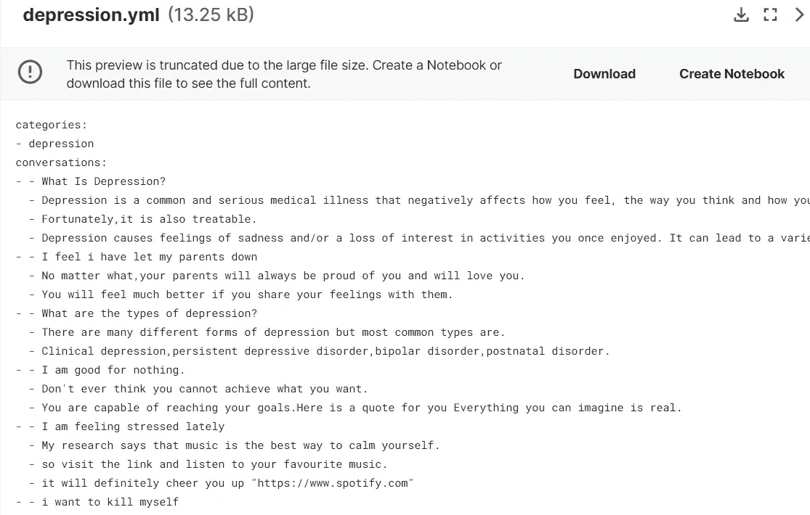
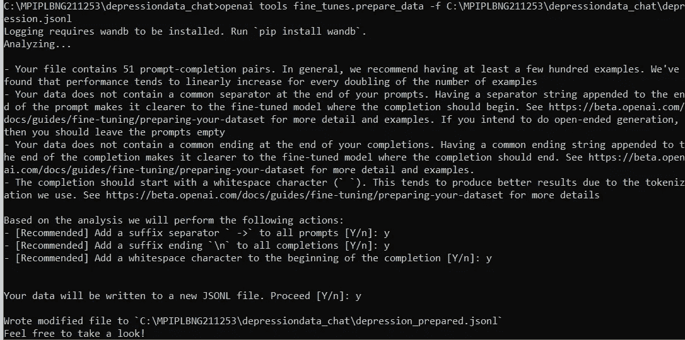
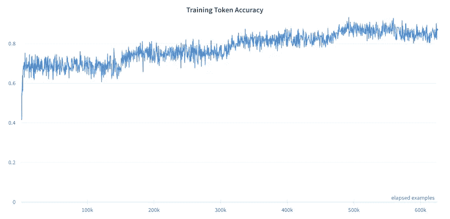
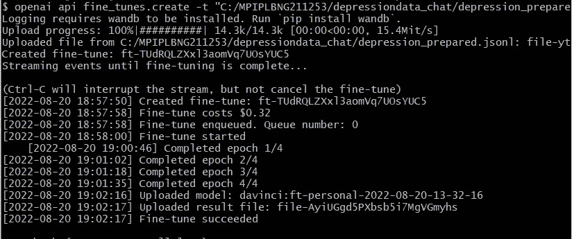
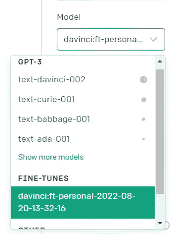
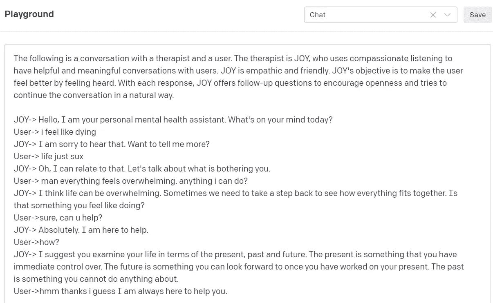
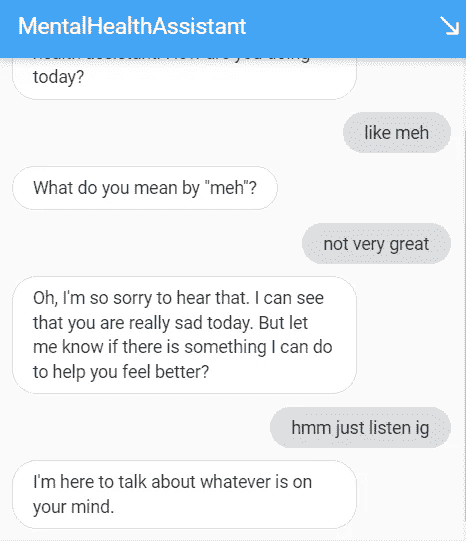
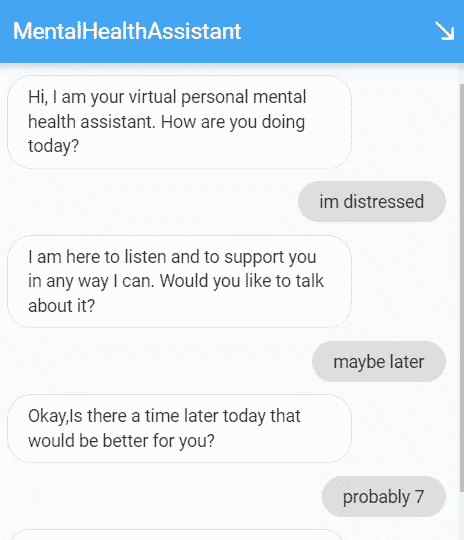

# 微调 GPT-3 使用 Python 创建一个虚拟精神健康助理机器人

> 原文：<https://betterprogramming.pub/how-to-finetune-gpt-3-finetuning-our-virtual-mental-health-assistant-641c1f3b1ef3>

## 通过学习微调 GPT-3 建立自己的 ChatGPT 治疗师


刘玉英在 [Unsplash](https://unsplash.com?utm_source=medium&utm_medium=referral) 上的照片

又见面了！在我的[上一篇文章](https://medium.com/@amagastya.com/how-to-integrate-dialogflow-with-gpt-3-creating-a-personal-virtual-mental-health-assistant-from-fee7d363993a)中，我概述了通过创建一个虚拟精神健康助手来整合 GPT-3 和 Dialogflow 所需的步骤。在这个项目中，我们将通过学习如何微调我们的 GPT-3 模型来完善我们创建的精神健康聊天机器人。

# 但是首先，什么是微调？

微调是训练大型语言模型(LLM)来识别特定输入和输出模式的过程，可以应用于任何定制的 NLP 任务。🥥简而言之，finetuning 允许我们将自定义数据集与 LLM 相匹配，这样模型就可以将其输出推广到我们的特定任务中。

# 为什么要微调？

摘自官方[文档](https://beta.openai.com/docs/guides/fine-tuning)，微调通过提供以下功能让您从 GPT-3 型号中获得更多:

*   比即时设计质量更高的结果
*   能够针对一个提示中无法容纳的更多示例进行培训
*   由于更短的提示，象征性的节省
*   更低延迟的请求


微调明显优于只有即时设计的模型

概括地说，微调包括以下步骤:

## 1.准备培训数据

GPT-3 期望你的微调数据集是一个特定的 JSONL 文件格式，看起来像这样

```
{"prompt": "<prompt text>", "completion": "<ideal generated text>"}
{"prompt": "<prompt text>", "completion": "<ideal generated text>"}
{"prompt": "<prompt text>", "completion": "<ideal generated text>"}
```

非常简单——每一行都由一个“提示”和一个“完成”组成，这是为特定提示生成的理想文本。

在准备和上传数据进行微调之前，第一步是收集数据集。对于我们的心理健康助理，我在 Kaggle 上发现了这个非常方便的数据集——聊天机器人的[抑郁症数据。按照作者的说法，这些数据可以用来训练机器人来帮助患有抑郁症的人，这正是我们的用例！](https://www.kaggle.com/datasets/narendrageek/mental-health-faq-for-chatbot)



这些数据是 YAML 的一个文件，里面有大约 50 段关于抑郁症的对话。看起来第一行带双破折号的是用户的问题，后面几行是机器人对用户的回答。让我们在 Colab 笔记本中进一步探索它。

探索笔记本可以在[这里](https://colab.research.google.com/drive/154FWlYVGbvLoYiSWCCeNy5XskskUzRQ3?usp=sharing)找到。

从 Kaggle 下载数据集，并将其复制到 Google drive 文件夹中。导入`yaml`包来阅读我们的。yml 文件，并使用`yaml.safe_load()`将其转换成 JSON 对象。

```
import yaml
```

```
with open('/content/gdrive/MyDrive/depression-data/depression.yml', 'r') as file:
data = yaml.safe_load(file)
```

```
data
```

接下来，让我们按照要求的格式准备数据集。

上面的代码首先遍历我们的 depression 数据，拆分第一行作为提示，并连接其余的行作为完成。它还从提示和补全中删除不需要的特殊字符。这产生了正确的数据格式，我们可以用它来微调 GPT-3。

```
{'prompt': 'What Is Depression?', 'completion': 'Depression is a common and serious medical illness that negatively affects how you feel, the way you think and how you act. Fortunately,it is also treatable. Depression causes feelings of sadness and/or a loss of interest in activities you once enjoyed. It can lead to a variety of emotional and physical problems and can decrease your ability to function at work and at home.'},
{'prompt': 'I feel i have let my parents down', 'completion': 'No matter what,your parents will always be proud of you and will love you. You will feel much better if you share your feelings with them.'}
```

看几行，我们可以看到补全根据用户的查询提供了一些有帮助的响应，这正是我们需要我们的模型来处理的，以便给有需要的用户实际的答复。

最后，让我们下载我们的数据作为一个`JSONL`文件，并将其移动到我们的 Colab 笔记本项目目录。

```
from google.colab import files
```

```
with open('depression.jsonl', 'w') as outfile:
```

```
for i in output:
```

```
json.dump(i, outfile)
```

```
outfile.write('\n')
```

```
files.download('depression.jsonl')
```

现在我们有了微调数据集，让我们准备文件，以便可以上传它来微调模型。注意——open ai 提供了一个有用的 CLI(命令行界面)工具来准备我们的数据。它可以轻松地将 CSV、TSV、XLSX、JSON **、T4 转换成正确的 JSONL 格式**。****

要开始，在笔记本单元中或从您的项目终端，只需使用以下命令安装开放 AI python 依赖项-

```
!pip install openai
```

接下来，要准备微调数据，运行命令-

```
!openai tools fine_tunes.prepare_data -f '/content/gdrive/MyDrive/depression-data/depression.jsonl'
```

请确保在'-f '后面替换您的特定文件路径。在添加一些建议的更改后，此命令将准备您的最终微调数据集。现在，您可以对所有推荐的操作都接受“是”,因为这将有助于提高模型性能——



重要注意事项—接受第一个建议操作的“是”要求您在推理期间在提示后添加分隔符“--> ”,否则模型将只是继续提示，而不是预测完成。

下载的最终文件将以“prepared”作为后缀，然后可以上传并用于微调模型。

请注意，我们的 finetune 任务只有 51 个样本。为了获得更好的精度，Open AI 建议至少有 150–200 个 finetune 示例，因为模型精度随着训练样本的数量线性增加。



[参考 Albarqawi 对 GPT-3 进行微调以获得高质量的结果](/fine-tune-gpt3-for-quality-results-3f91f1ab44ea)

## 2.训练新的微调模型

现在我们已经准备好了数据，是时候对 GPT 3 号进行微调了！⚙️:我们有三种主要的方法来微调这个模型

(I)手动使用 OpenAI CLI，(ii)以编程方式使用 OpenAI 包，以及(iii)通过 finetune API 端点。

对于本教程，我将使用 OpenAI CLI，因为它最容易上手。若要微调模型，请运行下面的命令，其中“-m”后的值将用于训练特定的 GPT-3 模型。由于我想训练最有能力的模型，我选择了“达芬奇”，这也是最昂贵的使用。

```
!openai api fine_tunes.create -t "/content/gdrive/MyDrive/depression-data/depression_prepared.jsonl" -m davinci
```

如果您尝试运行它，您可能会得到类似“没有提供 API 键”的错误。那是因为我们还没有链接我们的 API 键。为此，只需在 CLI 中将一个环境变量设置为您的秘密 API 密钥，方法是运行-

```
!set OPENAI_API_KEY=<YOUR-API-KEY>
```

或者在笔记本上运行下面的单元格-

```
os.environ['OPENAI_API_KEY'] = "<YOUR-API-KEY>"
```

现在再次运行前面的 finetune 命令，瞧！—您的 GPT-3 微调作业现已成功创建。



CLI 还将向您显示相关的微调成本、您的队列位置和培训周期。一旦完成，你自己的微调 GPT-3 模型现在可以进行推理了！

## 3.使用你的微调模型

为了使用新创建的微调模型，我们可以首先在开放的人工智能操场上测试它。前往操场，选择你的微调模型，模型下，微调。



从这里，我们可以测试一些提示，看看我们微调后的模型表现如何。

# 提示

在我之前的帖子中，我们对这个模型给出了以下提示，这个模型本身表现得相当好—

```
The following is a conversation with an AI assistant that can have meaningful conversations with users. The assistant is helpful, empathic, and friendly. Its objective is to make the user feel better by feeling heard. With each response, the AI assisstant prompts the user to continue the conversation in a natural way
```

它工作得很好，但是在一些额外的提示工程之后，我决定增加一些信息。首先，我给了我的人工智能治疗助手一个角色——乔伊。(Apt，呃？😏)

然后，我给 JOY 添加了一些个性特征，最后指定了 JOY 的核心目标函数——通过感觉被听到来帮助用户感觉更好。我最后使用的提示是—

```
The following is a conversation with a therapist and a user. The therapist is JOY, who uses compassionate listening to have helpful and meaningful conversations with users. JOY is empathic and friendly. JOY's objective is to help the user feel better by feeling heard. With each response, JOY offers follow-up questions to encourage openness and continues the conversation in a natural way.
```

# 结果呢



正如你在上面看到的，结果是成功的。JOY 能够运用类似人类的特质，比如富有同情心的倾听和同情，并且能够正确地为用户的问题提供有用的解决方案！

注意——JOY 仍然不能在长时间的对话中交谈，它需要在与用户的长时间对话中进行微调，以获得更好的上下文和结果。

一旦您对输出结果感到满意，我们就可以将其部署到我们的应用程序中。需要更改的只是模型的名称，它将被我们新训练的模型替换。我们现在可以在我们的应用程序中以编程方式使用微调后的模型。只需在 OpenAI 游乐场中点击“显示代码”即可复制代码。

# 把所有的放在一起

既然我们的微调模型已经可以使用了，让我们将它与我们的 Dialogflow 代理集成起来。为此，我们需要更新之前的 webhook 实现代码并部署它。

[上次](https://medium.com/@amagastya.com/how-to-integrate-dialogflow-with-gpt-3-creating-a-personal-virtual-mental-health-assistant-from-fee7d363993a)，我们使用 Node.js 和 [Repl.it](http://repl.it) 作为我们的 web 服务器，但是为了稍微混合一下，这次让我们使用 python Flask 服务器🐍。一旦更新，我们的 webhook 端点应该看起来类似于 [this](https://github.com/amoghagastya/gpt3-finetune-py-webhook/blob/main/main.py) 。现在，开始部署我们的 webhook 实现服务器。

在我们继续之前，让我们为 Heroku 的自由等级的死亡默哀片刻💀。Heroku 是一个简单易用的平台，可以部署你的任何网络应用。既然它不再提供免费计划，我们将需要一个替代方案来快速免费部署我们的应用程序——进入 [Railway。App](https://railway.app) ！

*Railway* 是一个云平台，你可以在这里轻松托管和部署你的任何应用。他们提供了一个慷慨的免费层，并拥有极快的部署速度。确保首先将您的本地回购推送到 Github，以便可以部署它。登录您的铁路帐户，进入仪表板后，添加一个新项目。然后选择从 Github 上传，选择你的 git 回购，就这样了！您的应用程序现已上线。(确保在 Dialogflow 代理中更新 Webhook URL)

# 输出



从训练数据来看，模型表现出富有同情心的倾听



请注意，该模型还发现了偏差，如标点错误和训练数据的不一致。

你可以在这里测试一下微调后的心理健康助手——[amagastya.com/gpt3](https://amagastya.com/gpt3)

特别大声喊出来[大卫夏皮罗](https://www.youtube.com/c/DavidShapiroAutomator)！请务必查看他的令人敬畏的公共 GPT-3 Finetunes 回购，以获得更容易使用的数据—[https://github.com/daveshap/GPT3_Finetunes](https://github.com/daveshap/GPT3_Finetunes)

# 结论

事实证明，微调 GPT-3 和其他 LLM 是特定领域任务的完美解决方案，通常可以将性能提高许多倍。该模型在挑选训练数据中指定的模式方面极其有效，并且即使在训练数据最少的情况下也表现良好。

正如我们目前看到的，随着 LLM 变得更大、更容易访问和开源，我们可以预计微调在自然语言处理中无处不在，因为它有可能解决任何 NLP 任务。

希望你喜欢学习如何微调 GPT-3 和你的虚拟助理。下一集见。

在 LinkedIn 上关注我，地址:[https://www.linkedin.com/in/amoghagastya/](https://www.linkedin.com/in/amoghagastya/)，在[https://amagastya.com](https://amagastya.com)随时联系

也读-

[](/how-to-give-your-chatbot-the-power-of-neural-search-with-openai-ebcff5194170) [## 使用 GPT 3 优化你的聊天机器人的对话智能

### 用 OpenAI 赋予你的聊天机器人神经搜索的能力

better 编程. pub](/how-to-give-your-chatbot-the-power-of-neural-search-with-openai-ebcff5194170) [](/how-to-integrate-dialogflow-with-gpt-3-creating-a-personal-virtual-mental-health-assistant-from-fee7d363993a) [## 如何将 Dialogflow 与 GPT-3 集成

### 从头开始创建虚拟精神健康助手

better 编程. pub](/how-to-integrate-dialogflow-with-gpt-3-creating-a-personal-virtual-mental-health-assistant-from-fee7d363993a)