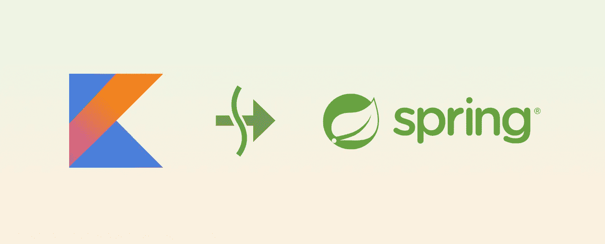

# 如何解雇和忘记 Spring Boot 的科特林花冠

> 原文：<https://betterprogramming.pub/how-to-fire-and-forget-kotlin-coroutines-in-spring-boot-40f8204aac86>

## 构建函数，阻塞，暂停，“作用域”…什么？



图片来源:作者

当计算被转移到其他地方时，Kotlin 协同程序是一种有效的(重用)线程的方式。协程与`Scope`的概念绑定在一起:要运行协程，需要先声明一个作用域对象。这就是他们如何实现[结构化并发](https://kotlinlang.org/docs/reference/coroutines/basics.html#structured-concurrency)。要得到一个作用域，你需要使用作用域生成器函数，比如`[coroutineScope{}](https://kotlin.github.io/kotlinx.coroutines/kotlinx-coroutines-core/kotlinx.coroutines/coroutine-scope.html)`或者`[runBlocking{}](https://kotlin.github.io/kotlinx.coroutines/kotlinx-coroutines-core/kotlinx.coroutines/run-blocking.html)`。作用域挂起(或阻塞)一个线程，直到它的所有协程都完成。

以下示例将打印“213”

这张照片印了 213 页

这意味着，如果您没有对`main`的简单控制，您就不能“发射并忘记”一个操作(这在框架中很常见)。JVM 将等待作用域完成，然后继续处理它之外的任何事情。

# 春天的花冠

在 Spring 的世界里，协同程序在框架层得到了 Spring WebFlux 的支持，Spring web flux 是 Spring Boot 的非阻塞替代物。在 Spring WebFlux 中，控制器方法可以被声明为`suspend`。

您可以编写以下内容:

```
@GetMapping("/foo")
**suspend** fun foo: X = **coroutineScope**{
val x = *async* **{** restClient.getForObject<Int>("/bla1") **}** val y = *async* **{** restClient.getForObject<Int>("/bla2") **}** x.await() + y.await()
}
```

在 Spring Boot，你不能将一个控制器声明为挂起，但是你可以使用`runBlocking`。

```
@GetMapping("/foo")
fun foo(): Int = ***runBlocking* {** val x = *async* **{** restClient.getForObject<Int>("/bla1") **}** val y = *async* **{** restClient.getForObject<Int>("/bla2") **}** x.await() + y.await()
**}**
```

在最后一个例子中，即使线程被阻塞，协程的异步性也是有益的。线程无论如何都会被阻塞，因为 Spring Boot 实现了[每个请求一个线程的模型](https://dzone.com/articles/spring-webflux-eventloop-vs-thread-per-request-mod) *。*

## 开火然后忘记

让我们弄清楚您想要启动一个流或一个长时间运行的作业的情况。您不希望等到任务结束后才返回 HTTP 响应。对于流，您可以选择 Server-Sent-Events，然后接受等待，直到流结束，但情况并非总是如此。例如，这不适合长时间运行的作业，或者如果流应该通过 WebSocket 传递。

如果使用生成器函数，协程作用域将绑定到方法的作用域。在该范围内的所有操作完成之前，该方法不会返回。

# 应用程序级范围

排除范围生成器函数，我们有两个选择:`GlobalScope`或者一个定制的应用程序`CoroutineScope`。选哪个？看情况。

## 全球范围

`GlobalScope`是最简单的选择。请看下面的例子:

```
@GetMapping("/foo")
fun get() : Int{
    GlobalScope.*launch* **{** ...
    **}** return 0
}
```

来自官方的 Kotlin 协程文档:“全局协程就像守护线程。”

一旦应用程序关闭，在其中启动的每个协程也将被取消。

这将只打印“2”

在上面的例子中，当程序结束时，协程将被取消。

`GlobalScope`不实现结构化并发。这意味着，如果其中的任何一个协程抛出异常，所有其他协程将继续运行。

在 GlobalScope 中启动:这将抛出并打印“hello 1”

这未必是一件坏事。一个例子是一个控制器，它通过 WebSocket 执行启动流的命令。对控制器的每个调用都是一个新的流流；不会出现这样的情况:如果任何一条河流断流，那么所有其他河流也会停止运行。

## 适用范围

另一种选择是创建一个自定义范围，然后将其注入到您的应用程序中:

```
@SpringBootConfiguration
class MyConguration{   
   @Bean
   fun scope(): CoroutineScope =
        C*oroutineScope*(Dispatchers.Default)
}@RestController
class MyController(@Autowired private val scope: CoroutineScope) ...
```

在这种情况下，结构化并发是适当的。如果在这个范围内运行的任何一个协程抛出，那么所有其他的协程也会停止。

这不会打印“hello 1”

像`GlobalScope`一样，这种作用域不会阻止 Spring Boot 关闭，即使任何协程仍在运行。这是因为当它被垃圾收集器收集时，它的所有协程一起被取消。

# 结论

*   如果你想完全支持协同程序，那么就使用 Spring WebFlux。如果您的应用程序是 IO 受限的，建议这样做，以利用非阻塞模型。
*   如果你坚持 Spring Boot，那么你仍然可以得到好处。这些都与更有效地使用分配给请求的线程密切相关。
*   如果所有的任务都必须在控制器调用期间完成，例如，如果您从数据库中获取一些东西，那么使用协程函数生成器(`runBlocking`或`coroutineScope`)。
*   用`GlobalScope`开火，忘记必须过自己生活的长时间运行的任务。
*   使用自定义作用域来触发并忘记必须相互关联的长期运行的任务。

# 奖金部分

我总是喜欢用项目内的自定义类来包装作用域。姑且称之为`AppCoroutineScope`。

```
class AppC*oroutineScope :* C*oroutineScope by CoroutineScope(Dispatchers.Default)*orclass AppC*oroutineScope :* C*oroutineScope by GlobalScope*@SpringBootConfiguration
class MyConguration{
    @Bean
    fun scope(): AppCoroutineScope = AppC*oroutineScope*()
}@RestController
class MyController(@Autowired private val scope: AppCoroutineScope) ...
```

通过这种方式，您可以构建多个作用域类型，并决定如何注入它们。此外，如果您在选择范围时出错，则更容易切换。

感谢您的阅读！