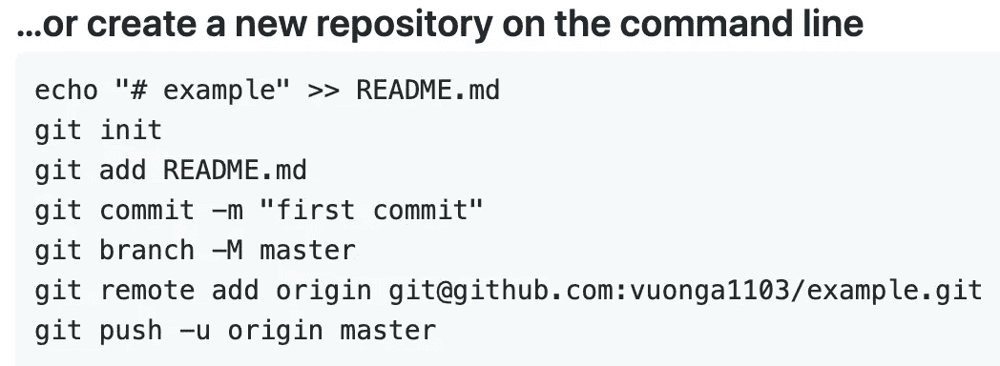
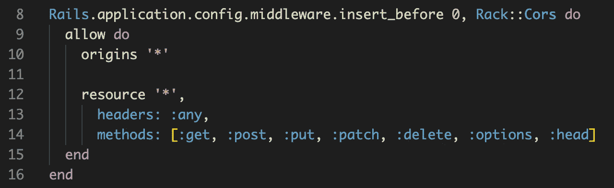
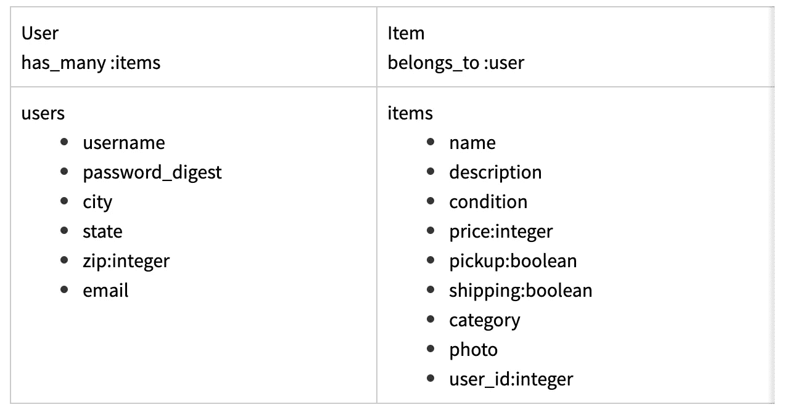

# 为您的新项目创建一个 Rails API

> 原文：<https://betterprogramming.pub/how-to-fire-up-a-rails-api-for-your-new-project-6fad595caf07>

## 立即开始新的 Rails API 项目


[罗斯·帕莫利](https://unsplash.com/@rparmly?utm_source=medium&utm_medium=referral)在 [Unsplash](https://unsplash.com?utm_source=medium&utm_medium=referral) 上的照片

因此，你的任务是为你的新项目使用一个 [Rails](https://guides.rubyonrails.org/) API 后端，而你不知道从哪里开始。

*我再安装什么宝石？！如何指定我想使用 PostgreSQL？！串行器到底是什么？我需要一个登录功能，完全忘记了如何工作* `*bcrypt*` *！[-开始内心沮丧的尖叫-]*

没有恐惧，初学者 Rails 开发，这里是我需要你做的:1。深呼吸，然后 2。使用这个分步指南作为你开始的模型。

为了这个演示的目的，我将设置两个模型的电子商务应用程序的后端:用户和项目。一个用户有许多想要出售的物品，而一个物品属于一个用户。好了，我们开始吧！

# 步骤 0。使用“rails new”命令创建新的 Rails 应用程序

*   导航到要存储 Rails 应用程序的文件夹。在终端中抛出下面的命令，告诉 Rails 您想要创建一个新项目，使用 [PostgreSQL](https://www.postgresql.org/) 作为数据库，并且它将是一个 API。

```
rails new <project-name> --database=postgresql --api
```

*   您应该已经安装了 PostgreSQL。如果没有，按照[步骤安装](https://www.postgresql.org/download/)。
*   在 GitHub 上创建一个新的存储库，将`/ **cd**`导航到您刚刚创建的新 rails 项目目录，并按照 GitHub 给出的步骤在您的新项目中初始化 Git。



# 第一步。启用“bcrypt”和“rack-cors”

*   导航到您的`Gemfile`，取消注释`gem ‘bcrypt’`和`gem ‘rack-cors’`。
*   `bcrypt` gem 允许你使用`has_secure_password`宏来很好地保护你的密码验证。
*   `[rack-cors](https://github.com/cyu/rack-cors)` gem 是一个中间件，它让跨源 AJAX/获取数据的魔力得以实现。
*   完成后在你的终端上运行`bundle install`来安装这些 gem。
*   导航进入`config/initializers/cors.rb`，取消`Rack::Cors`配置的注释，将`'example.com'`原点改为`'*'`:



*   当您稍后部署您的应用程序时，将`origin`更改为您的前端网站地址将只允许您的前端向您的后端发出获取请求。目前，通配符`'*'`允许任何本地主机 URL 从您的后端获取信息。

# 第二步。为您的表生成迁移、模型和资源

*   我的数据库将保存两个表的信息:`users`和`items`。这是我希望他们看起来的样子:



*   使用`rails g resource`，我可以使用以下命令生成迁移、模型和资源:
*   `rails g resource User username password_digest city state zip:integer email`
*   `rails g resource Item user:belongs_to name description condition price:integer pickup:boolean shipping:boolean category photo`
*   如果数据类型是字符串，则不需要在列名后指定它们的类型。添加`user:belongs_to`指定两个表之间的关系，并在`items`表中为`user_id`设置一列。此外，我们使用列名`password_digest`来避免直接将密码存储为字符串。
*   接下来，运行`rails db:create`来创建后端，运行`rails db:migrate`来迁移您的表。然后，转到您的模型，以确保建立了适当的关系(`has_many`、`belongs_to`)。

# 第三步。使用“bcrypt”并添加一些验证

*   你安装的`bcrypt` gem 允许你使用一个叫做`has_secure_password`的宏。将此添加到您的用户模型中，因为我们将验证用户的密码。在那里，为`email`和`username`添加验证:

*   添加这一点，您应该导航到您的`db/seeds.rb`文件，生成种子数据，并在`rails console`中测试它们。

# 第四步。生成序列化程序

*   序列化器允许您以对前端最有用的格式组织发送的 JSON 数据。我将在这个演示中使用`active_model_serializers`。首先，将`gem 'active_model_serializers'`添加到您的`Gemfile`中，然后再次运行`bundle install`。
*   使用以下命令为用户和项目生成序列化程序:
*   `rails g serializer User`T24`rails g serializer Item`
*   导航到`app/serializers`并为您的序列化程序类设置属性。这些属性指定了您希望作为 JSON 发送出去的键及其相应的值。我的`UserSerializer`类现在看起来像这样:

```
class UserSerializer < ActiveModel::Serializer
   attributes :id, :username, :city, :state, :zip, :email
end
```

*   注意，我没有发送`created_at`、`updated_at`和`password_digest`列。序列化器的奇妙之处在于，您可以只发送前端需要的信息，而隐藏其余的信息。
*   我的`ItemSerializer`类是这样的:

```
class ItemSerializer < ActiveModel::Serializer
   attributes :id, :name, :description, :condition, :price, :pickup, :shipping, :category, :photo, :user belongs_to :user
end
```

*   在这里指定`belongs_to :user`并将`:user`作为一个属性，这样当我发送一个获取项目的请求时，我得到的数据将具有以下格式:

*   请注意与项目关联的用户是如何嵌套在项目对象中的。串行器是自切片面包以来最好的东西，证明我错了！

# 第五步。设置路线和行动

*   我想为项目设置一个路由，这样当我请求 get `/items`时，我就可以接收到 JSON 数据，该数据以刚才描述的格式表示我的数据库中的项目。为此，首先在`config/routes.rb`中指定以下内容:

```
resources :items, only: [:index]
```

*   接下来，创建`items#index`动作，看起来像这样:

```
class ItemsController < ApplicationController
  def index
    items = Item.all
    render json: items
  end
end
```

*   最后，使用`**rails s**` 启动 rails 服务器，在浏览器上导航到[http://localhost:3000/items](http://localhost:3000/items)，查看显示的 JSON 数据。

好了，伙计们，这就是要点！我希望这有助于缓解您在启动 Rails API 时最初的挫败感。有关 Rails 的更多具体信息，请访问官方的 [Rails 文档](https://guides.rubyonrails.org/)。