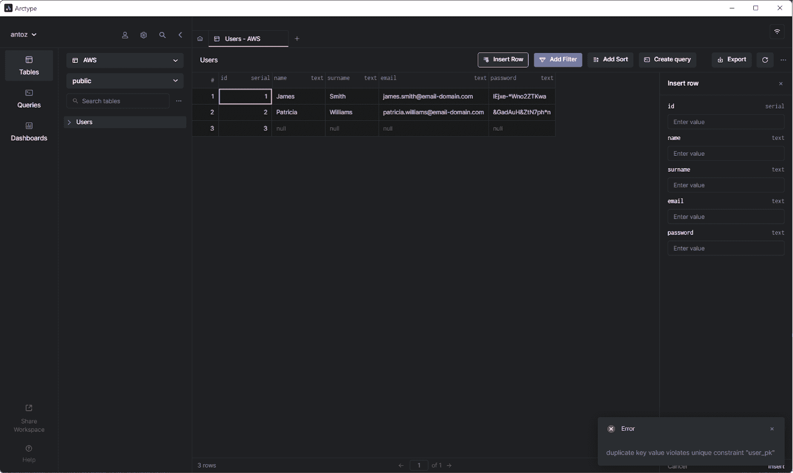
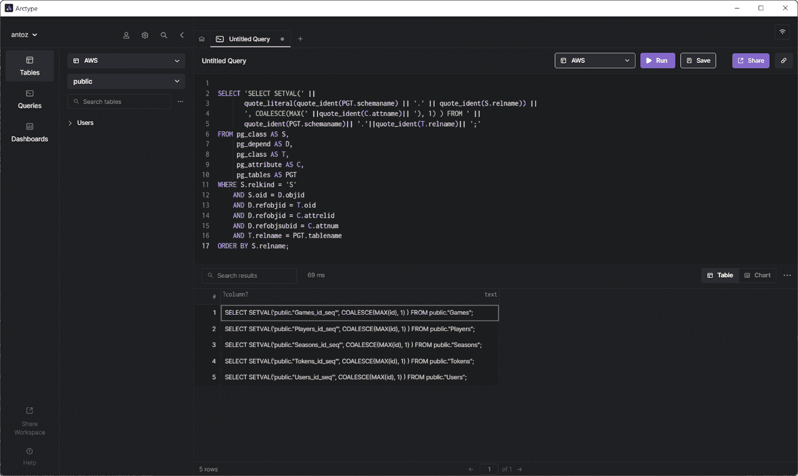
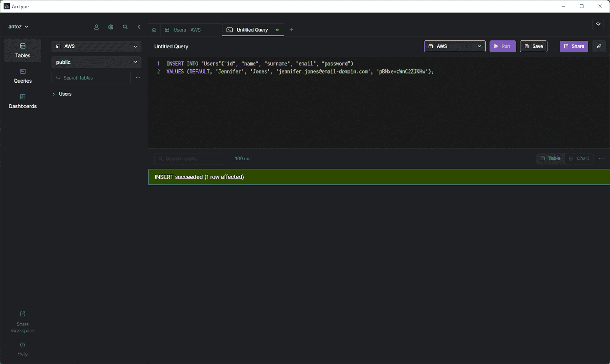

# 如何修复 Postgres 中不同步的序列

> 原文：<https://betterprogramming.pub/how-to-fix-a-sequence-when-it-goes-out-of-sync-in-postgres-8393c1c65299>

## 解决 Postgres 中的不同步序列问题


Postgres 是世界上最先进、最广泛使用的开源 RDBMS(关系数据库管理系统)之一。它尤其受到开发人员社区的青睐，因为它支持 SQL 和 JSON 查询，这使得它同时兼容关系和非关系。

然而，Postgres 有一些众所周知的问题，其中最恼人的一个涉及序列。具体来说，Postgres 序列很容易失去同步，从而阻止您插入新行。当这种情况发生时，Postgres 甚至会返回一个令人困惑的错误消息。

在本文中，我们将向您介绍不同步问题，并向您展示如何解决这个问题。我们将学习序列，了解导致不同步问题的环境，学习如何诊断问题，并最终解决问题。我们开始吧。

# Postgres 中不同步序列问题的探讨

## 什么是 Postgres 序列？

官方文档[解释说序列只不过是一个数字生成器。特别是，Postgres 使用一个序列来生成一个渐进的数字，它通常代表一个自动递增的数字主键。](https://www.postgresql.org/docs/8.1/sql-createsequence.html)

如果你熟悉 [MySQL](https://www.mysql.com/) ，在 Postgres 中拥有一个序列的结果堪比`[AUTO_INCREMENT](https://dev.mysql.com/doc/refman/8.0/en/example-auto-increment.html)`行为。主要区别在于 Postgres 序列也可以从一个定义的值开始，然后在每个`INSERT`递减。

你可以用`[CREATE SEQUENCE](https://www.postgresql.org/docs/9.5/sql-createsequence.html)`语句在 Postgres 中定义一个序列。类似地，特殊类型`[SERIAL](https://www.postgresql.org/docs/9.1/datatype-numeric.html#DATATYPE-SERIAL)`在后台使用一个序列初始化一个自动递增的数字主键。一般来说，用`CREATE TABLE`创建新表的时候应该用`SERIAL`。

## 什么时候序列会不同步？

根据我作为一名高级软件开发人员的经验，Postgres 序列不同步有三个原因。具体来说，这发生在以下情况:

*   用一个`INSERT`脚本导入许多行或者恢复一个庞大的数据库；
*   用`[setval()](https://www.postgresql.org/docs/8.2/functions-sequence.html)`功能手动设置序列的错误值；
*   通过在`INSERT`查询中手动指定`id`字段，向表中插入新记录。

最后一个是最常见的原因，通常是因为 Postgres 使用一个序列，只有当您省略 id 字段或在`INSERT`查询中使用`DEFAULT`关键字时，它才会自动更新它的值。

## 我如何识别这个问题？

发现这个问题很简单。当您没有为`id`列指定值并手动启动一个`INSERT`查询或者让您的 ORM ( [对象关系映射](https://en.wikipedia.org/wiki/Object%E2%80%93relational_mapping))为您执行时，Postgres 将总是返回一个“重复键值违反唯一约束”错误。此外，在执行`UPDATE`查询时，这种情况永远不会发生。



可以想象，问题出在与 id 列不同步相关的序列上。具体来说，当序列为已经使用的 id 列返回一个值时，就会发生错误。这导致了前面提到的错误，因为根据定义，ID 必须是唯一的。

# **如何解决问题**

现在是时候看看如何处理不同步问题并一劳永逸地解决它了。这个问题可以用几种方法来解决。这里有两种方法。

## 方法 1:单表解决方案

假设您想要修复与您的`Users`表的`id`列相关联的序列。您可以通过运行以下查询来实现这一点:

```
SELECT SETVAL('public."Users_id_seq"', COALESCE(MAX(id), 1)) FROM public."Users";
```

该查询将通过将当前值设置为`COALESCE(MAX(id), 1)`的结果来更新`Users_id_seq`序列。请注意 Postgres 中的序列名称是如何遵循以下符号的:

```
"<table-name>_<column-name>_seq"
```

`[COALESCE](https://www.postgresql.org/docs/8.1/functions-conditional.html#AEN12663)`函数返回第一个非空值，它是必需的，因为如果`Users`为空，`MAX(id)`将返回`NULL`。因此，通过使用`COALESCE`，您可以确定当`Users`不为空时，分配给`Users_id_seq`的值将为`MAX(id)`，当`Users`为空时，该值为 1。在这两种情况下，该查询都会设置所需的值。

## 方法 2:用一个脚本修复所有的序列

如果你想用一个查询修复所有的序列，你可以使用来自官方 Postgres Wiki 的以下脚本:

```
SELECT 'SELECT SETVAL(' ||
       quote_literal(quote_ident(PGT.schemaname) || '.' || quote_ident(S.relname)) ||
       ', COALESCE(MAX(' ||quote_ident(C.attname)|| '), 1) ) FROM ' ||
       quote_ident(PGT.schemaname)|| '.'||quote_ident(T.relname)|| ';'
FROM pg_class AS S,
     pg_depend AS D,
     pg_class AS T,
     pg_attribute AS C,
     pg_tables AS PGT
WHERE S.relkind = 'S'
    AND S.oid = D.objid
    AND D.refobjid = T.oid
    AND D.refobjid = C.attrelid
    AND D.refobjsubid = C.attnum
    AND T.relname = PGT.tablename
ORDER BY S.relname;
```



该查询返回执行时修复每个序列所需的查询集。如 Wiki 中所述，您应该按如下方式使用此查询:

1.  将查询保存在一个`fix_sequences.sql`文件中。
2.  运行包含在`fix_sequences.sql`文件中的查询，并将结果存储在`temp`文件中。然后，运行包含在`temp`文件中的查询。最后，删除`temp`文件。您可以使用以下三个命令来实现这一点:

```
bash
psql -Atq -f fix_sequences.sql -o temp
psql -f temp
rm temp
```

# **如何确认问题已经解决**

现在，要验证序列不再不同步，只需在最初遇到问题的表中插入一条新记录。

记住在`INSERT`查询中给`id`列赋予`DEFAULT`值或者完全省略它。通过这种方式，Postgres 将在后台使用`Users_id_seq`序列来检索正确的值，并将其提供给`id`。

例如，运行以下查询，您应该不会再收到“重复键值违反唯一约束”错误消息:

```
INSERT INTO "Users"("id", "name", "surname", "email", "password")
VALUES (DEFAULT, 'Jennifer', 'Jones', 'jennifer.jones@email-domain.com', 'pBHxe*cWnC2ZJKHw');
```

相反，该查询将按预期在`Users`表中插入一条新记录。



# **结论**

Postgres 无疑是一个伟大的 RDBMS。同时，它也有一些问题会浪费你的时间。

如果你没有意识到它们，不知道如何识别它们，也没有相应地解决它们，那就更是如此。在本文中，我们研究了棘手的不同步问题。

不同步序列错误很棘手，因为它会导致“重复键值违反唯一约束”消息错误，这也与其他问题相关。但这不会再欺骗你了，因为现在你知道它为什么会发生，如何检测它，以及如何修复它！