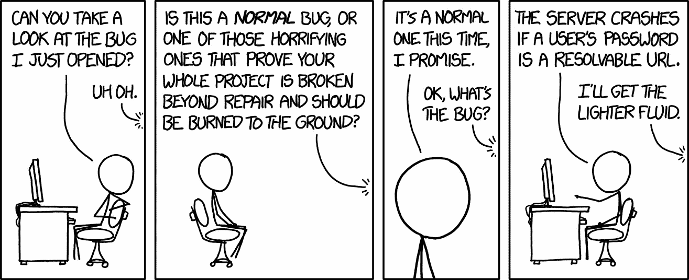

# 如何修复 bug

> 原文：<https://betterprogramming.pub/how-to-fix-bugs-b3ae3044bc78>

## 所有开发人员都必须处理 bug，这是如何修复 bug 的概述

新 Bug 由 [XKCD](https://xkcd.com/1700/)

所有的软件都有缺陷。bug 只是软件开发的一个现实，就像产品经理会把它们视为纯粹的浪费一样，修复它们确实会增加价值。作为开发人员，我们有责任尽可能快速有效地处理 bug。在这篇文章中，我将分享一些实现这一目标的策略。

# 不要写它们

处理 bug 的绝对最好的方法是一开始就不要写它们。如果你在一段新代码上写了`// TODO`或`// FIXME`，请举手。不要这样！如果你发现自己正在写代码，然后在后面直接添加了`// FIXME`，你就是在有意地故意给你的代码添加错误。不写 bug 比写了 bug 以后再修复要容易得多，所以先从不故意写 bug 开始吧。

# 不要修理它们

另一种处理 bug 的方法，不管是有意的还是无意的，就是不去管它们。对于某些微不足道的错误或只以非侵入性方式影响一小部分用户的极端情况，这是一种完全有效的方法。

在一个健康的开发工作流程中，bug 应该根据开发的其他领域进行分类和优先级排序，比如开发新的特性、架构、偿还技术债务和基础设施工作。您可能想问的一些问题是:

*   修复 bug 是否比给定的特性优先级更高，修复它会增加更多的客户价值吗？
*   修复 bug 的成本是大于还是小于实现一个给定的特性，或者修复其他优先级更高的 bug？

一般来说，我们希望总是致力于最高价值的工作项目，所以如果开发成本对客户价值的比率高于其他竞争优先级，那么最好忽略这个 bug，至少现在是这样。

# 使用问题跟踪器

你不能修复你不知道的错误。因此，问题跟踪器是记录和解决 bug 的工具箱中必不可少的一部分。它可以用来存储当前 bug 的列表，区分它们的优先级，记录信息，并将状态反馈给支持人员或用户。

制定一个“错误总是被记录”的策略是一个好主意。口头报告的问题很容易丢失，如果没有跟踪到所有的 bug，就很难构建最常报告的 bug 的图片。

像 [GitHub](https://github.com) 和 [GitLab](https://about.gitlab.com) 这样的版本控制前端包括集成的问题跟踪器，如果你还没有跟踪问题，我建议你从这些开始。

# 收集所有信息

好了，我们已经记录了一个错误，并认为它值得修复。接下来呢？

我的建议是开始收集关于问题本质的信息。这要从一个 bug 报告说起。一份格式良好的错误报告应该具有以下结构:

**复制步骤:**

*   打开软件
*   点击 foo
*   点击栏

**预期行为:**

*   将显示一个横幅

**实际行为:**

*   什么都没发生

**系统配置:**

*   macOS 10.14，Safari 13.1

复制的步骤应该尽可能详细和具体。它们应该包括任何相关的上下文，例如当时在软件中加载的文件或其他状态。

需要收集的其他信息包括:

*   事故报告
*   调试日志
*   相关系统信息，如可用内存

这些信息大部分可以自动收集，并且有一些框架可以提供帮助，比如 [Crashlytics](https://firebase.google.com/products/crashlytics/) 。

在信息收集阶段，排除不相关的信息也很重要。例如,“重现”的步骤可能包括加载文件，但实际上，无论文件是否被加载，崩溃都可能发生。这是错误分类的关键步骤。

# 写下你的假设

一旦你有了可靠的 bug 报告和关于 bug 上下文的信息，写下一些最初的假设和理论是个好主意。

把事情写下来这个简单的行为，常常能激发灵感或者排除一些事情。一个好主意是将你最初的想法分成两类:

*   **假设:**这些是你想当然认为是问题前提的因素。
*   理论:这些是探索的潜在途径。

# 缩小问题的范围

缩小问题范围并开始修复 bug 的一个好方法是从消除任何容易测试的明显的确凿证据开始。

例如，您可能有一个崩溃报告，它提供了程序崩溃的确切代码行。有时可以沿着堆栈跟踪向上走，找到导致崩溃的代码行，并修复错误。任务完成。

然而，情况并非总是如此。有时崩溃的程序线程并不是有缺陷的线程。其他时候，未处理的异常会导致崩溃，我们需要找到引发异常的原因。或者错误可能不是崩溃，而是挂起，或者一些更微妙的怪异行为。

修复这些类型的错误的一个糟糕的方法是从一个精确的理论开始，然后非常深入地研究它。这样做的问题是，我们最终可能会在错误的道路上浪费大量时间。

最好从排除一般可能性开始，通过隔离问题逐步解决具体问题。一种方法是从注释掉大块的功能开始，看看什么会影响 bug，什么不会。我将在下面探索隔离问题的其他方法。

## 1.使用调试器

调试器是开发人员工具箱中的一个宝贵工具，与添加“打印”语句等老派技术相比，它可以节省大量时间(尽管这些也有它们的位置)。

大多数 ide(Xcode、Visual Studio、IntelliJ)都内置了调试器，但是如果你更喜欢使用文本编辑器，也有独立的调试器，比如 [GDB](https://www.gnu.org/software/gdb/) 。对于 web 开发，大多数浏览器都内置了调试功能。

调试器给我们的主要功能是能够在代码中设置断点。这些是我们可以暂停程序执行并检查状态的地方。这很有用，因为我们可以使用它作为缩小问题范围的另一种方式，找出一个状态何时以及如何发生了变化，从而提供问题所在的线索。

更高级的调试器功能包括在引发异常或发生内存分配错误时中断。

## 2.使用版本控制历史记录

缩小 bug 来源的另一个工具是版本控制。与“注释掉代码”的方法一样，这涉及到在不同的版本中检查您的代码，以隔离哪里引入了问题。

让这一点为您的调试所用依赖于拥有一个有序的、细粒度的提交历史。如果你不经常做小的、独立的提交，现在是时候开始了。

用版本控制调试的时候，我一般会用分而治之的方法。我将取上一次提交和当前提交之间的中点，在上次提交时我知道没有出现 bug。然后，我将隔离包含 bug 的那一点上的提交，并将它们分成两半，以此类推，直到我找到引入 bug 的确切提交。

通常，这可以节省大量时间，并将问题缩小到几个潜在的罪犯。

## 3.创建一个测试程序

在一个大而复杂的程序中，我们可能会有许多影响程序状态的事情。我们还可能不得不处理长时间的测试编译，注释掉大量代码可能是一项巨大的任务。因此，就地调试的另一种方法是创建一个小的测试程序来重现我们正在经历的错误。

这可以通过将相关代码从我们的工作应用程序中复制并粘贴到一个新的程序中来实现，也可以通过从头开始创建一个新程序，然后粘贴相关的代码块来实现。

有时不可能在测试程序中重现 bug，这也可以通过告诉我们哪里没有 bug 来帮助缩小范围。

如果您有幸从事全面单元测试的代码库工作，那么失败的测试也是查明和修复 bug 的好方法。

# 重新思考你的建筑

至少有两种方法可以修复 bug:

*   我们让病毒的症状消失。这通常被称为*创可贴*方法。从用户的角度来看，bug 可能已经消失了，但是导致 bug 的潜在问题仍然存在。
*   我们修复了导致 bug 的潜在问题。

我经常发现，如果一个程序中出现了很多 bug，那就说明底层设计很差。

与其单独修复每个 bug，不如回到我们的架构中找出一个更好的整体解决方案。这看起来令人望而生畏，因为它不是一个快速的解决方案，但是我强烈推荐这种方法。一个更坚实的底层架构将意味着短期和长期更少的错误，也可以使开发功能更快更容易。

# 请求帮助

我修复 bug 的最后一个策略是在需要的时候寻求帮助。不要试图坚持下去，或者觉得你必须为修复负全部责任。明智的开发人员知道何时询问他人。

询问同事或合作伙伴是一个不错的首选。如果这不可能，网上有很多帮助来源，其中一个很好的来源是[堆栈溢出](https://stackoverflow.com)。

寻求帮助是一种技能。在你问之前，准确地想一想你在问什么。准备好解释到目前为止你已经尝试了什么，什么有效，什么无效。

# 知道什么时候该放弃

拒绝放弃一个问题对于开发人员来说是一个很好的品质，但是知道什么时候放弃也很重要。如果你在用头撞砖墙，而一系列的调查毫无进展，那么:

*   休息一会儿，然后带着一个全新的想法回到现实中来
*   暂停你目前的调查，尝试不同的方法

很多时候，当你几天后精神饱满地回来时，在调试高峰期看起来不可能的事情会变得很容易。

我希望这些策略有用。如果你有任何其他的分享，请在下面的评论中告诉我！