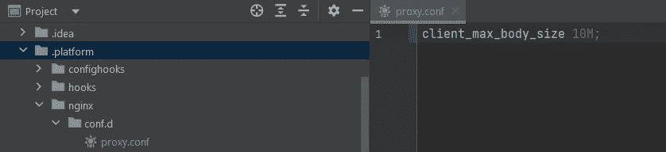

# 如何修复 AWS Elastic Beanstalk 上 Nginx 后面的应用程序中的错误 413

> 原文：<https://betterprogramming.pub/how-to-fix-error-413-in-apps-behind-nginx-on-aws-elastic-beanstalk-c68a1ef2c331>

## 解决了使用 Nginx 作为反向代理时“413 请求实体太大”的错误


穆罕默德·拉赫马尼在 [Unsplash](https://unsplash.com?utm_source=medium&utm_medium=referral) 上的照片

我最近处理了一个运行在 AWS Elastic Beanstalk 上并使用 Nginx 作为反向代理的应用程序的错误 413。当客户端发出的请求超过 web 服务器大小限制时，Nginx 会生成此错误。我在网上找到了这个问题的几种可能的解决方案，但是都没有解决。

经过几次尝试，我终于找到了一个解决方案，也是由官方 AWS EB 文档支持的。

现在让我们来看看“413 请求实体太大”错误是什么，以及如何在 Nginx 中和当 Nginx 作为 AWS Elastic beanstalk 上的反向代理时解决它。

# 什么是 HTTP 错误 413？

> HTTP `413 Payload Too Large`响应状态代码表明请求实体大于服务器定义的限制；服务器可能会关闭连接或返回一个`[Retry-After](https://developer.mozilla.org/en-US/docs/Web/HTTP/Headers/Retry-After)`头字段。—[MDN“413 有效负载过大”页面](https://developer.mozilla.org/en-US/docs/Web/HTTP/Status/413)

注意，HTTP `413 Payload Too Large`状态代码[之前被称为](https://www.rfc-editor.org/rfc/rfc2616#section-10.4.14)T3。详细来说，记住大多数情况下，还是这么叫的。因此，如果您遇到“请求实体太大”错误，您可以假设这是一个 HTTP `413 Payload Too Large`错误。

查看这篇文章，了解如何修复 Node.js 上的 HTTP 错误 413。

[](https://javascript.plainenglish.io/how-to-fix-413-request-entity-too-large-error-in-node-js-226c0070e4f4) [## 如何修复 Node.js 中的“413 请求实体太大”错误

### 解决 Express 中的 HTTP“413 有效负载过大”错误

javascript.plainenglish.io](https://javascript.plainenglish.io/how-to-fix-413-request-entity-too-large-error-in-node-js-226c0070e4f4) 

# 修复 Nginx 中的错误“413 请求实体太大”

如前所述，Nginx 只接受有效负载小于 MB 的请求。这个限制性的限制是“413 请求实体太大”错误的原因。为了避免这种情况，您可以简单地将`client_max_body_size`选项设置为一个更大的值。

为此，您必须编辑`/etc/nginx/nginx.conf`文件。

将`http`块中的`client_max_body_size`设为影响所有虚拟主机:

在`server`块中设置`client_max_body_size`以影响特定网站或网络应用。代码如下:

在`location`块中设置`client_max_body_size`以影响特定网站或 web 应用程序的特定目录。代码如下:

现在，保存`/etc/nginx/nginx.conf`文件，并使用以下命令重启 Nginx web 服务器以应用最近的更改:

```
systemctl restart nginx service nginx restart
```

恭喜你。您刚刚将 Nginx 请求实体大小限制从 1MB 扩展到 10MB。

# 在 AWS Elastic Beanstalk 上配置 Nginx 以避免错误 413

不幸的是，要将上述解决方案应用到 AWS Elastic Beanstalk 上使用 Nginx 作为反向代理的应用程序，您应该在每个实例上手动配置 Nginx。

每个 AWS EB 实例都是从头开始创建的，不与其他实例共享 web 服务器配置。因此，每次添加新实例时，您可能需要通过 SSH 来配置 Nginx，如前所示。你可以想象，这不是一个可行的解决方案。

幸运的是，正如在[“扩展 Elastic Beanstalk Linux 平台”](https://docs.aws.amazon.com/elasticbeanstalk/latest/dg/platforms-linux-extend.html)文档页中所解释的，AWS Elastic Beanstalk 允许您在用作反向代理时扩展默认的 Nginx 配置。这个自定义配置由所有 AWS EB 实例共享。

按照以下步骤扩展 AWS Elastic Beanstalk 上的 Nginx 默认配置，以避免“413 请求实体太大”错误。

1.  确保您的应用程序源代码包有一个`.platform`文件夹。如果不存在，请创建它。
2.  在应用程序源代码包的`.platform/nginx/conf.d/`路径中创建一个`XXX.conf`配置文件。您可以随意命名这个`.conf`文件。比如你可以叫它`proxy.conf`。
3.  如下初始化您的`.conf`文件:

这是您的应用程序源代码包中的`.platform`文件夹现在的样子:



`.platform/nginx/conf.d/proxy.conf`

瞧啊！当 AWS Elastic Beanstalk 作为反向代理使用 Nginx 时，您刚刚定义了一个扩展配置来避免 413 错误。

# 结论

在本文中，您看到了什么是 HTTP 错误 413 以及它为什么会出现。具体来说，您有机会学习如何修复 Nginx web 服务器上的“413 请求实体太大”错误。此外，您还了解了如何使用 Nginx 作为反向代理将该解决方案应用于 AWS Elastic Beanstalk 环境。

感谢阅读！我希望这篇文章对你有所帮助。请随意留下任何问题、评论或建议。