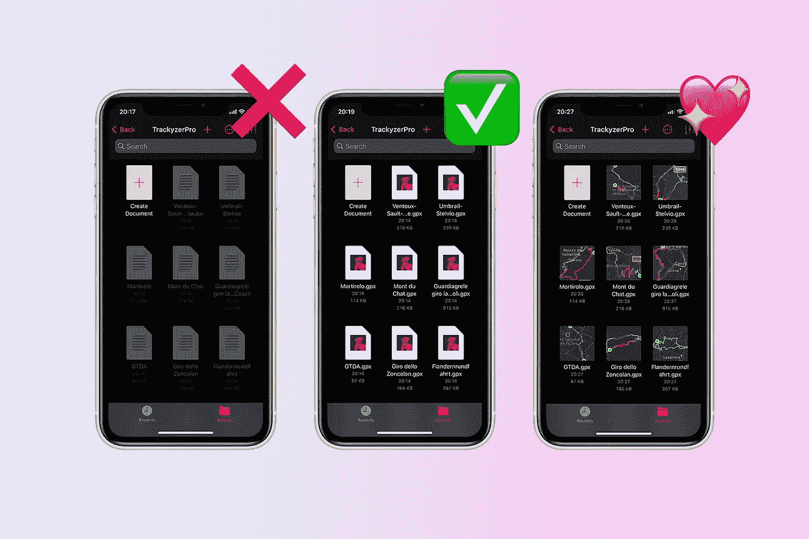
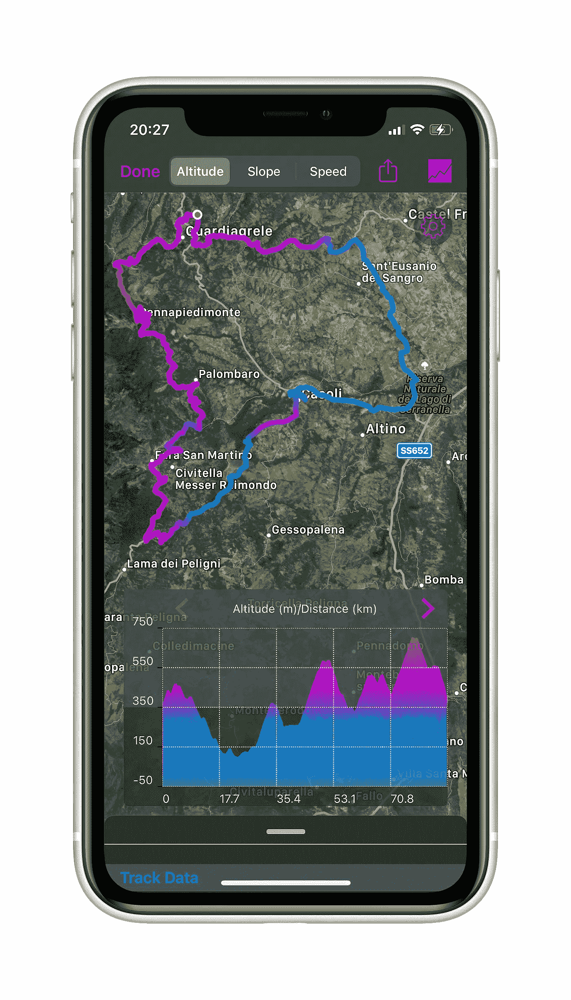
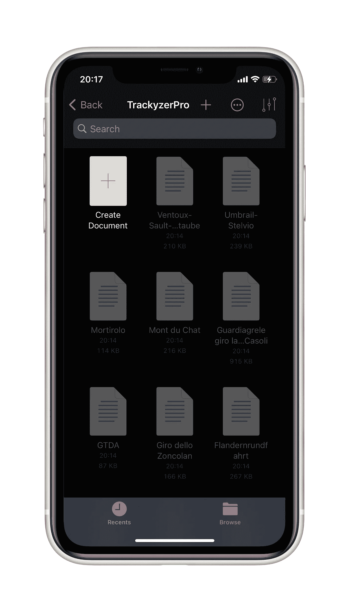
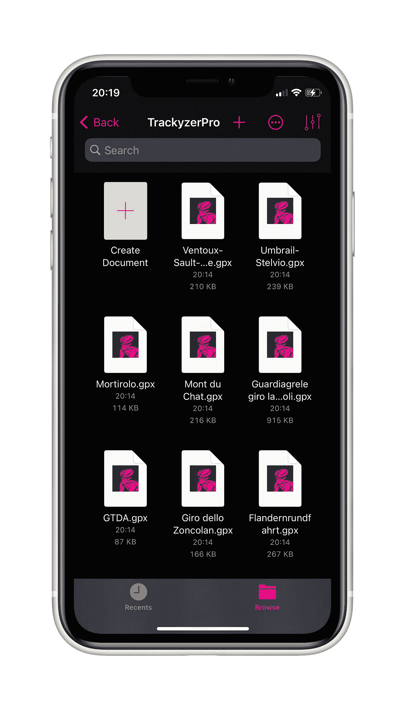
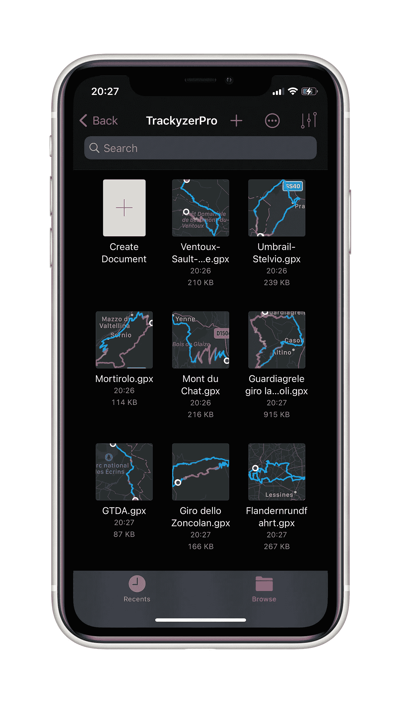

# 如何修复 iOS 文档浏览器和选择器上的灰色图标

> 原文：<https://betterprogramming.pub/how-to-fix-greyed-icons-on-ios-document-browser-and-picker-8dea8a76d6e7>

## UIDocumentBrowserViewController 支持的统一类型标识符的正确配置



图片由作者提供。

你可能知道，安装在 iOS 上的应用程序，出于安全原因，被限制在应用程序沙箱中。这意味着从 iOS 应用程序中，您只能访问应用程序本身生成的文件或包含在应用程序文件夹中的文件。

为了帮助开发人员，UIKit 在 iOS 上提供了两个标准的 UI 解决方案，以访问来自 app 文件夹和云提供商的文件:

*   [UIDocumentBrowserViewController](https://developer.apple.com/documentation/uikit/uidocumentbrowserviewcontroller)是苹果标准视图控制器，用于管理 iOS 上的文档，浏览云资源并对其执行操作。
*   [UIDocumentPickerViewController](https://developer.apple.com/documentation/uikit/uidocumentpickerviewcontroller)是标准视图，设计用于导入、导出、打开或移动文件。

# 文档和教程

Apple 已经提供了很好的使用示例，我建议您阅读官方文档来了解如何使用它们:

**UIDocumentBrowserViewController**

*   [向您的应用添加文档浏览器](https://developer.apple.com/documentation/uikit/view_controllers/adding_a_document_browser_to_your_app)
*   [设置文档浏览器应用](https://developer.apple.com/documentation/uikit/view_controllers/adding_a_document_browser_to_your_app/setting_up_a_document_browser_app)
*   [展示所选文件](https://developer.apple.com/documentation/uikit/view_controllers/adding_a_document_browser_to_your_app/presenting_selected_documents)
*   [启用文档共享](https://developer.apple.com/documentation/uikit/view_controllers/adding_a_document_browser_to_your_app/enabling_document_sharing)
*   [为自定义文件格式构建文档浏览器应用](https://developer.apple.com/documentation/uikit/view_controllers/building_a_document_browser_app_for_custom_file_formats)

**UIDocumentPickerViewController**

*   [提供对目录的访问](https://developer.apple.com/documentation/uikit/view_controllers/providing_access_to_directories)

**WWDC**

[https://developer.apple.com/videos/play/wwdc2018/216/](https://developer.apple.com/videos/play/wwdc2018/216/)

# 我的用例:GPX 轨迹浏览器

UIDocumentBrowserViewController 的经典用例是作为特定文件类型的查看器。

例如，我用它构建了一个名为 [Trackyzer Pro](https://apps.apple.com/us/app/id1465569363) 的应用程序，这是一个 GPX 浏览器，为骑自行车的人提供丰富的坡度、速度和海拔数据图形。该应用程序可以将训练另存为 GPX，或者使用文档浏览器打开任何带有曲目的 GPX 文件。



track yzer Pro-GPX 可视化工具

# 灰色图标

我按照苹果公司提供的最佳实践和教程开发了我的应用程序，一切似乎都是正确的，直到我把我的应用程序安装在一个真实的设备上。

现在，大多数骑自行车的人有不止一个应用程序来导入 GPX 文件，结果是在某些情况下，应用程序内的文件浏览器显示灰色图标。

一旦图标在文档浏览器中变灰，用户就无法从应用程序中打开任何文件。



图片由作者提供。

深入探讨一下我在支持博客上看到的[这篇文章](https://developer.apple.com/forums/thread/118932):

> 我们知道您在类型定义方面存在问题。gpx 文件。目前，还没有公认的统一类型标识符。gpx 文件和不同的开发者已经定义了他们的。gpx 声明不同。这意味着，如果两个应用程序安装在同一台设备上，声称可以打开不同定义的文件，它们将无法正确交互:从用户的角度来看，这些应用程序中只有一个看似随机选择的应用程序能够打开这些文件。”

GPX 格式在这里被定义为，它是一个 XML 文本文件。所以在不同的条件下，根据用户安装的应用程序，iOS 可能会将其显示为文本图标、XML 图标或自定义图标。

这个问题似乎没有解决办法，但我找到了一个。

# 什么是统一类型标识符？

根据苹果[官方文档](https://developer.apple.com/library/archive/documentation/FileManagement/Conceptual/understanding_utis/understand_utis_conc/understand_utis_conc.html#//apple_ref/doc/uid/TP40001319-CH202-SW1)，一个统一的类型标识符:

> 是唯一标识被认为具有“类型”的一类实体的字符串。例如，对于文件或其他字节流，“类型”是指数据的格式。对于包和包之类的实体，“类型”是指目录层次结构的内部结构。
> 
> 最常见的情况是，UTI 为所有应用程序和服务都可以识别和依赖的数据提供一致的标识符，从而无需跟踪所有现有的数据标记方法。"

在`Info.plist`中声明的 GPX UTI 的例子:

```
**<dict>
 <key>**UTTypeConformsTo**</key>
 <array>
  <string>**public.content**</string>
  <string>**public.data**</string>
  <string>**public.xml**</string>
 </array>
 <key>**UTTypeDescription**</key>
 <string>**GPS Exchange Format (GPX)**</string
 <key>**UTTypeIconFiles**</key>
 <array>
 <string>**GPX.icns**</string>
 </array>
 <key>**UTTypeIdentifier**</key>
 <string>**com.topografix.gpx**</string>
 <key>**UTTypeReferenceURL**</key
 <string>**http://www.topografix.com/GPX/1/1**</string>
 <key>**UTTypeTagSpecification**</key>
 <dict>
 <key>**public.filename-extension**</key>
 <array>
 <string>**gpx**</string>
 </array>
 <key>**public.mime-type**</key>
 <array>
 <string>**application/gpx+xml**</string>
 </array>
 </dict>
</dict>**
```

这基本上说明了 GPX 文件可以是:

*   扩展名为`.gpx`的文件
*   一个哑剧类型`application/gpx+xml`
*   符合`public.xml, public.text, public.data`的文件，引用 url 如下:`[http://www.topografix.com/GPX/1/1](http://www.topografix.com/GPX/1/1)`

但是任何人都可以定义自己的 UTI。通过这种方式，没有简单的方法来获取应用程序的类型所有者。

# 我如何知道另一个应用程序是否正在使用我的 UTI？

Apple 提供了一个函数来获取类型[UTTypeCreatePreferredIdentifierForTag](https://developer.apple.com/documentation/coreservices/1448939-uttypecreatepreferredidentifierf)的首选 UTI:

```
**func** preferredUTI(ext: String) -> String? {**let** theUTI = UTTypeCreatePreferredIdentifierForTag(kUTTagClassFilenameExtension,ext **as** CFString,**nil**)?.takeRetainedValue()**return** theUTI **as** String?}
```

如果你使用它，你会发现当有另一个应用程序声明的首选 UTI 时，图标是灰色的。

通过使用函数[uttypecreatelidentifiersfortag](https://developer.apple.com/documentation/coreservices/1447261-uttypecreateallidentifiersfortag)，可以知道系统中声明的所有 uti。

以下示例实现了一种获取特定文件扩展名的所有 UTI 标识符的方法:

```
**func** getUTTypeCreateAllIdentifiers(for tag: String) -> [String] {**let** cfArray = UTTypeCreateAllIdentifiersForTag(
                 kUTTagClassFilenameExtension,
                 tag **as** CFString,
                 **nil** )?.takeRetainedValue()**let** utis:[String] = cfArray **as**? [String] ?? []**return** utis;}
```

注意:这些函数在 iOS14 中被弃用，但是有一个新的类型叫做 [UTTypeReference](https://developer.apple.com/documentation/uniformtypeidentifiers/uttypereference) ，在其中你会找到等价的方法。

# 灰色图标:解决方案

现在我们明白了发生了什么，让我们找到一个解决办法。

阅读这些类的文档，您会在 UIDocumentBrowserViewController 上发现这一点:

> `init(forOpeningFilesWithContentTypes allowedContentTypes: [[String](https://developer.apple.com/documentation/swift/string)]?)`
> 
> `allowedContentTypes`
> 
> 统一类型标识符(UTIs)的数组。文档浏览器只能打开这些 uti 指定的文档类型。如果您通过了`nil`，浏览器将使用应用程序的`Info.plist`文件中的`CFBundleDocumentTypes`键指定的文档类型

对于 UIDocumentPickerViewController:

> `init(documentTypes allowedUTIs: [[String](https://developer.apple.com/documentation/swift/string)], in mode: [UIDocumentPickerMode](https://developer.apple.com/documentation/uikit/uidocumentpickermode))`
> 
> `allowedUTIs`
> 
> 统一类型标识符(UTIs)的数组。uti 是唯一标识文件类型的字符串。

Apple 示例是用故事板准备的，这意味着 UIDocumentBrowserViewController 是用默认实现实例化的，这意味着`nil`被作为`allowedContentTypes`传递，这将只使用您声明的 UTI 过滤文件，而不使用另一个应用程序声明的首选 UTI。

如果您在 init 方法中传递所有的 uti，问题就解决了，因为应用的过滤器不仅仅是您在`CFBundleDocumentType`中定义的，还包括所有注册的 uti。

```
//UIDocumentViewControllerlet utis = **func** getUTTypeCreateAllIdentifiers(for: "gpx")
let viewController = UIDocumentViewController(*forOpeningFilesWithContentTypes*: utis)//UIDocumentPickerViewControllerlet viewController = UIDocumentPickerViewController(documentTypes: utis, in: .open)
```



UIDocumentBrowserViewController—灰色图标已修复

# 结论

本文讨论了一个具体的问题，但通过阅读官方文档，这个问题并不明显。

这两个组件的潜在用途非常惊人，但挑战在于如何以正确的方式配置它们。

可以添加特定的动作和不同的风格，可以预览文档并共享它们。我把探索更多选择的冒险留给你。

感谢阅读。



Trackyzer Pro —具有文档预览功能的 UIDocumentBrowserViewController