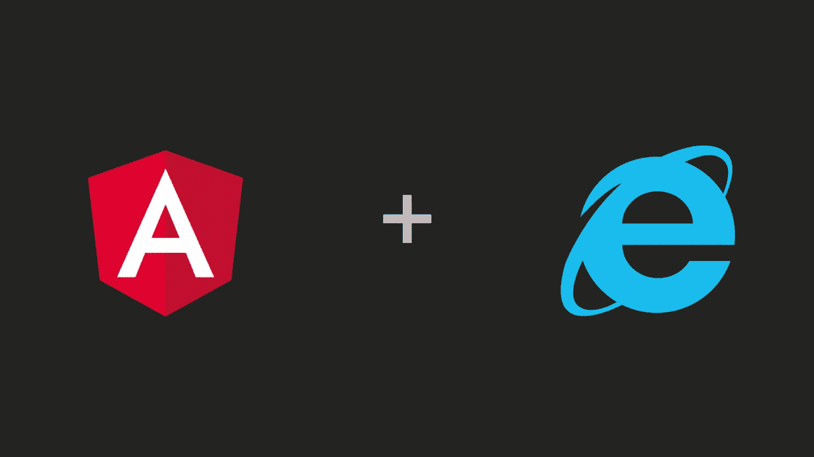
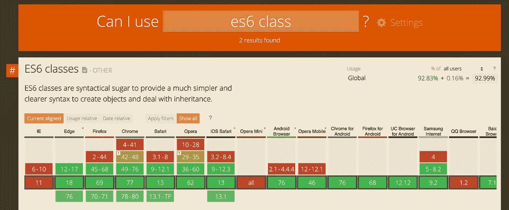

# 如何在 IE11 中修复不工作的 Angular 应用程序

> 原文：<https://betterprogramming.pub/how-to-fix-your-angular-app-when-its-not-working-in-ie11-eb24cb6d9920>

## 使用聚合填充支持旧浏览器中的新功能

虽然 Internet Explorer 11 已经被弃用了一段时间，但微软仍然提供安全更新和技术支持。然而，IE11 不支持许多已经在其他浏览器中工作的新功能，如谷歌 Chrome，或未来将推出的新功能。这就是为什么如果你还想让你的应用程序在 IE11 中工作，就必须使用 polyfills。

有时，您的应用程序可能会在 IE11 中抛出错误，即使它在其他浏览器中工作正常。角度应用程序不工作的原因有很多，包括:

*   `polyfills.ts`中缺少聚合填充。
*   使用 IE11 不支持的[类型脚本](https://www.typescriptlang.org/) `target`版本
*   使用 IE11 不支持的 TypeScript `target`版本导入第三方依赖项

# **传统浏览器缺失的聚合填充(IE11)**

**IE11 需要 poly fill**，因为[不支持 ES2015 及以后的特性](http://es6-features.org/#Constants)。存在于每个 [Angular](https://angular.io/) 项目中的`polyfills.ts`文件是导入所有必需的多面填充的合适位置。一些聚合填充可能会被注释掉，因为现代浏览器不需要它们，所以您需要删除注释。此外，您可能需要安装额外的聚合填充，以支持 IE11 不支持的功能(例如 [CSS 自定义属性](https://developer.mozilla.org/en-US/docs/Web/CSS/--*))。

# 聚合填料的不同负载

从 Angular CLI 8 开始，有一个新功能叫做[差动加载](https://blog.ninja-squad.com/2019/05/29/angular-cli-8.0/)。如果你是通过 CLI 更新的，默认情况下运行`ng serve`会针对 ES2015，IE11 和更老的浏览器都不支持。当运行产品构建时，您将获得两种包:一种用于现代浏览器，另一种用于 IE11 之类的遗留浏览器。这意味着现代浏览器将不得不下载更少的数据，因为它们支持最新的 ES 特性。请记住，以下步骤仅在开发时需要，在部署时不需要。以下是在 IE11 中进行开发的方法:

1.  添加一个新的`tsconfig-es5.app.json`文件。
2.  更新`angular.json`配置。
3.  运行您的应用程序:`ng serve --configuration es5`。为了方便起见，我建议在`package.json`中添加一个运行脚本。

## 使用不支持的 JavaScript 功能

我们已经了解了 polyfills，它帮助我们在最初不支持现代 JavaScript 特性的浏览器中使用这些特性。但是，如果不在每个浏览器中进行手动测试，你怎么能预先知道某个特性在特定的浏览器上是否受支持呢？

[MDN(Mozilla Developer Network)](https://developer.mozilla.org/en-US/#)是一个伟大的资源，不仅包含 web 开发相关教程，还包含 JavaScript 参考，包括浏览器兼容性数据。[我可以使用](https://caniuse.com/#home)为您提供浏览器兼容性数据和浏览器使用数据。使用这些网站，你会知道你所使用的功能是否在网络浏览器中被本地支持。

还有像 linters 这样的静态代码分析工具，它可以让你知道这个 API 并不是在所有的浏览器中都可用。

我最近偶然发现了 [es-check](https://github.com/dollarshaveclub/es-check) ，这是一个小的 JavaScript 库，用 shell 命令对照特定版本的 ECMAScript 检查 JavaScript 文件。如果指定文件的 ES 版本与 ES Check 命令中传递的 ES 版本参数不匹配，ES Check 将抛出错误并记录与检查不匹配的文件。我已经写了一篇关于如何在应用程序开发过程中结合这一点的文章。

 [## 检查您的 JavaScript 包以获得浏览器支持

### 不要向使用旧浏览器的用户发送损坏的代码

medium.com](https://medium.com/better-programming/check-your-javascript-bundles-for-browser-support-d769c1fca4c) 

## 如何处理 IE11 及更老版本浏览器中的 CSS 问题？

CSS 问题不是这篇文章的主要焦点，这就是为什么我只简单地谈论它。通常，如果浏览器不支持 CSS 属性，样式看起来会很奇怪(例如，元素定位错误)，但页面很可能仍然工作。

对于像 [Flexbox](https://developer.mozilla.org/en-US/docs/Web/CSS/CSS_Flexible_Box_Layout/Basic_Concepts_of_Flexbox) 这样的属性，您可以使用供应商前缀**。有像 [**Autoprefixer**](https://github.com/postcss/autoprefixer) 这样的工具可以帮助你编写在大多数浏览器中都能工作的 CSS。幸运的是，Angular 可以自动添加厂商前缀，如果配置的话。**

# 结论

感谢你阅读这篇文章。如您所见，在 IE11 中测试您的应用程序时，有一些问题。虽然概述的步骤是针对角度应用程序的，但是解决方案的思想也适用于其他框架。如果你有问题，请在评论中告诉我。