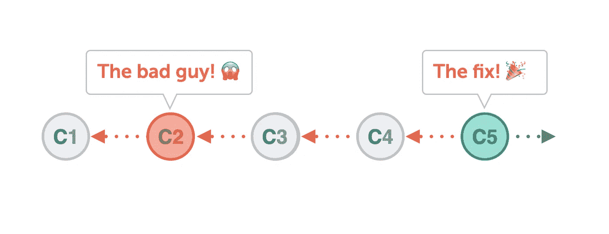
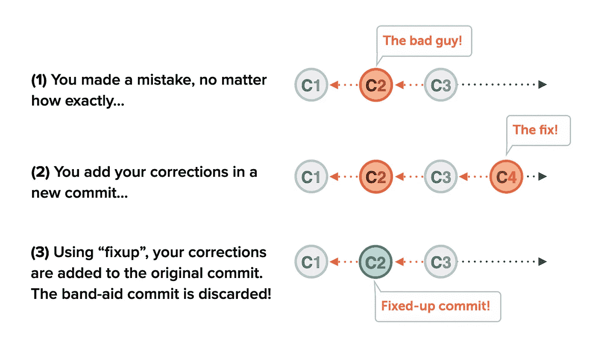
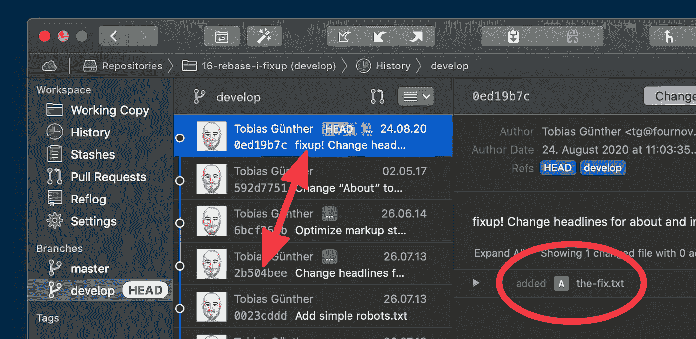
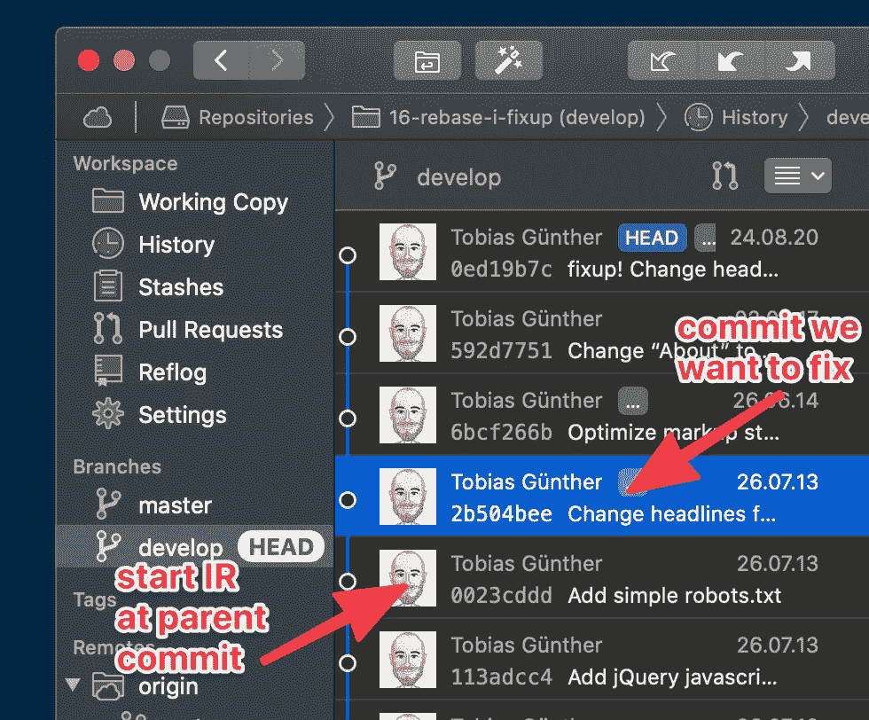
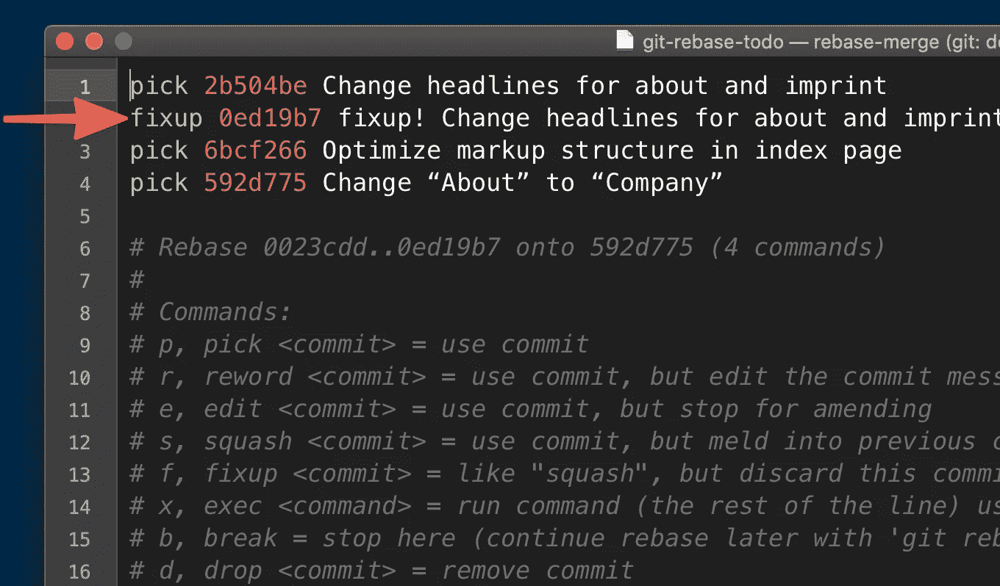
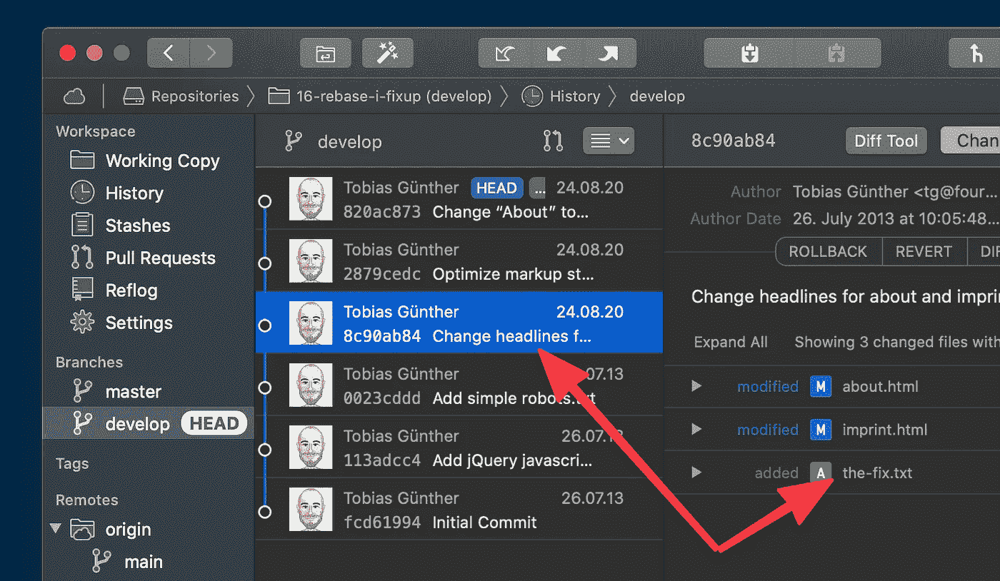

# 如何在 Git 中修复你的错误(并且不留痕迹)

> 原文：<https://betterprogramming.pub/how-to-fix-your-mistakes-in-git-and-leave-no-trace-8919d112064b>

## 发现 git 中的修复工具，以优雅的方式从错误中恢复


Dana Vollenweider 在 [Unsplash](https://unsplash.com/photos/GzYQll7ojIM) 上拍摄的照片。

你终于找到了:一个老提交的 bug！幸运的是，你心中已经有了一个解决方案。所以你只需要在新的提交中修复你的错误，一切都很好，对吗？



作者照片。

不完全是。如果你遵循这个策略一段时间，你的提交历史将会*被这些小小的“创可贴”提交弄得乱七八糟。它们没有任何语义上的意义——而且它们本来就不应该出现在那里！当其他人(或者过一段时间后，您)查看提交历史时，他们会看到有缺陷的原始提交，抓耳挠腮，直到后来，在提交日志的某个地方，发现一个更正了原始提交错误的提交。*

如果我们能在最初的*提交中纠正我们的错误，那不是很好吗？好消息是:你可以！*

在本文中，我们将研究作为 Git 交互式 Rebase 命令一部分的修复工具，并了解它如何允许我们修复旧提交中的错误。

# 关于交互式 Rebase 的一些话

在我们进入细节和处理一个示例案例之前，我认为先对交互式 Rebase 做一个非常简单的介绍是有帮助的。

你可以说交互式 Rebase 是一套工具，它们都有一个目的:它们允许你在事后纠正你的提交历史。您可以使用交互式 Rebase 做许多有趣的事情:删除旧的提交、更改它们的消息、合并多个提交等等。我们不会深入这些其他用例，但我会在本文末尾链接一些好的阅读材料。

最后一个警告:正如我们马上要做的，操纵您的提交历史最好是在还没有在远程存储库上共享的提交上执行。这样做的原因很简单:如果你已经和你的队友分享了提交，那么他们很可能已经把他们的新工作建立在这些提交的基础上了。如果你在事后操纵他们，你可以期待眼泪和脏话。

所以，为了过上长久而快乐的生活，我建议你只在本地提交历史上使用这些工具——在集成到共享团队分支之前使用*。*

# 有很多方法可以把事情搞砸

正如您无疑知道的，有一百万种方法可以搞乱您的代码。您可能忘记添加文件，或者应该删除一个文件。也许你应该删除一些行或你只是产生了一个错别字！修正工具的美妙之处在于，它并不影响到底发生了什么。我们犯了一个错误，现在我们正在改正。

正如我们已经讨论过的，我们的自然倾向是简单地产生一个新的承诺来修复我们的不幸。这种方法的问题是，每次我们这样做，我们的提交历史都会变得越来越脏——以至于很难跟踪和理解。

但是这里有一个好消息:使用修正，我们可以像这样继续工作(简单地产生一个包含修正的新提交),但是最后有一个干净的提交历史！

以下是 Fixup 如何做到这一点:



作者照片。

神奇的事情发生在第三步:Fixup 将难看的创可贴提交中的更改应用于原始的创可贴提交，然后丢弃创可贴提交。我们留下了一个干净的提交历史，没有任何错误的痕迹！

让我们看看所有这些在实践中是如何工作的！

# 第一步:制作创可贴

第一步是采取一切必要措施来纠正错误。您将会想要跳入您的编辑器并进行修复。对于我们的例子，假设我们的修正包含在`the-fix.txt`中。我们简单地将它添加到暂存区，并像普通提交一样提交它— *几乎*:

```
$ git add the-fix.txt
$ git commit — fixup 2b504bee
```

这里唯一的特色是`commit`命令的`--fixup`选项。正是在这里，我们提到了我们打算修复的中断的原始提交。您可以按如下方式阅读该命令:“这个新提交将使用散列值`2b504bee`修复旧提交。”

让我们使用 Git 桌面 GUITower 来看看我们的提交历史:



你会看到最新的产品是我们刚刚生产的创可贴。没什么特别的，除了它的提交信息。这是我们想要修复的*旧提交*的消息，由`fixup !`预先添加。

我们都设置好了，现在可以开始交互式重建基础会话来执行*实际的*修复操作。

# 步骤 2:用交互式重定基础进行修复

要开始交互式 Rebase 会话，我们首先必须再次查看我们的提交历史:



在上面的屏幕截图中选择了我们想要更正的提交。为了能够操作 Git 历史的这一部分，我们需要至少在错误提交的*父*修订版开始交互式 Rebase 会话！您可以提供提交散列，或者简单地提供在当前头提交之后有多少次提交:

```
# Option (a): provide a specific commit hash:
$ git rebase -i — autosquash 0023cddd# Option (b): provide how far behind the HEAD commit it is:
$ git rebase -i — autosquash HEAD~4
```

无论您选择哪种方式，`--autosquash`选项是这个工作流程中的另一个重要因素。还记得我们的邦迪承诺被赋予的`fixup !`前缀吗？当`autosquash`选项发现带有这样前缀的提交时，它*会自动*知道需要进行修正。

执行上述命令之一后，交互式重建基础会话将启动，您将看到一个类似于以下窗口的编辑器窗口:



文件顶部的行是您刚刚选择的提交(通过提供一个提交散列或 HEAD 后面的一个范围)。好消息是 Git 已经为我们完成了所有繁重的工作:它用`fixup` action 关键字标记了我们的邦迪提交，并将其移动到正确的行。后者需要一个简短的解释:`fixup`动作关键字通过将带标记的提交(这里:第 2 行)与之上的提交*(这里:第 1 行)结合起来工作。由于 Git 已经知道了创可贴和最初的错误提交，它已经为我们准备好了一切。*

除了保存这个编辑器窗口，然后关闭它之外，我们别无选择。然后，交互式 Rebase 会话结束，留给我们以下场景:



有两件事值得注意:

1.  旧的、错误的提交现在在其变更集中显示`the-fix.txt`——就像我们一开始希望的那样！
2.  创可贴承诺没了。Git 在将包含的更改应用到原始提交后丢弃了它。

总而言之，我们最初的提交现在是正确的(就像它从未有过错误一样)，我们的提交历史是干净的，没有任何那些难看的邦迪式的提交。

请随意打开上好的香槟，因为这当然是值得庆祝的理由！

# 发现交互式 Rebase 的力量

我们几乎没有触及交互式 Rebase 能为您做什么的表面！这是一个非常强大的工具，可以帮助您在 Git 存储库中生成一个更干净、更清晰的提交历史。

如果你想深入了解，这里有一些(免费)资源可能会有帮助:

*   “[Git 急救包](https://www.git-tower.com/learn/git/first-aid-kit?utm_source=betterprogramming&utm_medium=guestpost&utm_campaign=fix-mistakes-using-interactive-rebase-fixup)”—一系列围绕“用 Git 纠正错误”的不同用例的短片，包括交互式 Rebase。
*   一个关于 CSS 的视频——让自己摆脱困境的技巧。

享受使用 Git 提高工作效率的乐趣！