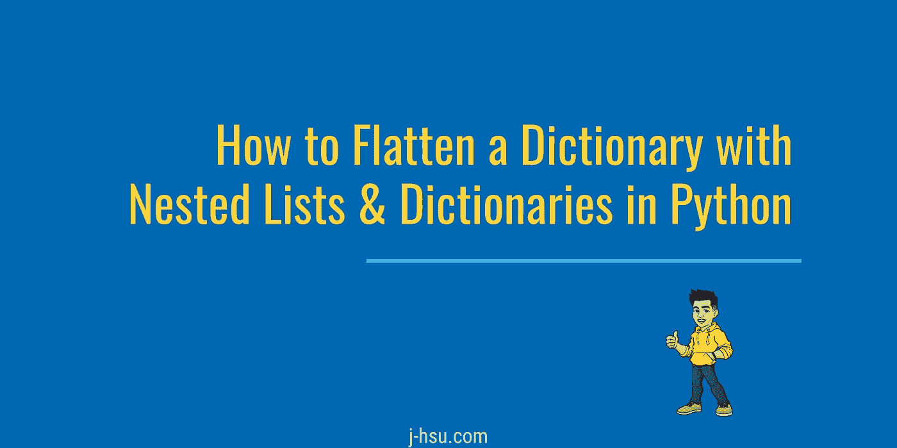

# 如何在 Python 中展平带有嵌套列表和字典的字典

> 原文：<https://betterprogramming.pub/how-to-flatten-a-dictionary-with-nested-lists-and-dictionaries-in-python-524fd236365>

## 学习用自定义分隔符拼合字典，以容纳嵌套列表和字典

您是否想过如何将多层数据结构转换成表格格式？这是一个将字典扁平化的函数，可以容纳嵌套列表和字典。

不包括元组和其他数据类型，因为这主要在操作 JSON 数据时使用。该函数允许自定义分隔符，并将保留术语的顺序。

# 起始结构

我们的函数需要递归才能正常工作。递归是调用自己的过程。

此外，我们将需要使用`collections`库来创建一个`OrderedDict`来保持术语的顺序。这是我们函数的框架:

注意包含了一个`sep`参数，如果没有指定自定义分隔符，该参数将默认为下划线。

`obj`变量用于构建我们的扁平字典，并将在每次递归结束时添加。

在我们的`recurse()`函数中，`parent_key`变量将用于传递当前的键，允许连接先前的键和新的键。

# 概述 recurse()函数

因为我们坚持使用 JSON 兼容的数据，所以有三种可能的数据类型:列表/数组、字典/对象和原始值。

设置好这三个场景，`recurse()`功能就初步成型了。

注意在第 11 行，我们写到`obj`。只有当数据类型是原语，而不是列表或字典时，我们才会写入展平的对象。

# 完成 flatten()函数

充实函数的其余部分，列表和字典的`parent_key`有所不同，因为列表需要索引。如果`parent_key`为空，则只传递当前索引或当前键。

# 测试功能

以下是一些示例数据，包括嵌套列表、字典和值。

当使用上面的数据调用我们的`flatten()`函数时，下面是使用`pprint()`干净地格式化输出的结果:

请注意，嵌套数据结构被标识为原始键，通过分隔符与新键连接在一起。对于嵌套列表，还包括索引。

对于在一个地方的全部功能和测试执行，检查这个[要点](https://gist.github.com/188df03ec6286ad3a0f30b67cc0b8428)。