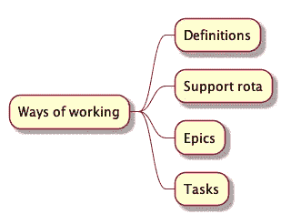
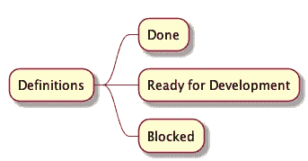

# 为你的敏捷团队制定有效的工作方式

> 原文：<https://betterprogramming.pub/how-to-formulate-effective-ways-of-working-for-your-agile-teams-8e14aa25fe15>

## *你需要和你的敏捷团队一起建立的一套非详尽但重要的原则*

由[安妮·斯普拉特](https://unsplash.com/@anniespratt?utm_source=unsplash&utm_medium=referral&utm_content=creditCopyText)在 [Unsplash](https://unsplash.com/s/photos/work?utm_source=unsplash&utm_medium=referral&utm_content=creditCopyText) 上拍摄

# 为什么“工作方式”很重要？

在管理团队的日常运作时，拥有一份一致认可的工作方式宣言将有助于保持引擎尽可能平稳地运转。将这一点整理成一个现成的文档，可以方便地提醒团队什么是约定的工作方式。

商定的“工作方式”宣言应该随时可用，以提醒团队如何有效地一起工作。这将是一份活的文件，必须根据你的团队的情况不断更新。工作方式通常是在敏捷团队的启动阶段开始的。理想情况下，在 sprint 回顾、健康检查和团队更新会议期间，最好讨论工作方式的更新。

作为工程经理或主管，您需要帮助您的团队尽早建立工作方式，确保团队为冲刺阶段的成功做好准备——这些工作方式需要符合您组织的工程原则和生产标准。

这个上下文中的*团队*指的是一个组织中一群人的最小单位。例如，如果你使用的是部落和小队模型，那么小队就相当于本文中的*队*。

让我们在接下来的章节中讨论工作原理的基本方法。

思维导图的工作方式。

# 1.票证或卡状态的定义

在工作票时， *Done* 的定义是必不可少的；然而,*进行中*和*准备开发*意味着什么也很重要。当报告分配给您的任务的状态时，如果没有正确定义它的含义，有时它对其他团队成员的确切含义可能是模糊的。根据我们使用的工具，我们可以尽可能详细地描述状态或泳道。但是我们只能拥有我们使用的方法允许配置的泳道数量。

例如，团队应同意当票证的状态为“完成”时，根据任务的类型，这可能意味着:

*   如果是新特性:它被合并到 master，并在生产中运行。
*   如果这是一个实验:这个特性已经进入生产阶段，并向 20%的用户推广。
*   如果是一个尖峰:团队建立了包含所有必要信息的任务，并对其进行了审查。

*准备开发*的定义可能意味着:

*   故事有产品经理提供的需求。
*   应该将工单分解成可操作的子任务。

与你的团队就这些定义达成一致将会节省你在日常谈话中的时间，以及将来不必要的澄清和检查。

定义思维导图。

# 2.支持轮值表——每个 Sprint 都有专人负责“支持”

随着您的产品和服务的增长，客户支持单、错误报告、照常营业的工作(BAU)、重复的任务和来自其他团队的询问在某一点上将开始感到难以管理。这是一个好问题——这意味着你正在做重要的事情。尽管通过提供足够的文档或 FAQ 文档以及自动化工具可以部分解决这个问题，但是它仍然会占用团队每周冲刺的大量时间。这些好问题可能会随着时间的推移而积累，并降低团队的速度。

解决这个问题的一个方法是在你的团队中建立一个支持轮值表。根据你的喜好，每次冲刺的轮值表都会改变。每次冲刺，都会有一个人在“支持”目的是这个被指派的支持人员将负责充当团队其他成员的缓冲。“支持”应该像 BAU 一样优先考虑上述任务，回答其他组的询问，并对客户支持票证进行分类。根据支持任务的数量，sprint 票证对于被分配支持的人来说应该是次要的。请注意，这不同于非工作时间支持责任；这是正常工作时间，上午 9 点到下午 5 点的日间支持。尽管某些职责(如响应警报和寻呼)可能会重叠，但这并不要求指定人员在凌晨 3 点响应事件

通过让某人主要为你的团队处理非冲刺任务，让你的团队专注于冲刺工作，并在处理冲刺任务时尽量减少可能影响他们“流程”的小任务和干扰。

我很乐意在另一篇文章中更详细地介绍这一支持轮换话题，如果您觉得有用，请留下评论或联系我。

# 3.制作史诗:最佳实践

一个史诗可以是一个项目，一个新产品或新功能，或者一个需要几周或几个月才能完成的计划。它通常涉及团队以外的利益相关者和合作者。Epics 需要指定工程师的承诺和领导。任何被指派领导史诗的人都应该有足够的经验和技能来完成史诗；因此，他们通常给高级工程师或那些准备接受一个。有时，当史诗由于其复杂性而没有得到适当的管理时，可能会导致团队内部的沟通不畅和不一致，从而延迟其执行。曲解的需求或“范围蔓延”形式的其他问题也会对执行不佳的史诗产生影响。

为了避免上面提到的陷阱，您的团队必须就一组最佳实践达成一致。这些最佳实践应该符合您组织的标准，以适应您的团队和更广泛的群体偏好。

以下是您的团队在开发 epic 时可以采用的一些最佳实践示例:

1.  对于任何新的 epic，产品经理都必须召开“启动”会议，为团队搭建舞台，让每个人都为未来做好准备。会议也给团队一个提问的机会。
2.  为史诗创建一个临时松弛通道。一个宽松的渠道是必不可少的，尤其是当你需要跨多个团队和利益相关者工作的时候。例如，您可以像下面这样命名您的 Slack 通道#tmp- < Epic or project name>。
3.  确保及早发现并解决潜在的阻碍因素。
4.  启动前通知利益相关方。利益相关者也可以帮助识别#2 中提到的阻碍因素。
5.  创建工程设计文档并进行设计评审。
6.  在决策日志中记录所有技术决策。

根据你的团队的情况，这个列表还可以继续下去。这里的要点是就如何有效地工作在 epic 上的一组最佳实践达成一致。

# 4.处理任务或用户故事:最佳实践

用户故事和任务组成了一部史诗。一个任务或故事在 sprint 中是可以实现的，尽管我们都知道情况并不总是这样。有时，如果评估不当、受阻或执行耗时，用户故事可能会溢出到下一个 sprint。有时，被指派的工程师花了太多的时间孤立地解决问题，而不寻求帮助。

即使任务比史诗小，完成任务的延迟可能会累积并阻碍团队的进展，这可能会导致总体团队目标或史诗的进一步延迟。

以下是处理任务时的一些最佳实践示例:

1.  事先确定对其他小队的依赖。例如，如果你需要改变另一个小队的代码来完成你的任务，提出一个拉请求(PR ),并明确这是一个依赖。如果 PR 比最初商定的时间长，或者没有确认或回复，则通过 Slack 或即时消息跟进。
2.  必要时，提出草稿/WIP 拉动请求以获得早期反馈或开始讨论。
3.  如果你在你的任务上坚持工作了 30 分钟，向团队提出。根据任务的复杂程度，如果有人可以与你进行结对编程或 mob 编程会话，请寻求帮助。
4.  如果你的公关花了太多时间在团队内部审核，通过 Slack 提醒特定的人。

*   *如果您是审核者，请确保跟进您的任何变更请求或 PR 意见。*
*   *如果你是一名评审员，并且无法跟进(例如休年假)，请确保通知公关作者，并就后续步骤达成一致。*

上面的一些最佳实践最好地补充了您的代码审查指南和编码实践。

# 结论

通过坚持一致同意的“工作方式”，团队将对一起工作时的良好形象有一个共同的理解。团队有责任遵守集体商定的一套原则和指导方针。