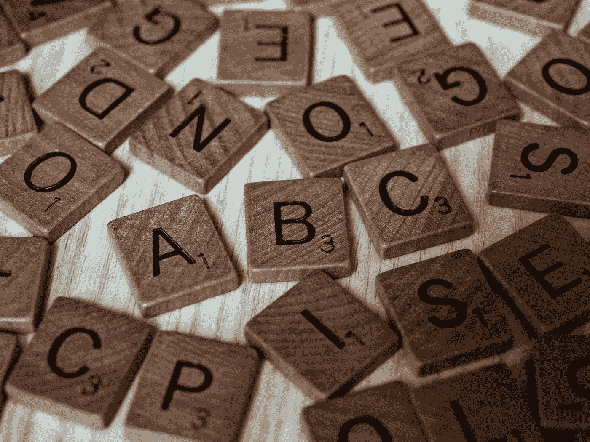

# 如何生成一个字母表 JavaScript 数组

> 原文：<https://betterprogramming.pub/how-to-generate-an-alphabet-javascript-array-eae6940ea646>

## 没有硬编码；自动生成就好！



布雷特·乔丹在 [Unsplash](https://unsplash.com?utm_source=medium&utm_medium=referral) 上拍摄的照片

想象一下，用 JavaScript 构建一个文字游戏，你需要从字母表中随机选取一个字符，但是你不想手工输入所有的字母。(*请告诉我你没有考虑到*)。

不是，我们要生成一个包含字母表(我指的是 [*拉丁字母*](https://en.wikipedia.org/wiki/Latin_alphabet) )所有字符的数组。我们希望尽可能直接、尽可能短地完成这项工作。

我们走吧

## 生成一个包含 26 项的数组

首先，我们需要一个包含 26 项的数组，因为拉丁字母有 26 个字母。我们可以用这段代码简单地做到这一点。

```
[...Array(26)]; 
// returns [...undefined, undefined]
```

## 根据数字得到一个字母

现在我们有了一个包含 26 项的数组，我们需要有一种方法来获取基于这个数组的字母。所以让我们创建一个包含 26 个数字的数组。

```
[...Array(26)].map((_, i) => i); 
// returns [0, 1, 2, 3, 4, 5, 6, 7, 8, 9, 10, 11, 12, 13, 14, 15, 16, 17, 18, 19, 20, 21, 22, 23, 24, 25]
```

根据这些数字，我们会得到一封信。为了实现这一点，我们需要`String.fromCharCode()`(查看 [MDN 文档，了解如何使用 fromCharCode 方法](https://developer.mozilla.org/en-US/docs/Web/JavaScript/Reference/Global_Objects/String/fromCharCode))。

```
[...Array(26)].map((_, i) => String.fromCharCode(i)); 
// returns ['\x00', '\x01', '\x02', '\x03', '\x04', '\x05', '\x06', '\x07', '\b', '\t', '\n', '\v', '\f', '\r', '\x0E', '\x0F', '\x10', '\x11', '\x12', '\x13', '\x14', '\x15', '\x16', '\x17', '\x18', '\x19']
```

## 从字母表中找出正确的字母

但那些角色不是我们想要的。所以我们必须添加更多的东西。W3Schools 提供了一个所有可用信件的列表。我们可以看到 a 在数字 97 上。现在我们可以开始数数了。

```
[...Array(26)].map((_, i) => String.fromCharCode(i + 97)); 
// returns ['a', 'b', 'c', 'd', 'e', 'f', 'g', 'h', 'i', 'j', 'k', 'l', 'm', 'n', 'o', 'p', 'q', 'r', 's', 't', 'u', 'v', 'w', 'x', 'y', 'z']
```

现在我们有了我们的字母表！

## 在大写和小写字符之间选择

如果你想要大写字母而不是小写字母，你应该从 65 位开始。我们来做一个两者都支持的函数。

```
function generateAlphabet(capital = false) {
    return [...Array(26)].map((_, i) => String.fromCharCode(i + (capital ? 65 : 97)));
}
```

在`fromCharCode`方法中，一个三元运算符检查`capital`是否为`false`。注意参数`capital`的默认值是`false`。当值为`true`时，将返回`65`，当值为假时，将返回`97`。所以我们可以像这样轻松地调用函数`generateAlphabet()`而不会出错。

尝试[这个 runkit 示例](https://runkit.com/devbyrayray/how-to-generate-an-alphabet-array-with-javascript)中的函数:

如果你想从字母表中随机抽取一个字母，你可以这样做。

```
function getRandomLetter() {
    const alphabet = generateAlphabet();
    return alphabet[Math.round(Math.random() * alphabet.length)]
}
```

尝试[run kit 示例](https://runkit.com/devbyrayray/get-random-letter-from-alphabet-with-javascript)中的功能:

我希望你在读完这个故事后学到了一些新的东西或者受到了启发去创造一些新的东西！

# 谢谢！


读完这个故事后，我希望你学到了一些新的东西，或者受到启发去创造一些新的东西！🤗

如果我给你留下了问题或一些要说的话作为回应，向下滚动并给我键入一条消息。如果你想保密，请在 Twitter @DevByRayRay 上给我发一条 [DM。我的 DM 永远是开放的😁](https://twitter.com/@devbyrayray)

[**通过电子邮件获取我的文章点击这里**](https://byrayray.medium.com/subscribe) **|** [**购买 5 美元中等会员**](https://byrayray.medium.com/membership)

# 阅读更多


[雷雷](https://byrayray.medium.com/?source=post_page-----eae6940ea646--------------------------------)

## 最新的 JavaScript 和 TypeScript 故事

[View list](https://byrayray.medium.com/list/latest-javascript-typescript-stories-0358ad941491?source=post_page-----eae6940ea646--------------------------------)14 stories