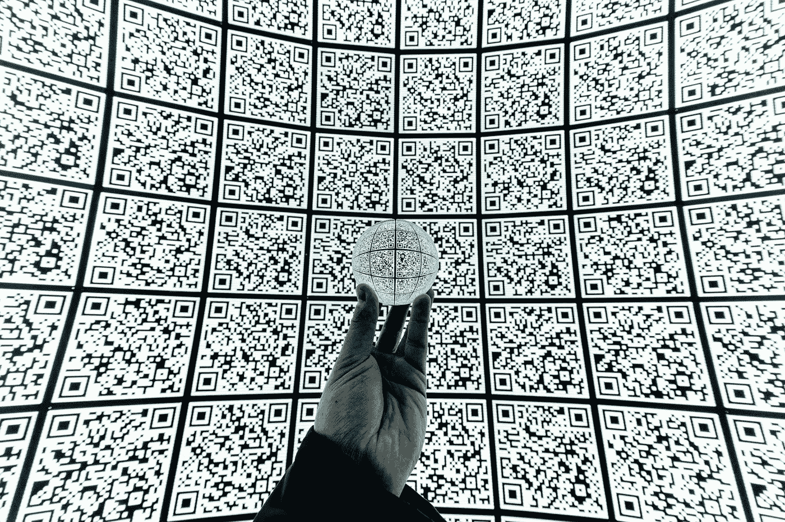
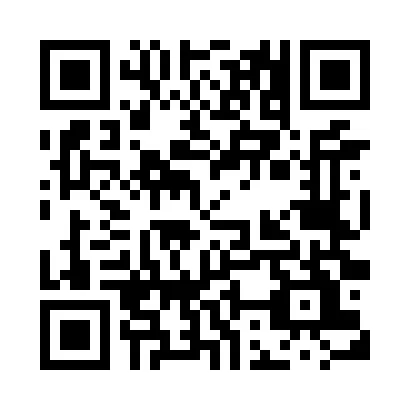
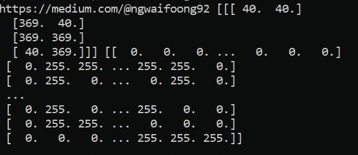

# 如何用 Python 生成和解码二维码

> 原文：<https://betterprogramming.pub/how-to-generate-and-decode-qr-codes-in-python-a933bce56fd0>

## 在 Python 应用程序中处理二维码的入门指南



照片由[米娅·伊万诺夫](https://unsplash.com/@aka_opex?utm_source=unsplash&utm_medium=referral&utm_content=creditCopyText)在 [Unsplash](https://unsplash.com/s/photos/qr-code?utm_source=unsplash&utm_medium=referral&utm_content=creditCopyText) 上拍摄

通过阅读这篇文章，你将学会生成自己的二维码，并从图像中解码二维码。在本教程结束时，您应该能够将 QR 码功能集成到您自己的 Python 应用程序中。我在本教程中使用了`python-qrcode`模块。基于[官方 Github 页面](https://github.com/lincolnloop/python-qrcode)，它将一个二维码概括为:

> “……一种二维象形码，具有快速可读性和相对较大的存储容量。该代码由白色背景上排列成正方形的黑色模块组成。编码的信息可以由任何种类的数据(例如，二进制、字母数字或汉字符号)组成。

二维码和条形码有很大的区别。条形码只保存水平方向的信息；QR 码包含水平和垂直两个方向的信息。因此，与条形码相比，二维码包含更多的信息。

本教程有四个部分。

1.  设置
2.  生成二维码
3.  解码二维码
4.  结论

让我们继续下一部分，开始安装必要的模块

# 1.设置

强烈建议您在继续安装之前创建一个虚拟环境。在本教程中，我们将使用以下 Python 包:

*   `python-qrcode` — Python 二维码图像生成器。标准安装还包括用于生成图像的`pillow`。
*   `opencv-python` —用于计算机视觉、机器学习和图像处理的开源库。它带有内置的`QRCodeDetector`类，有助于解码二维码。

通过`pip install`安装非常简单。运行以下命令安装`python-qrcode`和`pillow`。

```
pip install qrcode[pil]
```

完成后，使用以下命令继续安装 OpenCV-Python:

```
pip install opencv-python
```

如果您打算在单个图像中检测多个二维码，请确保`opencv-python`版本至少为 4.3.0。旧版本不具备多重检测功能。

让我们进入下一节，开始编写 Python 代码。

# 2.生成二维码

## 导入

在 Python 文件的顶部添加以下导入声明。

```
import qrcode
from PIL import Image
```

## 基本示例

对于基本用法，您只需运行`make()`功能，根据您输入的文本生成一个二维码:

```
img = qrcode.make('Your input text')
```

## 高级用法

您可以利用`QRCode`类，它提供了更多的控件和属性。

```
qr = qrcode.QRCode(
    version=1,
    error_correction=qrcode.constants.ERROR_CORRECT_H,
    box_size=10,
    border=4,
)
```

*   `version` —接受 1 到 40 之间的整数，控制 QR 码的大小。最小的版本 1 具有 21×21 的尺寸。
*   `box_size` —确定每个 QR 码框的像素数。
*   `border` —决定盒子边框的粗细。默认值为 4，这是最小大小。
*   `error_correction` —控制使用的误差校正。这将在下一段中进一步解释。

## 误差校正常数

误差校正有助于改进检测，即使当图像变形或在 QR 码上有叠加图像时。有四个常量可用于`error_correction`:

*   `ERROR_CORRECT_L` —大约 7%或更少的错误可以被纠正。
*   `ERROR_CORRECT_M` —大约 15%或更少的错误可以被纠正。这是默认值。
*   `ERROR_CORRECT_Q` —大约 25%或更少的错误可以被纠正。
*   `ERROR_CORRECT_H` —大约 30%或更少的错误可以被纠正。

## 另存为图像文件

下一步是调用`add_data()`函数。传入您选择的输入文本。继续添加以下代码，生成一个白色背景、黑色填充的 QR 码。

```
qr.add_data('[https://medium.com/@ngwaifoong92'](https://medium.com/@ngwaifoong92'))
qr.make(fit=True)img = qr.make_image(fill_color="black", back_color="white").convert('RGB')
```

您可以将其保存为图像文件，如下所示:

```
img.save("sample.png")
```

您应该会看到一个新生成的二维码，如下所示:



作者图片

## 在二维码上叠加图像

你可能会注意到一些二维码上面有一个叠加图像。这有助于推广您的品牌，并防止与其他二维码混淆。如果您打算这样做，请确保使用最佳的`error_correction`常量，以防止错误解码的问题。

您可以利用枕头在您的 QR 码上添加一个覆盖图像。让我们调用图像构造函数来打开一个图像。`thumbnail()`功能有助于调整图像大小。你应该把它缩小到一个更小的分辨率，以防止它阻挡整个二维码。

```
logo_display = Image.open('profile.png')
logo_display.thumbnail((60, 60))
```

调用以下代码计算中心位置，并通过`paste()`功能将缩略图覆盖在二维码上。

```
logo_pos = ((img.size[0] - logo_display.size[0]) // 2, (img.size[1] - logo_display.size[1]) // 2)img.paste(logo_display, logo_pos)
```

通过`save()`功能保存，就像我们之前所做的一样。

```
img.save("sample2.png")
```

以下是它的外观示例:


作者图片

# 3.解码二维码

在本节中，我将对之前生成的二维码进行解码。我建议您为此创建一个新的 Python 文件。

## 单一二维码

添加以下导入语句。

```
import cv2 as cv
```

`QRCodeDetector`为我们提供了以下功能:

*   `detect` —检测图像中的 QR 码，并返回包含该码的四边形。
*   `decode` —一旦通过`detect()`方法找到图像中的二维码，就对其进行解码。如果代码无法解码，则返回 UTF8 编码的输出字符串或空字符串。
*   `detectAndDecode`—`detect`和`decode`二维码。

为了让事情简单明了，我在本教程中使用了`detectAndDecode()`函数。

```
im = cv.imread('sample.png')
det = cv.QRCodeDetector()retval, points, straight_qrcode = det.detectAndDecode(im)
```

它接受图像的输入数组，并返回以下结果:

*   `retval` —产生一个字符串。
*   `points` —找到的二维码四边形的顶点数组。如果找不到，将为空。
*   `straight_qrcode` —包含经过校正和二值化的 QR 码的图像。

当您打印出结果时，应该会看到下面的输出。



作者图片

## 多个二维码

从版本 4.3.0 开始，`OpenCV-Python`具有多重检测功能。由于我目前没有任何包含两个二维码的图像，我将使用`numpy`复制它，并将两个二维码并排放置。让我们看看下面的代码片段。

```
import cv2 as cv
import numpy as npim = cv.imread('sample.png')
det = cv.QRCodeDetector()retval, decoded_info, points, straight_qrcode = det.detectAndDecodeMulti(np.hstack([im, im]))
```

`detectAndDecodeMulti`返回以下结果:

*   `retval` —一个布尔值。`True`如果检测到并解码了至少一个二维码。
*   `decoded_info` —保存解码结果的字符串列表。
*   `points` —找到的二维码四边形的顶点数组。如果找不到，将为空。
*   `straight_qrcode` —包含校正和二值化 QR 码的图像。

当您打印出`retval`和`decode_info`变量时，您应该得到以下结果。

```
True ['https://medium.com/@ngwaifoong92', 'https://medium.com/@ngwaifoong92']
```

# 4.结论

让我们回顾一下今天所学的内容。

我们从二维码的简单解释开始。之后，我们继续通过 pip install 安装必要的 Python 包。

我们继续使用`python-qrcode`模块生成二维码。它带有`QRCode`类，为我们提供了更多的控制。

然后，我们使用来自`OpenCV-Python`的`QRCodeDetector`类测试解码 QR 码。此外，最新版本具有多重检测功能，允许我们从单个图像中检测和解码多个二维码。

感谢你阅读这篇文章。希望在下一篇文章中再见到你！

# 参考

1.  [Python-二维码 Github](https://github.com/lincolnloop/python-qrcode)
2.  [OpenCV 二维码检测器文档](https://docs.opencv.org/4.3.0/de/dc3/classcv_1_1QRCodeDetector.html)