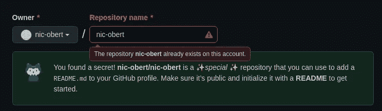
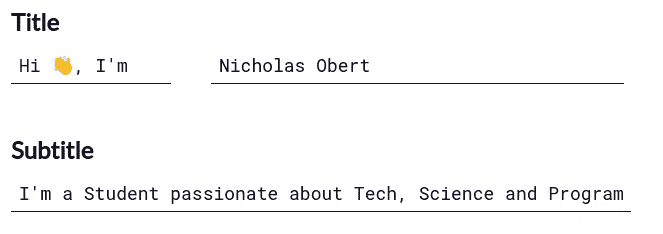
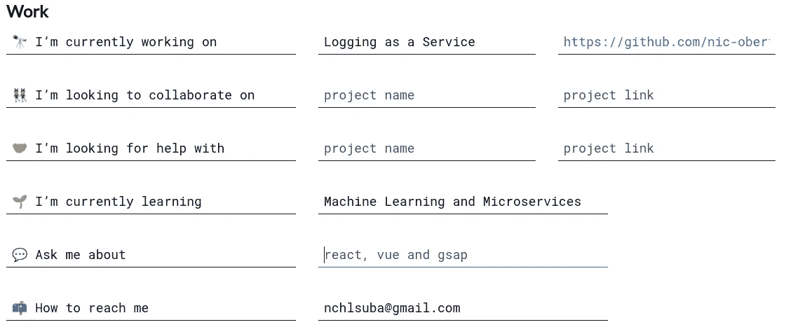
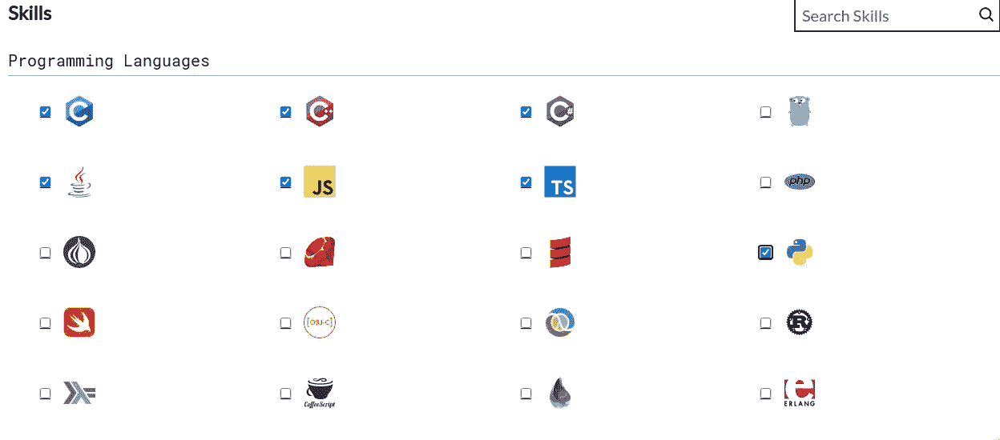
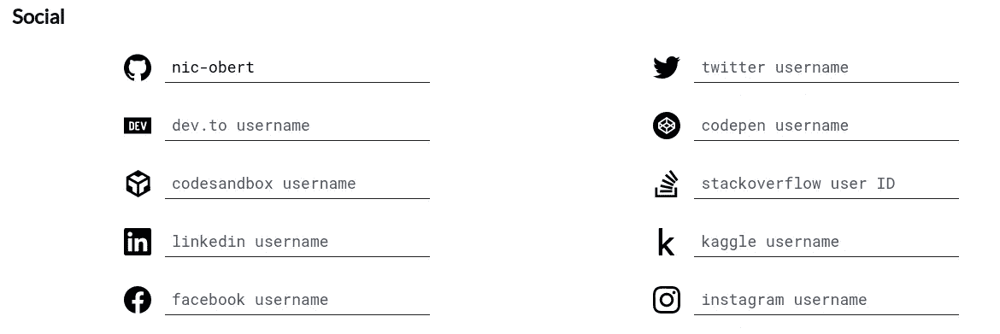
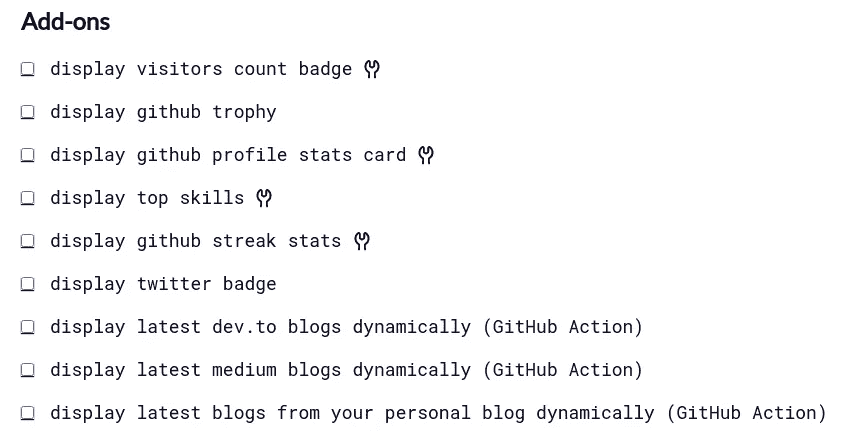
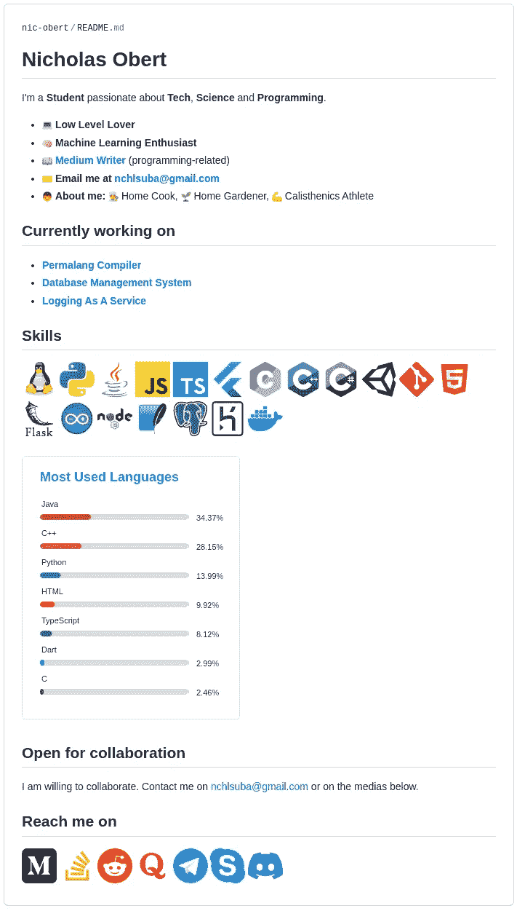

# 如何生成令人敬畏的 GitHub 个人资料组合页面

> 原文：<https://betterprogramming.pub/how-to-generate-awesome-github-profile-portfolio-pages-de6ff0d79e2d>

## 在 GitHub 个人资料页面上展示您的经验、技能和联系信息

照片由 [Mar Cerdeira](https://unsplash.com/@estudiodelmar?utm_source=medium&utm_medium=referral) 在 [Unsplash](https://unsplash.com?utm_source=medium&utm_medium=referral) 上拍摄

在开发人员中，GitHub 是最常用的存储、共享和贡献代码库的平台之一。此外，这也是向公众展示你作为一名程序员的有效方式。它可以让你深入了解你一直在做的项目，以及你的学习历程和技能。正因为如此，我认为拥有一个好的个人展示页面是很重要的，它可以让那些可能对你感兴趣的人对你作为一名软件开发人员有一个总体的了解。

# GitHub 配置文件自述文件

正如许多人所知，GitHub 允许您在项目存储库中包含一个`README.md`文件，以便提供工件的简要介绍。但是你知道你可以为你的整个 GitHub 档案创建一个`README.md`吗？如果没有，现在是时候了解一下了！

首先，创建一个新的资源库，其名称与您的 GitHub 配置文件名称相同。例如，如果我的名字是`nic-obert`，我必须创建一个名为`nic-obert`的新存储库。

用您的名字创建一个新的存储库

在我的例子中，我不能创建这样的存储库，因为我已经完成了。您应该不会收到红色错误通知。

当你创建完存储库后，是时候添加一个`README.md`文件了。最好通过 GitHub 的网站界面完成，而不是在你的本地机器上。这样，您将能够编辑并轻松查看自述文件的预览，而不必处理存储库克隆、提交和推送。

> 免责声明:我不是这篇文章中我将展示的项目的附属机构或赞助商。尽管如此，我认为这是一个很好的解决方案。

# GitHub 配置文件自述文件生成器

虽然您可以自己编写一个自述文件，但是如果您使用一个经过深思熟虑的模板就更好了。这就是 README 生成器派上用场的地方。有很多在线工具可以解决这个问题，但是在本文中我将重点介绍由 [Rahul Jain](https://github.com/rahuldkjain) 开发的 [GitHub Profile README 生成器](https://rahuldkjain.github.io/gh-profile-readme-generator/)。

这个非常棒的在线工具需要你毫不费力地填写一些关于你的 GitHub 个人资料和经历的字段，以生成 README 文件。

由[拉胡尔·贾恩](https://github.com/rahuldkjain)制作的 [GitHub 简介自述文件生成器](https://rahuldkjain.github.io/gh-profile-readme-generator/)示例

然后，您可以填写如下所示的其他字段:

由 [Rahul Jain](https://github.com/rahuldkjain) 制作的 [GitHub 配置文件自述文件生成器](https://rahuldkjain.github.io/gh-profile-readme-generator/)示例

如您所见，您不需要填写每个字段。无论如何，这些不是唯一可用的“工作”字段。我之所以包括这些，是为了避免文章中出现过多的图片。

除此之外，你还可以具体说明你在学习过程中获得了哪些技能。您可以勾选您所知道的编程语言的复选框，但是该工具还允许您在流行的框架、数据库技术等中进行选择。

由 [Rahul Jain](https://github.com/rahuldkjain) 制作的 [GitHub 概要文件自述文件生成器](https://rahuldkjain.github.io/gh-profile-readme-generator/)示例

然后你还可以包含你的社交媒体账户的链接，比如 GitHub(当然)、Twitter、LinkedIn、Medium 等等。

由 [Rahul Jain](https://github.com/rahuldkjain) 制作的 [GitHub 概要文件自述文件生成器](https://rahuldkjain.github.io/gh-profile-readme-generator/)示例

最后，你还可以利用一些很酷的附件来制作你的个人资料自述文件。以下是直接从网站上获取的完整列表:

由[拉胡尔·贾恩](https://github.com/rahuldkjain)制作的 [GitHub 概要文件自述文件生成器](https://rahuldkjain.github.io/gh-profile-readme-generator/)示例

最后，点击`Generate README`按钮生成你的降价文件。完成后，只需将其内容复制并粘贴到之前创建的`README.md`文件中。如果你喜欢，提交修改。如果没有，你可以随时编辑你喜欢的降价文件。

经过一点调整和一些手工添加，下面是我的 GitHub 概要文件的 README 文件:

GitHub 个人资料自述文件

你也可以在 GitHub 上的[这里](https://github.com/nic-obert)找到它，在我的个人资料页面。

# 结论

GitHub profile 是开发人员最重要的个人表现媒介之一。在我看来，展示你作为程序员的经验和技能，以及联系你的方式是很好的。

这个在线自述文件生成器提供了一个很好的模板来构建您的 GitHub 个人资料页面。从那里，你可以毫不费力地编辑生成的降价，以适应你的个人口味，并给它一个独特的触摸。

我希望你觉得这篇文章有用，并学到了一些新的东西。

一如既往的感谢阅读！