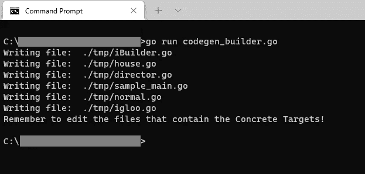
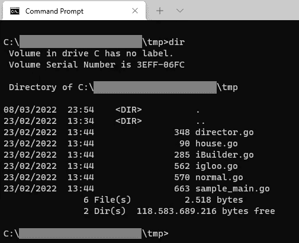
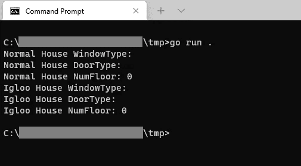
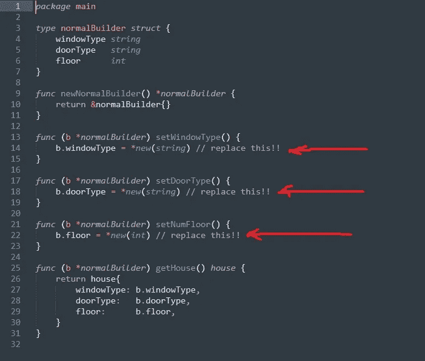
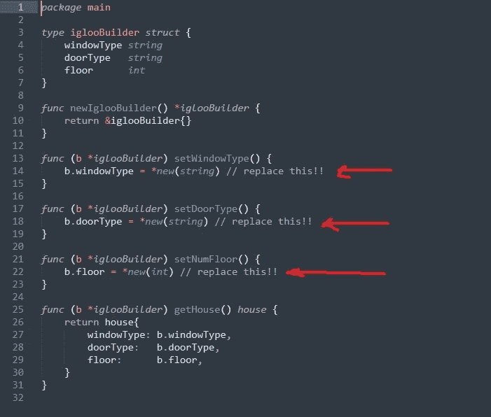

# 如何使用 Golang 模板生成代码

> 原文：<https://betterprogramming.pub/how-to-generate-code-using-golang-templates-942cba2e5e0c>

## 如何根据构建器设计模式使用 Golang 模板生成代码的示例

照片由[粘土银行](https://unsplash.com/@claybanks?utm_source=medium&utm_medium=referral)在 [Unsplash](https://unsplash.com?utm_source=medium&utm_medium=referral) 上拍摄

在本文中，我给出了一个例子，作为我上一篇文章[“如何在 Golang 中使用模板”](/how-to-use-templates-in-golang-46194c677c7d)的后续。您将看到该文章中使用的所有不同技术，以及一些额外的技术。

我创建这个项目和写这篇文章的主要动机是自己学习更多关于 Golang 模板的知识。但是，我希望您也会觉得它有用。作为练习，您可能会改进我的代码，也可能会为其他设计模式构建代码生成器。

您将在本文中找到的代码部分基于 Donald Feury 关于 Go 模板的视频[结尾描述的“struct”代码生成器。](https://youtu.be/dWchPTi9Vc0?t=984)

然而，我没有像上面的视频那样输出基于 API 的结构，而是创建了一个示例程序，它根据“构建器设计模式”生成 Golang 代码。

由此产生的 Golang 代码应该与您在本文中找到的几乎完全一样。

我不会在本文中解释构建器设计模式是如何工作的。为了解释这一点，我鼓励你去看看上面提到的文章，并且读一读 Gamma 等人的经典著作《设计模式——可重用面向对象软件的元素》。

我们将生成的结果代码显然会有微小的差异——因为不是所有的东西都可以生成。

生成的输出基于我们向程序提供的特定数据。对于这个例子，我将为代码生成器提供以下数据(参数):

*   1 产品目标结构。我们将提供结构的名称。在这个示例代码中，产品目标名称将是`house`。
*   产品目标结构的 N 个属性(其中 N>0)。这里我们将成对提供这些属性的名称和类型。对于我们这里的例子，这些将是:`windowType` - `string`、`doorType` - `string`和`floors` - `int`。
*   N 个具体的目标名称(其中 N>0)。我们会提供目标的名字。在本例中，它们将是`normal`和`igloo`。

在接下来的内容中，我将首先讨论用于解析和呈现模板并输出生成的代码的程序。之后，我会谈到个别模板。

# 真正的围棋程序

因此，首先，我们来看看解析和呈现所有模板的程序。当你运行这个程序时，它会在`./tmp`目录下输出生成的 Go 代码。

在第 3–12 行，我们导入将要使用的包。值得注意的是:

*   `bufio`用于将生成的代码写入文件。
*   `github.com/Masterminds/sprig`为我们的模板提供了方便的函数。
*   `go/format`用于将输出格式化为“gofmt”风格的 Go 代码。
*   `html/template`用于实际的模板功能。最初，我想使用`text/template`，但这似乎不能与`sprig`一起工作。所以，我改变了它。

在第 26–34 行，我们定义了想要在模板中呈现的数据。这个数据已经在上面描述过了。

在第 35–39 行，我们处理每个不同的模板文件。这是通过调用`processTemplate()`和`processConcreteTargets()`功能完成的。

执行重物提升的功能是`processTemplate()`功能。

在第 44 行，我们引入了一个我在上一篇文章中没有提到的函数。该功能是`template.Must()`功能。这个函数负责验证模板。它确保所有的括号都正确闭合，等等。

在第 46 行，使用函数`ExecuteTemplate()`而不是`Execute()`来避免错误信息。你可以在这里阅读更多关于那个[的内容。](https://stackoverflow.com/questions/49043292/error-template-is-an-incomplete-or-empty-template)

在第 50 行，函数`format.Source()`确保呈现的输出`ExecuteTemplate()`按照“gofmt”样式准则格式化，如前所述。

在第 54 行，我们设置了输出路径。我已经将输出目录设置为`./tmp`。当然，你可以改变这一点。

在第 56–59 行，我们将呈现的模板字符串输出到输出路径。

函数`processConcreteTargets()`是为每个具体目标运行`processTemplate()`的辅助函数。

在第 64 行，我们复制了一份数据。

在第 65 行，我们将`ConcreteTargets`设置为我们希望呈现的给定具体目标，而不是所有具体目标的列表。

# 用于生成代码的模板

在这一部分，我将详细介绍用于生成代码的每个模板。

## iBuilder 模板

该模板将用于创建`iBuilder`接口。该接口定义了用于设置属性和获取产品目标的函数。

双结束括号前的减号删除空格和换行符。

在第 4–6 行，我们循环遍历每个属性，为产品目标的属性创建 setter 函数。

在第 5 行，如果变量类型是“int”，我们使用条件在变量名称前添加“Num”。

在第 11–15 行，我们遍历具体的目标来创建代码，返回实现`iBuilder`接口的函数。

## 具体目标模板

函数`processConcreteTargets()`将为每个具体目标调用`processTemplate()`。

结果是，下面的模板将为我们定义的每个具体目标呈现。在我们的数据中，我们定义了两个具体的目标— `normal`和`igloo`。

需要注意的事项:

*   在第 3 行，我们在模板中创建了一个内部变量，名为`$target`。
*   在第 5–7 行，我们对定义的属性进行循环。
*   在第 10 行，我们使用来自`Sprig`的`title`函数来大写`$target`字符串的第一个字母。
*   在第 15 行，如果变量类型是整数，我们使用`if eq`在变量名前显示“Num”。
*   在第 16 行，有一个注释“//替换这个”。该注释是给所生成代码的用户的消息。

## 产品目标模板

该模板将被渲染以产生产品目标的`struct`。

在第 4–6 行，有一个简单的循环生成了`struct`的所有属性。

## 导演模板

该模板呈现一个导演。该主管将建立产品目标。

这里需要注意的是:

在第 17、19 和 21 行，再次使用了来自`Sprig`的`title`函数来大写变量字符串的第一个字母。

在第 18–19 行，我们对属性进行了循环。

在第 19 行，我们再次使用条件将“Num”添加到属性，如果它是一个整数。

## 主模板示例

为了让生成代码的用户开始使用它，我还制作了一个模板来呈现一个示例文件`main`，名为`sample_main.go`。

在这个文件中，有一些使用构建器设计模式构建的具体目标的例子。

在第 6–8 行，我们创建了许多内部变量用于模板。

在第 9-16 行，我们循环了具体的目标。注意，我们在循环中使用了`$index`和`$item`。

在第 11 行，条件语句中使用了`$index`来决定应该呈现哪个语句。

在第 13–15 行中，使用了一个嵌套循环来为具体目标的每个属性创建“打印”语句。

# 运行代码生成器

确保`codegen_builder.go`文件中的主程序和模板在同一个目录下。然后在您的终端中运行`go run codegen_builder.go`。现在程序将在模板的帮助下生成代码，并将其输出到`./tmp`目录中。

让我们转到那个目录，看看我们生成的代码。

中生成的 Go 文件。/tmp 目录

# 测试生成的代码

我们可以通过在终端中运行`go run .`来测试生成的代码。当我们运行该命令时，我们应该在终端中得到如下输出:

中运行文件时的输出。/tmp 目录

这表明，我们生成的所有代码都运行无误，并按预期工作。

如果我们真的要使用生成的代码，我们仍然需要编辑具体的目标文件。见下面截图:

显示需要在 normal.go 中编辑的内容的箭头

箭头显示冰屋中需要编辑的内容。开始

# 参考

*   [“GoLang 中的构建器模式”GoLang 举例](https://golangbyexample.com/builder-pattern-golang/)
*   [“Go 模板——简单而强大”,作者 Donald Feury](https://youtu.be/dWchPTi9Vc0?t=984)