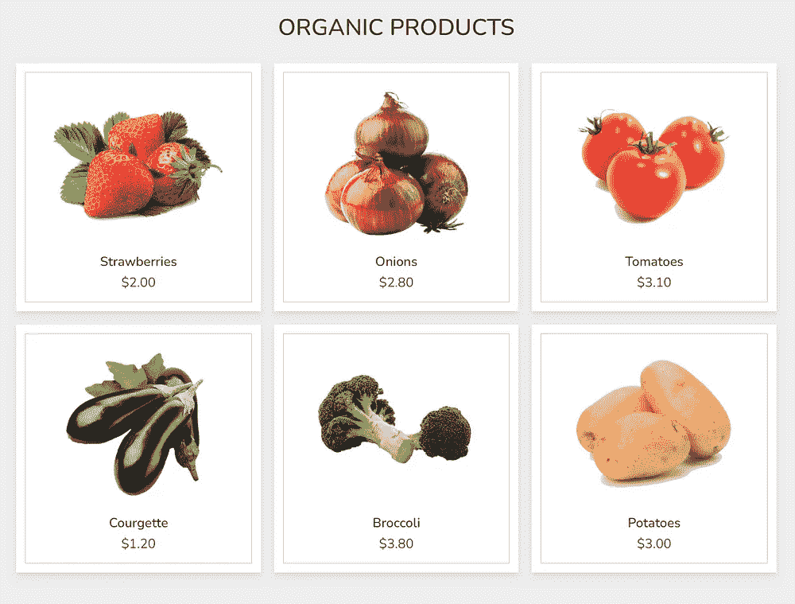
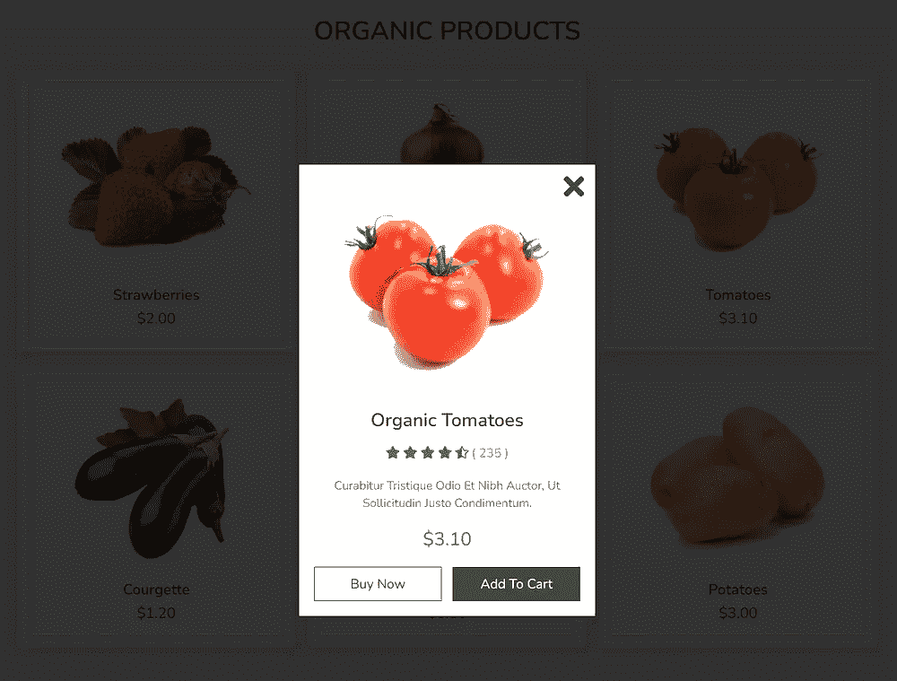

# 如何用 Golang 模板生成 HTML

> 原文：<https://betterprogramming.pub/how-to-generate-html-with-golang-templates-5fad0d91252>

## 如何使用 Go 模板生成 HTML 页面的示例

照片由 [Pankaj Patel](https://unsplash.com/@pankajpatel?utm_source=medium&utm_medium=referral) 在 [Unsplash](https://unsplash.com?utm_source=medium&utm_medium=referral) 上拍摄

在这里，我提供了另一个例子，它是我上一篇文章[“如何在 Golang 中使用模板”](/how-to-use-templates-in-golang-46194c677c7d)的后续。我将使用那篇文章中关于使用 Golang (Go 语言)模板的一些基本技术。除了这个项目，我还决定*使用嵌套模板*和*编写自己的简单函数在模板*中使用。

由于这是一个使用 Golang 模板而不是网页设计的练习，我决定寻找一个现有的页面设计。因此，所有的图片、CSS 和 JS 都一字不差地来自于[网页设计师先生的视频教程](https://www.youtube.com/watch?v=OAPRagDr4pU)(代码可以免费使用)。*另一方面，教程中的 HTML 显然已经被改编成模板。*

在这里，您可以看到我们将根据产品数据生成的网页:

网页是有反应的，所以它适应不同的屏幕宽度，当你点击其中一个“产品”时，你会得到一个带有描述和一些按钮的弹出窗口。

在 Web Designer 先生的原始示例中，产品及其描述被硬编码在 HTML 文件中。使用模板并用(不同的)数据呈现它们可以避免对产品及其描述进行硬编码。

在接下来的内容中，我将首先向您展示解析和呈现模板的实际程序，然后输出生成的 HTML 文件。之后，我会向你展示不同的模板是什么样子，并讨论我在其中使用的一些技术。

# 真正的 Golang 计划

下面是将完成所有工作的 Golang 程序:

在第 3–8 行，我们导入必要的包。输出 HTML 文件需要`bufio`、`bytes`和`os`包。包`html/template`用于处理模板。

在第 10–17 行，我们定义了`product`，它是一个用于保存产品数据的`struct`。确保所有属性都用大写字母书写，即它们是可导出的。在 Golang 模板中使用 struct 时，这是必需的。

另外，请注意，星的数量是一个介于 0 和 5 之间的浮点数。我们对这个数字使用一种类型的`float64`的原因是模板对所有浮点数都使用`float64`。

在第 19–25 行，我创建了两个函数，因为我对`sprig`包提供的函数不满意。第一个名为`subtr()`的函数是一个简单的浮点数减法函数，第二个名为`list()`的函数用于创建浮点数列表。

在第 29–36 行，我们定义了要在模板中呈现的数据。在这个例子中，数据是硬编码的。在更现实的环境中，这些数据可能会存储在某种数据库中。注意，数据遵循`product`结构的定义。

在第 38 行，我们将所有模板的文件名添加到一个切片中。

在第 40–43 行，目录名`/templates/`被添加到所有文件名中。

在第 45 行，我们用`ParseFiles()`解析模板，确保用`template.FuncMap{}`添加两个函数`subtr`和`list`，并用`template.Must()`检查模板的正确性。

在第 47–48 行，我们将模板渲染到一个字节缓冲区。为了确保渲染器从`page`模板开始，我们使用`ExecuteTemplates()`和`"page"`作为参数。这里，我们还向渲染器提供我们定义的数据。

在第 50–54 行，渲染的字节缓冲区被输出到一个名为`./static`目录中`index.html`的 HTML 文件。

# 用于生成 HTML 的模板

在这里，我讨论了这个项目使用的所有模板。

## “页面”模板

这是定义完整网页的模板。它调用另外三个模板；`header`、`content`和`footer`。

在第 1 行中，必须在这个模板中定义`page`，否则`ExecuteTemplates()`将找不到它。

在第 3 行，注意当调用`content`模板时添加了一个点。这向模板呈现器发出信号，表明所提供的数据将被发送到`content`模板。这与向函数提供参数是一样的。假设`header`和`footer`模板不需要数据；也没有必要添加点。

## “标题”模板

该模板用于呈现加载字体、样式和 JavaScript 代码的典型 HTML 标题。

注意，我们使用`define`和`end`关键字将模板定义为`header`模板。

另外，请注意双结束括号前的“-”号。这个符号告诉渲染器删除空白和换行符。根据我的经验，你需要试验一下这些“-”的位置。

为了获得想要的输出，你有时需要把“-”放在开始的双括号之后，有时在双结束括号之前，有时在两个地方。

## “内容”模板

这是呈现 HTML 文件主体的模板。

将内容与页眉和页脚分开定义的原因是，我们可以快速创建具有不同内容但具有相同页眉和页脚的其他页面——例如，加载相同的 CSS、JS、字体等。

如前所述，我创建了自己版本的[Sprig](http://masterminds.github.io/sprig/)和`subf`函数，因为我对那个包中的不满意。这是因为我有一些无法摆脱的错误。我还决定调用我的减法函数`subtr`而不是`subf`。

在第 5–12 行，我们遍历了数据中的所有产品。对于每个产品，我们创建内部模板变量`$index`和`$item`。我们使用`$index`作为`data-name`属性。从`$item`中，我们提取了用于 HTML 的`Img`、`Name`和`Price`属性。

在第 16–42 行，我们做的和上面一样，但是我们也从`$item`中提取了`$Stars $Description`和`$Reviews`属性。

此外，在第 22 行，我们创建了一个名为`$stars`的列表。这个列表包含从 1.0 到 5.0 的浮点数。我们需要这些来展示星星。这些数字代表显示每颗星的阈值。

然后，在第 23–32 行，我们创建了一个循环来显示星星。本质上，我们有三种类型的星星可以展示:满星星、半星星和空星星。

使用条件句，我们确定一个条目的星数(`$item.Stars`)是否小于来自`$stars`列表的星数减 0.5，或者小于星数，或者更高。在第一种情况下，我们显示一个空的星星。在第二种情况下，我们显示一个半星形。最后，在最后一种情况下，我们显示一个完整的星号。

## “页脚”模板

除了将模板定义为`footer`之外，这里没有什么特别的事情发生。

# 运行 HTML 生成器并查看结果

确保`main.go`文件位于包含两个子目录`templates`和`static`的目录中。以上模板都需要在`templates`目录下。原始代码中的 CSS、JS 和图像需要放在`static`目录中它们各自的子目录中。

只需在终端的正确目录中键入`go run main.go`来运行生成器。随后，将生成 HTML 文件，并作为`index.html`写出到`static`目录中。

现在您可以在浏览器中打开`index.html`文件，您应该会得到本文开头所示的结果。

# 参考

[“具有快速查看产品预览弹出效果的响应式产品卡”，网页设计师先生](https://www.youtube.com/watch?v=OAPRagDr4pU)