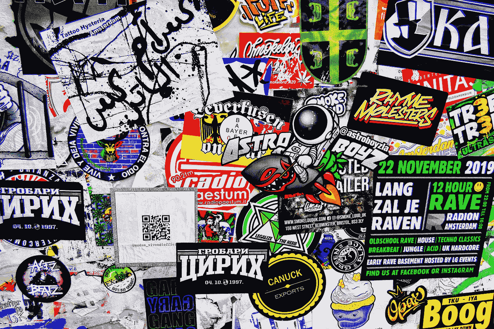
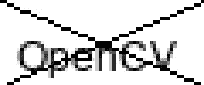
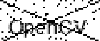
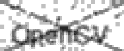
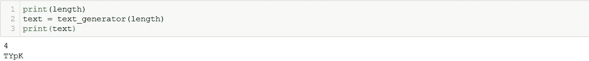
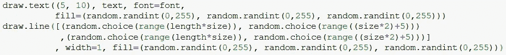

# 如何使用 Python 生成随机文本验证码

> 原文：<https://betterprogramming.pub/how-to-generate-random-text-captchas-using-python-e734dd2d7a51>

## 确保你的用户是他们所说的那个人



照片由 [Massimo Virgilio](https://unsplash.com/@massimovirgilio?utm_source=medium&utm_medium=referral) 在 [Unsplash](https://unsplash.com?utm_source=medium&utm_medium=referral) 上拍摄。

*被困在付费墙后面？点击* cv2.destroyAllWindows()



# 添加噪声

我们的基本验证码现在已经准备好了，但与你在网上看到的验证码相比，它看起来非常干净和可读。我们来加点噪音吧！

最简单的方法是在图像中随机添加黑白像素。这就是所谓的椒盐噪声。

首先，我们必须从我们的映像创建一个数组:

```
img = np.array(img_pil)
```

然后，我们定义要改变的像素阈值。我们将保持在 0.05 (5%)。添加噪声的代码是一个简单的嵌套 for 循环，使用随机生成的数字(0-1 之间)来确定噪声是否会添加到特定像素:

在这里，如果随机数低于阈值(0.05)，我们将其设为白色。如果它大于 0.95，我们就把它变成黑色。否则，我们让它保持原样。添加噪声后的输出如下所示:



添加盐和胡椒噪声

胡椒噪声(黑色像素)非常明显，但是文本上先前为黑色的一些像素现在变成了白色(注意线条中的中断)。

我们可以通过模糊图像来添加更多的噪声，这将使噪声更加分散。对于 cv2，这只是一行程序！

```
img_blurred = cv2.blur(img,(2,2))
```

这里，`(2,2)`是用于平滑图像的内核的大小。在 OpenCV 的[文档](https://opencv-python-tutroals.readthedocs.io/en/latest/py_tutorials/py_imgproc/py_filtering/py_filtering.html#averaging)中阅读更多相关内容。



模糊图象

# 随机化一切！

我们的基本代码已经准备好了…但是“随机文本验证码”中的“随机”却不见了。让我们随机化大部分事情，以便每个验证码是真正独特的！

那么，什么可以随机化呢？好吧，一切，但我们将集中在图像大小，文本(字符串，字体，字体大小，颜色)，线位置，线颜色，噪声阈值，噪声强度和模糊强度。

图像大小将取决于文本的长度和字体大小。所以我们首先制作一个字体大小变量和字符串的长度:

```
size = random.randint(10,16)
length = random.randint(4,8)
```

在对字体大小、字符串长度和画布大小之间的关系进行了大量实验后，我得出了画布大小的如下结果:

```
img = np.zeros(((size*2)+5, length*size, 3), np.uint8)
```

现在，为了随机化字体，我们可以使用 [glob](https://docs.python.org/2/library/glob.html) 库从系统字体路径中选择一些。我只使用 Arial 字体的变体。


然后我们可以使用`random.choice()`选择一个随机的字体:

```
font = random.choice(fonts)
```

现在来看正文。给定字符串的长度，我们生成 ASCII 字母数字字符的随机序列:

```
text = ''.join(
        random.choice(string.ascii_uppercase + string.digits + string.ascii_lowercase) 
                   for _ in range(length))
```

由于长度已经是随机的，我们只是通过传递`length`来调用这个函数:



对于线的位置，不是从左上角画到右下角`[(0,0),(length*size,(size*2)+5)]`，我们可以通过以下方式随机化起点和终点坐标

`[(random.choice(range(length*size)), random.choice(range((size*2)+5)))
,(random.choice(range(length*size)), random.choice(range((size*2)+5)))]`

对于文本和线条的颜色，之前我们只使用黑色(`0, 0, 0`)。这可以随机化到`(random.randint(0,255), random.randint(0,255), random.randint(0,255))`:



对于噪声阈值，我们可以将其设置为 1%到 5%之间的任意随机值:

```
thresh = random.randint(1,5)/100
```

对于噪波强度，我们可以将盐和胡椒像素分别设置为随机的明暗色调，而不是使用绝对的白色和黑色:

最后，为了控制模糊强度，我们可以从`(2, 2)`到`(int(size/random.randint(5,10)),int(size/random.randint(5,10)))`随机化内核大小。选择 5 到 10 之间的范围，因为任何小于 5 的值都会使图像太模糊而不清晰，而大于 10 的值不会有太大的模糊效果。

`img = cv2.blur(img,(int(size/7),int(size/7)))`

# 把所有的放在一起


OQw4(够狠？)

# 应用程序？

这可以用来生成验证码。您可以用文本作为要匹配的文件名来保存图像。另一个新颖的应用是生成大量带标签的图像来训练 OCR 模型。把上面的代码放在一个循环中，你会得到你想要的任意多的图像！

如果你能想到更多的应用，请告诉我。

Medium 仍然不支持向印度以外的作者支付费用。如果你喜欢我的内容，你可以给我买杯咖啡:)

[](https://www.buymeacoffee.com/siddhantsadangi) [## Siddhant Sadangi 正在 Streamlit 上创建 python 网络应用程序

### 嘿👋我刚刚在这里创建了一个页面。你现在可以给我买杯咖啡了！

www.buymeacoffee.com](https://www.buymeacoffee.com/siddhantsadangi)