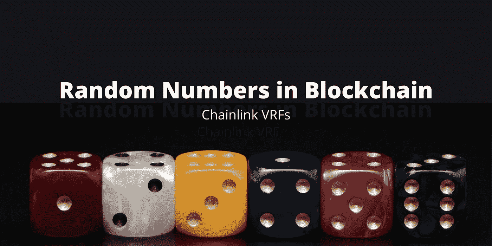
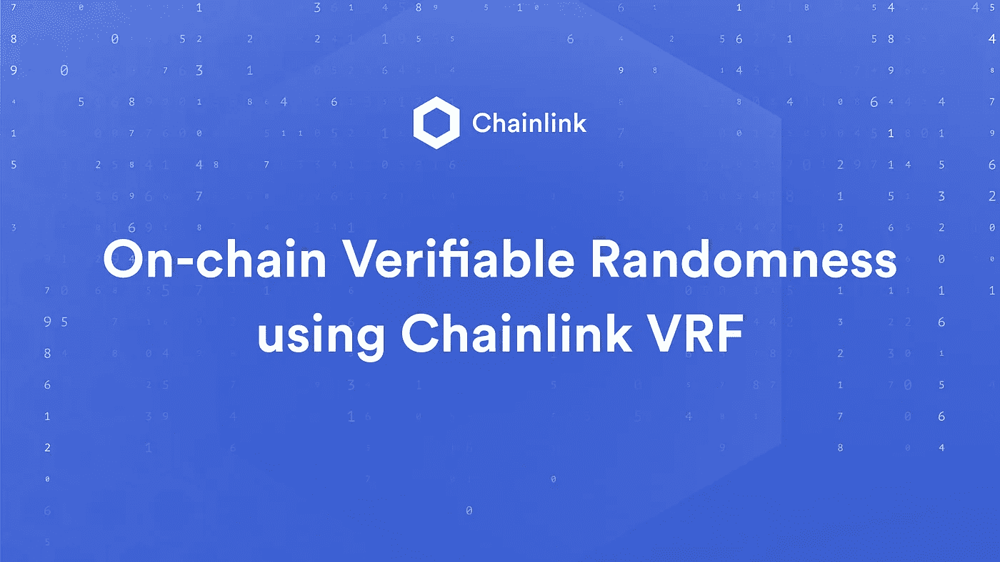
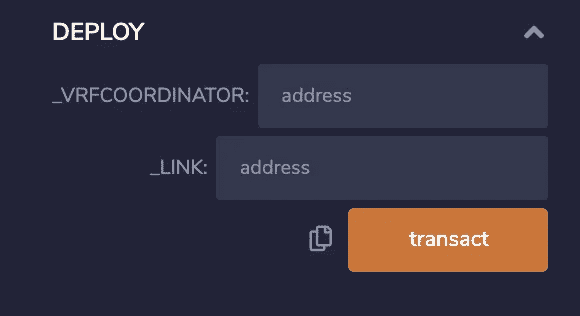

# 如何在 Solidity 和区块链中生成真正的随机数

> 原文：<https://betterprogramming.pub/how-to-generate-truly-random-numbers-in-solidity-and-blockchain-9ced6472dbdf>

## 为什么在区块链需要随机数，有什么问题，最好的解决方案



安娜卡— 1564471 途经[Canva.com](http://canva.com/)

[生成可靠的随机数](https://blog.chain.link/random-number-generation-solidity/)在历史上一直是个问题，直到[链环 VRF](https://docs.chain.link/docs/chainlink-vrf) 出现。但是现在，如果你试图找出如何在 solidity 中生成随机数，你的最佳结果包括:

> 坚固性不能产生随机数。
> 
> 不要在你的合同中产生随机数。没用的，你会被黑的。
> 
> 小心点。该随机数是 100%可预测的，因此不适合于概率游戏或参与者被认为不能猜出它的任何情况。
> — [罗布·希钦斯上栈交换以太网](https://ethereum.stackexchange.com/questions/60684/i-want-get-random-number-between-100-999-as-follows)

他们好像都不太看好，都在说同样的话。

# 从历史上看，在区块链上获取一个随机数一直是一个安全灾难

是的。我说的是“历史上”。如果你有任何上下文线索，是的，我会告诉你如何绕过，解决，以及如何在三分钟内创建一个可验证的随机数。

如果你在这篇文章结束时学到了什么，请帮我和这个世界一个忙，用这些知识创造一个德州扑克游戏。求你了。在我之前。

## 为什么我们需要随机数？

我们可能想要创建一个随机数来进行抽奖、游戏，或者获取测试数据的随机种子。过去要做到这一点，我们会使用最新的块散列作为伪随机数生成器的种子。这是大多数教程将带您经历的第一种方法。

# 方法 1:使用当前的块哈希

由于区块链不断增长，每个块的 ID 哈希不断变化，我们可以只使用该块得到一个随机数，对不对？我们可以用这个函数在 solidity 中对此进行编码:

```
function random() private view returns(uint){
    return uint(keccak256(abi.encodePacked(block.difficulty, now, players)));
}
```

注意:这其实是利用了块难度，随机性差不多。

太好了！对于某些人来说，使用块哈希做任何恶意的事情都太难了，对吗？

## 错误的

矿工可以选择是否发布区块。如果他们开采了一个他们不喜欢的区块，他们可以把它扔掉！如果一群矿工这样做，你的数字就不再是随机的了！这对于矿工来说是可行的，也是合理的。假设一个矿工报名参加一个 10,000 ETH 的去中心化抽奖，中奖票取决于 blockhash。他们只会继续挖掘区块，不发布，直到他们得到他们想要的区块！他们有动机这样做，因为他们可能只放弃 2-3 个 ETH，而如果他们赢了，好处是巨大的。

随机数系统需要足够强大，这样即使攻击者确切地知道你是如何创建随机数的，它也足够强大到不可预测。通过使用 blockhash 选项，如果有人足够快地看到散列，他们就可以恶意地利用这一知识来“击败”您使用随机数的任何东西。没有真正的 RNG，你的彩票总是会被黑客攻击和窃取。

您在彩票应用程序中使用这种方法吗？太好了，现在他们每次都可以使用哈希来计算出中奖号码*。*意思是你的彩票应用程序是某个随机的凯尔的“快速致富”计划。


可能是这个随机的凯尔，虽然这个是个好人。也不叫凯尔。照片由[亨特·约翰逊](https://unsplash.com/@hjohnson02?utm_source=unsplash&utm_medium=referral&utm_content=creditCopyText)在 [Unsplash](https://unsplash.com/s/photos/guy?utm_source=unsplash&utm_medium=referral&utm_content=creditCopyText) 拍摄

不仅猜测块散列更快的人会成为一个问题，而且我们还必须相信散列答案的挖掘者。我们必须相信他们不会利用这些知识来破坏我们的随机应用。*区块链被设计成尽可能不可信。*因此，使用伪随机数有两个主要问题。

# 方法 2:使用 API/Oracle 给你一个随机数

如果你在之前读过我写的任何东西，你就知道这是个糟糕的主意。如果你的集中随机来源被贿赂、破坏或中断，你的智能合同现在就没用了。也许那个 API 公司被收买了，继续在 12 面骰子滚动上发送你的智能合约 a 7。

这意味着你现在有了数字版的“骰子”。

不仅如此，他们可能会停机，变得腐败，或不再经营，这意味着当你的智能合同游戏[卡坦](https://www.catan.com/)试图滚动资源时，你实际上只是滚动一个`404 Not Found`。现在我很确定我不能使用`404`资源来得到`longest road`。(书呆子幽默很棒吧？)

# 方法 3:VRF 链环公司

让我们进入正题。

几年前发布了一个有趣的 StackExchange 问题:“[如何在我的智能合约中安全地生成一个随机数？](https://ethereum.stackexchange.com/questions/191/how-can-i-securely-generate-a-random-number-in-my-smart-contract)”，当前热门答案解释了什么是最好的系统。

对随机数的请求被发送到多个节点，每个节点发送一个可证明的随机响应(使用公钥、私钥和种子)。每个节点将它们的响应[按位](https://en.wikipedia.org/wiki/Bitwise_operation) `XOR`运算在一起，以生成结果随机数。

您可以稍后阅读它的数学原理，但有两个主要部分需要解释:

1.  随机数是以可验证的随机方式生成的，使用公钥和私钥来加密地证明该数是随机的。
2.  这种随机数生成(或 RNG)是在多个节点上完成的，以确保没有单一的失败源，然后通过`XOR`(一种组合答案的方法)得出最终结果。

你会看到这些都是区块链、去中心化和密码术中的常见主题(密码术可能会稍微明显一些)。

用集中式数据源和 oracles 构建区块链应用程序就像买了一辆自行车，这样你就不必再步行去上班，然后继续骑着自行车步行去上班。



原始图片来自 [Chainlink 博客](https://blog.chain.link/verifiable-random-functions-vrf-random-number-generation-rng-feature/)

这些概念是链环 VRF 的支柱。

现在，Chainlink 在 testnet 上有一个概念#1(密码可证明的随机数)的工作再现，并且正在开发概念#2，可证明的随机数的渐强，可证明的随机数的分散。现在，您可以在 Kovan、Ropsten 和 Rinkeby 上构建一个可证明是随机的应用程序。

Chainlink 目前“正处于 Chainlink VRF 安全审查的最后阶段，并希望与我们在开发人员社区和学术界的用户合作”，因此您可以成为首批使用可验证随机数运行智能合同的应用程序之一**，并在去中心化进程完成时提前获得访问权限。如果你想了解更多的技术术语，一定要看看他们的博客文章。**

除了[查看他们的文档](https://docs.chain.link/docs/chainlink-vrf)，以下是你可以如何开始。

# 在 3 分钟内获得您的智能合同中可证明的随机数

## 1.打开[混音](https://remix.ethereum.org/#version=soljson-v0.6.2+commit.bacdbe57.js&optimize=false&gist=9be4bfc3abde316990d77fdb24243134)

单击该链接将自动生成本 [remix](https://remix.ethereum.org/#version=soljson-v0.6.2+commit.bacdbe57.js&optimize=false&gist=9be4bfc3abde316990d77fdb24243134&evmVersion=null) 示例中的代码；但是，请随意复制和粘贴我的要点:

这是一个简单的合同，将滚动一个可验证的六面骰子，并将答案返回到您的合同中。

> 如果你从未运行过 smart-contract out of solidity，我建议你要么[浏览我的教程](https://medium.com/alpha-vantage/write-your-first-blockchain-application-in-minutes-with-alpha-vantage-c4e8dd662fc0)要么浏览 Chainlink 文档中的[示例演练。](https://docs.chain.link/docs/example-walkthrough)

要做 RNG，我们需要几个变量:

1.  `keyhash`:oracle 的公钥散列(这将由 Oracle 提供)。这是为了确保他们根据我们给的种子生成一个随机数。我们将使用 ropsten Chainlink VRF 甲骨文。
2.  `userProvidedSeed`:我们选择的一颗种子，这是另一块我们要用来证明他们在给我们制造一个随机数的棋子。每次我们给`rollDice`打电话，我们都应该用不同的种子。更多信息见[选择种子](https://docs.chain.link/docs/chainlink-vrf#choosing-a-seed)。** *注意:您仍然需要散列这个种子！！(参见上下文示例)*
3.  `_vrfcoordinator`和`_link`:这是 vrfcoordinator 和 Chainlink token 的合同地址。在这个契约中，它们被硬编码为 Ropsten。

## 2.编写可靠的合同`v0.6.2`

如果你感到困惑，[做一下演练](https://docs.chain.link/docs/example-walkthrough)！成为混音/智能合约专家需要五分钟。

确保如果你使用元掩码，你是在 ropsten 这个演练只适用于 ropsten。不同测试网上的地址是不同的。


## 3.用`injected Web3`部署

如果你点击部署旁边的小胡萝卜，你会得到这个下拉菜单。



图片来自作者

对于`_vrfcoordinator`，输入`0xf720CF1B963e0e7bE9F58fd471EFa67e7bF00cfb`，对于`_link`，输入`0x20fE562d797A42Dcb3399062AE9546cd06f63280`。这是 Chainlink 和 vrfcoordinator 的合同地址。

点击`transact`或`deploy`，会出现 metamask 提示。点击确认，并等待几秒钟。您可以点击它提供的 etherscan 链接，这样您就可以准确地看到合同何时完成部署。

## 4.为合同提供资金

点击底部已部署合同旁边的小复制图标，复制混音中的地址。


图片来自作者

并给它发送一些 testnet 链接。你总能从水龙头上得到更多的链接。

## 5.掷骰子

在`rollDice`功能中输入任意数字，交易确认后，按`diceRolled`按钮查看您掷出了什么！


图片来自作者

现在你已经使用 Chainlink VRFs 以可验证的随机方式掷骰子了。

如果成为有史以来第一个可验证 RNG 的用户之一的诱惑没有让你兴奋，那么让我再提高一个档次。众所周知，Chainlink 团队会在黑客马拉松上为他们技术的酷实现发放[奖金，有时高达 6000 美元的 LINK token。](https://blog.chain.link/exploring-the-wide-variety-of-winning-chainlink-applications-from-recent-hackathons/)

感谢阅读！