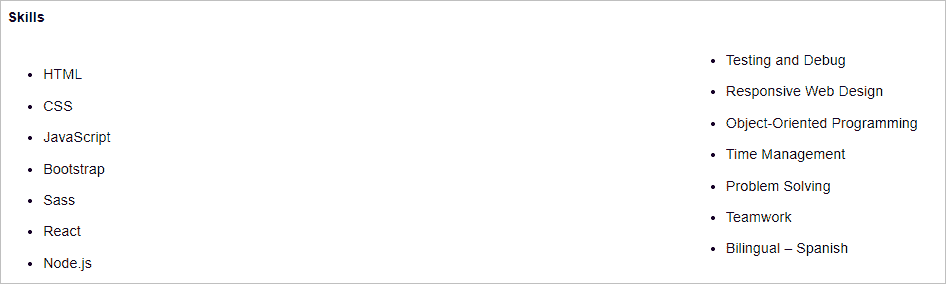
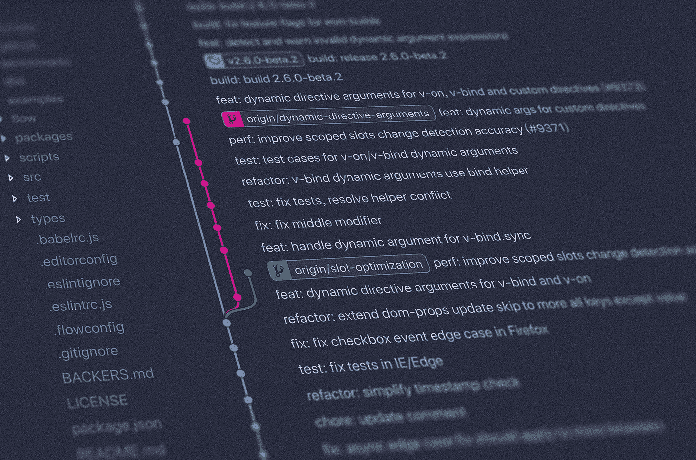

# 如何找到一份像我一样没有经验的开发人员工作

> 原文：<https://betterprogramming.pub/how-to-get-a-developer-job-with-no-experience-like-i-did-2cbede58a5d6>

## 信不信由你，你不需要一个学位或一个训练营来获得你的第一份工作

莫妮卡·索罗在 [Unsplash](https://unsplash.com/s/photos/minimal-computer?utm_source=unsplash&utm_medium=referral&utm_content=creditCopyText) 上的照片

你可以做很多事情来增加获得第一份科技工作的机会。你的编程技能并不是它的终点。

如果没有经验，你需要采取措施让雇主相信你值得拥有一个机会。我是这样做的。

# 介绍

当我和一群开发人员坐在酒吧里时，我紧张地呷了一口饮料。这是我面试过程的最后一步。去见见团队，看看我是否适合这个文化。

我不敢相信我已经走了那么远！我没有编程经验，几个月前才开始编程。

我担心收到技术问题会暴露出我缺乏经验。

令我惊喜的是，出现的技术内容都围绕着我的 GitHub 项目。他们看了看我在那里的东西，并对他们所看到的进行了评论。这对我来说很舒服，我可以谈论这些项目。

在没有工作经验的情况下，我是如何在求职过程中走得那么远的？

因此，您正在学习成为一名开发人员所需的技能。重要的是要知道学习你的编程语言和其他相关技术并不足以找到一份工作。你需要让雇主看到你，然后给他们一个想和你谈话的理由。

好消息是，你可以采取一些坚实的步骤来大大提高你的机会。你应该尽早开始处理这些事情。所以当你准备开始搜索的时候，你已经有了一个很好的基础。

在这篇文章中，我想和你分享找工作所需要的基石。我们将关注那些有助于你讲述雇主想要参与的故事的事情。

# 简历

让我们从头开始。你需要一份好的简历。

这是雇主首先会看到的。即使你可能没有相关的经验可以展示，你仍然需要在你的简历上花很多心思。

有时候，一个忙碌的雇主可能只会浏览简历。你有几秒钟的时间来试着抓住他们的眼球，让他们想看更多的细节。

## **保持简洁明了**

很少有理由让简历超过一页。

## **获得下线**

让公司内部的人给你引荐，会有很大的不同。这会给你的简历一个真正被人看到的机会。

联系你认识的人或老熟人。并非我们所有人都有朋友在顶级公司工作，但还是有解决办法的。

例如，我最近发现了 [Rooftop Slushie](https://www.rooftopslushie.com/) ，你可以从谷歌等公司的开发人员那里获得推荐。开发人员比招聘人员更能推荐开发人员。他们知道他们在同事身上寻找什么。

## **让别人审阅你的简历**

我们通常很难判断如何展示自己。我们中的一些人过于自负，而另一些人则缺乏自尊，这一点会在你的简历中表现出来。让你信任的人帮你看看。

## **把所有与科技相关的东西放在最上面**

其他经历和教育更低。

你可能没有任何技术经验，但你应该提到一些你做过的个人项目。或者其他任何能让雇主感觉到你作为开发者的进步的东西。

## **不要没完没了地添加以前的经历**

选择最重要的，突出显示你是什么样的人的事情。添加你希望他们在面试中提出的内容。

## **不添油加醋不使用噱头**

技能进度条，我正看着你*...以视觉上吸引人但不分散注意力的方式展示信息。

我最近看到的最好的例子是我的朋友瓦内萨。她有一个简单的两栏列表，列出了她所拥有的技术和软技能。就在顶端。清晰有效。这是我一看就知道的东西。到了面试的时候，我们可以进入细节。

*我自己的简历仍然有可怕的进度条。我非常想尽快移除它们。

# 开源代码库

我在介绍中提到 GitHub 是为了让大家感受到它对于一个初露头角的开发者有多重要。

如果您还没有 GitHub 帐户，请立即创建一个！说真的。这是你的简历，你的作品集，你的工作经验，以及你所知道的关于代码的一切。

把你做的一切都推给 GitHub。不管是教程还是微小的项目。一个活跃的 GitHub 帐户表明你是认真的，并展示你的进步。

这是任何一个认真的雇主都会仔细考虑的，以确定他们是否有兴趣推进选择过程。

对我来说非常有效的一件事是在 GitHub 上创建了一个[学习跟踪器](https://github.com/Syknapse/My-Learning-Tracker)，在那里我可以跟踪我正在发展的技能和我使用的资源。我仍然一直在使用它，它已经成为我的一个中心参考点。

我可以想象这在选择过程中会非常有用，因为它会比你应该塞进简历的内容更详细地描述你的学习情况。

另外，它可以帮助你在 GitHub 上保持活跃，即使你没有代码要推送。

# 投资组合

建立你自己的网站来展示你是谁和你做什么。这样做的过程是一次很棒的学习经历。

不要被吓倒，你只需要基本的 HTML 和 CSS 技能就能入门。随着时间的推移和你获得更多的技能，你总是可以改进它，增加它。

这应该是找到你想让雇主看到的关于你的一切的一站式服务。GitHub 和相关社交媒体的链接。你参与的项目。有什么值得关注或有趣的事情分享。

这也是一个展示你的个性和你是什么样的人的好地方。简历简洁而枯燥，而 GitHub 就是代码。所以，这是你第一次有机会添加缺失的维度。你不需要过度设计，但它需要看起来很好。

我在建立投资组合时学到的东西成了我知识的支柱。随着时间的推移，它的演变是我和其他人看到我进步的一种方式。

# 项目

构建项目。不管多简单。

在我早期的学习经历中，当我听到这个建议时，听起来总是很吓人。在我学会如何编码之前，我不能“构建东西”！

嗯，大部分是反过来的。你在构建东西的时候学习编码。你在你试图做的事情的背景中学习。

但我想“建造”这个词听起来很严肃。问题是，我们不是在谈论创造下一个社交媒体应用！一个项目有多简单甚至毫无意义都没关系。

努力学习并试图找到解决问题的答案是最好的学习经历。它为您提供了放入 GitHub 和投资组合的材料。

而且，这可能会成为你面试的中心话题。这是我学到的，这是我卡住的地方，这是我正在努力的地方。

你已经知道这是我在面试最后阶段的可取之处。

# 社交网络

利用 Twitter 和 LinkedIn 的力量。如果使用得当，它们可以成为帮助你学习和找工作的绝佳工具。

找到你所在地区的活跃社区，并与他们建立联系。在大多数地方，技术社区都很小，人们可以很快相互了解。这可能会在帮助你迈出第一步时起到至关重要的作用。

对我来说，Twitter 是我找工作的核心。作为一个完全的局外人，寻找当地社区给了我大量有用的信息和联系。此外，人们可以偶尔在 Twitter 上友好一些，这很好。(那是明目张胆的刻板印象，我在 Twitter 上认识的大多数人都很可爱！)

# 建立工作关系网

参加聚会和技术会议。网络，与人交谈。

如果你是一个初学者，你觉得你什么都不知道，你会认为你完全是一个骗子。你还没有赢得参加科技活动的权利。

但问题是。没有人会突然在人群中拦住你，让你在所有人面前快速编写一个新的应用程序，以证明你属于那里！大部分人都很恭敬很好(又来了，这好像是个跑步主题！).

即使你发现自己处于一个你不懂的技术对话中，说你是一个新手也不会引起警报声。

我总是发现人们对我学的东西和我是如何做的非常感兴趣。你会得到鼓励，你会近距离看到技术社区，你会听到一些演讲，即使这些对你来说听起来像是胡言乱语。

但最重要的是，你会遇到人，这对你找工作非常重要。

# 申请工作

我是说，这很明显。但是你需要申请工作才能得到一份工作。有三件事你需要知道。

## 你不能决定自己什么时候准备好接受这份工作

雇主有。所以不要再为什么时候应该开始申请而苦恼了。你永远不会觉得自己准备好了。一旦你的 GitHub 账户上有了几个项目，就开始申请，让雇主决定你是否准备好了。

## **不要只找初级职位**

不要被报价中的一长串技术先决条件吓倒。如果一家公司提供了一份工作，这意味着他们正在招聘，这就是你想要的。

这个提议是他们超理想化的候选人。这并不意味着他们永远不会考虑你。他们可能会。

不过，我不会发送数百份申请。找工作很费时间。因此，花时间研究和准备应用程序是更好的时间投资。

## **你会遭到拒绝。你会得到沉默**

很正常。这并不影响你未来找到工作的机会。继续努力，不断进步。找出招聘过程中哪些步骤需要改进。求指教。继续编码。

每天你都在提高自己的技能，你就离说服雇主让你加入他们的团队更近了一步。坚持不懈是关键。

# 求职信

写一封有说服力的求职信。告诉你未来的雇主为什么他们应该雇用你。

这是你引起他们注意的大好机会。不要发通用的。研究公司，了解它是关于什么的。想象阅读这篇文章的人。告诉他们一些会让他们想读更多的东西。

永远不要忘记，另一边的正常人和我们其他人一样容易感到无聊或兴奋。

如果他们在筛选一堆申请，他们会读到每个人都是多么伟大的团队成员，他们都能很好地处理压力。你需要告诉他们一些别的事情。

在我给洛拉市场的求职信中，我告诉他们我知道他们广告的职位是高级职位。但我解释了我是如何改变职业的，以及如何寻找团队来帮助我实现转变。

我的首席技术官，也就是给我这份工作的人，告诉我这是如何让他们对我开始面试感到好奇的。

这是一个经历了几个阶段的面试过程。而我提到的这些步骤，都在这个过程中起到了推动我前进的作用。这个过程在那个酒吧达到高潮，我紧张地啜饮着我的饮料，全心全意地希望他们会说*是*。

他们做到了！他们给了我第一份开发工作。这是一个如此自豪和激动人心的时刻。所有的努力都是值得的。

我真的希望你也能很快体验这个改变人生的时刻。希望这篇文章能让你明白在实现这个目标的道路上需要采取的步骤。祝你好运，继续努力。

# 资源

*   [屋顶雪泥](https://www.rooftopslushie.com/)
*   [学习跟踪器](https://github.com/Syknapse/My-Learning-Tracker)