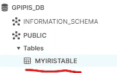
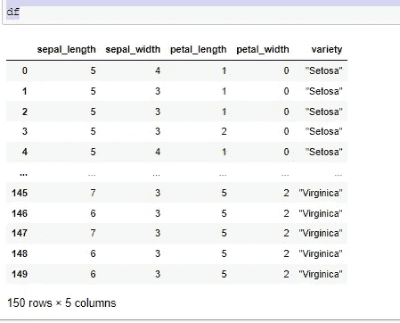
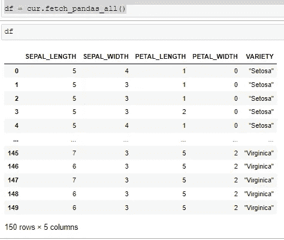
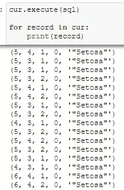
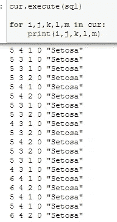

# 如何使用 Python 从雪花中获取数据

> 原文：<https://betterprogramming.pub/how-to-get-data-from-snowflake-using-python-9f2c08b9ab28>

## 一个用 Python 连接雪花的例子


照片由 [Aaron Burden](https://unsplash.com/@aaronburden?utm_source=medium&utm_medium=referral) 在 [Unsplash](https://unsplash.com?utm_source=medium&utm_medium=referral) 上拍摄

[](https://jorgepit-14189.medium.com/membership) [## 用我的推荐链接加入媒体-乔治皮皮斯

### 阅读乔治·皮皮斯(以及媒体上成千上万的其他作家)的每一个故事。您的会员费直接支持…

jorgepit-14189.medium.com](https://jorgepit-14189.medium.com/membership) 

在之前的帖子中，我们提供了一个[如何从 S3 加载数据到雪花](https://predictivehacks.com/how-to-load-data-from-s3-to-snowflake/)的例子。数据科学家和数据工程师非常熟悉 Python 和 Pandas 数据框，因此能够将雪花与 Python 连接起来是必不可少的。在本教程中，我们将向您展示如何在您的本地环境中用 Python 从雪花中获取数据。

# 雪花数据库和表

对于本教程，我们创建了一个名为`GPIPIS_DB`的数据库，其中有一个名为`MYIRISTABLE`的表



# 安装 Python 库

我们需要安装以下 Python 库。

```
pip install snowflake-connector-python
pip install --upgrade snowflake-sqlalchemy
pip install "snowflake-connector-python[pandas]"
```

从雪花到 Python 有不同的数据获取方式。下面，我们提供一些例子，但是首先，让我们加载库。

```
import snowflake.connector
import pandas as pd
from snowflake.sqlalchemy import URL
from sqlalchemy import create_engine
```

# 使用“sqlalchemy”以 Pandas 数据框的形式获取数据

我们需要创建一个连接引擎，然后运行 SQL 查询。请注意，帐户 id(帐户)，是你在网址上看到的到`.snowflakecomputing.com`

```
url = URL(
    user='XXX',
    password='XXX',
    account='<ACCOUNT_ID>',
    warehouse='TEST_WH',
    database='GPIPIS_DB',
    schema='PUBLIC',
    role = 'ACCOUNTADMIN'
)
engine = create_engine(url)connection = engine.connect()query = '''
select * from myiristable
'''df = pd.read_sql(query, connection)df
```



正如我们所看到的，我们设法将雪花表加载到本地环境中。

# 使用 snowflake.connector 和 fetch_pandas_all 以 Pandas 数据框的形式获取数据

假设您已经安装了`snowflake-connector-python[pandas]`，您可以如下加载数据。

```
conn = snowflake.connector.connect(
    user='XXX',
    password='XXX',
    account='<ACCOUNT_ID>',
    warehouse='TEST_WH',
    database='GPIPIS_DB',
    schema='PUBLIC',
    role = 'ACCOUNTADMIN'
            )cur = conn.cursor()sql = "select * from myiristable"
cur.execute(sql)df = cur.fetch_pandas_all()df
```



# 使用 snowflake.connector 和 from_records 以 Pandas 数据框的形式获取数据

或者，我们可以迭代`cur`对象，如下所示:

```
conn = snowflake.connector.connect(
    user='XXX',
    password='XXX',
    account='<ACCOUNT_ID>',
    warehouse='TEST_WH',
    database='GPIPIS_DB',
    schema='PUBLIC',
    role = 'ACCOUNTADMIN'
            )cur = conn.cursor()sql = "select * from myiristable"
cur.execute(sql)df = pd.DataFrame.from_records(iter(cur), columns=[x[0] for x in cur.description])
df
```


# 通过迭代光标获取数据

最后，我们可以通过如下方式迭代光标来获取数据:

```
conn = snowflake.connector.connect(
    user='XXX',
    password='XXX',
    account='<ACCOUNT_ID>',
    warehouse='TEST_WH',
    database='GPIPIS_DB',
    schema='PUBLIC',
    role = 'ACCOUNTADMIN'
            )cur = conn.cursor()sql = "select * from myiristable"
cur.execute(sql)for record in cur:
    print(record)
```



我们可以获得每列的数据，如下所示:

```
cur.execute(sql)for i,j,k,l,m in cur:
    print(i,j,k,l,m)
```



# 关闭连接

完成后，我们可以关闭连接:

```
conn.close()
connection.close()
cur.close()
```

这篇文章最初由[预测黑客](https://predictivehacks.com/how-to-get-data-from-snowflake-using-python/)发布